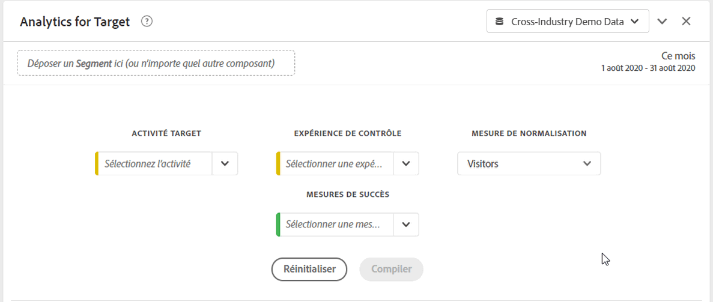

# Panneau Analytics for Target (A4T)

Le panneau Analytics for Target (A4T) vous permet d’analyser vos activités et expériences Adobe Target dans Analysis Workspace. Il vous permet également d’afficher l’effet élévateur et le degré de confiance pour 3 mesures de succès au maximum. Pour accéder au panneau A4T, accédez à une suite de rapports avec les composants A4T activés. Cliquez ensuite sur l’icône du panneau située à l’extrémité gauche et faites glisser le panneau Analytics for Target dans votre projet Analysis Workspace.

## Entrées de panneau {#Input}

Vous pouvez configurer le panneau A4T à l’aide des paramètres d’entrée suivants :

| Paramètre | Description |
|---|---|
| Activité Target | Effectuez une sélection à partir d’une liste d’activités Target ou faites glisser et déposez une activité à partir du rail de gauche. **Remarque :** la liste est remplie avec les 6 derniers mois d’activités qui comptent au moins 1 accès. Si vous ne voyez pas d’activité dans la liste, il se peut qu’elle remonte à plus de 6 mois. Elle peut encore être ajoutée à partir du rail gauche doté d’une période de retour en arrière de 18 mois. |
| Expérience de contrôle | Sélectionnez votre expérience de contrôle. Vous pouvez la modifier si nécessaire dans la liste déroulante. |
| Mesure de normalisation | Choisissez Visiteurs uniques, Visites ou Impressions d’activité. Visiteurs uniques est l’option recommandée pour la plupart des cas d’utilisation d’analyses. Cette mesure (également appelée méthodologie de comptage) devient le dénominateur du calcul de l’effet élévateur. Elle affecte également la manière dont les données sont agrégées avant l’application du calcul du degré de confiance. |
| Mesures de succès | Sélectionnez jusqu’à 3 événements de succès standard (non calculés) dans les listes déroulantes ou faites glisser les mesures depuis le rail de gauche. Chaque mesure comporte une visualisation et un tableau dédiés dans le panneau généré. |
| Période du calendrier | Cette variable est automatiquement renseignée à partir d’Adobe Target en fonction de la période d’activité. Vous pouvez la modifier, si nécessaire. |

## Sortie de panneau {#Output}

Le panneau Analytics for Target renvoie un vaste ensemble de données et de visualisations pour vous aider à mieux comprendre les performances de vos activités et expériences Adobe Target. En haut du panneau, une ligne de résumé vous rappelle les paramètres du panneau que vous avez sélectionnés. À tout moment, vous pouvez modifier le panneau en cliquant sur l’icône de modification en forme de crayon dans le coin supérieur droit.

Pour chaque mesure de succès sélectionnée, un tableau à structure libre et une tendance de taux de conversion sont affichés :

Chaque tableau à structure libre affiche les colonnes de mesures suivantes :

| Mesure | Description |
|---|---|
| Mesures de normalisation | Visiteurs uniques, Visites ou Impressions d’activité. |
| Mesure de succès | La mesure sélectionnée dans le créateur. |
| Taux de conversion | Mesure de succès/normalisation |
| Effet élévateur | Compare le taux de conversion de chaque expérience à l’expérience de contrôle. **Remarque :**L’effet élévateur est une &quot;mesure verrouillée&quot; des expériences de Cible ; il ne peut pas être ventilé ou utilisé avec d&#39;autres dimensions. |
| Effet élévateur (inférieur) | Représente le pire effet élévateur qu’une expérience de variante pourrait avoir sur l’expérience de contrôle. |
| Effet élévateur (médian) | Représente l’effet élévateur moyen qu’une expérience de variante pourrait avoir sur l’expérience de contrôle, avec un intervalle de confiance de 95 %. Il s’agit d’« Effet élévateur » dans Reports &amp; Analytics. |
| Effet élévateur (supérieur) | Représente le meilleur effet élévateur qu’une expérience de variante pourrait avoir sur l’expérience de contrôle. |
| Degré de confiance | Le test T calcule le degré de confiance, qui indique la probabilité selon laquelle les résultats seraient dupliqués si le test était exécuté à nouveau. Une plage de mise en forme conditionnelle fixe de 75 %/85 %/95 % a été appliquée à la mesure. Si nécessaire, cette mise en forme peut être personnalisée sous Paramètres de colonne.  **Remarque :**La confiance est une &quot;mesure verrouillée&quot; des expériences de Cible ; il ne peut pas être ventilé ou utilisé avec d&#39;autres dimensions. |

Comme pour n’importe quel panneau d’Analysis Workspace, vous pouvez continuer votre analyse en ajoutant des tableaux et [visualisations](https://docs.adobe.com/content/help/fr-FR/analytics/analyze/analysis-workspace/visualizations/freeform-analysis-visualizations.html) supplémentaires qui vous aideront à analyser vos activités Adobe Target.

## Questions fréquentes {#FAQ}

| Question | Réponse |
|---|---|
| Quels types d’activité sont pris en charge dans A4T ? | [En savoir plus](https://docs.adobe.com/content/help/fr-FR/target/using/integrate/a4t/a4t-faq/a4t-faq-activity-setup.html) sur les types d’activité pris en charge. |
| Les mesures calculées sont-elles prises en charge dans les calculs d’effet élévateur et de degré de confiance ? | Non. [En savoir plus](https://docs.adobe.com/content/help/fr-FR/target/using/integrate/a4t/a4t-faq/a4t-faq-lift-and-confidence.html) sur les raisons pour lesquelles les mesures calculées ne sont pas prises en charge dans les calculs d’effet élévateur et de degré de confiance. Les mesures calculées peuvent toutefois être utilisées dans les rapports A4T, mais en dehors de ces mesures. |
| Pourquoi les visiteurs uniques varient-ils entre Target et Analytics ? | [En savoir plus](https://docs.adobe.com/content/help/fr-FR/target/using/integrate/a4t/a4t-faq/a4t-faq-viewing-reports.html) sur les variations de visiteurs uniques entre les produits. |
| Pourquoi des expériences sans rapport sont-elles renvoyées lorsque j’applique un segment d’accès pour une activité Target spécifique dans mon analyse ? | La dimension A4T est une variable de liste, ce qui signifie qu’elle peut contenir de nombreuses activités (et expériences) en même temps. [En savoir plus](https://docs.adobe.com/content/help/fr-FR/target/using/integrate/a4t/a4t-faq/a4t-faq-viewing-reports.html) |
| La mesure de degré de confiance tient-elle compte des commandes extrêmes ou applique-t-elle une correction de Bonferroni pour plusieurs offres ? | Non. [En savoir plus](https://docs.adobe.com/content/help/fr-FR/target/using/integrate/a4t/a4t-faq/a4t-faq-lift-and-confidence.html) sur la façon dont Analytics calcule le degré de confiance. |
| Les mesures d’effet élévateur et de confiance peuvent-elles être utilisées avec d’autres dimensions ou ventilations ? | L’effet élévateur et le degré de confiance sont des &quot;mesures verrouillées&quot; par rapport à la dimension Expériences de Cible, car ils nécessitent un contrôle et une variante à calculer sur l’ensemble. Ils ne peuvent donc pas être ventilés ou utilisés avec d’autres dimensions. |
| Quand l’effet élévateur et la confiance sont-ils recalculés ? | L’effet élévateur et la confiance sont recalculés chaque fois que le panneau est exécuté (ou réexécuté), que la plage de dates du panneau est modifiée ou qu’un segment est appliqué au panneau ou au tableau. |

Pour plus d’informations sur les rapports Analytics for Target, consultez [Rapports A4T](https://docs.adobe.com/content/help/fr-FR/target/using/integrate/a4t/reporting.html).
