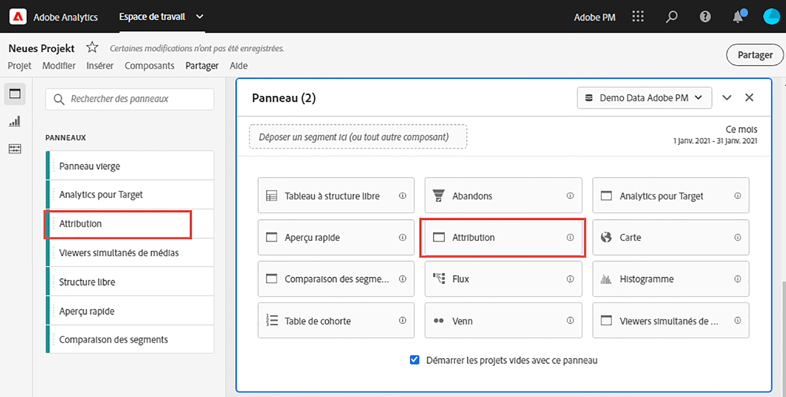

# Panneau d’attribution

Le panneau [!UICONTROL Attribution] est un moyen facile de créer une analyse comparant divers modèles d’attribution. Il s’agit d’une fonctionnalité d’[Attribution IQ](../attribution/overview.md) qui vous permet d’utiliser et de comparer des modèles d’attribution dans un espace de travail dédié.

## Création d’un panneau d’attribution

1. Cliquez sur l’icône du panneau à gauche.
1. Faites glisser le panneau [!UICONTROL Attribution] dans votre projet Analysis Workspace.

   

1. Ajoutez une mesure que vous souhaitez attribuer et ajoutez toute dimension à laquelle vous souhaitez l’attribuer. Par exemple, les canaux marketing ou les dimensions personnalisées, telles que les promotions internes.

   

1. Sélectionnez les [modèles d’attribution et l’intervalle de recherche en amont](../attribution/models.md) que vous souhaitez comparer.

1. Le panneau d’attribution renvoie un riche ensemble de données et des visualisations qui comparent l’attribution de la dimension et de la mesure sélectionnées.

   

## Visualisations d’attribution

* **Mesure totale** : nombre total de conversions survenues pendant le créneau de rapport. Il s’agit des conversions qui sont attribuées pour la dimension que vous avez sélectionnée.
* **Barre** de comparaison des attributs : compare visuellement les conversions attribuées à chacun des éléments de dimension de la dimension sélectionnée. Chaque couleur de barre représente un modèle d’attribution distinct.
* **Tableau** de comparaison des attributs : Affiche les mêmes données que le graphique à barres, représenté sous la forme d’un tableau. La sélection de différentes colonnes ou lignes dans ce tableau permet de filtrer le graphique à barres ainsi que plusieurs autres visualisations du panneau. Ce tableau se comporte de la même manière que tout autre tableau à structure libre de Workspace. Il vous permet d’ajouter des composants tels que des mesures, des segments ou des ventilations.
* **Diagramme** de chevauchement : Diagramme de Venn présentant les trois principaux éléments de dimension et la fréquence à laquelle ils participent conjointement à une conversion. Par exemple, la taille du chevauchement des bulles indique la fréquence des conversions lorsqu’un visiteur a été exposé aux deux éléments de dimension. La sélection d’autres lignes dans le tableau à structure libre adjacent met à jour la visualisation pour refléter votre sélection.
* **Détails** des performances : Permet de comparer visuellement jusqu’à trois modèles d’attribution à l’aide d’un graphique de dispersion.
* **Performances** de tendances : Par défaut, affiche la tendance des performances de conversion par modèle d’attribution pour la première dimension répertoriée dans le tableau à structure libre adjacent. Vous pouvez sélectionner différentes lignes de dimension dans le tableau Structure libre pour afficher la tendance des dimensions sélectionnées (telles que Recettes totales pour chaque modèle d’attribution pour les campagnes sur les réseaux sociaux et la recherche payante). Vous pouvez également sélectionner des cellules dans les colonnes pour toute combinaison de mesures et de types d’attribution dans le tableau Structure libre afin de visualiser les performances de tendance par valeur de dimension pour les modèles d’attribution spécifiés (tels que Recettes totales par Canal marketing à l’aide de l’attribution Dernière touche et Première touche).
* **Flux** : Permet de déterminer les canaux qui interagissent le plus souvent et dans quel ordre parmi les visiteurs.
