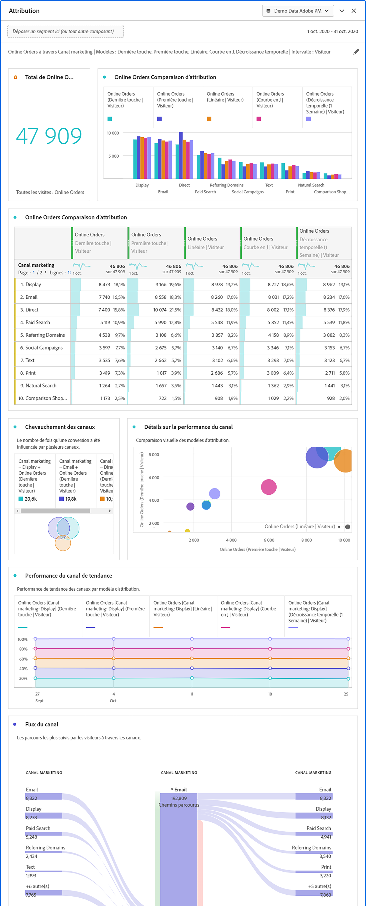

# Panneau Attribution {#attribution-panel}

<!-- markdownlint-disable MD034 -->

>[!CONTEXTUALHELP]
>id="workspace_attribution_button"
>title="Attribution"
>abstract="Comparer et visualiser rapidement de nombreux modèles d’attribution en utilisant n’importe quelle dimension ou mesure de conversion"
>additional-url="https://www.youtube.com/watch?v=Yu0hy2klzA0" text="Panneau Attribution IQ"

>[!CONTEXTUALHELP]
>id="workspace_attribution_panel"
>title="Panneau d’attribution"
>abstract="Comparez et visualisez rapidement de nombreux modèles d’attribution en utilisant n’importe quelle dimension ou mesure de conversion.  **Paramètres &#x200B;** **Canal**  Dimension à attribuer. Il peut s’agir de canaux marketing, de campagnes ou de toute autre dimension. **Modèles**  Le modèle détermine la manière dont le crédit est attribué aux points de contact. **Période de recherche rétroactive**  Ce paramètre détermine la fenêtre d’attribution des données qui sera appliquée à chaque conversion."
>additional-url="https://www.youtube.com/watch?v=Yu0hy2klzA0" text="Panneau Attribution IQ"

<!-- markdownlint-enable MD034 -->

>[!BEGINSHADEBOX]

_Cet article présente le panneau Attribution dans_  _&#x200B;**Adobe Analytics**._ _Voir [Panneau Attribution](https://experienceleague.adobe.com/fr/docs/analytics-platform/using/cja-workspace/panels/attribution) pour la_ version  _&#x200B;**Customer Journey Analytics** de cet article._

>[!ENDSHADEBOX]

Le panneau **[!UICONTROL Attribution]** vous permet de créer facilement une analyse comparant différents modèles d’attribution. Le panneau vous fournit un espace de travail dédié à l’utilisation et à la comparaison des modèles d’attribution.

Adobe Analytics améliore l’attribution en vous permettant d’effectuer les tâches suivantes :

* Définir l’attribution à des médias autres que ceux achetés : tout élément (dimension, mesure, canal ou événement) peut être appliqué aux modèles (par exemple, recherche interne) et pas seulement aux campagnes marketing.
* Utilisez la comparaison illimitée de modèles d’attribution : comparez dynamiquement autant de modèles que vous le souhaitez.
* Évitez les changements d’implémentation : avec le traitement de la période de rapport et les sessions contextuelles, le contexte du parcours client peut être créé et appliqué lors de l’exécution.
* Construire la session qui correspond le mieux à votre scénario d’attribution.
* Ventiler l’attribution par segments : comparez facilement les performances de vos canaux marketing sur n’importe quel segment important (par exemple, la nouvelle clientèle par rapport à la clientèle régulière, le produit X par rapport au produit Y, le niveau de fidélité ou la valeur vie client (CLV)).
* inspecter le croisement des canaux et l’analyse multi-touch : utilisation des histogrammes et diagrammes de Venn ainsi que des résultats de l’attribution des tendances ;
* analyser visuellement des séquences marketing importantes : explorez les chemins d’accès qui ont mené à la conversion sur le plan visuel par le biais de visualisations à plusieurs nœuds de flux et d’abandons ;
* créer des mesures calculées : utilisez n’importe quel nombre de méthodes d’attribution.

## Utilisation

Pour utiliser un panneau **[!UICONTROL Attribution]**, procédez comme suit :

1. Créez un panneau **[!UICONTROL Attribution]**. Pour plus d’informations sur la création d’un panneau, consultez [Créer un panneau](panels.md#create-a-panel).

1. Spécifiez l’[entrée](#panel-input) du panneau.

1. Observez la [sortie](#panel-output) du panneau.

### Entrée du panneau

Vous pouvez configurer le panneau Attribution à l’aide des paramètres d’entrée suivants :

1. Ajoutez une **[!UICONTROL mesure de succès]** et une dimension à partir du **[!UICONTROL canal]** auquel vous souhaitez affecter des attributs. Par exemple, les canaux marketing ou les dimensions personnalisées, telles que les promotions internes.

   

1. Sélectionnez un ou plusieurs [modèles d’attribution](#attribution-models) parmi **[!UICONTROL Modèles inclus]**, le [conteneur](#container) parmi **[!UICONTROL Conteneur]** et un [intervalle de recherche en amont](#lookback-window) parmi **[!UICONTROL Intervalle de recherche en amont]** que vous souhaitez utiliser à des fins de comparaison.

1. Sélectionnez **[!UICONTROL Créer]** pour créer les visualisations dans le panneau.

### Sortie du panneau

Le panneau **[!UICONTROL Attribution]** renvoie un riche ensemble de données et des visualisations qui comparent l’attribution de la dimension et de la mesure sélectionnées.

### Visualisations d’attribution

Les visualisations suivantes font partie de la sortie du panneau.

* **Mesure totale** : nombre total de conversions qui se sont produites au cours de la période de création des rapports et qui sont attribuées à la dimension que vous avez sélectionnée.
* **Barres de comparaison d’attribution** : compare visuellement les conversions attribuées à chacun des éléments de dimension de la dimension sélectionnée. Chaque couleur de barre représente un modèle d’attribution distinct.
* **Tableau de comparaison d’attribution** : affiche, sous forme de tableau, les mêmes données que le graphique à barres. La sélection de différentes colonnes ou lignes dans ce tableau permet de filtrer le graphique à barres ainsi que plusieurs autres visualisations du panneau. Ce tableau fonctionne de la même manière que tout autre tableau à structure libre dans Workspace. Il vous permet d’ajouter des composants tels que des mesures, des segments ou des répartitions.
* **Diagramme de chevauchement** : visualisation de Venn présentant les trois principaux éléments de dimension et la fréquence à laquelle ils participent conjointement à une conversion. Par exemple, la taille du chevauchement des bulles indique la fréquence des conversions lorsqu’une personne a été exposée aux deux éléments de dimension. La sélection d’autres lignes dans le tableau à structure libre adjacent met à jour la visualisation pour refléter votre sélection.
* **Détails sur les performances** : visualisation en nuage de points pour comparer visuellement jusqu’à trois modèles d’attribution.
* **Performance de tendance** : affiche la tendance des conversions attribuées pour le principal élément de dimension. La sélection d’autres lignes dans le tableau à structure libre adjacent met à jour la visualisation pour refléter votre sélection.
* **Flux** : vous permet de voir avec quels canaux les personnes interagissent le plus souvent lors de leur parcours, et dans quel ordre.

## Modèle d’attribution

{{attribution-models-details}}

## Conteneur

{{attribution-container}}

## Intervalle de recherche en amont

{{attribution-lookback-window}}

## Exemple

{{attribution-example}}

>[!MORELIKETHIS]
>
> [Créer un panneau](/help/analyze/analysis-workspace/c-panels/panels.md#create-a-panel)
>

<!--
# Attribution panel

The [!UICONTROL Attribution] panel is an easy way to build an analysis comparing various attribution models. It is a feature in [Attribution](/help/analyze/analysis-workspace/attribution/overview.md) that gives you a dedicated workspace to use and compare attribution models.

>[!VIDEO](https://video.tv.adobe.com/v/39110/?quality=12&captions=fre_fr)

## Create an attribution panel

1. Click the panel icon on the left.
1. Drag the [!UICONTROL Attribution] panel into your Analysis Workspace Project.

   

1. Add a metric that you want to attribute and add any dimension to attribute against. Examples include Marketing Channels or custom dimensions, such as internal promotions.

   

1. Select the [attribution models and lookback window](../attribution/models.md) you want to compare.

1. The Attribution panel returns a rich set of data and visualizations that compare attribution for the selected dimension and metric.

   

## Attribution visualizations

* **Total metric**: The total number of conversions that occurred over the reporting time window. These are the conversions that are attributed across the dimension that you selected.
* **Attribution Comparison Bar**: Visually compares the attributed conversions across each of the dimension items from your selected dimension. Each bar color represents a distinct attribution model.
* **Attribution Comparison Table**: Shows the same data as the bar chart, represented as a table. Selecting different columns or rows in this table filters the bar chart as well as several of the other visualizations in the panel. This table acts similar to any other Freeform Table in Workspace - allowing you to add components such as metrics, segments, or breakdowns.
* **Overlap Diagram**: A Venn Diagram showing the top three dimension items and how often they participate jointly in a conversion. For example, the size of the bubble overlap indicates how often conversions occurred when a visitor was exposed to both dimension items. Selecting other rows in the adjacent Freeform table updates the visualization to reflect your selection.
* **Performance Detail**: Lets you to compare up to three attribution models visually using a scatter plot.
* **Trended Performance**: By default, shows the conversion performance trend by attribution model for the first dimension listed in the adjacent Freeform table. You can select different dimension rows in the Freeform table to show the trend for the selected dimensions (such as Total Revenue for each attribution model for Social Campaigns and Paid Search). Alternately, you can select cells in the columns for any metric and attribution type combinations in the Freeform table to see the trended performance by dimension value for the specified attribution models (such as Total Revenue by Marketing Channel using Last Touch and First Touch attribution).
* **Flow**: Lets you see which channels are interacted with most commonly, and in what order across a visitor's journey.

-->