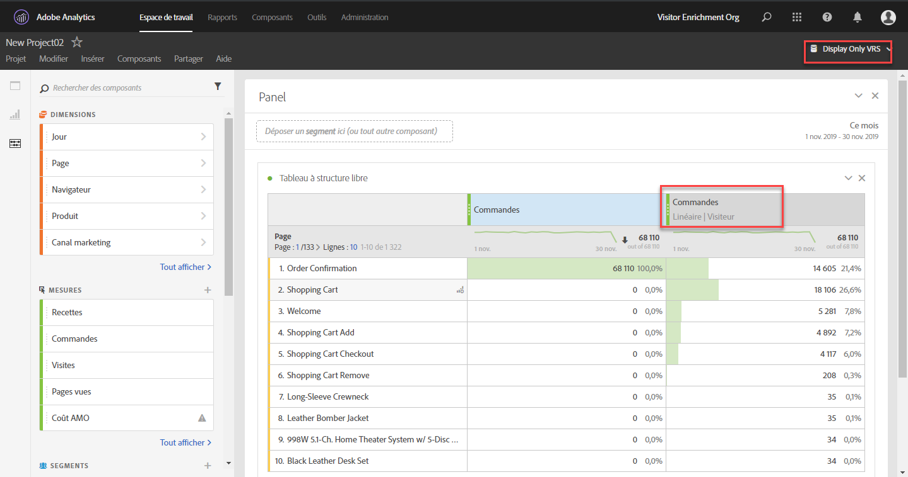

# Panneau Attribution - Aperçu

>[!IMPORTANT] Le panneau Attribution est accessible à tous les utilisateurs des produits Adobe Analytics Ultimate, Prime, Select et Foundation.

Le panneau d’attribution est une fonction d’[Attribution IQ](../../attribution-iq.md) qui vous permet d’ajouter de nombreux nouveaux types de modèles d’attribution aux tableaux à structure libre, aux visualisations et aux mesures calculées. Tous les modèles d’attribution ont deux composants :

* **Modèles d’attribution :** le modèle décrit la distribution des conversions pour les accès dans un groupe. Par exemple, Première touche ou Dernière touche.
* **Intervalle de recherche en amont d’attribution :** l’intervalle de recherche en amont décrit les groupes d’accès pris en compte pour chaque modèle. Par exemple, visite ou visiteur.

## Modèles d’attribution

| Icône de l’interface utilisateur | Modèle d’attribution | Définition | Conditions d’utilisation |
| --- | --- | --- | --- |
|  | Dernière touche | Attribue un crédit de 100 % au point de contact le plus récent avant la conversion. | Le modèle d’attribution le plus élémentaire et le plus courant. Il est fréquemment utilisé pour les conversions avec un cycle de traitement court. Le modèle Dernière touche est couramment utilisé par les équipes qui gèrent le marketing de moteur de recherche ou qui analysent les mots-clés de recherche interne. |
|  | Première touche | Attribue un crédit de 100 % au point de contact affiché pour la première fois dans l’intervalle de recherche en amont d’attribution. | Un autre modèle d’attribution commun utile pour l’analyse des canaux marketing destinés à accroître la notoriété de la marque ou à favoriser l’acquisition client. Il est fréquemment utilisé par les équipes Display ou Marketing social, mais est également utile pour évaluer l’efficacité des recommandations de produits sur site. |
|  | Même touche | Attribue un crédit de 100 % à l’accès même où la conversion a eu lieu. Si un point de contact ne se produit pas sur le même accès qu’une conversion, il est placé sous « Aucun ». | Un modèle utile pour évaluer le contenu ou l’expérience client qui a été présenté immédiatement au moment de la conversion. Les équipes produit ou de conception utilisent souvent ce modèle pour évaluer l’efficacité d’une page où a lieu une conversion. |
|  | Linéaire | Attribue le même crédit à chaque point de contact visible menant à une conversion. | Utile pour les conversions avec des cycles de traitement plus longs ou des expériences client qui nécessitent un engagement plus fréquent et plus constant de la part des clients. Il est souvent utilisé par des équipes qui mesurent l’efficacité des notifications d’applications mobiles ou avec des produits sur abonnement. |
|  | En forme de U | Attribue 40 % de crédit à la première interaction, 40 % à la dernière interaction et divise les 20 % restants entre les autres points de contact. Pour les conversions avec un point de contact unique, un crédit de 100 % est attribué. Pour les conversions avec deux points de contact, un crédit de 50 % est attribué aux deux. | Un modèle conseillé à ceux qui valorisent les interactions qui ont introduit ou fermé une conversion, mais qui veulent tout de même reconnaître les interactions d’assistance. L’attribution En forme de U est souvent utilisée par des équipes qui adoptent une approche plus équilibrée, mais qui veulent accorder plus de crédit aux canaux ayant trouvé ou mis fin à une conversion. |
|  | En forme de J | Attribue un crédit de 60 % à la dernière interaction, de 20 % à la première interaction et divise les 20 % restants entre les autres points de contact. Pour les conversions avec un point de contact unique, un crédit de 100 % est attribué. Pour les conversions avec deux points de contact, un crédit de 75 % est attribué à la dernière interaction et 25 % à la première. | Ce modèle est conseillé à ceux qui donnent la priorité aux outils de recherche et de fermeture, mais qui souhaitent se concentrer sur les interactions de fermeture. L’attribution En forme de J est souvent utilisée par des équipes qui adoptent une approche plus équilibrée et qui veulent accorder plus de crédit aux canaux ayant mis fin à une conversion. |
|  | En forme de J inversé | Attribue un crédit de 60 % au premier point de contact, de 20 % au dernier point de contact et divise les 20 % restants entre les autres points de contact. Pour les conversions avec un point de contact unique, un crédit de 100 % est attribué. Pour les conversions avec deux points de contact, un crédit de 75 % est attribué à la première interaction et 25 % à la première. | Ce modèle est idéal pour ceux qui donnent la priorité aux outils de recherche et de fermeture, mais qui souhaitent se concentrer sur les interactions de recherche. L’attribution En forme de J inversé est utilisée par des équipes qui adoptent une approche plus équilibrée et qui veulent accorder plus de crédit aux canaux ayant déclenché une conversion. |
|  | Personnalisé | Permet de spécifier les pondérations à attribuer aux premiers points de contact, aux derniers points de contact et à tous les points de contact intermédiaires. Les valeurs spécifiées sont normalisées à 100 %, même si les nombres personnalisés saisis ne totalisent pas 100. Pour les conversions avec un point de contact unique, un crédit de 100 % est attribué. Pour les interactions avec deux points de contact, le paramètre du milieu est ignoré. Les premiers et derniers points de contact sont ensuite normalisés à 100 % et le crédit est attribué en conséquence. | Ce modèle est parfait pour ceux qui souhaitent un contrôle total sur leur modèle d’attribution et qui ont des besoins spécifiques que d’autres modèles d’attribution ne remplissent pas. |
|  | Décroissance temporelle | Suit une atténuation exponentielle avec un paramètre de demi-vie personnalisé, où la valeur par défaut est de sept jours. La pondération de chaque canal dépend de la durée écoulée entre l’initiation du point de contact et la conversion éventuelle. La formule utilisée pour déterminer le crédit est `2``(-t/halflife)`, où `t` correspond à la durée entre un point de contact et une conversion. Tous les points de contact sont alors normalisés à 100 %. | L’idéal pour les équipes qui exécutent régulièrement de la publicité vidéo ou qui font du marketing pour des événements avec une date prédéterminée. Plus une conversion se produit après un événement marketing, plus faible sera le crédit attribué. |
|  | Participation | Attribue un crédit de 100 % à tous les points de contact uniques. Le nombre total de conversions est gonflé par rapport aux autres modèles d’attribution. La participation déduplique les canaux qui sont vus à plusieurs reprises. | Excellent pour comprendre la fréquence à laquelle les clients sont exposés à une interaction donnée. Les sociétés de médias utilisent fréquemment ce modèle pour calculer la vitesse du contenu. Les sociétés de vente au détail utilisent souvent ce modèle pour comprendre les parties de leur site qui sont essentielles à la conversion. |
|  | [Algorithmique](https://docs.adobe.com/content/help/en/analytics/analyze/analysis-workspace/panels/attribution/algorithmic.md) | Utilise des techniques statistiques pour déterminer de manière dynamique l’allocation optimale du crédit pour la mesure sélectionnée. | Utile pour éviter les conjectures ou les heuristiques lors du choix du modèle d’attribution approprié pour votre entreprise. |

## Intervalles de recherche en amont

Un intervalle de recherche en amont est la durée pendant laquelle une conversion doit faire une recherche en amont pour inclure des points de contact. Les modèles d’attribution qui accordent plus de crédit aux premières interactions voient des différences plus importantes lors de l’affichage de différents intervalles de recherche en amont.

* **Intervalles de recherche en amont des visites :** recherchent en amont jusqu’au début d’une visite au cours de laquelle une conversion s’est produite. Les intervalles de recherche en amont des visites sont étroits, car ils ne recherchent pas au-delà de la visite. Les intervalles de recherche en amont des visites respectent la définition de visite modifiée dans les suites de rapports virtuelles.

* **Intervalles de recherche en amont des visiteurs :** recherchent toutes les visites en amont jusqu’au 1er du mois de la période en cours. Les intervalles de recherche en amont des visiteurs sont larges, car ils peuvent porter sur plusieurs visites. Par exemple, si la période du rapport s’étend du 15 au 30 septembre, la période de recherche en amont des visiteurs est du 1er au 30 septembre.

* **Fenêtre de recherche personnalisée :** Permet d’étendre la fenêtre d’attribution au-delà de la plage de dates du rapport jusqu’à 90 jours au maximum. Les fenêtres de recherche personnalisées sont évaluées pour chaque conversion au cours de la période du rapport. Par exemple, pour une conversion survenant le 20 février, une fenêtre de recherche de 10 jours évaluerait tous les points de contact de dimension du 10 au 20 février dans le modèle d’attribution.

## Exemple

Examinez l’exemple suivant :

1. Le 15 septembre, un visiteur arrive sur votre site par le biais d’une annonce de référencement payant, puis le quitte.
2. Le 18 septembre, le visiteur arrive de nouveau sur votre site par le biais d’un lien sur les médias sociaux qu’un ami lui a envoyé. Ils ajoutent plusieurs articles à leur panier, mais n’achètent rien.
3. Le 24 septembre, votre équipe marketing leur envoie un courrier électronique contenant un bon pour certains articles de leur panier. Ils appliquent le bon, mais se rendent sur plusieurs autres sites pour voir s’il existe d’autres bons. Ils en trouvent un autre par le biais d’une annonce d’affichage, puis effectuent un achat de 50 $.

Selon votre intervalle de recherche en amont et votre modèle d’attribution, les canaux reçoivent un crédit différent. Voici quelques exemples intéressants :

* À l’aide de **Première touche** et d’un **intervalle de recherche en amont des visites**, l’attribution ne s’intéresse qu’à la troisième visite. Entre le courrier électronique et l’affichage, le courrier électronique était le premier. Dès lors, il reçoit 100 % du crédit pour l’achat de 50 $.
* À l’aide de **Première touche** et d’un **intervalle de recherche en amont des visiteurs**, l’attribution s’intéresse aux trois visites. Le référencement payant a été le premier. Il obtient donc un crédit de 100 % pour l’achat de 50 $.
* En utilisant la **première touche** et une fenêtre **de recherche** personnalisée de sept jours, l’attribution ne prend en compte que les deux visites les plus récentes. Dans cette fenêtre de rapport, le lien vers les réseaux sociaux a été créé en premier, de sorte qu’il obtient un crédit de 100 % pour l’achat de 50 euros.
* À l’aide de **Linéaire** et d’un **intervalle de recherche en amont des visites**, le crédit est divisé entre le courrier électronique et l’affichage. Ces deux canaux reçoivent chacun un crédit de 25 $.
* À l’aide de **linéaire** et d’un **intervalle de recherche en amont des visiteurs**, le crédit est divisé entre le référencement payant, les réseaux sociaux, le courrier électronique et l’affichage. Chaque canal reçoit un crédit de 12,50 $ pour cet achat.
* À l’aide d’une fenêtre **de recherche** linéaire **et** personnalisée de sept jours, le crédit est divisé entre le social, le courrier électronique et l’affichage. Chacun de ces canaux reçoit un crédit de 12,50 $ pour cet achat. La recherche payante est exclue car elle ne se produit pas dans la fenêtre de recherche spécifiée.
* À l’aide de **En forme de J** et d’un **intervalle de recherche en amont des visiteurs**, le crédit est divisé entre le référencement payant, les réseaux sociaux, le courrier électronique et l’affichage.
   * Un crédit de 60 % est accordé à l’affichage, pour un montant de 30 $.
   * Un crédit de 20 % est accordé au référencement payant, pour un montant de 10 $.
   * Les 20 % restants sont répartis entre les réseaux sociaux et le courrier électronique, soit 5 $ à chacun.
* À l’aide de **Décroissance temporelle** et d’un **intervalle de recherche en amont des visiteurs**, le crédit est divisé entre le référencement payant, les réseaux sociaux, le courrier électronique et l’affichage. Utilisation de la demi-vie de sept jours par défaut :
   * Intervalle de zéro jour entre le point de contact de l’affichage et la conversion. `2``(-0/7)` `= 1`
   * Intervalle de zéro jour entre le point de contact du courrier électronique et la conversion. `2``(-0/7)` `= 1`
   * Intervalle de six jours entre le point de contact de réseaux sociaux et la conversion. `2``(-6/7)` `= 0.552`
   * Intervalle de neuf jours entre le point de contact du référencement payant et la conversion. `2``(-9/7)` `= 0.41`
   * La normalisation de ces valeurs entraîne les résultats suivants :
      * Affichage : 33,8 %, gain de 16,88 $
      * Courrier électronique : 33,8 %, gain de 16,88 $
      * Réseaux sociaux : 18,6 %, gain de 9,32 $
      * Référencement payant : 13,8 %, gain de 6,92 $

> [!TIP] D’autres événements de conversion, tels que des commandes ou des événements personnalisés, sont également divisés si le crédit appartient à plusieurs canaux. Par exemple, si deux canaux contribuent à un événement personnalisé à l’aide d’un modèle d’attribution linéaire, les deux canaux obtiennent 0,5 de l’événement personnalisé. Ces fractions d’événement sont additionnées pour toutes les visites, puis arrondies à l’entier le plus proche à des fins de création de rapports.

## Utilisation de l’attribution avec des canaux marketing

Lorsque les canaux marketing ont été introduits pour la première fois, ils ne disposaient que des dimensions Première touche et Dernière touche. Avec ces modèles d’attribution supplémentaires, les dimensions Première touche/Dernière touche explicites ne sont plus nécessaires. Adobe fournit des dimensions **Canal marketing** génériques qui peuvent être utilisées avec le modèle d’attribution de votre choix. Ces dimensions Canal marketing génériques se comportent de la même manière que les dimensions Canal Dernière touche, mais sont étiquetées différemment pour éviter toute confusion lors de l’utilisation de canaux marketing avec un modèle d’attribution différent.

Étant donné que les dimensions Canal marketing dépendent d’une définition de visite traditionnelle (définie par leurs règles de traitement), la définition de visite ne peut pas être modifiée à l’aide de suites de rapports virtuelles.

## Utilisation de l’attribution avec des variables à plusieurs valeurs

Certaines dimensions d’Analytics peuvent contenir plusieurs valeurs sur un seul accès. Les variables de liste et la variable Products sont des exemples courants.

Lorsque l’attribution est appliquée à des accès à plusieurs valeurs, toutes les valeurs d’un même accès reçoivent le même crédit. Comme plusieurs valeurs peuvent recevoir ce crédit, le total du rapport peut être différent de celui de chaque élément de ligne. Le total du rapport est dédupliqué, tandis que chaque valeur de dimension individuelle reçoit un crédit approprié.

## Utilisation d’une attribution avec segmentation

L’attribution s’exécute toujours avant la segmentation et la segmentation s’exécute avant l’application des filtres de rapport. Ce concept s’applique également aux suites de rapports virtuelles utilisant des segments.

Par exemple, si vous créez une suite de rapports virtuelle avec un segment « Accès à l’affichage » appliqué, vous pouvez voir d’autres canaux dans un tableau à l’aide de certains modèles d’attribution.

