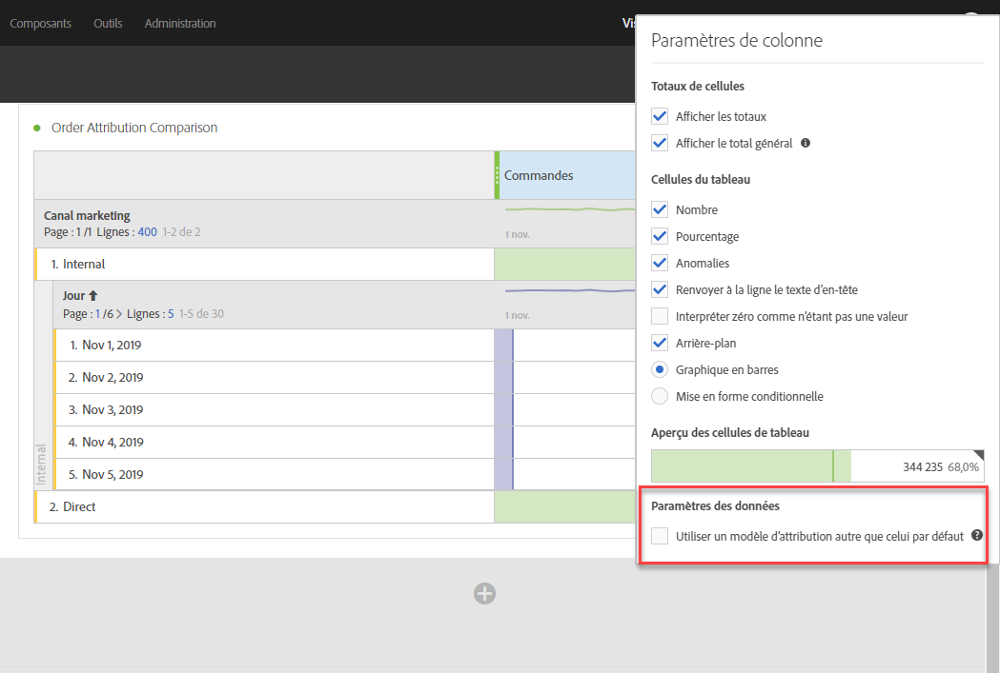
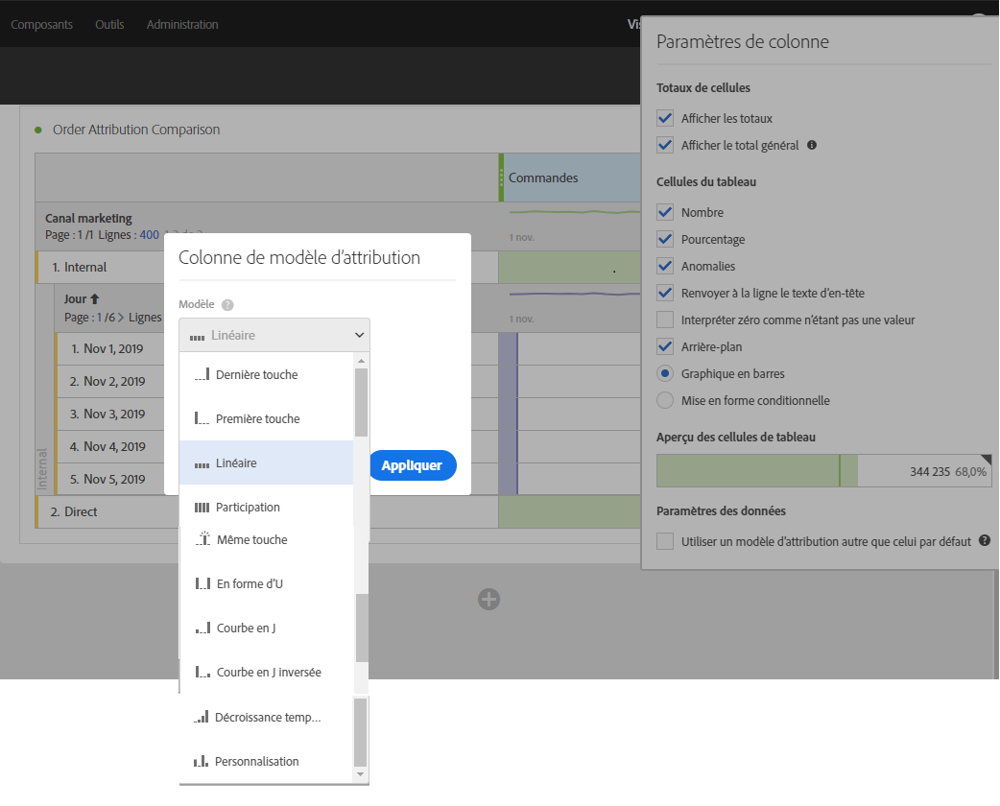
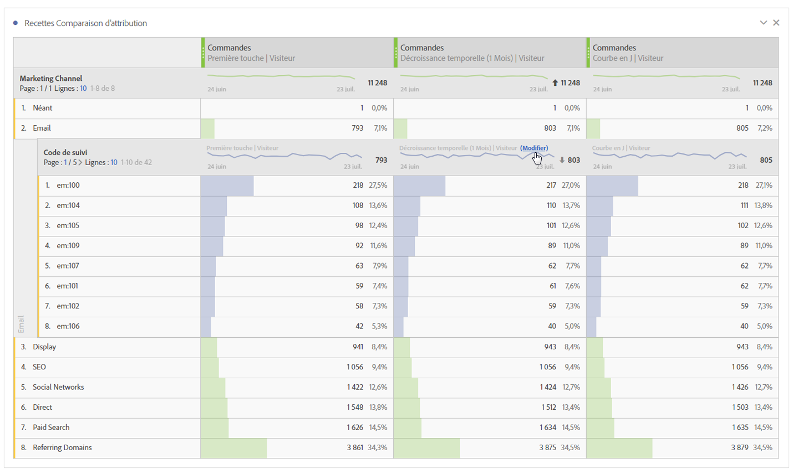
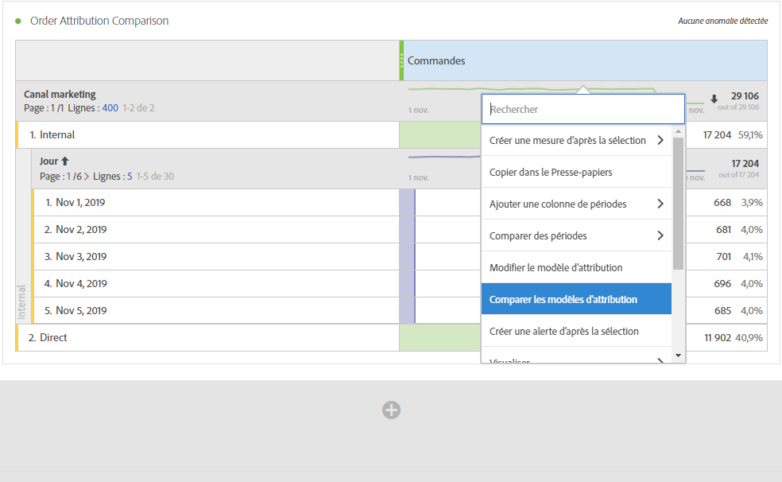
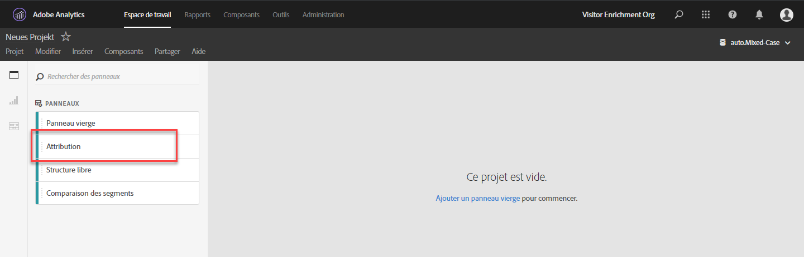
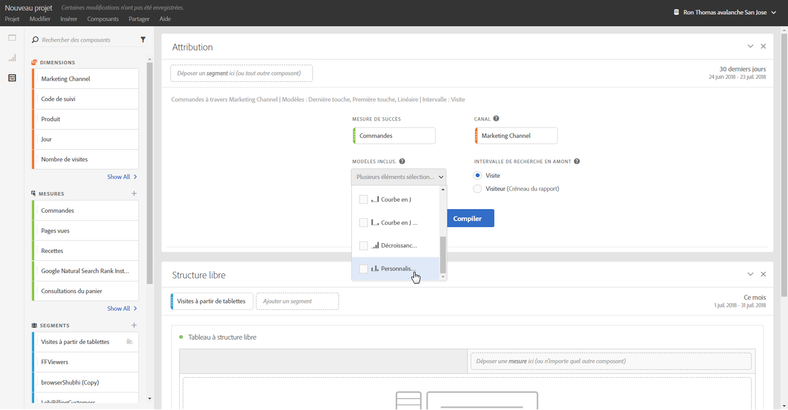
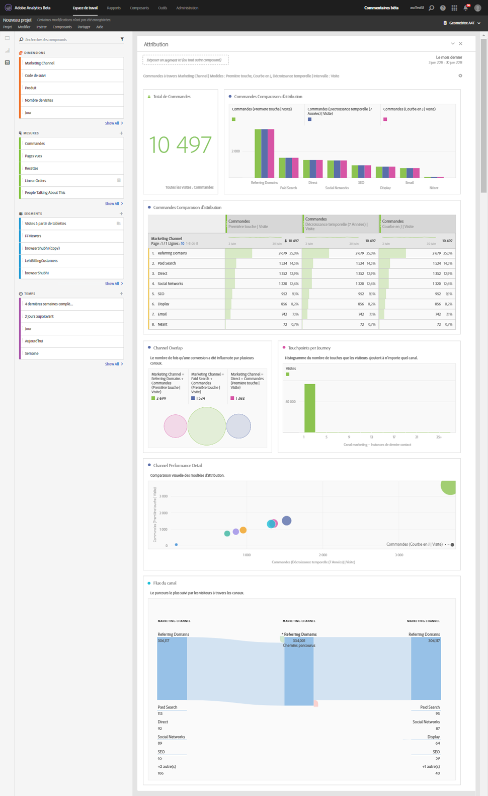

# Utilisation de l’Attribution IQ dans Analysis Workspace

L’Attribution IQ dans Analysis Workspace vous permet de comparer les modèles d’attribution pris en charge, de visualiser les principales séquences marketing menant à la conversion au moyen de visualisations avancées des abandons et des flux, de suivre facilement les tendances de tout canal ou campagne marketing pour voir les performances dans le temps, de trouver des anomalies statistiques dans les performances des canaux/campagnes et d’être alerté lorsque les performances chutent ou s’améliorent.

## Utilisation de l’attribution dans les tableaux à structure libre {#section_F2F72AE840EB4EA781302A559726E6F4}

Les tableaux à structure libre d’Analysis Workspace prennent en charge les modèles d’attribution pouvant être utilisés sur presque toutes les mesures. Les modèles d’attribution peuvent être définis sur la mesure d’une colonne d’un tableau à structure libre dans Paramètres de colonne :

1. Cliquez sur l’icône Paramètres (en forme d’engrenage) dans une colonne d’un tableau à structure libre.

   

1. Sous **[!UICONTROL Paramètres des données]**, cochez **[!UICONTROL Utiliser un modèle d’attribution autre que celui par défaut]**. Pour plus d’informations sur les différents modèles d’attribution, reportez-vous à la section [Attribution IQ - Aperçu](attribution.md).

   

## Application des modèles d’attribution aux ventilations {#section_ED1E7532CF084B5AB0942BD80B4770C9}

Toute ventilation au sein d’un tableau à structure libre peut également se voir appliquer n’importe quel modèle d’attribution pouvant être identique ou différent de la colonne parente. Par exemple, vous pouvez analyser les Commandes linéaires au niveau de la dimension de vos canaux marketing, mais appliquer les Commandes en forme de U aux codes de suivi spécifiques au sein d’un canal. Pour modifier le modèle d’attribution appliqué à une ventilation, il suffit de pointer la souris sur le modèle de ventilation et de cliquer sur « Modifier » :

## Comparaison de deux modèles d’attribution {#section_1D74C09549CC4EC8A952A7392C76D375}

Si vous souhaitez comparer rapidement et facilement deux modèles d’attribution, cliquez avec le bouton droit de la souris sur une mesure et sélectionnez **[!UICONTROL Ajouter un modèle d’attribution comparatif]** :

Cela vous permet de comparer rapidement et facilement deux modèles d’attribution sans avoir à faire glisser une mesure et à la configurer deux fois.

## Panneau d’attribution et visualisations {#section_6B02F28182F14ECC9FC5020F224726E6}

Le panneau d’attribution permet de créer aisément une analyse comparant différents modèles d’attribution. Pour accéder au panneau d’attribution :

1. Cliquez sur l’icône du panneau tout à gauche.
1. Faites glisser le panneau d’attribution dans votre projet Analysis Workspace.

   

1. Ajoutez une mesure de succès que vous voulez attribuer et ajoutez n’importe quelle dimension de canal à attribuer (comme les canaux marketing ou les promotions internes).

   

1. Sélectionnez les [modèles d’attribution](attribution.md) que vous souhaitez comparer, ainsi que l’intervalle de recherche en amont.

   Le panneau d’attribution renverra un ensemble important de données et de visualisations pour vous aider à mieux comprendre comment vos canaux marketing (ou d’autres dimensions) fonctionnent ensemble :

   

   Voici une description de chaque visualisation :

| Visualisation | Description |
|--- |--- |
| Mesure totale | Nombre total de conversions survenues pendant le créneau de rapport. Il s’agit des conversions qui sont attribuées pour la dimension que vous avez sélectionnée. |
| Graphique à barres comparatif de l’attribution métrique | Vous permet de comparer visuellement les conversions attribuées pour chacun des éléments de la dimension à partir de la dimension sélectionnée. Chaque couleur de barre représente un modèle d’attribution distinct qui a été sélectionné. |
| Tableau à structure libre de l’attribution métrique | Affiche les mêmes données que le graphique à barres. La sélection de colonnes ou de lignes différentes dans ce tableau filtrera le graphique à barres, ainsi que plusieurs autres visualisations dans le panneau. Ce tableau agit comme n’importe quel autre tableau à structure libre dans Workspace, vous permettant d’ajouter des mesures, des segments, des ventilations, etc. |
| Tableau des chevauchements des dimensions | Un diagramme de Venn montrant les trois principales dimensions (par exemple, les canaux) et la fréquence à laquelle elles participent conjointement à une conversion. Par exemple, la taille du chevauchement des bulles indique la fréquence des conversions lorsqu’un visiteur a été exposé aux deux éléments de dimension (par exemple, les canaux). La sélection d’autres lignes dans le tableau à structure libre mettra à jour la visualisation pour refléter votre sélection. |
| Points de contact marketing par parcours | Histogramme indiquant le nombre de points de contact marketing (ou n’importe quelle dimension) qu’un visiteur avait dans la période de création de rapports. Ceci est utile pour voir l’impact de l’attribution multi-touch pour votre jeu de données. Si presque tous les visiteurs n’ont qu’un seul point de contact, les différents modèles d’attribution ne seront pas très différents les uns des autres dans leurs résultats. |
| Détail de la performance des canaux marketing | Vous permet de comparer visuellement jusqu’à trois modèles d’attribution à l’aide d’un graphique de dispersion. |
| Flux du canal marketing | Vous permet de voir quels canaux sont en interaction les uns avec les autres, et dans quel ordre lors du parcours d’un visiteur. |
