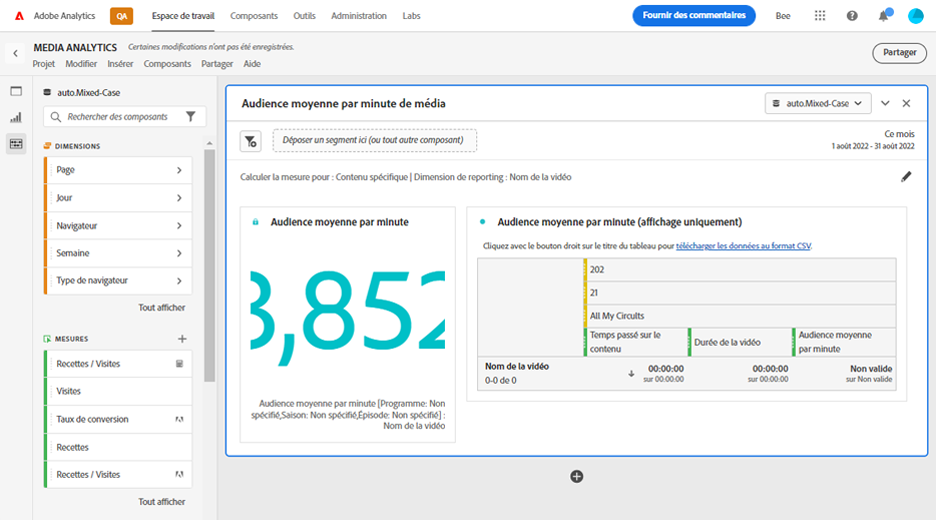
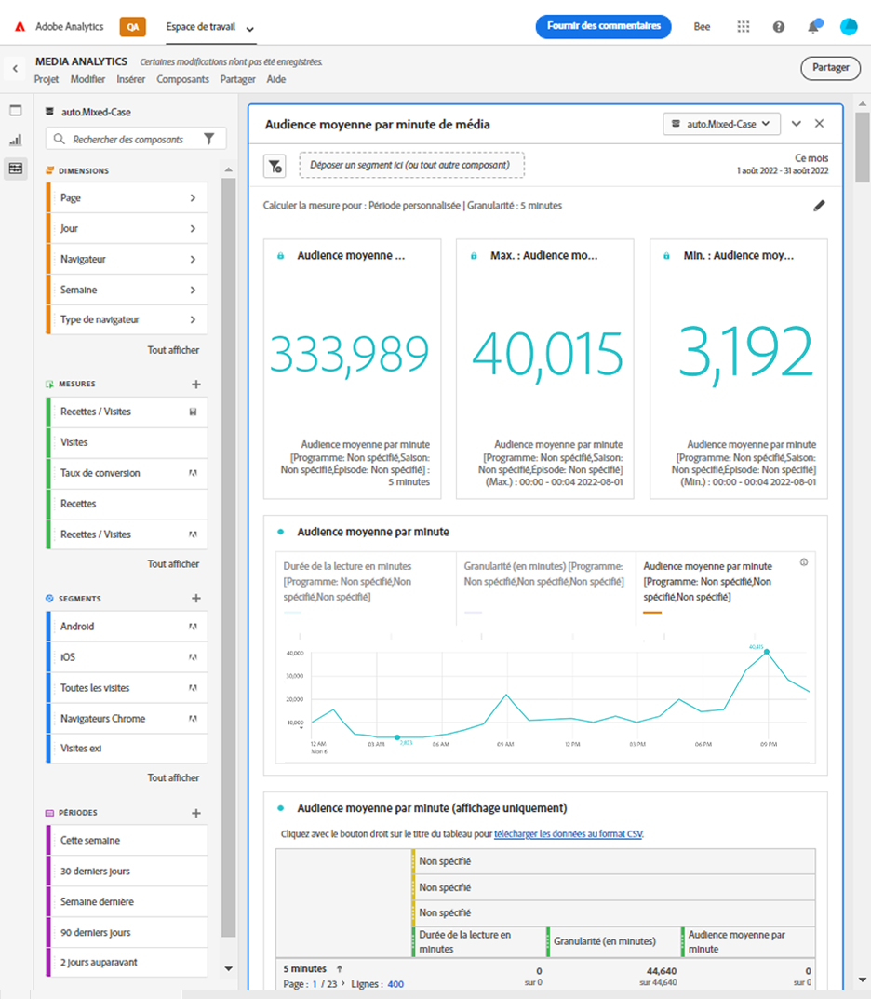

# Panneau Audience moyenne par minute de média {#media-average-minute-audience-panel}

<!-- markdownlint-disable MD034 -->

>[!CONTEXTUALHELP]
>id="workspace_mediaminuteaverageaudience_button"
>title="Audience moyenne par minute du média"
>abstract="Créez un panneau afin d’analyser l’audience moyenne par minute d’un contenu ou d’une période spécifique."

<!-- markdownlint-enable MD034 -->

<!-- markdownlint-disable MD034 -->

>[!CONTEXTUALHELP]
>id="workspace_mediaaverageminuteaudience_panel"
>title="Audience moyenne par minute du média"
>abstract="Affiche les performances du contenu multimédia ou de la période personnalisée.  **Paramètres généraux ** **Calculer la mesure pour** : sélectionnez la mesure à utiliser pour le panneau. Sélectionnez **Contenu spécifique** pour analyser l’audience moyenne par minute pour un contenu ou un événement spécifique en fonction de la durée du contenu. **Sélectionnez Période personnalisée** pour analyser l’évolution de l’audience moyenne par minute sur une période sélectionnée. **Dimension des rapports** : sélectionnez cette option pour créer un rapport en fonction du **Nom de la vidéo** de la dimension **ID de contenu**. Disponible uniquement si vous avez sélectionné Contenu spécifique comme mesure. **Granularité** : sélectionnez cette option pour les rapports. Disponible uniquement si vous avez sélectionné Période personnalisée comme mesure. **Filtrer le contenu par (facultatif)** sélectionnez un affichage, une saison, un épisode ou une dimension personnalisée pour filtrer le contenu.  **Paramètres avancés ** **Paramètres du tableau** : choisissez d’afficher ou non les valeurs de calcul dans le tableau. **Mesure Tranche de temps** : sélectionnez la mesure Tranche de temps que vous souhaitez utiliser pour le calcul du contenu spécifique. Disponible uniquement si vous avez sélectionné Contenu spécifique comme mesure."

<!-- markdownlint-enable MD034 -->

>[!BEGINSHADEBOX]

_Cet article documente le panneau d’audience moyenne par minute de média dans **Customer Journey Analytics**. Voir [Panneau d’audience moyenne par minute de média](https://experienceleague.adobe.com/en/docs/analytics/analyze/analysis-workspace/panels/average-minute-audience-panel) pour la version **Adobe Analytics** de cet article.*

>[!ENDSHADEBOX]

>[!NOTE]
>
>Le panneau **[!UICONTROL Audience moyenne par minute de média]** est disponible uniquement pour les clients qui ont acheté Streaming Media Collection pour Adobe Analytics.
>
>Pour plus d’informations, contactez votre représentant commercial Adobe ou l’équipe du compte Adobe.
>

Dans Analysis Workspace, l’audience moyenne par minute peut fournir des informations sur les éléments suivants :

* le temps passé à visionner un flux multimédia spécifique divisé par la durée du contenu, ou
* temps passé à afficher au cours d’une période personnalisée avec une granularité sélectionnée.

Le panneau Audience moyenne par minute de média vous permet de comprendre la consommation moyenne de votre contenu en comparant des programmes de n’importe quelle longueur ou genre. Par exemple, vous pouvez comprendre la consommation moyenne en comparant une sitcom de 30 minutes à un événement sportif de 3 heures.

En outre, vous pouvez utiliser le panneau Audience moyenne par minute de média pour comparer ou ajouter cette audience numérique moyenne par minute aux mesures moyennes par minute de la télévision linéaire.

Le panneau Audience moyenne par minute de média offre les avantages suivants par rapport à la mesure Audience moyenne par minute :

* Prend en charge les périodes personnalisées

* Permet de mettre à jour la classification de durée après le traitement des vues (si la classification de durée n&#39;était pas présente ou doit être corrigée)

  Si vous effectuez cette mise à jour lors de l’utilisation de la mesure, la classification de durée n’existe pas (si la classification n’était pas présente). Ou la classification de durée est obsolète (si la classification était présente mais incorrecte).

## Utilisation

Pour utiliser un panneau **[!UICONTROL Audience moyenne par minute de média]** :

1. Créez un panneau **[!UICONTROL Audience moyenne par minute de média]**. Pour plus d’informations sur la création d’un panneau, consultez [Créer un panneau](panels.md#create-a-panel).

1. Veillez à sélectionner une vue de données pour le panneau dont les composants sont configurés à partir de la collection de médias en flux continu.

1. Spécifiez l’[entrée](#panel-input) du panneau.

1. Observez la [sortie](#panel-output) du panneau.

### Entrée du panneau

Utilisez les paramètres d’entrée décrits dans cette section pour configurer le panneau Audience moyenne par minute de média .

1. Configurez les paramètres d’entrée suivants :

   | Paramètre | Description |
   |---------|------------|
   | **Période du panneau** | La période par défaut du panneau est [!UICONTROL **Ce mois-ci**]. Vous pouvez la modifier pour afficher un seul jour ou plusieurs mois à la fois.    La visualisation est limitée à 1440 lignes de données (par exemple, 24 heures à une granularité au niveau des minutes). Si une combinaison de période et de granularité génère plus de 1 440 lignes, la granularité est automatiquement mise à jour pour s’adapter à la période complète. |
   | [!UICONTROL **Déposez un segment ici (ou tout autre composant)**] | Comme les autres panneaux, ce paramètre filtre vos sélections en fonction des segments que vous avez créés. Ce paramètre est un excellent moyen d’examiner des plateformes spécifiques, des diffusions en direct ou d’autres segments de médias courants. |
   | [!UICONTROL **Calculer la mesure pour**] | Choisissez si vous souhaitez afficher l’audience moyenne par minute pour le [**[!UICONTROL contenu spécifique]**](#specific-content). Ou si vous souhaitez afficher l’audience moyenne par minute pour une [**[!UICONTROL période personnalisée]**](#custom-time-period).  Sélectionnez [!UICONTROL **Période personnalisée**] : <ul><li>Si la durée n’est pas disponible, ou </li><li>si vous souhaitez afficher l’audience moyenne par minute pour une série temporelle composée de plusieurs éléments de contenu, ou</li><li>pour le contenu sans durée attribuée spécifique (par exemple pendant un flux ou un événement en direct)</li></ul></li></li></ul> 
Ce paramètre modifie le workflow et la sortie du rapport.
 |

1. Continuez avec [Contenu spécifique](#specific-content) ou [Période personnalisée](#custom-time-period), selon l’option choisie dans la liste déroulante [!UICONTROL **Calculer la mesure pour**].

#### Contenu spécifique

1. Si vous avez sélectionné [!UICONTROL **Contenu spécifique**] dans le menu déroulant [!UICONTROL **Calculer la mesure pour**] lors de la [configuration des entrées de panneau](#panel-inputs), spécifiez les options de configuration suivantes :

   | Paramètre | Description |
   |---------|------------|
   | [!UICONTROL **Dimension Reporting**] | Lorsque vous sélectionnez un contenu spécifique, vous pouvez sélectionner la sortie du rapport à l’aide des champs Nom de la vidéo ou ID du contenu pour afficher le contenu et l’audience moyenne par minute associée. |
   | [!UICONTROL **Filtrer le contenu par (facultatif)**] | Choisissez comment filtrer le contenu spécifique, en fonction de l’affichage souhaité ou de la structure de vos données. <ul>[!UICONTROL **Programme, saison, épisode**] : affiche les programmes disponibles dans la liste déroulante, que vous pouvez filtrer à l’aide d’une recherche (ou en glissant-déposant le nom du programme dans la colonne de gauche). Si vous arrêtez votre sélection ici, vous verrez toutes les saisons de votre programme. Vous pouvez aussi filtrer les résultats par saison, puis par épisodes individuels. Ce paramètre affiche les données relatives à ces programmes, saisons ou épisodes pour la période sélectionnée.</li><li>[!UICONTROL **Dimension personnalisée**] : si le nom de votre programme se trouve sous une dimension personnalisée, vous pouvez le trouver en effectuant une recherche dans la liste déroulante Dimension (facultatif) ou dans la colonne de gauche. L’élément de dimension est automatiquement renseigné en fonction de cette sélection et traité comme un épisode.</li><li>[!UICONTROL **Aucun**] : affiche tous les noms de vidéo qui contiennent des données d’audience moyenne par minute pour votre sélection. (Cette option est sélectionnée par défaut.)</li></ul> |

1. Continuez avec [Paramètres avancés du contenu spécifique](#specific-content-advanced-settings) pour configurer les paramètres avancés.

#### Paramètres avancés du contenu spécifique

1. Lorsque [!UICONTROL **Contenu spécifique**] est sélectionné dans le menu déroulant [!UICONTROL **Calculer la mesure pour**], sélectionnez [!UICONTROL **Afficher les paramètres avancés**], puis spécifiez les options de configuration suivantes :

   | Options | Description |
   |---------|------------|
   | **[!UICONTROL Paramètres du tableau]** | L’option par défaut **[!UICONTROL Afficher les valeurs de calcul dans le tableau]** affiche le numérateur et le dénominateur de l’audience moyenne par minute comme les colonnes précédentes du tableau. La désélection de cette option supprime ces deux colonnes. La colonne d’audience moyenne par minute reste dans le tableau en regard du nom de la vidéo ou de l’identifiant du contenu. |
   | **[!UICONTROL Mesure Tranche de temps]** | Vous pouvez choisir l’option par défaut **[!UICONTROL Durée du contenu]**, qui inclut uniquement la durée du contenu. Vous pouvez également choisir d’utiliser **[!UICONTROL Durée des médias]**, qui inclut la durée du contenu et de l’annonce publicitaire comme calcul du numérateur pour l’audience moyenne par minute. |

1. Sélectionnez [!UICONTROL **Créer**] pour terminer la création du panneau d’audience moyenne par minute de média.

1. Continuez avec [Sortie de panneau](#panel-output) pour plus d’informations sur l’utilisation du panneau d’audience moyenne par minute de média.

#### Période personnalisée

1. Si vous avez sélectionné [!UICONTROL **Période personnalisée**] dans le menu déroulant [!UICONTROL **Calculer la mesure pour**] lors de la [configuration des entrées de panneau](#panel-inputs), spécifiez les options de configuration suivantes :

   | Options | Description |
   |---------|------------|
   | **[!UICONTROL Granularité]** | La granularité par défaut est de [!UICONTROL **5 minutes**], mais vous pouvez choisir l’une des granularités utilisées comme dénominateur pour la série temporelle au cours de la période sélectionnée. Par exemple, la sélection de 12 h 00 à 12 h 30 avec une granularité de 5 minutes renvoie l’audience moyenne par minute sur la demi-heure complète ainsi que six lignes avec l’audience moyenne par minute pour chaque période de 5 minutes. Ces lignes servent de points de données pour le graphique de série temporelle. |
   | [!UICONTROL **Filtrer le contenu par (facultatif)**] | Choisissez comment filtrer le contenu spécifique, en fonction de l’affichage souhaité ou de la structure de vos données. <ul>[!UICONTROL **Programme, saison, épisode**] : affiche les programmes disponibles dans la liste déroulante, que vous pouvez filtrer à l’aide d’une recherche (ou en glissant-déposant le nom du programme dans la colonne de gauche). Si vous arrêtez votre sélection ici, vous verrez toutes les saisons de votre programme. Vous pouvez aussi filtrer les résultats par saison, puis par épisodes individuels. Ce paramètre affiche les données relatives à ces programmes, saisons ou épisodes pour la période sélectionnée.</li><li>[!UICONTROL **Dimension personnalisée**] : si le nom de votre programme se trouve sous une dimension personnalisée, vous pouvez le trouver en effectuant une recherche dans la liste déroulante Dimension (facultatif) ou dans la colonne de gauche. L’élément de dimension est automatiquement renseigné en fonction de cette sélection et traité comme un épisode.</li><li>[!UICONTROL **Aucun**] : affiche tous les noms de vidéo qui contiennent des données d’audience moyenne par minute pour votre sélection. (Cette option est sélectionnée par défaut.)</li></ul> |

1. Continuez avec [Paramètres avancés de la période personnalisée](#custom-time-period-advanced-settings) pour configurer les paramètres avancés.

#### Paramètres avancés de la période personnalisée

1. Avec l’option [!UICONTROL **Période personnalisée**] sélectionnée dans le menu déroulant [!UICONTROL **Calculer la mesure pour**], sélectionnez [!UICONTROL **Afficher les paramètres avancés**] puis spécifiez l’option de configuration suivante :

   | Option | Description |
   |---------|------------|
   | **[!UICONTROL Paramètres du tableau]** | Le paramètre par défaut affiche les valeurs de calcul dans le tableau, où apparaissent le numérateur et le dénominateur de l’audience moyenne par minute sous forme des colonnes précédentes du tableau. Lorsque cette option est désélectionnée, ces deux colonnes laissent seulement apparaître l’audience moyenne par minute près de la période. |

1. Sélectionnez [!UICONTROL **Créer**] pour terminer la création du panneau d’audience moyenne par minute de média.

1. Continuez avec [Sortie de panneau](#panel-output) pour plus d’informations sur l’utilisation du panneau d’audience moyenne par minute de média.

### Sortie du panneau

La sortie du panneau varie selon que vous avez choisi [!UICONTROL **Contenu spécifique**] ou [!UICONTROL **Période personnalisée**] dans le menu déroulant [!UICONTROL **Calculer la mesure pour**] lors de la [configuration des entrées du panneau](#panel-inputs).

#### Contenu spécifique

Le panneau Audience moyenne par minute de média renvoie ce qui suit :

* Audience moyenne par minute totale pour l’ensemble de votre sélection
* Filtres et audience moyenne par minute pour les vidéos individuelles, affichée dans un tableau
* Temps passé sur le contenu et durée de la vidéo si ce paramètre avancé a été sélectionné

Pour modifier et recréer le panneau à tout moment, sélectionnez  en haut à droite.

#### Source de données de contenu spécifique

Le panneau Audience moyenne par minute de média utilise uniquement la mesure d’audience moyenne par minute pour collecter des données. Les répartitions ou autres mesures ne peuvent pas être utilisées dans le panneau.

| Mesure | Description |
|--------|-------------|
| **[!UICONTROL Audience moyenne par minute]** | Il s’agit du temps passé à visionner votre flux multimédia divisé par la durée de la vidéo fournie au moyen des Classifications. |

#### Période personnalisée {#custom-time-period-output}

Le panneau Audience moyenne par minute de média renvoie ce qui suit :

* Audience moyenne par minute totale pour l’ensemble de votre sélection

* Audience moyenne par minute maximale et minimale

* Graphique linéaire des séries indiquant l’audience moyenne par minute sur l’ensemble de la sélection.

* Un tableau qui affiche les filtres et l’audience moyenne par minute pour les granularités, ainsi que le temps passé sur le contenu et la granularité pour chaque période

  Ce tableau s’affiche uniquement si l’option sous les paramètres avancés appelée [!UICONTROL **Afficher les valeurs de calcul dans le tableau**] est sélectionnée.

Pour modifier et recréer le panneau à tout moment, sélectionnez  en haut à droite.

#### Source de données de période personnalisée

Le panneau Audience moyenne par minute de média utilise uniquement la mesure d’audience moyenne par minute pour collecter des données. Les répartitions ou autres mesures ne peuvent pas être utilisées dans le panneau.

| Mesure | Description |
|---|---|
| **[!UICONTROL Audience moyenne par minute]** | Il s’agit du temps passé à visionner votre flux multimédia divisé par la sélection totale ou la granularité sélectionnée en minutes. |

>[!MORELIKETHIS]
>
> [Créer un panneau](/help/analyze/analysis-workspace/c-panels/panels.md#create-a-panel)
> [Panneau Observateurs simultanés de médias ](media-concurrent-viewers.md)
> [Panneau Temps de lecture de média ](media-playback-time-spent.md)
>

<!--

# Media average minute audience panel

>[!NOTE]
>
>The Media average minute audience panel is available only to customers who have purchased the Streaming Media Collection Add-on. 
>
>Contact your Adobe Sales Representative or Adobe Account Team to purchase the Streaming Media Collection Add-on. 

In Analysis Workspace, average minute audience is the time spent viewing your media stream divided by the duration of the content or the total selection of the period and selected granularity.

The Media average minute audience panel enables you to better understand average consumption of your content by comparing programs of any length or genre. For example, you can understand average consumption when comparing a 30-minute sitcom with a 3-hour sporting event.

In addition, you can use the Media average minute audience panel to compare or append this digital average minute audience to linear TV average minute metrics. 

The Media average minute audience panel provides the following benefits over the Average Minute Audience metric:

* Supports custom time periods

* Allows for updating the duration classification after views are processed (if it was not present or if it needs to be corrected)

  If you did this when using the metric, it either won't exist (if the classification wasn't present) or it will be out of date (if the classification was present but incorrect).

## Access the Media average minute audience panel

1. In Analysis Workspace, go to a report suite that has streaming media components enabled. 

1. In the left nav, select the **Panels** icon.

   

1. Drag the [!UICONTROL **Media average minute audience**] panel onto the canvas in Analysis Workspace.

1. To configure the panel, continue with [Panel inputs](#panel-inputs).

## Panel inputs {#Input}

Use the input settings described in this section to configure the Media average minute audience panel.

1. Begin creating a Media average minute audience panel, as described in [Access the Media average minute audience panel](#access-the-media-average-minute-audience-panel).

1. Configure the following input settings:

   | Setting | Description |
   |---------|------------|
   | **Panel date range** | The panel date range default is [!UICONTROL **This month**]. You can edit it to view a single day or many months at a time.    This visualization is limited to 1440 rows of data (for example, 24-hours at minute-level granularity). If a date range and granularity combination results in more than 1440 rows, the granularity is automatically updated to accommodate the full date range. |
   | [!UICONTROL **Drop a segment here (or any other component)**] | Like other panels, this setting filters your selections based on segments you've created. This is a great way to look at specific platforms, live streams, or other common media segments. |
   | [!UICONTROL **Calculate metric for**] | Choose whether you want to see the average minute audience for a specific piece of content, or if you want to see the average minute audience for a custom period of time:<ul><li>**Specific content:** This is available only if the duration has been updated using Classifications. If the duration is unavailable, or if you want to view the average minute audience for a time series with multiple pieces of content or content without a specific assigned duration (like during a live stream or event), then you should select [!UICONTROL **Custom time period**]. (Durations can be set using Classifications either before or after processing time.)</li><li>**Custom time period:** This is available regardless of whether the durations is made available using Classifications.</li></ul> 
This setting changes the workflow and report output.
  |

1. Continue with [Specific content](#specific-content) or [Custom time period](#custom-time-period), depending on the option you chose in the [!UICONTROL **Calculate metric for**] drop-down menu.

### Specific content

1. If you selected [!UICONTROL **Specific content**] in the [!UICONTROL **Calculate metric for**] drop-down menu when [configuring panel inputs](#panel-inputs), specify the following configuration options:

   | Setting | Description |
   |---------|------------|
   | [!UICONTROL **Reporting dimension**] | When you choose specific content, you can select the report output to use either the video name or content ID fields to show the content and its associated average minute audience for the time period selected. |
   | [!UICONTROL **Filter content by (optional)**] | Choose how to filter the specific content, depending on the view you want or the way your data is structured. <ul>[!UICONTROL **Show, season, episode**]: Displays your available shows in the drop-down, which you can filter using a search (or by dragging and dropping the show name from the left column). You can end your selection there to see all the seasons of your show, or you can filter by individual seasons and then by individual episodes. This setting shows the data for those shows, seasons, or episodes for the selected time period.</li><li>[!UICONTROL **Custom dimension**]: If your show name is under a custom dimension, you can find it either by searching in the dimension (optional) drop down or by using the left column search. The dimension item automatically populates based on that selection and is treated as an episode.</li><li>[!UICONTROL **None**]: Shows all the video names that have average minute audience data for the selection you've chosen. (This options is selected by default.)</li></ul>  |

1. Continue with [Specific content advanced settings](#specific-content-advanced-settings) to configure advanced settings. 

### Specific content advanced settings

1. With [!UICONTROL **Specific content**] selected in the [!UICONTROL **Calculate metric for**] drop-down menu, select [!UICONTROL **Show advanced settings**], then specify the following configuration options:

   | Setting | Description |
   |---------|------------|
   | Table settings | The default setting shows the calculation values in the table, which shows the numerator and denominator of the average minute audience as the preceding columns in the table. Deselecting this option removes those two columns, leaving only the average minute audience next to the video name or content ID. |
   | Time spent metric | You can choose the default content time spent, which includes only content time, or you can choose to use the media time spent, which includes content and ad time together as the numerator calculation for the average minute audience. |

1. Select [!UICONTROL **Build**] to finish creating the Media average minute audience panel.

1. Continue with [Panel output](#panel-output) for information about how to use the Media average minute audience panel.

### Custom time period

1. If you selected [!UICONTROL **Custom time period**] in the [!UICONTROL **Calculate metric for**] drop-down menu when [configuring panel inputs](#panel-inputs), specify the following configuration options:

   | Setting | Description |
   |---------|------------|
   | Granularity | The default granularity is [!UICONTROL **5-Minute**], but you can choose any of the granularities that are used as the denominator for the time series within your overall time period selection made in the calendar selection. For example, selecting 12:00 pm to 12:30 pm with a 5-minute granularity returns the average minute audience over the full half hour as well as six rows with the average minute audience for each 5-minute period. These rows are used as the datapoints for the time series chart. |
   | [!UICONTROL **Filter content by (optional)**] | Choose how to filter the specific content, depending on the view you want or the way your data is structured. <ul>[!UICONTROL **Show, season, episode**]: Displays your available shows in the drop-down, which you can filter using a search (or by dragging and dropping the show name from the left column). You can end your selection there to see all the seasons of your show, or you can filter by individual seasons and then by individual episodes. This setting shows the data for those shows, seasons, or episodes for the selected time period.</li><li>[!UICONTROL **Custom dimension**]: If your show name is under a custom dimension, you can find it either by searching in the dimension (optional) drop down or by using the left column search. The dimension item automatically populates based on that selection and is treated as an episode.</li><li>[!UICONTROL **None**]: Shows all the video names that have average minute audience data for the selection you've chosen. (This options is selected by default.)</li></ul>  |

1. Continue with [Custom time period advanced settings](#custom-time-period-advanced-settings) to configure advanced settings. 

### Custom time period advanced settings

1. With [!UICONTROL **Custom time period**] selected in the [!UICONTROL **Calculate metric for**] drop-down menu, select [!UICONTROL **Show advanced settings**], then specify the following configuration option:

   | Setting | Description |
   |---------|------------|
   | Table settings | The default setting displays the calculation values in the table, which displays the numerator and denominator of the average minute audience as the preceding columns in the table. Deselecting this option removes those two columns leaving only the average minute audience next to the time period. |

1. Select [!UICONTROL **Build**] to finish creating the Media average minute audience panel.

1. Continue with [Panel output](#panel-output) for information about how to use the Media average minute audience panel.

## Panel output

The panel output differs depending on whether you chose [!UICONTROL **Specific content**] or [!UICONTROL **Custom time period**] in the [!UICONTROL **Calculate metric for**] drop-down menu when [configuring panel inputs](#panel-inputs).

### Specific content

The Media average minute audience panel returns the following:

* Total average minute audience for your entire selection
* Filters and average minute audience for the individual videos displayed in a table 
* Content time spent and video length (duration) if that advanced setting was selected

To edit and rebuild the panel at any time, select the Edit (pencil) icon in the top right.

### Specific content data source

The Media average minute audience panel uses only the Average Minute Audience metric to gather data. Breakdowns or other metrics cannot be used in the panel.

| Metric | Description |
|--------|-------------|
| Average Minute Audience | The time spent viewing your media stream divided by the video length (duration) supplied via Classifications. |

### Custom time period {#custom-time-period-output}

The Media average minute audience panel returns the following:

* The total average minute audience for your entire selection

* The maximum and minimum average minute audience

* The line series graph showing the average minute audience over the entire selection.

* A table that shows the filters and average minute audience for the granularities, as well as the content time spent and granularity for each time period 

  This table displays only if the option under advanced settings called [!UICONTROL **Show calculation values in table**] is selected.

To edit and rebuild the panel at any time, select the Edit (pencil) icon in the top right.

### Custom time period data source

The Media average minute audience panel uses only the Average Minute Audience metric to gather data. Breakdowns or other metrics cannot be used in the panel.

|Metric|Description|
|---|---|
|Average Minute Audience| The time spent viewing your media stream divided by the total selection or selected granularity in minutes.|

-->