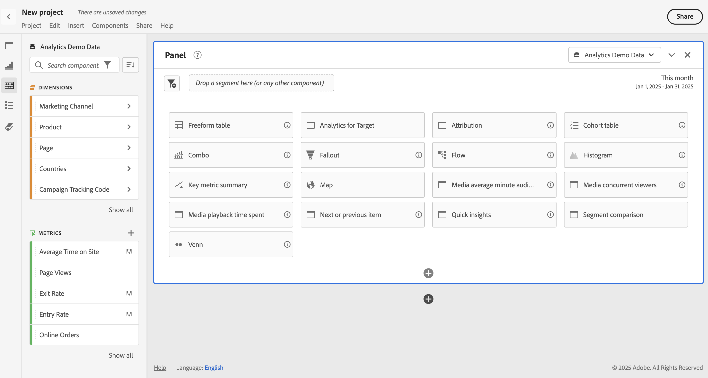

# Panneau vierge {#blank-panel}

<!-- markdownlint-disable MD034 -->

>[!CONTEXTUALHELP]
>id="workspace_blankpanel_button"
>title="Panneau vierge"
>abstract="Affiche une sélection de panneaux ou de visualisations que vous pouvez créer pour générer une analyse entièrement personnalisée."
>additional-url="https://www.youtube.com/watch?v=SYaioiwBTrk" text="Panneaux dans Analysis Workspace"

<!-- markdownlint-enable MD034 -->

>[!BEGINSHADEBOX]

_Cet article présente le panneau vierge dans_  _**Adobe Analytics**._ _Voir [Panneau vierge](https://experienceleague.adobe.com/fr/docs/analytics/analyze/analysis-workspace/panels/blank-panel) pour la version_  _**Customer Journey Analytics** de cet article._

>[!ENDSHADEBOX]

Un **[!UICONTROL panneau vierge]** affiche une sélection de panneaux (indiqués par ) ou de visualisations que vous pouvez créer pour générer une analyse entièrement personnalisée.

## Utilisation

Pour utiliser un **[!UICONTROL panneau vierge]** :

1. Créez un **[!UICONTROL panneau vierge]**. Pour plus d’informations sur la création d’un panneau, consultez [Créer un panneau](panels.md#create-a-panel).

   

1. Sélectionnez une visualisation ou un panneau parmi les options disponibles.

   * Lorsque vous sélectionnez un panneau, le panneau vierge devient le panneau sélectionné.
   * Lorsque vous sélectionnez une visualisation, celle-ci est ajoutée au panneau vierge.

   Par exemple, sélectionnez une visualisation (par exemple,  **[!UICONTROL Table de cohorte]**) à ajouter au panneau ou sélectionnez un panneau (par exemple,  **[!UICONTROL Attribution]**) pour transformer le panneau en panneau d’attribution.

Vous pouvez effectuer les opérations suivantes :

* Sélectionner  **dans** un panneau pour ajouter une autre visualisation. Une fenêtre contextuelle s’affiche, vous permettant de sélectionner une visualisation.

  | Sélectionnez... | Pour créer un/une... |
  |---|---|
  |  | [Tableau à structure libre](/help/analyze/analysis-workspace/visualizations/freeform-table/freeform-table.md) |
  |  | [Ligne](/help/analyze/analysis-workspace/visualizations/line.md) |
  |  | [Barre](/help/analyze/analysis-workspace/visualizations/bar.md) |
  |  | [Numéro de résumé](/help/analyze/analysis-workspace/visualizations/summary-number-change.md) |
  |  | [Texte](/help/analyze/analysis-workspace/visualizations/text.md) |
  |  | [Abandon](/help/analyze/analysis-workspace/visualizations/fallout/fallout-flow.md) |
  |  | [Flux](/help/analyze/analysis-workspace/visualizations/c-flow/flow.md) |
  |  | [Aires empilées](/help/analyze/analysis-workspace/visualizations/area.md) |
  |  | [Table de cohorte](/help/analyze/analysis-workspace/visualizations/cohort-table/t-cohort.md) |
  |  | [Puces](/help/analyze/analysis-workspace/visualizations/bullet-graph.md) |
  |  | [Anneau](/help/analyze/analysis-workspace/visualizations/donut.md) |
  |  | [Résumé des changements](/help/analyze/analysis-workspace/visualizations/summary-number-change.md) |
  |  | [Histogramme](/help/analyze/analysis-workspace/visualizations/histogram.md) |
  |  | [Dispersion](/help/analyze/analysis-workspace/visualizations/scatterplot.md) |
  |  | [Venn](/help/analyze/analysis-workspace/visualizations/venn.md) |
  |  | [Plan en arborescence](/help/analyze/analysis-workspace/visualizations/treemap.md) |

* Sélectionnez  **en dehors** d’un panneau pour ajouter un autre panneau vierge.

>[!MORELIKETHIS]
>
>[Créer un panneau](/help/analyze/analysis-workspace/c-panels/panels.md#create-a-panel)
>
