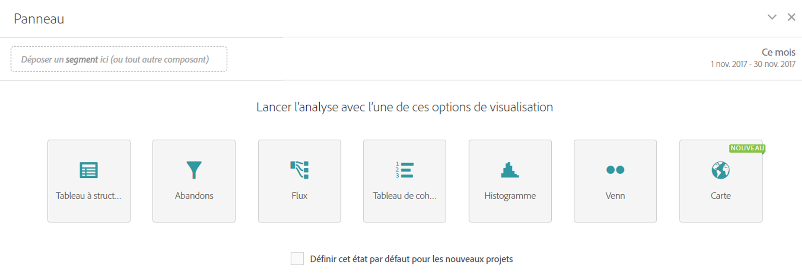

# Panneau vierge

Un panneau vierge met en exergue l’ensemble des visualisations que vous pouvez générer depuis un panneau : Forme libre, Carte, Abandons, Flux, Histogramme, Cohorte et Venn. En outre, vous pouvez définir le panneau vierge comme état de lancement par défaut d’un projet (plutôt qu’un panneau à structure libre).

