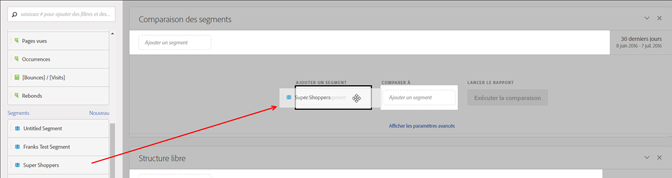

# Comparaison de segments

Explique comment comparer les segments dans Analysis Workspace.

>[!NOTE]
>
>You can also compare segments within a [fallout analysis](../../../../analyze/analysis-workspace/visualizations/fallout/compare-segments-fallout.md#section_E0B761A69B1545908B52E05379277B56).

## Compare segments {#section_8F2BFC45131C49B4A2E08A063CD7A91F}

1. Navigate to **[!UICONTROL Analytics]** &gt; **[!UICONTROL Workspace]** and open a project.

1. Dans le rail des **[!UICONTROL panneaux]** de la marge gauche, sélectionnez **Comparaison des segments]et faites-le glisser vers un projet nouveau ou existant.[!UICONTROL **

   

1. Veillez à définir correctement la période de comparaison.
1. Sélectionnez les segments à comparer et faites-les glisser dans le panneau. Par exemple, supposons que vous ayez un segment « Super-acheteurs ».

   

   Après avoir fait glisser le segment dans le panneau, Analytics crée automatiquement un segment **[!UICONTROL Tous les autres]qui comprend quiconque N’est PAS dans le segment que vous choisissez – dans ce cas, tous les « non-super-acheteurs ».** Ceci vous évite ainsi d’avoir à créer ce segment. L’option Tous les autres est automatiquement ajoutée au panneau dans le champ **[!UICONTROL Comparer à].** Vous pouvez le supprimer et comparer le super-acheteur à n’importe quel autre segment de votre choix.

   

1. Cliquez sur **[!UICONTROL Afficher les paramètres avancés]pour exclure des composants (dimensions, mesures ou segments) de l’analyse de comparaison des segments.** Pour plus d’informations, voir [Exclusion de composants de la comparaison](../../../../analyze/analysis-workspace/c-panels/c-segment-comparison/compare-segments.md#section_5E98FFA0744140C08D83700E3F025937).

1. Après avoir sélectionné le segment « Comparer à » approprié, cliquez sur **[!UICONTROL Créer]**.

   Cette action déclenche un processus en arrière-plan qui analyse chaque dimension, mesure et segment et recherche des différences statistiques entre les deux segments. Dans la partie supérieure de l’outil, une barre de progression indique le temps restant avant que chaque mesure et dimension ne soit analysée pour y détecter des différences importantes. En outre, les mesures, dimensions et segments les plus fréquemment utilisés s’exécuteront en priorité, afin que nous puissions vous présenter les résultats pertinents le plus rapidement possible.

   Une fois le processus d’analyse en arrière-plan terminé, de nouveaux visuels apparaissent :

   

   

1. Interprétez les résultats de la comparaison des segments en passant en revue les [nouvelles visualisations et les nouveaux tableaux et les résumés](../../../../analyze/analysis-workspace/c-panels/c-segment-comparison/segment-comparison.md#concept_74FAC1C6D0204F9190A110B0D9005793).

## Exclude components from comparison {#section_5E98FFA0744140C08D83700E3F025937}

Parfois, vous voudrez exclure certaines dimensions, mesures ou segments des comparaisons de segments. Par exemple, imaginons que vous souhaitiez comparer le segment Utilisateurs de mobiles américains au segment Utilisateurs de mobiles allemands. Il ne serait pas logique d’inclure des dimensions liées à la géographie puisqu’il y aura des différences évidentes de localisation entre ces deux segments. Vous pouvez les exclure. Procédez comme suit :

1. Une fois que vous avez fait glissé les segments que vous souhaitez comparer dans le panneau, cliquez sur **[!UICONTROL Afficher les paramètres avancés]afin d’exclure les composants (dimensions, mesures ou segments) de l’analyse de comparaison des segments.**

   

1. Faites glisser les composants que vous souhaitez exclure à n’importe quel emplacement du panneau **[!UICONTROL Composants exclus].** (Ceci s’affiche comme une « liste noire » de composants à exclure). Vous pouvez définir ces composants comme valeurs par défaut ou **[!UICONTROL Effacer tout]pour recommencer.**

   

1. Cliquez sur **[!UICONTROL Définir comme valeur par défaut]** pour exclure ces composants de **toutes** les comparaisons de segments.

1. Si vous avez besoin de réviser la liste des composants exclus, double-cliquez simplement, par exemple, sur Dimensions, et la liste des dimensions exclues s’affiche :

   

1. Supprimez simplement les dimensions non voulues en cliquant sur le x en regard, puis enregistrez la liste en cliquant sur **[!UICONTROL Définir comme valeur par défaut]**.

