# Panneau de comparaison des segments - Aperçu

Le panneau de comparaison des segments est un composant d’outil de [Segment IQ](../../segment-iq.md) qui détecte les différences les plus significatives sur le plan statistique parmi un nombre illimité de segments. La fonction effectue une itération au moyen d’une analyse automatisée de toutes les dimensions et mesures auxquelles vous avez accès. Les principales caractéristiques des segments d’audience qui stimulent les indicateurs clés de performances de votre entreprise sont ainsi détectées et vous pouvez savoir de cette façon à quel point des segments se chevauchent.

## Création d’un panneau de comparaison des segments

1. Connectez-vous à [experiencecloud.adobe.com](https://experiencecloud.adobe.com) à l’aide de vos identifiants Adobe ID.
1. Cliquez sur l’icône à 9 carrés dans le coin supérieur droit, puis sur le logo Analytics coloré.
1. Dans la barre de navigation supérieure, cliquez sur Workspace.
1. Cliquez sur le bouton Créer un projet.
1. Dans la fenêtre contextuelle modale, assurez-vous que l’option « Projet vierge » est sélectionnée, puis cliquez sur Créer.
1. Cliquez sur le bouton Panneaux sur la gauche, puis faites glisser le panneau Comparaison des segments au-dessus ou en dessous du panneau du tableau à structure libre créé automatiquement.

   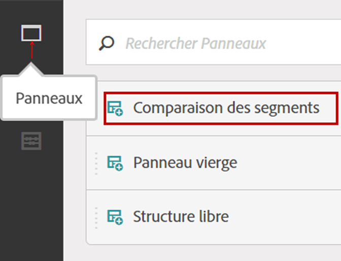

1. Sélectionnez les segments à comparer et faites-les glisser dans le panneau.

   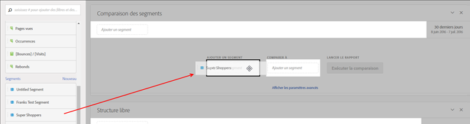

   Après avoir fait glisser le segment dans le panneau, Analytics crée automatiquement un segment [!UICONTROL « Tous les autres »] qui comprend quiconque N’est PAS dans le segment que vous choisissez. Il s’agit d’un segment fréquemment utilisé dans le panneau de comparaison, mais vous avez la possibilité de le supprimer et de comparer un autre segment de votre choix.

   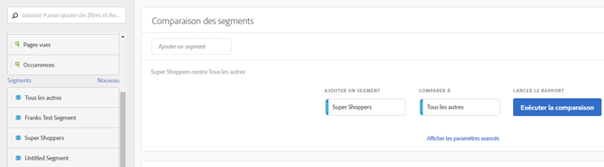

1. Une fois que vous avez déterminé les deux segments à comparer, cliquez sur [!UICONTROL Créer].

   Cette action lance un processus principal qui recherche les différences statistiques entre les deux segments sélectionnés et l’ensemble des dimensions, des mesures et des autres segments. Une barre de progression en haut du panneau indique le temps restant jusqu’à ce que chaque mesure et dimension soit analysée. Les mesures, dimensions et segments les plus fréquemment utilisés s’exécutent en priorité. Dès lors, les résultats les plus pertinents sont renvoyés en temps voulu.

## Exclusion de composants de la comparaison

Il est parfois souhaitable d’exclure certaines dimensions, mesures ou segments des comparaisons de segments. Par exemple, vous souhaitez comparer le segment « Utilisateurs mobiles américains » à « Utilisateurs mobiles allemands ». L’inclusion de dimensions liées à la géographie n’aurait aucun sens, puisque ces segments impliquent déjà ces différences.

1. Une fois que les deux segments souhaités s’affichent dans le panneau, cliquez sur [!UICONTROL « Afficher les options avancées »].
1. Faites glisser les composants que vous souhaitez exclure dans le panneau [!UICONTROL Composants exclus].

   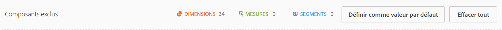

Cliquez sur [!UICONTROL « Définir comme valeur par défaut »] pour exclure automatiquement vos composants actuels de toutes les futures comparaisons de segments. Si vous souhaitez modifier des composants exclus, cliquez sur un type de composant, puis sur le « X » en regard d’un composant afin de l’inclure à nouveau dans votre analyse. Cliquez sur « Effacer tout » pour inclure à nouveau tous les composants dans la comparaison de segments.

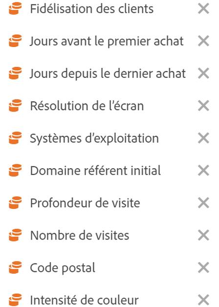

## Affichage d’un rapport de comparaison de segments

Une fois l’analyse des deux segments souhaités terminée, Adobe affiche ses résultats au moyen de plusieurs visualisations :

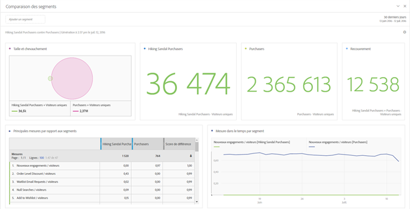

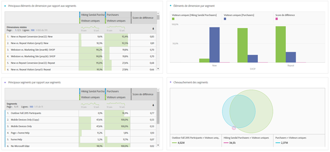

### Taille et chevauchement

Illustre les tailles comparatives de chaque segment sélectionné et l’ampleur de leur chevauchement à l’aide d’un diagramme de Venn. Pointez sur le visuel pour savoir combien de visiteurs se trouvent dans chaque section en intersection ou non. Cliquez avec le bouton droit de la souris sur l’intersection afin de créer un nouveau segment pour une analyse plus approfondie. Si les deux segments s’excluent mutuellement, aucun chevauchement n’est affiché entre les deux cercles (généralement dans le cas de segments utilisant un conteneur d’accès).

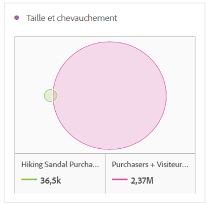

### Résumés de population

Le nombre total de visiteurs uniques dans chaque segment et chevauchement s’affiche à droite de la visualisation Taille et chevauchement.

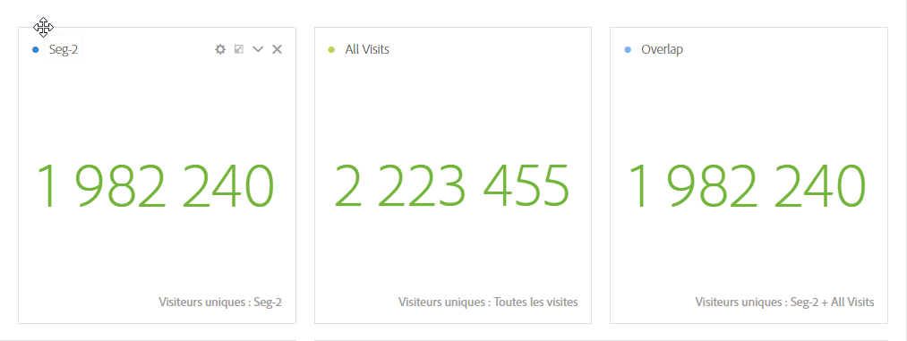

### Mesures principales

Affiche les mesures les plus significatives sur le plan statistique entre les deux segments. Chaque ligne de ce tableau représente une mesure de différenciation, classée selon le degré de différence entre chaque segment. Un score de différence de 1 signifie qu’il est statistiquement significatif, tandis qu’un score de différence de 0 signifie qu’il n’y a aucune signification statistique.

Cette visualisation est similaire aux tableaux à structure libre dans Analysis Workspace. Si vous souhaitez approfondir l’analyse d’une mesure spécifique, passez la souris sur un élément de ligne et cliquez sur « Créer un visuel ». Un tableau est alors créé pour analyser cette mesure spécifique. Si une mesure n’est pas pertinente pour votre analyse, passez la souris sur l’élément de ligne et cliquez sur le « X » pour le supprimer.

> [!NOTE] Les mesures ajoutées à ce tableau au terme de la comparaison de segments ne reçoivent pas de score de différence.

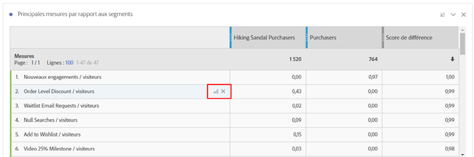

### Mesure dans le temps par segment

Une visualisation liée se trouve à droite du tableau de mesures. Vous pouvez cliquer sur un élément de ligne du tableau de gauche afin que cette visualisation se mette à jour pour afficher les tendances de cette mesure au fil du temps.

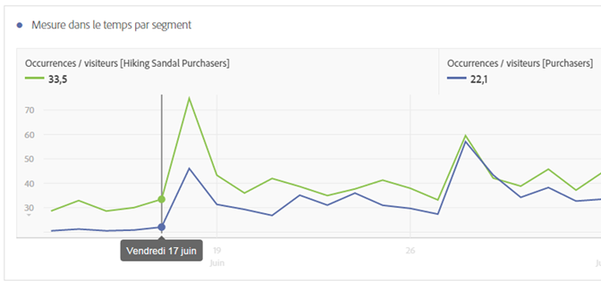

### Dimensions principales

Affiche les valeurs de dimension les plus significatives sur le plan statistique pour toutes vos dimensions. Chaque ligne présente le pourcentage de chaque segment exposant cette valeur de dimension. Par exemple, ce tableau peut indiquer que 100 % des visiteurs du « segment A » avaient l’élément de dimension « Type de navigateur : Google », tandis que 19,6 % du « segment B » seulement ont cet élément de dimension. Un score de différence de 1 signifie qu’il est statistiquement significatif, tandis qu’un score de différence de 0 signifie qu’il n’y a aucune signification statistique.

Cette visualisation est similaire aux tableaux à structure libre dans Analysis Workspace. Si vous souhaitez approfondir l’analyse d’une valeur de dimension spécifique, passez la souris sur un élément de ligne et cliquez sur « Créer un visuel ». Un tableau est alors créé pour analyser cette valeur de dimension spécifique. Si une valeur de dimension n’est pas pertinente pour votre analyse, passez la souris sur l’élément de ligne et cliquez sur le « X » pour la supprimer.

> [!NOTE] Les valeurs de dimension ajoutées à ce tableau au terme de la comparaison de segments ne reçoivent pas de score de différence.

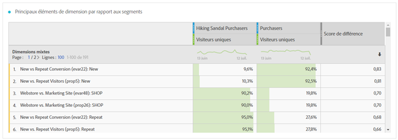

### Éléments de dimension par segment

Une visualisation de graphique à barres liée se trouve à droite du tableau de dimensions. Elle affiche toutes les valeurs de dimension affichées dans un graphique à barres. Cliquez sur un élément de ligne dans le tableau de gauche pour mettre à jour la visualisation sur la droite.

### Segments principaux

Indique quels autres segments (différents des deux segments sélectionnés pour la comparaison) présentent un chevauchement statistiquement significatif. Par exemple, ce tableau peut présenter un troisième segment, « Visiteurs récurrents », qui chevauche nettement le « segment A », mais pas le « segment B ». Un score de différence de 1 signifie qu’il est statistiquement significatif, tandis qu’un score de différence de 0 signifie qu’il n’y a aucune signification statistique.

Cette visualisation est similaire aux tableaux à structure libre dans Analysis Workspace. Si vous souhaitez approfondir l’analyse d’un segment spécifique, passez la souris sur un élément de ligne et cliquez sur « Créer un visuel ». Un tableau est alors créé pour analyser ce segment spécifique. Si un segment n’est pas pertinent pour votre analyse, passez la souris sur l’élément de ligne et cliquez sur le « X » pour le supprimer.

> [!NOTE] Les segments ajoutés à ce tableau au terme de la comparaison de segments ne reçoivent pas de score de différence.

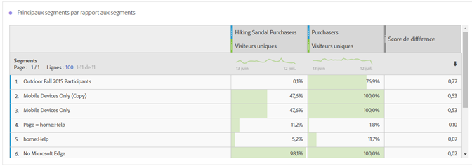

### Chevauchement des segments

Une visualisation Diagramme de Venn liée se trouve à droite du tableau de segments. Il montre le segment le plus significatif sur le plan statistique appliqué à vos segments comparés. Par exemple, « Segment A » + « Segment significatif sur le plan statistique » ou « Segment B » + « Segment significatif sur le plan statistique ». Cliquez sur un élément de ligne dans le tableau de gauche pour mettre à jour le diagramme de Venn sur la droite.

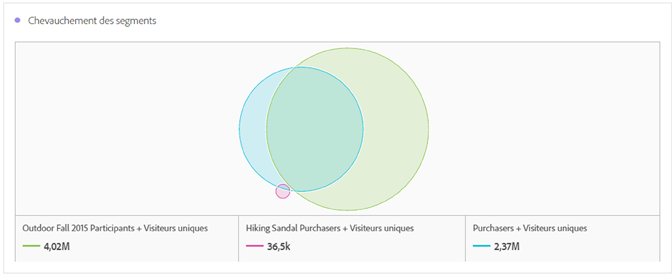
