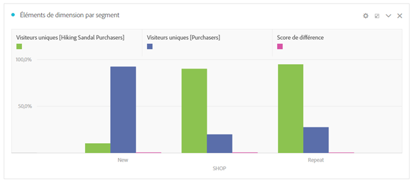

# Vue d’ensemble du panneau de comparaison des segments {#segment-comparison-overview}

<!-- markdownlint-disable MD034 -->

>[!CONTEXTUALHELP]
>id="workspace_segmentcomparison_button"
>title="Comparaison des segments"
>abstract="Comparez rapidement deux segments sur tous les points de données afin de rechercher automatiquement les différences pertinentes."

<!-- markdownlint-enable MD034 -->

<!-- markdownlint-disable MD034 -->

>[!CONTEXTUALHELP]
>id="workspace_segmentcomparison_panel"
>title="Panneau de comparaison des segments"
>abstract="Comparez rapidement deux segments sur tous les points de données afin de rechercher automatiquement les différences pertinentes.  **Paramètres &#x200B;** **Ajouter un segment** : le premier segment à analyser. **Objet de comparaison** : le second segment par rapport auquel vous souhaitez effectuer une comparaison. Ce champ est automatiquement renseigné avec *Toutes les autres personnes*, ce qui est l’inverse de votre premier segment. Si vous le souhaitez, vous pouvez le remplacer par un autre segment. **Paramètres avancés** : la possibilité d’exclure des composants de l’analyse dans la comparaison des segments."
<!-- markdownlint-enable MD034 -->

>[!BEGINSHADEBOX]

_Cet article présente le panneau de comparaison des segments dans_  _&#x200B;**Adobe Analytics**._ _Il n’existe pas de panneau équivalent dans_  _&#x200B;**Customer Journey Analytics**._

>[!ENDSHADEBOX]

Le panneau de comparaison des segments est un composant d’outil de [Segment IQ](../../segment-iq.md) qui détecte les différences les plus significatives sur le plan statistique parmi un nombre illimité de segments. La fonction effectue une itération au moyen d’une analyse automatisée de toutes les dimensions et mesures auxquelles vous avez accès. Les principales caractéristiques des segments d’audience qui stimulent les indicateurs clés de performances de votre entreprise sont ainsi détectées et vous pouvez savoir de cette façon à quel point des segments se chevauchent.

>[!BEGINSHADEBOX]

Voir  [Comparaison des segments](https://video.tv.adobe.com/v/23976?quality=12&learn=on){target="_blank"} pour une vidéo de démonstration.

>[!ENDSHADEBOX]

## Utilisation

Pour utiliser un panneau **[!UICONTROL Attribution]**, procédez comme suit :

1. Créez un panneau **[!UICONTROL Attribution]**. Pour plus d’informations sur la création d’un panneau, consultez [Créer un panneau](../panels.md#create-a-panel).

1. Spécifiez l’[entrée](#panel-input) du panneau.

1. Observez la [sortie](#panel-output) du panneau.

### Entrée du panneau

Vous pouvez configurer le panneau [!UICONTROL Comparaison des segments] à l’aide des paramètres d’entrée suivants :

| Entrée | Description |
| --- | --- |
| **[!UICONTROL Ajouter un segment]** | Sélectionnez la dimension par rapport à laquelle effectuer la comparaison. |
| **[!UICONTROL Comparer]** | Sélectionnez la dimension à utiliser pour comparer le segment sélectionné initial. Si vous ne sélectionnez pas de segment spécifique, le segment par défaut **[!UICONTROL Toutes les autres personnes]** est utilisé. |
| **[!UICONTROL Afficher/masquer les paramètres avancés]** | Sélectionnez **[!UICONTROL Afficher les paramètres avancés]** pour configurer les **[!UICONTROL Composants exclus]**. Sélectionnez **[!UICONTROL Masquer les paramètres avancés]** pour masquer les **[!UICONTROL Composants exclus]**. |
| **[!UICONTROL Composants exclus]** | Composants que vous pouvez spécifier, tels que **[!UICONTROL Dimensions]**, **[!UICONTROL Mesures]** ou **[!UICONTROL Segments]** pour l’exclusion. <ul><li>Faites glisser et déposez une ou plusieurs dimensions, mesures ou segments des conteneurs dans le conteneur **[!UICONTROL Composants exclus]**.</li><li>Pour supprimer un composant, sélectionnez le type (**[!UICONTROL Dimension]**, **[!UICONTROL Mesures]** ou **[!UICONTROL Segments]**) et . Pour supprimer tous les composants, sélectionnez **[!UICONTROL Effacer tout]**.</li><li>Pour définir la sélection actuelle de dimensions, mesures et segments comme valeur par défaut, sélectionnez **[!UICONTROL Définir comme valeur par défaut]**.</li></ul> |

Sélectionnez **[!UICONTROL Créer]** pour créer le panneau.

### Sortie du panneau

Une fois qu’Adobe Analytics termine l’analyse des deux segments souhaités, le panneau de sortie affiche ses résultats au moyen de plusieurs visualisations :

| Visualisation | Description |
|---|---|
| **[!UICONTROL Taille et chevauchement]** | Illustre au moyen d’une visualisation [Venn](/help/analyze/analysis-workspace/visualizations/venn.md) les tailles comparatives de chaque segment sélectionné et la façon dont les segments se chevauchent les uns les autres. |
| **[!UICONTROL Visiteurs et visiteuses uniques pour le premier segment]** | Visualisation [Synthèse des chiffres](/help/analyze/analysis-workspace/visualizations/summary-number-change.md) présentant les visiteurs et visiteuses uniques pour le premier segment (dans l’exemple Visites sur une seule page) |
| **[!UICONTROL Visiteurs et visiteuses uniques pour le deuxième segment]** | Visualisation [Synthèse des chiffres](/help/analyze/analysis-workspace/visualizations/summary-number-change.md) présentant les visiteurs et visiteuses uniques pour le deuxième segment (dans l’exemple Premières visites) |
| **[!UICONTROL Principales mesures des segments]** | [Tableau à structure libre](/help/analyze/analysis-workspace/visualizations/freeform-table/freeform-table.md) affichant les principales mesures pour les segments sélectionnés. |
| **[!UICONTROL Mesure dans le temps par segment]** | Visualisation [Graphique en courbes](/help/analyze/analysis-workspace/visualizations/line.md) présentant les mesures au fil du temps pour les segments sélectionnés. |
| **[!UICONTROL Principaux éléments de dimension par rapport aux segments]** | [Tableau à structure libre](/help/analyze/analysis-workspace/visualizations/freeform-table/freeform-table.md) présentant les éléments de dimension mixtes pour les segments sélectionnés. |
| **[!UICONTROL Éléments de dimension par segment]** | Visualisation [Barre horizontale](/help/analyze/analysis-workspace/visualizations/horizontal-bar.md) présentant les éléments de dimension par segment. |
| **[!UICONTROL Segments principaux par rapport aux segments]** | [Tableau à structure libre](/help/analyze/analysis-workspace/visualizations/freeform-table/freeform-table.md) affichant les principaux segments par rapport aux segments. |
| **[!UICONTROL Chevauchement des segments]** | Visualisation [Venn](/help/analyze/analysis-workspace/visualizations/venn.md) affichant le chevauchement des segments. |

Utilisez  pour reconfigurer et recréer le panneau.

<!--
#### Size and overlap

Illustrates the comparative sizes of each selected segment and how much they overlap with each other using a venn diagram. You can hover over the visual to see how many visitors were in each overlapping or non-overlapping section. You can also right click on the overlap to create a brand new segment for further analysis. If the two segments are mutually exclusive, no overlap is shown between the two circles (typically seen with segments using a hit container).

#### Population summaries

To the right of the Size and Overlap visualization, the total unique visitor count in each segment and overlap is shown.

#### Top metrics

Displays the most statistically significant metrics between the two segments. Each row in this table represents a differentiating metric, ranked by how different it is between each segment. A difference score of 1 means it is statistically significant, while a difference score of 0 means there is no statistical significance.

This visualization is similar to freeform tables in Analysis Workspace. If deeper analysis on a specific metric is desired, hover over a line item and click 'Create visual'. A new table is created to analyze that specific metric. If a metric is irrelevant to your analysis, hover over the line item and click the 'X' to remove it.

>[!NOTE]
>
>Metrics added to this table after the segment comparison has finished do not receive a Difference Score.

#### Metric over time by segment

To the right of the metrics table is a linked visualization. You can click a line item in the table on the left, and this visualization updates to show that metric trended over time.

#### Top dimensions

Shows the most statistically significant dimension items across all of your dimensions. Each row shows the percentage of each segment exhibiting this dimension item. For example, this table might reveal that 100% of visitors in 'Segment A' had the dimension item 'Browser Type: Google', whereas only 19.6% of 'Segment B' had this dimension item. A difference score of 1 means it is statistically significant, while a difference score of 0 means there is no statistical significance.

This visualization is similar to freeform tables in Analysis Workspace. If deeper analysis on a specific dimension item is desired, hover over a line item and click 'Create visual'. A new table is created to analyze that specific dimension item. If a dimension item is irrelevant to your analysis, hover over the line item and click the 'X' to remove it.

>[!NOTE]
>
>Dimension items added to this table after the segment comparison has finished do not receive a Difference Score.

#### Dimension items by segment

To the right of the dimensions table is a linked bar chart visualization. It shows all displayed dimension items in a bar chart. Clicking a line item in the table on the left updates the visualization on the right.

#### Top segments

Shows which other segments (other than the two segments selected for comparison) have statistically significant overlap. For example, this table can show that a third segment, 'Repeat Visitors', overlaps highly with 'Segment A' but does not overlap with 'Segment B'. A difference score of 1 means it is statistically significant, while a difference score of 0 means there is no statistical significance.

This visualization is similar to freeform tables in Analysis Workspace. If deeper analysis on a specific segment is desired, hover over a line item and click 'Create visual'. A new table is created to analyze that specific segment. If a segment is irrelevant to your analysis, hover over the line item and click the 'X' to remove it.

>[!NOTE]
>
>Segments added to this table after the segment comparison has finished do not receive a Difference Score.

#### Segment overlap

To the right of the segments table is a linked venn diagram visualization. It shows the most statistically significant segment applied to your compared segments. For example, 'Segment A' + 'Statistically significant segment' vs. 'Segment B' + 'Statistically significant segment'. Clicking a segment line item in the table on the left updates the venn diagram on the right.

-->
