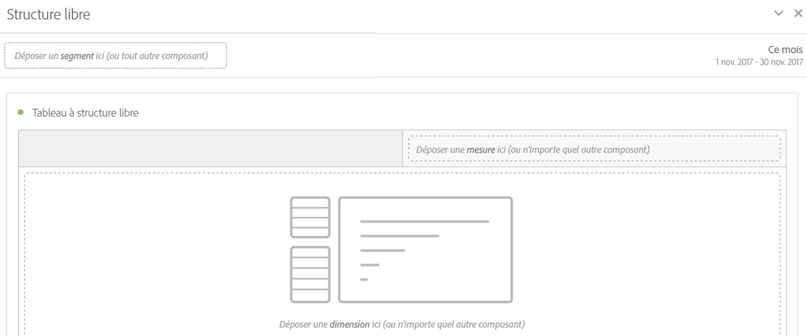

# Panneau à structure libre

>[!BEGINSHADEBOX]

_Cet article présente le panneau à structure libre dans_  _**Adobe Analytics**._ _Voir [Panneau à structure libre](/help/analyze/analysis-workspace/c-panels/freeform-panel.md) pour la_  _**version Customer Journey Analytics** de cet article._

>[!ENDSHADEBOX]

Un **[!UICONTROL Panneau à structure libre]** est un panneau vierge s’ouvrant par défaut avec une visualisation [Tableau à structure libre](/help/analyze/analysis-workspace/visualizations/freeform-table/freeform-table.md).

## Utilisation

Pour utiliser un **[!UICONTROL Panneau à structure libre]**, procédez comme suit :

1. Créez un **[!UICONTROL Panneau à structure libre]**. Pour plus d’informations sur la création d’un panneau, consultez [Créer un panneau](panels.md#create-a-panel).

   

1. Voir [Guide des composants d’Analytics](/help/components/home.md) pour découvrir comment ajouter des composants au panneau à structure libre et à la visualisation [Tableau à structure libre](/help/analyze/analysis-workspace/visualizations/freeform-table/freeform-table.md).

>[!MORELIKETHIS]
>
>[Créer un panneau](/help/analyze/analysis-workspace/c-panels/panels.md#create-a-panel)
>[Guide des composants d’Analytics](/help/components/home.md)
>[Visualisation Tableau à structure libre](/help/analyze/analysis-workspace/visualizations/freeform-table/freeform-table.md)
>
