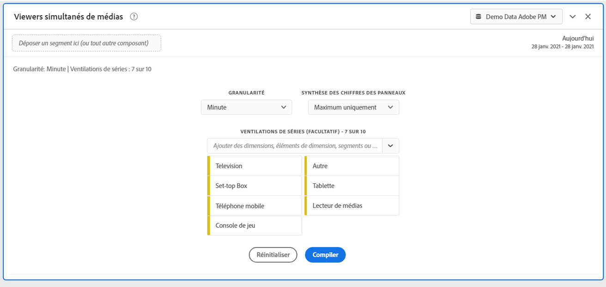
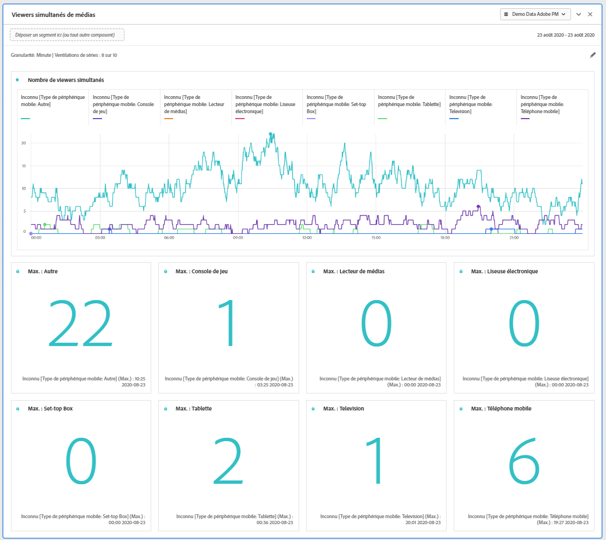
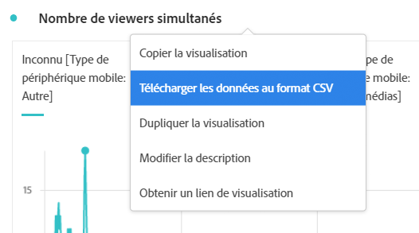
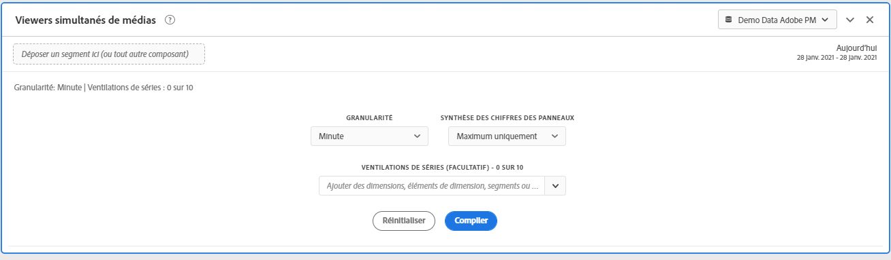

# Panneau des visionneuses simultanées de médias {#media-concurrent-viewers-panel}

<!-- markdownlint-disable MD034 -->

>[!CONTEXTUALHELP]
>id="workspace_mediaconcurrentviewers_button"
>title="Visiteurs et visiteuses simultanés de médias"
>abstract="Créez un panneau afin d’analyser l’audience moyenne par minute d’un contenu ou d’une période spécifique."

<!-- markdownlint-enable MD034 -->

<!-- markdownlint-disable MD034 -->

>[!CONTEXTUALHELP]
>id="workspace_mediaconcurrentviewers_panel"
>title="Visiteurs et visiteuses simultanés de médias"
>abstract="Analysez l’évolution des visionneuses simultanées, affichez la simultanéité la plus élevée ou ventilez et comparez-les.  **Granularité** : sélectionnez une période pour laquelle afficher les visionneuses simultanées. **Nombre de résumés de panneau** : option permettant d’afficher les nombres de résumés avec des informations sur la date ou l’heure pour chaque ligne. La valeur maximale affiche les informations sur la simultanéité la plus élevée. La valeur minimale affiche les informations sur la plus basse. **Ventilation des séries (facultatif)** : ventilez la visualisation par segments, dimensions, éléments de dimension ou périodes. Vous pouvez afficher jusqu’à 10 lignes à la fois. Les répartitions sont limitées à un seul niveau."

<!-- markdownlint-enable MD034 -->

>[!BEGINSHADEBOX]

_Cet article présente le panneau Observateurs et observatrices simultanés de médias dans_  _&#x200B;**Adobe Analytics**._ _Voir [Panneau Observateurs et observatrices simultanés de médias](https://experienceleague.adobe.com/fr/docs/analytics/analyze/analysis-workspace/panels/media-concurrent-viewers) pour la_ version  _&#x200B;**Customer Journey Analytics** de cet article._

>[!ENDSHADEBOX]

>[!NOTE]
>
>Le panneau d’audience moyenne par minute de média est disponible uniquement pour les clients qui ont acheté le module complémentaire Adobe Analytics for Streaming Media.
>
>Pour plus d’informations, contactez votre représentant ou représentante du service commercial Adobe ou l’équipe Adobe en charge des comptes.
>

Le panneau **[!UICONTROL Visiteurs et visiteuses simultanés de médias]** permet d’analyser les visiteurs et visiteuses simultanés au fil du temps. Il fournit également des informations détaillées sur le pic d’accès simultanés et la possibilité de ventiler et de comparer.

Vous pouvez analyser les visiteurs et visiteuses simultanés pour déterminer où s’est produit le pic d’accès simultanés ou l’endroit où des abandons ont eu lieu, ce qui permet de mieux comprendre la qualité du contenu et l’engagement des personnes. Et pour faciliter le dépannage ou la planification du volume ou de l’échelle.

Dans Analysis Workspace, les visiteurs et visiteuses simultanés représentent le nombre de visiteurs et visiteuses uniques qui visualisent vos flux de médias à un moment donné, quel que soit le nombre de sessions.

>[!BEGINSHADEBOX]

Consultez  [Panneau Visiteurs et visiteuses simultanés de médias](https://video.tv.adobe.com/v/330177?quality=12&learn=on){target="_blank"} pour une vidéo de démonstration.

>[!ENDSHADEBOX]

## Utilisation

Pour utiliser un panneau **[!UICONTROL Visiteurs et visiteuses simultanés de médias]**, procédez comme suit :

1. Créez un panneau **[!UICONTROL Visiteurs et visiteuses simultanés de médias]**. Pour plus d’informations sur la création d’un panneau, consultez [Créer un panneau](panels.md#create-a-panel).

1. Veillez à sélectionner une vue de données pour le panneau dont les composants sont configurés à partir du module complémentaire Adobe Analytics for Streaming Media.

1. Spécifiez l’[entrée](#panel-input) du panneau.

1. Observez la [sortie](#panel-output) du panneau.

### Entrée du panneau

Vous pouvez configurer le panneau Visiteurs et visiteuses simultanés de médias à l’aide des paramètres d’entrée suivants :

| Paramètre | Description |
|---|---|
| **[!UICONTROL Période du panneau]** | La période par défaut du panneau est définie sur Aujourd’hui. Vous pouvez la modifier pour afficher un seul jour ou plusieurs mois à la fois.    La visualisation est limitée à 1440 lignes de données (par exemple, 24 heures à une granularité au niveau des minutes).  Si une combinaison de période et de granularité génère plus de 1 440 lignes, la granularité est automatiquement mise à jour pour s’adapter à la période complète. |
| **[!UICONTROL Granularité]** | La granularité par défaut est définie sur Minute. La visualisation est limitée à 1440 lignes de données (par exemple, 24 heures à une granularité au niveau des minutes).  Si une combinaison de période et de granularité génère plus de 1 440 lignes, la granularité est automatiquement mise à jour pour s’adapter à la période complète. |
| **[!UICONTROL Synthèse des chiffres des panneaux]** | Pour afficher les détails de date ou d’heure relatifs aux observateurs simultanés, une synthèse des chiffres est disponible. La valeur maximale affiche les détails concernant le pic d’accès simultanés. La valeur **[!UICONTROL minimale]** affiche les détails du creux.  Par défaut, le panneau affiche uniquement la valeur maximale, mais vous pouvez le modifier pour afficher la valeur minimale ou les deux valeurs.  Si vous utilisez des répartitions, une synthèse des chiffres s’affiche pour chacune d’elles. |
| **[!UICONTROL Répartition de la série]** | Vous pouvez éventuellement ventiler votre visualisation par filtres, dimensions, éléments de dimension ou périodes. Vous pouvez afficher jusqu’à 10 lignes à la fois. Les répartition sont limitées à un seul niveau. Lorsque vous faites glisser une dimension, les principaux éléments de dimension sont automatiquement sélectionnés en fonction de la période du panneau sélectionnée. Pour comparer des périodes, faites glisser deux périodes ou plus dans le filtre de répartition de la série. |

Voici un exemple de panneau configuré pour une granularité **[!UICONTROL Minute]** avec une synthèse des chiffres **[!UICONTROL Maximum uniquement]**. Et ventilé par **[!UICONTROL Autre]**, **[!UICONTROL Tableau]**, **[!UICONTROL Téléphone mobile]**, **[!UICONTROL Console de jeu]**, **[!UICONTROL Lecteur multimédia]**, **[!UICONTROL Décodeur]**, **[!UICONTROL Télévision]**.

### Sortie du panneau

Le panneau Observateurs simultanés de médias renvoie un graphique en courbe et des synthèses de chiffres pour inclure des détails sur les valeurs maximales et/ou minimales d’observateurs simultanés. En haut du panneau, une ligne de résumé vous rappelle les paramètres du panneau que vous avez sélectionnés.

À tout moment, sélectionnez  pour modifier et recréer le panneau.

Si vous avez sélectionné la répartition des séries, une ligne du graphique en courbe et une synthèse des chiffres s’affichent pour chacune d’elles :

### Source de données

La seule mesure qui peut être utilisée dans ce panneau est **[!UICONTROL Visiteurs et visiteuses simultanés]** :

| Mesure | Description |
|---|---|
| **[!UICONTROL Visiteurs et visiteuses simultanés]** | Nombre de visiteurs et visiteuses uniques qui voient votre ou vos flux de médias à un moment précis, quel que soit le nombre de sessions. |

Un tableau à structure libre n’est pas disponible dans cet affichage. Pour afficher la source de données, vous pouvez la télécharger à partir du menu contextuel de visualisation sous forme de graphique en courbes et sélectionner **[!UICONTROL Télécharger les données au format CSV]**.  Les répartitions de séries sont incluses.

## Questions fréquentes

| Question | Réponse |
|---|---|
| Où se trouve le tableau à structure libre ? Comment puis-je voir la source de données ? | Le tableau à structure libre n’est pas disponible dans cet affichage. Vous pouvez télécharger la source de données à partir du menu contextuel du graphique en courbes et sélectionner **[!UICONTROL Télécharger les données au format CSV]**. |
| Pourquoi ma granularité a-t-elle changé ? | La visualisation est limitée à 1 440 lignes de données (par exemple, 24 heures à une granularité au niveau des minutes).  Si une combinaison de période et de granularité génère plus de 1 440 lignes, la granularité est automatiquement mise à jour pour s’adapter à la période complète.  Lorsque vous passez d’une période plus grande à une période plus petite, la granularité est mise à jour vers le détail le plus bas possible une fois la période modifiée. Pour afficher une granularité plus élevée, modifiez le panneau et recréez la visualisation. |
| Comment puis-je comparer les noms de vidéo, les filtres, les types de contenu, etc. ? | Pour comparer ces éléments dans une visualisation unique, faites glisser des filtres, des dimensions ou des éléments de dimension spécifiques dans le filtre de répartition des séries.  L’affichage est limité à 10 répartitions.  Pour en afficher plus de 10, vous devez utiliser plusieurs panneaux. |
| Comment puis-je comparer des périodes ? | Pour comparer des périodes dans une seule visualisation, utilisez les répartitions des séries en faisant glisser au moins 2 périodes.  Ces périodes remplacent alors la période du panneau. |
| Comment puis-je modifier le type de visualisation ? | Ce panneau permet uniquement la visualisation des lignes pour la série temporelle. |
| Puis-je exécuter la détection des anomalies ? | Non.  La détection des anomalies n’est pas disponible pour ce panneau. |
| Pourquoi utiliser des personnes uniques plutôt que des sessions actives ? | L’utilisation de personnes uniques permet de supprimer les pics indésirables aux limites de l’affichage (où les sessions se terminent et commencent simultanément). |
| Que signifie le fait d’avoir des observateurs simultanés avec une granularité supérieure à la minute ? | Avec une granularité supérieure à une minute, les observateurs simultanés représentent la somme des observateurs simultanés uniques pour toutes les minutes de cette période. Par exemple, les visiteurs et visiteuses simultanés avec une granularité au niveau de l’heure représentent la somme des visiteurs et visiteuses simultanés uniques pour toutes les minutes de cette heure. |
| Le panneau Espace de travail affiche-t-il les mêmes informations que le rapport sur les observateurs simultanés ? | Non.  Dans Analysis Workspace, la mesure Visiteurs et visiteuses simultanés est définie comme le nombre personnes uniques qui visualisent votre flux de médias à un moment précis. Quel que soit le nombre de sessions.  Cette mesure est différente de le rapport Visiteurs et visiteuses simultanés dans la section Rapports, qui utilise les sessions simultanées actives. L’utilisation de personnes uniques entraîne la suppression des « pics » indésirables aux limites de l’affichage (où les sessions se terminent et commencent en même temps). |

<!-- For more information about Media Concurrent Viewers, visit [MA doc page]( https://url). -->

>[!MORELIKETHIS]
>
>[Créer un panneau](/help/analyze/analysis-workspace/c-panels/panels.md#create-a-panel)
>&#x200B;>[Panneau Temps de lecture de média](media-playback-time-spent.md)
>&#x200B;>[Panneau Audience moyenne par minute de média](average-minute-audience-panel.md)
>
<!--
# Media Concurrent Viewers panel

Customers who have purchased the Streaming Media Collection Add-on can analyze concurrent viewers to understand where peak concurrency occurred or where drop-offs happened to provide valuable insight into the quality of content and viewer engagement, and to help with troubleshooting or planning for volume or scale.

In Analysis Workspace, Concurrent Viewers is the number of unique visitors viewing your media stream(s) at a specific point in time, regardless of the number of sessions.

The Media Concurrent Viewers panel enables analysis of concurrent viewers over time, with details on peak concurrency and the ability to break down and compare.  To access the Media Concurrent Viewers panel, navigate to a report suite with streaming media components enabled. Then, click the panel icon on the far-left and drag the panel into your Analysis Workspace project.

Here is a video overview of this panel:

>[!VIDEO](https://video.tv.adobe.com/v/330177/?quality=12)

## Panel Inputs {#Input}

You can configure the Media Concurrent Viewers panel using these input settings:

|Setting|Description|
|---|---|
|Panel date range|The panel date range default is Today.  You may edit it to view a single day or many months at a time.    This visualization is limited to 1440 rows of data (for example, 24-hours at minute-level granularity).  If a date range and granularity combination results in more than 1440 rows, the granularity is automatically updated to accommodate the full date range.|
|Granularity|The granularity default is Minute.    This visualization is limited to 1440 rows of data (for example, 24-hours at minute-level granularity).  If a date range and granularity combination results in more than 1440 rows, the granularity is automatically updated to accommodate the full date range.|
|Panel summary numbers| To see date or time details for concurrent viewers, a summary number is available. The Maximum shows details for peak concurrency. The Minimum shows details for the trough.  The panel default shows Maximum only, but you can change it to show Minimum or both Maximum and Minimum.  If you are using breakdowns, a summary number is displayed for each.|
|Series breakdown| Optionally, you can break down your visualization by segments, dimensions, dimension items, or date ranges.   - You may view up to 10 lines at a time. Breakdowns are limited to a single level.  - When dragging a dimension, the top dimension items will be automatically selected based on the selected panel date range.  - To compare date ranges, drag 2 or more date ranges into the series breakdown filter.|

### Default view

### Series breakdown view

## Panel Output {#Output}

The Media Concurrent Viewers panel returns a line chart and summary numbers to include details for the maximum and/or minimum concurrent viewers.  At the top of the panel, a summary line is provided to remind you of the panel settings you selected.

At any time, you can edit and rebuild the panel by clicking the edit pencil on the top right.

If you selected series breakdown, a line on the line chart and a summary number is displayed for each:

### Data Source

The only metric that can be used in this panel is Concurrent Viewers:

|Metric|Description|
|---|---|
|Concurrent Viewers| Number of unique visitors viewing your media stream(s) at a specific point in time, regardless of the number of sessions.  This is different than Concurrent Viewer reporting in the Reports section, which uses Concurrent Active Sessions.  Using unique visitors accounts for removal of unwanted 'spikes' at show boundaries (where sessions are ending and starting at the same time).|

A Freeform table is not available in this view.  In order to view the data source, you may right-click on the line chart and download as a .csv file.  Series breakdowns will be included.

## FAQs {#FAQ}

|Question|Answer|
|---|---|
|Where is the Freeform table? How can I see the data source?| The Freeform table is not available in this view.  You can download the data source by right-clicking on the line chart and downloading the CSV file.|
|Why did my granularity change?|This visualization is limited to 1440 rows of data (for example, 24-hours at minute-level granularity).  If a date range and granularity combination results in more than 1440 rows, the granularity will be automatically updated to accommodate the full date range.  When changing from a larger date range to a smaller one, the granularity will be updated to the lowest detail allowable once the date range is changed. To view a higher granularity, edit the panel and rebuild.|
|How do I compare video names, segments, content types, etc?|To compare these in a single visualization, drag segments, dimensions, or specific dimension items in the series breakdown filter.  The view is limited to 10 breakdowns.  To view more than 10, you must use multiple panels.|
|How do I compare date ranges?|To compare date ranges in a single visualization, use the series breakdowns by dragging 2 or more date ranges.  These date ranges will override the panel date range.|
|How do I change the visualization type?|This panel only allows for the line visualization for the time series.|
|Can I run anomaly detection?|No.  Anomaly detection is not available for this panel.|
|Why use unique visitors instead of active sessions?|Using unique visitors enables removal of unwanted spikes at show boundaries (where sessions are ending and starting at the same time).|
|What does it mean to have concurrent viewers at higher granularity than minute?|With a granularity larger than a minute, concurrent viewers is the sum of unique concurrent viewers for all minutes within that time range.  For example, at hour-level granularity concurrent viewers is the sum of unique concurrent viewers for all minutes within the hour.|
|Does the workspace panel show the same information as the Concurrent Viewers Report?|No.  In Analysis Workspace, Concurrent viewers is defined as the number of unique visitors viewing your media stream at a specific point in time, regardless of the number of sessions.  This is different than Concurrent Viewer reporting in the Reports section, which uses Concurrent Active Sessions.  Using unique visitors accounts for removal of unwanted spikes at show boundaries—where sessions are ending and starting at the same time.|

-->
