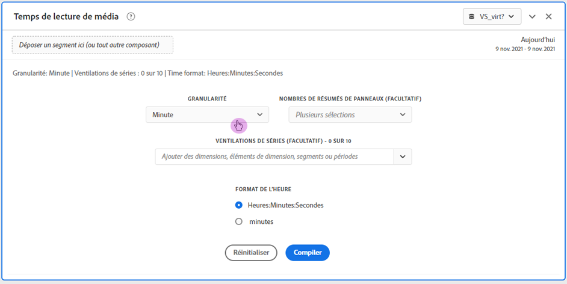
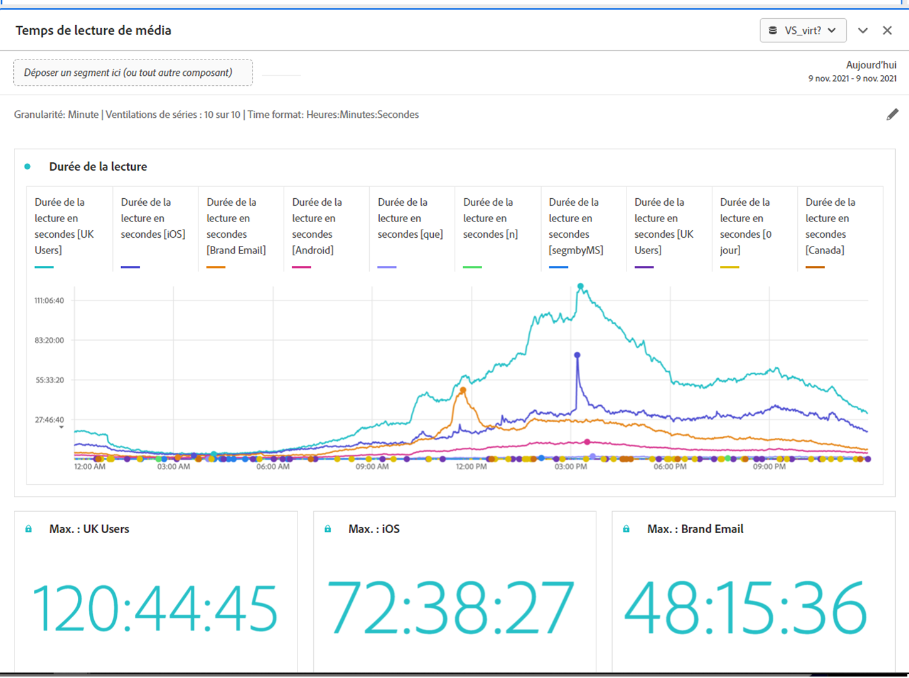

# Panneau Temps de lecture de média {#media-playback-time-spent-panel}

<!-- markdownlint-disable MD034 -->

>[!CONTEXTUALHELP]
>id="workspace_mediaplaybacktimespent_button"
>title="Temps de lecture de média"
>abstract="Créez un panneau pour analyser l’évolution de la consommation vidéo, avec différents niveaux de granularité, et la possibilité de ventiler et de comparer."

<!-- markdownlint-enable MD034 -->

<!-- markdownlint-disable MD034 -->

>[!CONTEXTUALHELP]
>id="workspace_mediaplaybacktimespent_panel"
>title="Temps de lecture de média"
>abstract="Analysez l’évolution de la consommation vidéo, sélectionnez différentes granularités, ventilez et comparez-les.  **Granularité** : sélectionnez une période pour laquelle afficher les visionneuses simultanées. **Nombre de résumés de panneau (facultatif)** : option permettant d’afficher le nombres de résumés avec les informations sur la date ou l’heure pour chaque ligne. La valeur maximale affiche les informations sur le temps de lecture le plus élevé. La valeur minimale affiche les informations sur la plus basse. La somme affiche les informations sur le temps de lecture total. **Ventilation des séries (facultatif)** : ventilez la visualisation par segments, dimensions, éléments de dimension ou périodes. Vous pouvez afficher jusqu’à 10 lignes à la fois. Les répartition sont limitées à un seul niveau. **Format de l’heure** : option permettant d’afficher le format de l’heure des visualisations en heures ou en minutes."

<!-- markdownlint-enable MD034 -->

>[!BEGINSHADEBOX]

_Cet article présente le panneau Temps de lecture de média dans_  _**Adobe Analytics**._ _Voir [Panneau Temps de lecture de média](https://experienceleague.adobe.com/fr/docs/analytics/analyze/analysis-workspace/panels/media-playback-time-spent)) pour la_ version  _**Customer Journey Analytics** de cet article._

>[!ENDSHADEBOX]

>[!NOTE]
>
>Le panneau d’audience moyenne par minute de média est disponible uniquement pour les clientes et clients qui ont acheté le module complémentaire Streaming Media Collection pour Adobe Analytics.
>>Pour plus d’informations, contactez votre représentant ou représentante du service commercial Adobe ou l’équipe Adobe en charge des comptes.
>

Le panneau **[!UICONTROL Temps de lecture de média]** permet dʼanalyser la lecture au fil du temps. Il fournit également des informations détaillées sur le pic dʼaccès simultanés et la possibilité de ventiler et de comparer.

Dans Analysis Workspace, le temps de lecture de média représente le temps de visionnage de vos flux multimédias à un moment précis. Il comprend les pauses, la mise en mémoire tampon et le temps de démarrage.

Les clientes et clients qui ont acheté le module complémentaire Streaming Media Collection peuvent analyser le temps de lecture pour obtenir des informations précieuses sur la qualité du contenu et l’engagement des visiteurs et visiteuses. Et pour vous aider lors du dépannage ou de la planification du volume ou de l’échelle.

Le temps de lecture peut vous aider à comprendre les éléments suivants :

* Où le pic d’accès simultanés s’est produit.

* L’endroit où les abandons ont eu lieu.

>[!BEGINSHADEBOX]

Consultez  [Panneau Temps de lecture de média](https://video.tv.adobe.com/v/338699?quality=12&learn=on){target="_blank"} pour une vidéo de démonstration.

>[!ENDSHADEBOX]

## Utilisation

Pour utiliser un panneau **[!UICONTROL Temps de lecture de média]**, procédez comme suit :

1. Créez un panneau **[!UICONTROL Temps de lecture de média]**. Pour plus d’informations sur la création d’un panneau, consultez [Créer un panneau](panels.md#create-a-panel).

1. Veillez à sélectionner une vue de données pour le panneau dont les composants sont configurés à partir de la collection de Straming Media Collection.

1. Spécifiez l’[entrée](#panel-input) du panneau.

1. Observez la [sortie](#panel-output) du panneau.

### Entrée du panneau

Vous pouvez configurer le panneau Durée de lecture des médias à lʼaide des paramètres dʼentrée suivants :

| Paramètre | Description |
|---|---|
| Période du panneau | La période par défaut du panneau est définie sur Aujourd’hui. Vous pouvez la modifier pour afficher un seul jour ou plusieurs mois à la fois. La visualisation est limitée à 1440 lignes de données (par exemple, 24 heures à une granularité au niveau des minutes). Si une combinaison de période et de granularité génère plus de 1 440 lignes, la granularité est automatiquement mise à jour pour s’adapter à la période complète. |
| Granularité | La granularité par défaut est définie sur Minute. La visualisation est limitée à 1440 lignes de données (par exemple, 24 heures à une granularité au niveau des minutes). Si une combinaison de période et de granularité génère plus de 1 440 lignes, la granularité est automatiquement mise à jour pour s’adapter à la période complète. |
| Synthèse des chiffres des panneaux | Pour afficher les détails de date ou dʼheure relatifs à la durée de la lecture, une synthèse des chiffres est disponible. La valeur maximale affiche les détails concernant le pic d’accès simultanés. La valeur minimale affiche les détails du creux. La somme additionne la durée de lecture totale de la sélection. Le panneau nʼindique par défaut que la valeur maximale, mais vous pouvez modifier cette valeur par défaut et afficher la valeur minimale, la valeur totale ou une combinaison des trois valeurs. Si vous utilisez des répartitions, une synthèse des chiffres s’affiche pour chacune d’elles. |
| Répartition de la série | Vous pouvez éventuellement ventiler votre visualisation par filtres, dimensions, éléments de dimension ou périodes.
- Vous pouvez afficher jusqu’à 10 lignes à la fois. Les répartitions sont limitées à un seul niveau.

- Lorsque vous faites glisser une dimension, les principaux éléments de dimension sont automatiquement sélectionnés en fonction de la période du panneau sélectionnée.
- Pour comparer des périodes, faites glisser deux périodes ou plus dans le filtre de répartition de la série. |
| Format de l’heure | Vous pouvez afficher le temps de lecture en `Hours:Minutes:Seconds` (par défaut) ou en `Minutes` (sʼaffiche en nombres entiers, arrondis à 0,5 vers le haut). |
| Affichage de la séquence de dates | Si vous avez placé au moins deux filtres de période en tant que répartitions de série, lʼoption permettant de sélectionner superposition (par défaut) ou séquentiel sʼaffiche. La superposition affiche les lignes avec un point de départ commun sur lʼaxe X afin quʼelles se déroulent en parallèle. Séquentiel affiche les lignes avec leur point de départ spécifique sur lʼaxe X. Si les données se suivent (par exemple, le filtre 1 se termine à 20 h 44 et le filtre 2 à 20 h 45), les lignes sʼaffichent de manière séquentielle. |

### Sortie du panneau

Le panneau Durée de lecture des médias renvoie un graphique en courbes et des numéros de synthèse, qui incluent des détails sur la durée maximale, minimale et/ou totale de la lecture. En haut du panneau, une ligne de résumé vous rappelle les paramètres du panneau que vous avez sélectionnés.

À tout moment, sélectionnez  pour modifier et recréer le panneau.

Si vous sélectionnez la répartition des séries, une ligne du graphique en courbe et une synthèse des chiffres s’affichent pour chacune d’elles :

### Source de données

La seule mesure pouvant être utilisée dans ce panneau est Durée de la lecture.

| Mesure | Description |
|---|---|
| Durée de la lecture | Nombre total en `hours:minutes:seconds` (ou `minutes`) de contenu affiché lors de la granularité sélectionnée, y compris la mise en pause, la mise en mémoire tampon et le temps de démarrage. |

## Questions fréquentes

| Question | Réponse |
|---|---|
| Où se trouve le tableau à structure libre ? Comment puis-je voir la source de données ? | 

Le tableau à structure libre n’est pas disponible dans cet affichage. Pour télécharger la source de données, à partir du menu contextuel du graphique linéaire, sélectionnez l’option de téléchargement du fichier CSV.
 |
| 
Pourquoi ma granularité a-t-elle changé ?
 | 
La visualisation est limitée à 1 440 lignes de données (par exemple, 24 heures à une granularité au niveau des minutes). Si une combinaison de période et de granularité génère plus de 1 440 lignes, la granularité est automatiquement mise à jour pour s’adapter à la période complète.

Lorsque vous passez d’une période plus grande à une période plus petite, la granularité est mise à jour vers le détail le plus bas possible une fois la période modifiée. Pour afficher une granularité plus élevée, modifiez le panneau et recréez la visualisation.
 |
| 

Comment puis-je comparer les noms de vidéo, les filtres, les types de contenu, etc. ?
 | 
Pour les comparer dans une visualisation unique, faites glisser des filtres, des dimensions ou des éléments de dimension spécifiques dans le filtre de répartition des séries.

L’affichage est limité à 10 répartitions. Pour en afficher plus de 10, vous devez utiliser plusieurs panneaux.
 |
| Comment puis-je comparer des périodes ? | Pour comparer des périodes dans une seule visualisation, utilisez les répartitions des séries en faisant glisser au moins 2 périodes. Ces périodes remplacent la période du panneau. |
| Comment puis-je modifier le type de visualisation ? | 

Ce panneau permet uniquement la visualisation des lignes pour la série temporelle.
 |
| Puis-je exécuter la détection des anomalies ? | 

Non. La détection des anomalies n’est pas disponible pour ce panneau.
 |

>[!MORELIKETHIS]
>
>[Créer un panneau](/help//analyze/analysis-workspace/c-panels/panels.md#create-a-panel)
>>[Panneau Audience moyenne par minute de média](average-minute-audience-panel.md)
>>[Panneau Visiteurs et visiteuses simultanés de médias](media-concurrent-viewers.md)
>

<!--
# Media Playback Time Spent panel

In Analysis Workspace, Playback Time Spent is the amount of time spent viewing your media streams at a specific point in time. It includes pause, buffer, and time to start.

The Media Playback Time Spent panel enables analysis of playback over time, with details on peak concurrency and the ability to break down and compare. 

Customers who have purchased the Streaming Media Collection Add-on can analyze playback time spent to gain valuable insight into the quality of content and viewer engagement, and to help when troubleshooting or planning for volume or scale.

Playback Time Spent can help you understand:

* Where peak concurrency occurred

* Where drop-offs occurred 

Following is a video overview of this panel:

>[!VIDEO](https://video.tv.adobe.com/v/338699)

## Use the Media Playback Time Spent panel

1. Go to a report suite with streaming media components enabled. 
1. Select the panel icon on the far-left, then drag the panel into your Analysis Workspace project.
1. Continue with the following sections to customize the Media Playback Time Spent panel

   * [Panel Inputs](#panel-inputs)
   * [Panel Output](#panel-output)

## Panel Inputs {#Input}

You can configure the Media Playback Time Spent panel using these input settings:

|Setting|Description|
|---|---|
|Panel date range|The panel date range default is Today. You may edit it to view a single day or many months at a time. This visualization is limited to 1440 rows of data (for example, 24-hours at minute-level granularity). If a date range and granularity combination results in more than 1440 rows, the granularity is automatically updated to accommodate the full date range.|
|Granularity|The granularity default is Minute. This visualization is limited to 1440 rows of data (for example, 24-hours at minute-level granularity). If a date range and granularity combination results in more than 1440 rows, the granularity is automatically updated to accommodate the full date range.|
|Panel summary numbers|To see date or time details for playback time spent, a summary number is available. The Maximum shows details for peak concurrency. The Minimum shows details for the trough. Sum adds up the total playback time spent for the selection. The panel default shows Maximum only, but you can change it to show Minimum, Sum, or any combination of the three. If you are using breakdowns, a summary number is displayed for each.|
|Series breakdown|Optionally, you can break down your visualization by segments, dimensions, dimension items, or date ranges.
- You may view up to 10 lines at a time. Breakdowns are limited to a single level.

- When dragging a dimension, the top dimension items will be automatically selected based on the selected panel date range.
- To compare date ranges, drag 2 or more date ranges into the series breakdown filter.|
|Time format|You can view the playback time spent in either `Hours:Minutes:Seconds` (default) or in `Minutes` (which is displayed in whole numbers, rounded up at .5). |
|Date sequence display|If you've placed at least two date range segments as series breakdowns you'll see the option to select either overlay (default) or sequential. Overlay will display the lines with a common x-axis start so that they run in parallel, while sequential will display the lines with their specific x-axis start. If the data lines up (for example, segment 1 ends at 8:44 pm and segment 2 starts at 8:45 pm), then the lines will show in sequence. |

## Default view

## Panel Output {#Output}

The Media Playback Time Spent panel returns a line chart and summary numbers to include details for the maximum, minimum, and/or sum of playback time spent. At the top of the panel, a summary line is provided to remind you of the panel settings you selected.

At any time, you can edit and rebuild the panel by clicking the edit pencil on the top right.

If you selected series breakdown, a line on the line chart and a summary number is displayed for each:

### Data Source

The only metric that can be used in this panel is Playback Time Spent.

|Metric|Description|
|---|---|
|Playback Time Spent|Total `hours:minutes:seconds` (or `minutes`) of content viewed during the selected granularity including pause, buffer, and time to start.|

## FAQs

|Question|Answer|
|---|---|
|Where is the Freeform table? How can I see the data source?|The Freeform table is not available in this view. You can download the data source by right-clicking on the line chart and downloading the CSV file.|
|Why did my granularity change?|This visualization is limited to 1440 rows of data (for example, 24-hours at minute-level granularity). If a date range and granularity combination results in more than 1440 rows, the granularity will be automatically updated to accommodate the full date range. 
When changing from a larger date range to a smaller one, the granularity will be updated to the lowest detail allowable once the date range is changed. To view a higher granularity, edit the panel and rebuild.
|
| How do I compare video names, segments, content types, etc?| To compare these in a single visualization, drag segments, dimensions, or specific dimension items in the series breakdown filter.The view is limited to 10 breakdowns. To view more than 10, you must use multiple panels.|
|How do I compare date ranges?|To compare date ranges in a single visualization, use the series breakdowns by dragging 2 or more date ranges. These date ranges will override the panel date range.|
|How do I change the visualization type?|This panel only allows for the line visualization for the time series.|
|Can I run anomaly detection?|No. Anomaly detection is not available for this panel.|

-->
