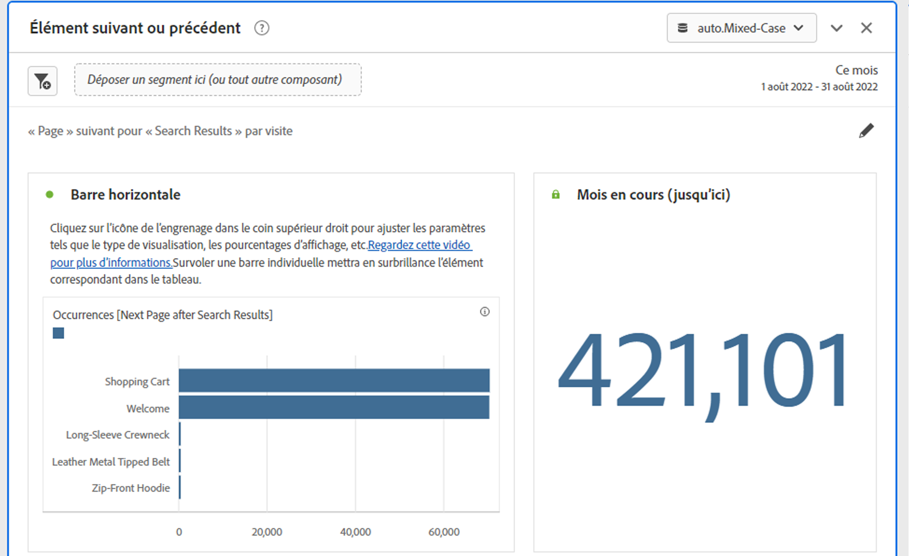

# Panneau d’éléments suivant ou précédent

Ce panneau contient plusieurs tableaux et visualisations pour identifier facilement l’élément de dimension précédent ou suivant pour une dimension spécifique. Par exemple, vous souhaitez peut-être explorer les pages les plus consultées par les clients après avoir visité la page d’accueil.

## Accès au panneau

Vous pouvez accéder au panneau dans [!UICONTROL Reports] ou dans [!UICONTROL Workspace].

| Point d’accès | Description |
| --- | --- |
| [!UICONTROL Rapports] | <ul><li>Le panneau est déjà déposé dans un projet.</li><li>Le rail de gauche est réduit.</li><li>Si vous avez sélectionné [!UICONTROL Page suivante], les paramètres par défaut ont déjà été appliqués, tels que [!UICONTROL Page] pour [!UICONTROL Dimension], et la première page comme [!UICONTROL élément de Dimension], [!UICONTROL Suivant] pour [!UICONTROL Direction] et [!UICONTROL Visite] pour [!UICONTROL Conteneur]}. Vous pouvez modifier tous ces paramètres.</li></ul> |
| Workspace | Créez un projet et sélectionnez l’icône Panneau dans le rail de gauche. Faites ensuite glisser le panneau [!UICONTROL Élément suivant ou précédent] au-dessus du tableau à structure libre. Notez que les champs [!UICONTROL Dimension] et [!UICONTROL Dimension Item] sont laissés vides. Sélectionnez une dimension dans la liste déroulante. Les [!UICONTROL éléments de Dimension] sont renseignés en fonction de la [!UICONTROL dimension] que vous avez choisie. L’élément de dimension supérieur est ajouté, mais vous pouvez sélectionner un autre élément. Les valeurs par défaut sont Suivant et Visiteur. Vous pouvez également les modifier.
 |

{style="table-layout:auto"}

## Entrées de panneau {#Input}

Vous pouvez configurer le panneau [!UICONTROL Elément suivant ou précédent] à l’aide des paramètres d’entrée suivants :

| Paramètre | Description |
| --- | --- |
| Zone de dépôt de segment (ou autre composant) | Vous pouvez faire glisser et déposer des segments ou d’autres composants pour filtrer davantage les résultats du panneau. |
| Dimension | Dimension pour laquelle vous souhaitez explorer les éléments suivants ou précédents. |
| Élément de dimension | L’élément spécifique au centre de votre requête suivante/précédente. |
| Direction | Indiquez si vous recherchez l’élément de dimension [!UICONTROL Suivant] ou [!UICONTROL Précédent] . |
| Conteneur | [!UICONTROL Visite] ou [!UICONTROL Visiteur] (par défaut) déterminent la portée de votre enquête. |

{style="table-layout:auto"}

Cliquez sur **[!UICONTROL Créer]** pour créer le panneau.

## Sortie de panneau {#output}

Le panneau [!UICONTROL Elément suivant ou précédent] renvoie un vaste ensemble de données et de visualisations pour vous aider à mieux comprendre les occurrences qui suivent ou précèdent des éléments de dimension spécifiques.

| Visualisation | Description |
| --- | --- |
| Barre horizontale | Répertorie les éléments suivants (ou précédents) en fonction de l’élément de dimension que vous avez choisi. Le survol d’une barre individuelle met en surbrillance l’élément correspondant dans le tableau à structure libre. |
| Numéro de résumé | Numéro de résumé de haut niveau de toutes les occurrences d’élément de dimension précédente ou suivante pour le mois en cours (à ce jour). |
| Tableau à structure libre | Répertorie les éléments suivants (ou précédents) en fonction de l’élément de dimension choisi, dans un format de tableau. Par exemple, les pages les plus populaires (par occurrence) sur lesquelles les utilisateurs se sont rendus après (ou avant) la page d’accueil ou la page de l’espace de travail. |

{style="table-layout:auto"}
