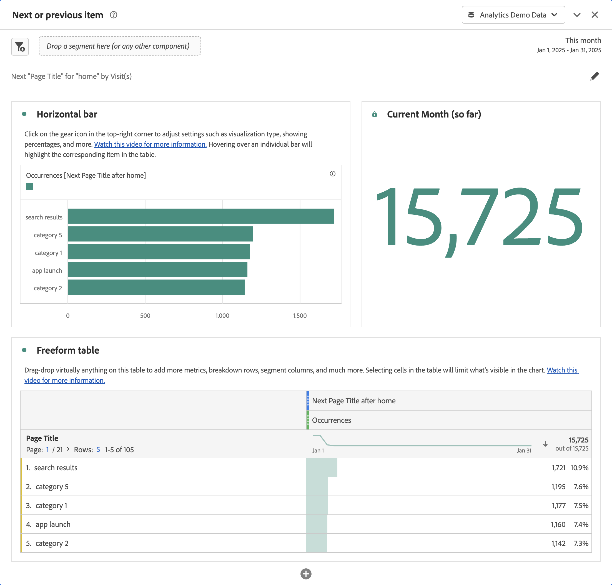
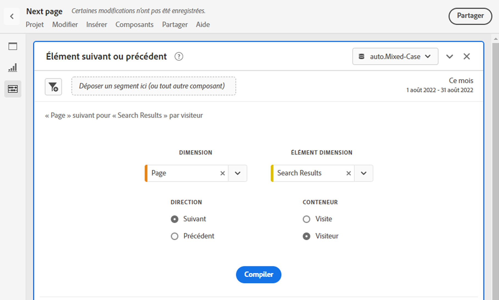

# Panneau d’éléments suivant ou précédent {#next-or-previous-item-panel}

<!-- markdownlint-disable MD034 -->

>[!CONTEXTUALHELP]
>id="workspace_nextorpreviousitem_button"
>title="Élément suivant ou élément précédent"
>abstract="Créez un panneau pour comprendre les dimensions précédentes des personnes ou la dimension suivante à laquelle ils accèdent."

<!-- markdownlint-disable MD034 -->

<!-- markdownlint-disable MD034 -->

>[!CONTEXTUALHELP]
>id="workspace_nextorpreviousitem_panel"
>title="Élément suivant ou précédent"
>abstract="Analysez les endroits les plus courants d’où viennent les visiteurs et visiteuses et ceux où ils vont ensuite.  **Dimension** : sélectionnez une dimension. **Page**, par exemple. **Élément de dimension** : sélectionnez un élément de dimension. Par exemple **Page d’accueil**. **Direction** : sélectionnez **Suivant** pour afficher les éléments de dimension juste après l’élément de dimension sélectionné. Sélectionnez **Précédent** pour afficher les éléments de dimension qui mènent vers l’élément de dimension sélectionné. **Conteneur** : sélectionnez **Session** pour afficher les éléments de dimension suivants/précédents dans la même session, ou sélectionnez **Personne** pour afficher l’élément de dimension suivant/précédent pour la même personne."

<!-- markdownlint-enable MD034 -->

>[!BEGINSHADEBOX]

*Cet article documente le panneau Élément suivant ou précédent dans **Adobe Analytics**. Voir [Panneau d’élément suivant ou précédent](https://experienceleague.adobe.com/en/docs/analytics/analyze/analysis-workspace/panels/next-previous) pour la version **Customer Journey Analytics**de cet article.*

>[!ENDSHADEBOX]

Le panneau **[!UICONTROL Élément suivant ou précédent]** contient un certain nombre de tableaux et de visualisations pour identifier l’élément de dimension suivant ou précédent pour une dimension spécifique. Par exemple, vous pouvez vouloir explorer les pages auxquelles les clients et clientes ont accédé le plus souvent après avoir consulté la page d’accueil.

## Utilisation

Pour utiliser un panneau **[!UICONTROL Élément suivant ou précédent]** :

1. Créez un panneau **[!UICONTROL Élément suivant ou précédent]**. Pour plus d’informations sur la création d’un panneau, consultez [Créer un panneau](panels.md#create-a-panel).

1. Spécifiez l’[entrée](#panel-input) du panneau.

1. Observez la [sortie](#panel-output) du panneau.

### Entrée du panneau

Vous pouvez configurer le panneau [!UICONTROL Élément suivant ou précédent] à l’aide des paramètres de saisie suivants :

| Entrée | Description |
| --- | --- |
| **[!UICONTROL Dimension]** | Sélectionnez la dimension pour laquelle vous souhaitez explorer les éléments suivants ou précédents. |
| **[!UICONTROL Élément de dimension]** | Sélectionnez l’élément de dimension spécifique au centre de votre requête suivante/précédente. |
| **[!UICONTROL Direction]** | Indiquez si vous recherchez l’élément de dimension [!UICONTROL Suivant] ou [!UICONTROL Précédent]. |
| **[!UICONTROL Conteneur]** | Sélectionnez le conteneur, [!UICONTROL Session] ou [!UICONTROL Personne] (par défaut), pour déterminer la portée de votre recherche. |

{style="table-layout:auto"}

Sélectionnez **[!UICONTROL Créer]** pour créer le panneau.

### Sortie du panneau

Le panneau [!UICONTROL Élément suivant ou précédent] renvoie un riche ensemble de données et de visualisations pour vous aider à mieux comprendre les occurrences qui suivent ou précèdent des éléments de dimension spécifiques.

| Visualisation | Description |
| --- | --- |
| **[!UICONTROL Barre horizontale]** | Répertorie les éléments suivants (ou précédents) en fonction de l’élément de dimension que vous sélectionnez. Le survol d’une barre individuelle met en surbrillance l’élément correspondant dans le tableau à structure libre. |
| **[!UICONTROL Numéro de résumé]** | Numéro de synthèse de haut niveau de toutes les occurrences d’éléments de dimension suivants ou précédents pour le mois en cours (jusqu’à présent). |
| **[!UICONTROL Tableau à structure libre]** | Répertorie les éléments suivants (ou précédents) en fonction de l’élément de dimension que vous sélectionnez, sous forme de tableau. Par exemple, qui étaient les pages les plus populaires (par occurrences) auxquelles les personnes ont accédé après (ou avant) la page d’accueil ou la page de l’espace de travail. |

{style="table-layout:auto"}

>[!MORELIKETHIS]
>
>[Créer un panneau](/help//analyze/analysis-workspace/c-panels/panels.md#create-a-panel)
>

<!--
# Next or previous item panel

This panel contains a number of tables and visualizations to easily identify the next or previous dimension item for a specific dimension. For example, you might want to explore which pages customers went to most often after they visited the Home page.

## Access the panel

You can access the panel from within [!UICONTROL Reports] or within [!UICONTROL Workspace].

| Access point | Description |
| --- | --- |
| [!UICONTROL Reports] | <ul><li>The panel is already dropped into a project.</li><li>The left rail is collapsed.</li><li>If you selected [!UICONTROL Next page], default settings have already been applied, such as [!UICONTROL Page] for [!UICONTROL Dimension], and the top page as the [!UICONTROL Dimension Item], [!UICONTROL Next] for [!UICONTROL Direction] and [!UICONTROL Visit] for [!UICONTROL Container]. You can modify all these settings.</li></ul>|
| Workspace | Create a new project and select the Panel icon in the left rail. Then drag the [!UICONTROL Next or previous item] panel above the Freeform table. Notice that the [!UICONTROL Dimension] and [!UICONTROL Dimension Item] fields are left blank. Select a dimension from the drop-down list. [!UICONTROL Dimension items] are populated based on the [!UICONTROL dimension] you chose. The top dimension item gets added, but you can select a different item. The defaults are Next and Visitor. Again, you can modify these as well.
 |

{style="table-layout:auto"}

## Panel Inputs {#Input}

You can configure the [!UICONTROL Next or previous item] panel panel using these input settings:

| Setting | Description |
| --- | --- |
| Segment (or other component) drop zone | You can drag and drop segments or other components to further filter your panel results. |
| Dimension | The dimension for which you want to explore next or previous items. |
| Dimension Item | The specific item at the center of your next/previous inquiry. |
| Direction | Specify whether you are looking for the [!UICONTROL Next] or the [!UICONTROL Previous] dimension item. |
| Container | [!UICONTROL Visit] or [!UICONTROL Visitor] (default) determine the scope of your inquiry. |

{style="table-layout:auto"}

Click **[!UICONTROL Build]** to build the panel.

## Panel output {#output}

The [!UICONTROL Next or previous item] panel returns a rich set of data and visualizations to help you better understand what occurrences follow or precede specific dimension items.

| Visualization | Description |
| --- | --- |
| Horizontal bar | Lists the next (or previous) items based on the dimension item you chose. Hovering over an individual bar highlights the corresponding item in the Freeform table. |
| Summary number | High-level summary number of all next or previous dimension item occurrences for the current month (so far.) |
| Freeform table | Lists the next (or previous) items based on the dimension item you chose, in a table format. For example, which were the most popular pages (by occurrences) that people went to after (or before) the home page or the workspace page. |

{style="table-layout:auto"}

-->