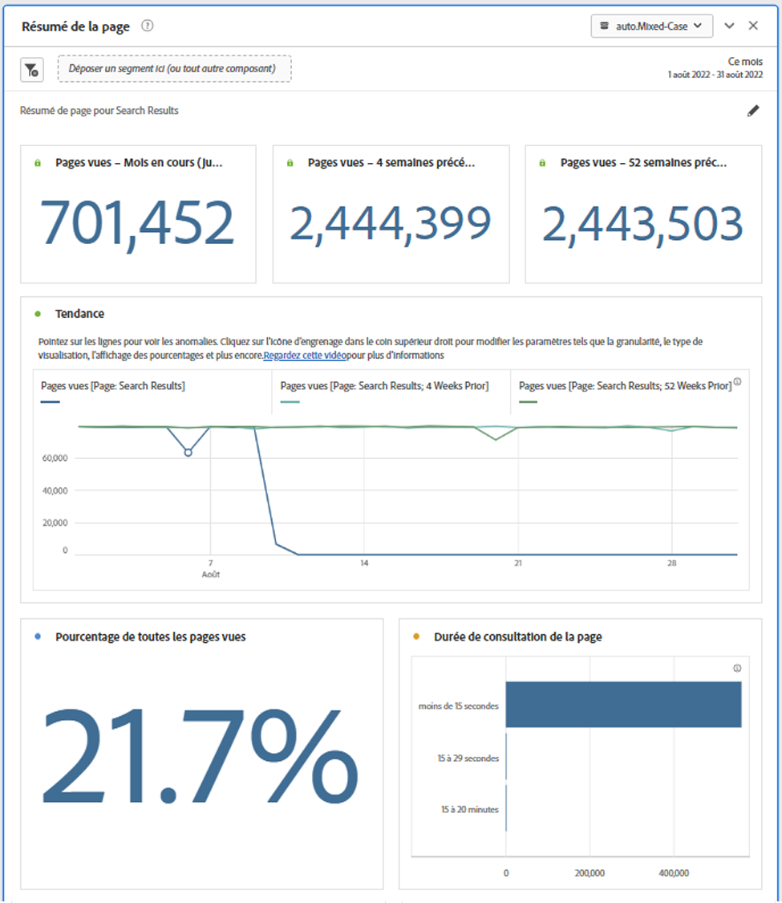
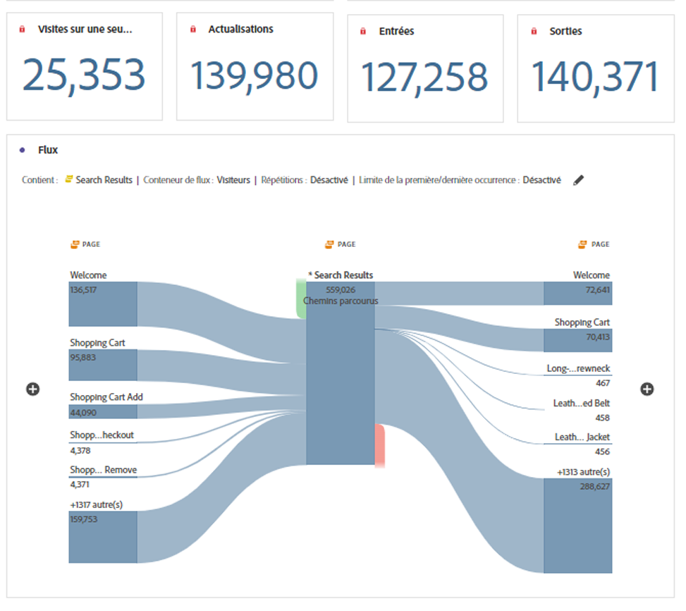

# Panneau Résumé de la page

Ce panneau vous permet d’explorer facilement les statistiques clés sur des pages spécifiques.

## Accès au panneau

Vous pouvez accéder au panneau à partir de la fonction [!UICONTROL Rapports] ou dans [!UICONTROL Workspace].

| Point d’accès | Description |
| --- | --- |
| [!UICONTROL Rapports] | <ul><li>Le panneau est déjà déposé dans un projet.</li><li>Le rail de gauche est réduit.</li><li>Seule la dimension Page est prise en charge.</li><li>Un paramètre par défaut a déjà été appliqué. Dans ce cas, la page la plus visitée pour la variable[!UICONTROL Page] dimension. Vous pouvez modifier ce paramètre.</li></ul> |
| Workspace | Créez un projet et sélectionnez l’icône Panneau dans le rail de gauche. Faites glisser le [!UICONTROL Résumé de la page] au-dessus du tableau à structure libre. Notez que la page [!UICONTROL Élément de Dimension] n’est pas renseignée. Sélectionnez une dimension dans la liste déroulante. |

## Entrées du panneau {#Input}

Vous pouvez configurer la variable [!UICONTROL Résumé de la page] à l’aide des paramètres d’entrée suivants :

| Paramètre | Description |
| --- | --- |
| Zone de dépôt de segment (ou autre composant) | Vous pouvez faire glisser et déposer des segments ou d’autres composants pour filtrer davantage les résultats du panneau. |
| Élément de dimension de page | Dans la liste déroulante, sélectionnez l’élément de dimension Page dont vous souhaitez explorer les statistiques clés. |

{style="table-layout:auto"}

Cliquez sur **[!UICONTROL Build]** pour créer le panneau.

## Sortie de panneau {#output}

La variable [!UICONTROL Résumé de la page] renvoie un riche ensemble de données de mesures et de visualisations pour vous aider à mieux comprendre les statistiques sur des pages spécifiques.

| Mesure/visualisation | Description |
| --- | --- |
| [!UICONTROL Pages vues] - Mois en cours, jusqu’à présent | Nombre de pages vues pour cette page pour le mois en cours. |
| [!UICONTROL Pages vues] - 4 semaines avant | Nombre de pages vues pour cette page au cours du dernier mois. |
| [!UICONTROL Pages vues] - 52 semaines avant | Nombre de pages vues pour cette page au cours de l’année écoulée. |
| [!UICONTROL Tendance] | Graphique de tendance des pages vues pour ce mois-ci, 4 semaines précédentes et 52 semaines précédentes. |
| [!UICONTROL Pourcentage de toutes les pages vues] | Un nombre résumé pour le pourcentage de toutes les pages vues qui ont accédé à cette page. |
| [!UICONTROL Durée de consultation de la page] | Graphique à barres horizontal répertoriant le temps passé sur cette page. |
| [!UICONTROL Visites de page unique] | Numéro de résumé répertoriant le nombre de pages vues pour lesquelles il s’agissait de la seule page visitée. |
| [!UICONTROL Actualisations] | La variable [!UICONTROL Actualisations] indique le nombre de fois où un élément de dimension a été présent lors d’un rechargement. Un visiteur actualisant son navigateur est la méthode la plus courante pour déclencher une actualisation. |
| [!UICONTROL Entrées] | La variable [!UICONTROL Entrées] mesure indique le nombre de fois où un élément de dimension donné est capturé comme première valeur d’une visite. |
| [!UICONTROL Sorties] | La variable [!UICONTROL Sorties] mesure indique le nombre de fois où un élément de dimension donné est capturé comme dernière valeur d’une visite. |
| [!UICONTROL Flux] | Diagramme de flux avec la page sélectionnée comme point focal. Vous pouvez approfondir l’analyse des données comme n’importe quelle [Diagramme de flux](/help/analyze/analysis-workspace/visualizations/c-flow/create-flow.md). |

{style="table-layout:auto"}

