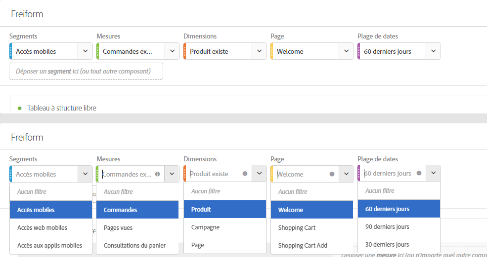
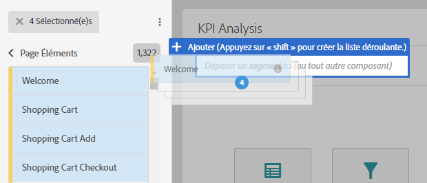
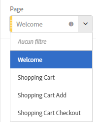
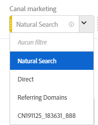

# Présentation des panneaux

Un panneau est un ensemble de tableaux et de visualisations. Vous pouvez accéder aux panneaux à partir de l’icône supérieure gauche dans Workspace. Les panneaux vous permettent d’organiser vos projets selon les périodes, les unités opérationnelles, la géographie, etc. Les quatre types de panneaux suivants sont disponibles dans Analysis Workspace : Panneau vierge, Attribution, Panneau à structure libre et Comparaison des segments.

Le Panneau vierge et le Panneau à structure libre sont des emplacements pour démarrer votre analyse, tandis que l’Attribution IQ et la Comparaison des segments se prêtent aux analyses plus avancées. Nous avons également ajouté un bouton de panneau « + » pour que vous puissiez à tout moment ajouter de nouveaux panneaux vierges.

Le panneau de démarrage par défaut est le Panneau à structure libre, mais vous pouvez également choisir d’utiliser le [Panneau vierge](../../../analyze/analysis-workspace/c-panels/blank-panel.md#concept_B0AD924A792F4166B13448AC253CE7E2) par défaut.

## Filtres déroulants des panneaux {#section_D2828EEDD52944528E87F470EAB581CF}

La zone de liste du panneau propose désormais une fonction de filtrage déroulante. Ces filtres vous permettent d’interagir avec les données du projet de manière contrôlée, afin de réaliser des analyses approfondies, simplifier vos projets et/ou partager des connaissances.

Voici un exemple de projet simplifié : supposons que vous disposiez de plusieurs versions d’un projet/panneau afin d’effectuer du reporting spécifique à chaque pays. Vous pouvez désormais réduire ces projets/panneaux dans un panneau unique et ajouter une liste déroulante des pays à la place pour filtrer les différents jeux de données.

N’oubliez pas ce qui suit :

* Vous pouvez dérouler plusieurs composants (ou éléments de dimension), puis passer de l’un à l’autre dans une liste déroulante pour filtrer le contenu du panneau.
* Vous pouvez également créer plusieurs listes déroulantes sur le même panneau.
* Vous pouvez personnaliser le titre de la liste déroulante en cliquant sur le titre et en le modifiant, ou supprimer complètement le titre en cliquant sur le x à côté de ce dernier.
* Vous pouvez créer des filtres déroulants avec n’importe quel type de composant : dimensions, périodes, segments et mesures. Notez que les périodes déroulantes écrasent toujours les périodes du panneau.
* Nous maintenons les couleurs des composants du rail de gauche : jaune pour les listes déroulantes d’éléments de dimension, vert pour les mesures, bleu pour les segments et violet pour les périodes.
* La zone de dépôt créé toujours des segments de niveau d’accès pour les éléments déplacés en tant que segments. Vous pouvez les modifier normalement en cliquant d’abord sur l’icône d’informations (i) à côté du segment, puis sur l’icône de modification en forme de crayon et en les modifiant dans le créateur de segments.

**Pour créer et utiliser des filtres déroulants :**

1. Select any items from the left rail and, **while holding down the  key**, drop them into the panel drop zone.

   

   Cela permet de transformer les composants en liste déroulante plutôt qu’en segment. (Vous pouvez également ajouter des segments en ne maintenant pas la touche enfoncée.)

   

1. Sélectionnez l’une des options de la liste déroulante ci-dessous pour modifier les données du panneau. (Vous pouvez également choisir de ne pas filtrer les données du panneau en sélectionnant **[!UICONTROL Pas de filtre]**.)
1. Par exemple, si vous souhaitez également répartir les données par canal marketing, vous pouvez ajouter une autre liste déroulante appelée « Canal marketing » :

   

