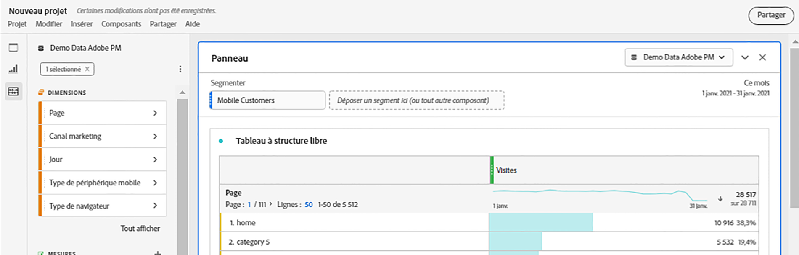
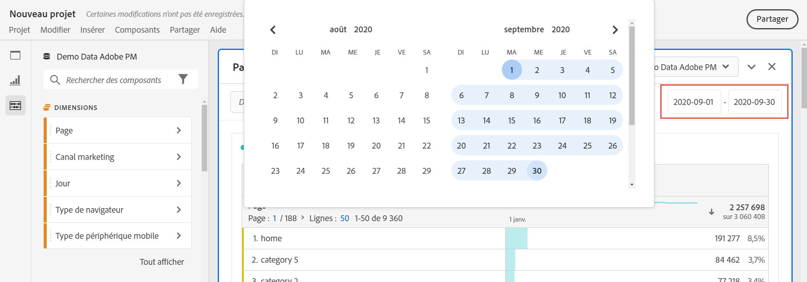
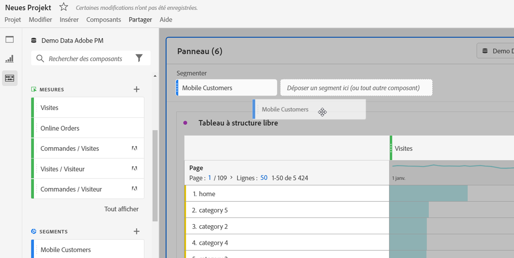
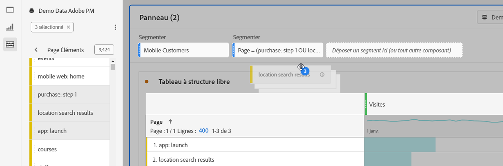
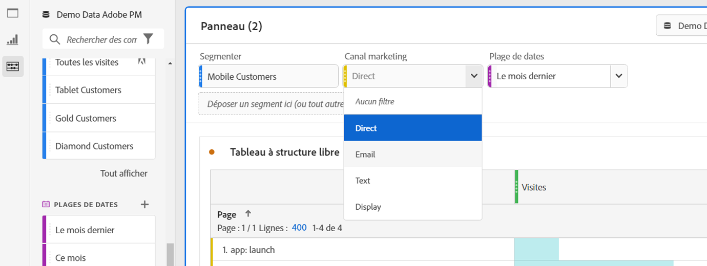
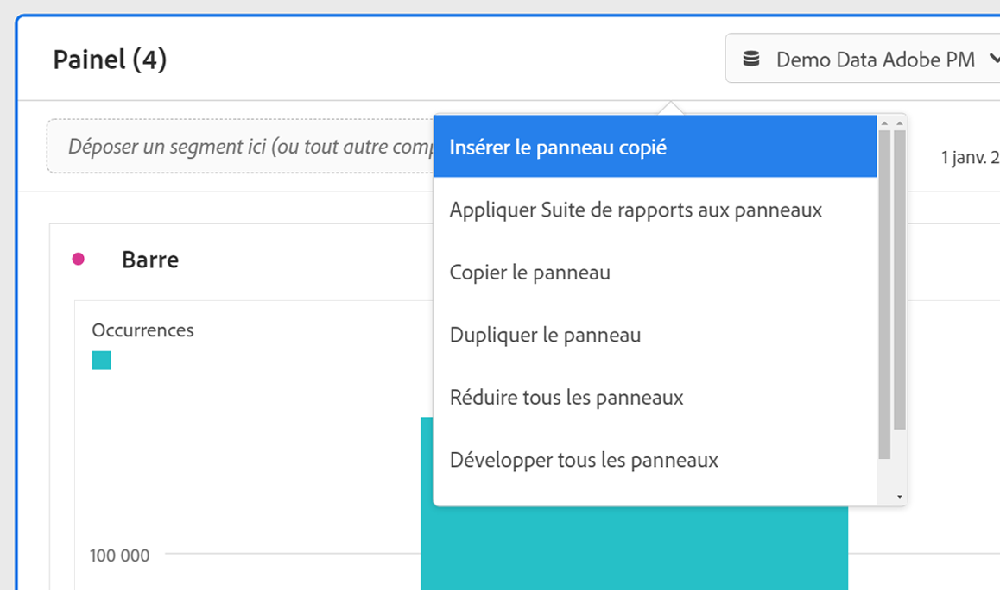
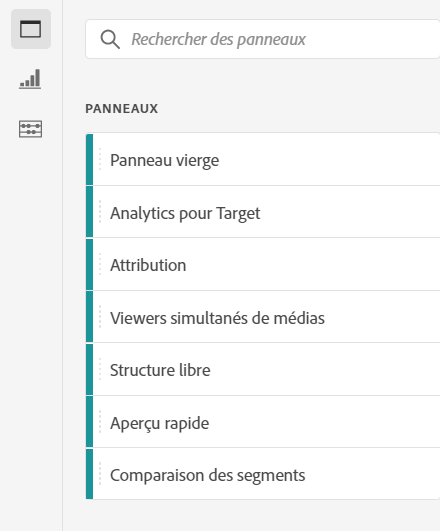
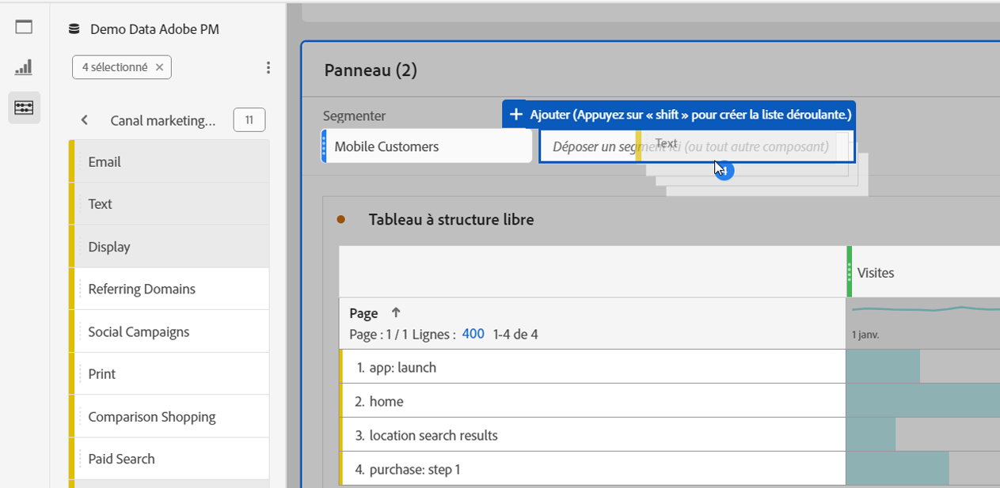

# Vue d’ensemble des panneaux

Un [!UICONTROL panneau] est un ensemble de tableaux et de visualisations. Vous pouvez accéder aux panneaux à partir de l’icône située en haut à gauche dans Workspace ou à partir d’un [panneau vierge](/help/analyze/analysis-workspace/c-panels/blank-panel.md). Les panneaux sont utiles pour organiser vos projets en fonction des périodes, des suites de rapports ou des cas d’utilisation d’analyses.

## Types de panneaux

Les types de panneau suivants sont disponibles dans Analysis Workspace pour [!UICONTROL Adobe Analytics] :

| Nom du panneau | Description |
| --- | --- |
| [Panneau vierge](/help/analyze/analysis-workspace/c-panels/blank-panel.md) | Faites votre choix parmi les panneaux et visualisations disponibles pour démarrer votre analyse. |
| [Attribution](attribution.md) | Comparez et visualisez rapidement de nombreux modèles d’attribution en utilisant n’importe quelle dimension ou mesure de conversion. |
| [Analytics for Target](a4t-panel.md) | Analysez les activités et les expériences Target dans Analysis Workspace. |
| [Structure libre](freeform-panel.md) | Effectuez des comparaisons et des répartitions illimitées, puis ajoutez des visualisations pour raconter une histoire riche en données. |
| [Audience moyenne par minute de média](average-minute-audience-panel.md) | Analysez l’audience moyenne par minute pour un élément spécifique de contenu ou au cours d’une période personnalisée. |
| [Visionneuses simultanées de médias](media-concurrent-viewers.md) | Analysez les visionneuses au fil du temps, avec des informations sur la simultanéité la plus élevée, et sur la capacité à ventiler et à comparer. |
| [Temps passé à lire des médias](/help/analyze/analysis-workspace/c-panels/media-playback-time-spent.md) | L’analyse du temps de lecture permet de déterminer où se produisent les pics d’audience mais aussi où des abandons ont eu lieu. |
| [Élément suivant ou précédent](next-previous.md) | Affiche les pages visitées suivantes ou précédentes. |
| [Aperçu rapide](quickinsight.md) | Construisez rapidement un tableau à structure libre et une visualisation d’accompagnement afin d’analyser et de mettre en évidence les informations plus rapidement. |
| [Résumé de la page](page-summary.md) | Explorez les statistiques clés concernant des pages spécifiques. |
| [Comparaison des segments](/help/analyze/analysis-workspace/c-panels/c-segment-comparison/segment-comparison.md) | Comparez rapidement deux segments sur tous les points de données afin de rechercher automatiquement les différences pertinentes. |

Les panneaux [!UICONTROL Aperçu rapide], [!UICONTROL Blank] et [!UICONTROL Tableau à stucture libre] constituent d’excellents points de départ pour votre analyse, tandis qu’[!UICONTROL Attribution] est réservé à des analyses avancées. Un  est disponible au bas de la zone de travail. Vous pouvez donc ajouter des panneaux vierges à tout moment.

Le panneau de démarrage par défaut est le panneau [!UICONTROL Tableau à structure libre], mais vous pouvez également choisir d’utiliser le [Panneau vierge](/help/analyze/analysis-workspace/c-panels/blank-panel.md) ou l’[Aperçu rapide](/help/analyze/analysis-workspace/c-panels/quickinsight.md) par défaut. Consultez [Préférences des projets et analyses](/help/analyze/analysis-workspace/user-preferences.md#projects--analyses-preferences).

## Créer un panneau

Pour créer un panneau :

* Faites glisser un panneau à partir du panneau de gauche **[!UICONTROL Panneaux]** dans votre zone de travail.
* Sélectionnez un panneau dans le [Panneau vierge](blank-panel.md).
* Utilisez le menu **[!UICONTROL Insérer]** dans Workspace et sélectionnez votre panneau. Vous pouvez également utiliser l’un des [raccourcis](../build-workspace-project/fa-shortcut-keys.md) pour insérer un panneau.

  

Vous pouvez effectuer les opérations suivantes :

* Sélectionnez  **dans** n’importe quel panneau pour ajouter une autre visualisation. Une fenêtre contextuelle s’affiche, vous permettant de sélectionner une visualisation.

  

  | Sélectionnez... | Pour créer un/une... |
  |---|---|
  |  | [Tableau à structure libre](/help/analyze/analysis-workspace/visualizations/freeform-table/freeform-table.md) |
  |  | [Ligne](/help/analyze/analysis-workspace/visualizations/line.md) |
  |  | [Barre](/help//analyze/analysis-workspace/visualizations/bar.md) |
  |  | [Numéro de résumé](/help/analyze/analysis-workspace/visualizations/summary-number-change.md) |
  |  | [Texte](/help/analyze/analysis-workspace/visualizations/text.md) |
  |  | [Abandon](/help/analyze/analysis-workspace/visualizations/fallout/fallout-flow.md) |
  |  | [Flux](/help/analyze/analysis-workspace/visualizations/c-flow/flow.md) |
  |  | [Aires empilées](/help/analyze/analysis-workspace/visualizations/area.md) |
  |  | [Table de cohorte](/help/analyze/analysis-workspace/visualizations/cohort-table/t-cohort.md) |
  |  | [Puces](/help/analyze/analysis-workspace/visualizations/bullet-graph.md) |
  |  | [Anneau](/help/analyze/analysis-workspace/visualizations/donut.md) |
  |  | [Résumé des changements](/help/analyze/analysis-workspace/visualizations/summary-number-change.md) |
  |  | [Histogramme](/help/analyze/analysis-workspace/visualizations/histogram.md) |
  |  | [Dispersion](/help/analyze/analysis-workspace/visualizations/scatterplot.md) |
  |  | [Venn](/help/analyze/analysis-workspace/visualizations/venn.md) |
  |  | [Plan en arborescence](/help/analyze/analysis-workspace/visualizations/treemap.md) |

* Sélectionnez  **à l&#39;extérieur** du dernier panneau de votre espace de travail pour ajouter un autre [panneau vierge](blank-panel.md).

## Suite de rapports

Chaque panneau est associé à une [suite de rapports](/help/admin/admin/c-manage-report-suites/report-suites-admin.md), identifiée par  **[!UICONTROL *nom de la suite de rapports *]**dans le menu déroulant en haut à droite du panneau.

Lorsque vous créez un panneau, la suite de rapports par défaut est basée sur la suite de rapports du panneau sur lequel vous avez travaillé pour la dernière fois dans le projet Analysis Workspace.

Dans un projet, vous pouvez utiliser une ou [plusieurs suites de rapports](https://experienceleague.adobe.com/docs/analytics/analyze/analysis-workspace/build-workspace-project/multiple-report-suites.html?lang=fr) selon les cas d’utilisation de votre analyse.

La liste des suites de rapports est triée en fonction de la pertinence. Adobe définit la pertinence en fonction de la fréquence dʼutilisation récente de la suite par lʼutilisateur ou lʼutilisatrice actuels et de la fréquence dʼutilisation de la suite au sein de lʼentreprise.

>[!IMPORTANT]
>
>La suite de rapports sélectionnée détermine les dimensions, les mesures et les segments disponibles pour la création des visualisations dans un panneau.
>
>
>Lorsque vous changez la suite de rapports d’un panneau, certains composants peuvent ne pas être disponibles dans la nouvelle suite de rapports. Cette modification peut empêcher votre visualisation de s’afficher correctement. Des avertissements peuvent s’afficher, par exemple :
>
>* Ce panneau contient des composants qui ne sont pas activés dans la suite de rapports sélectionnée. Changez de suite de rapports ou activez les composants requis dans la suite de rapports.
>* Impossible d’afficher la visualisation : vérifiez vos colonnes et lignes pour vous assurer qu’elles contiennent des composants valides.
>

## Calendrier

Le calendrier de panneau contrôle la période des rapports des tableaux et des visualisations dans un panneau.

>[!NOTE]
>
>Si un composant de période  est utilisé dans une visualisation ou un panneau (par exemple, comme segment), le composant de période remplace le calendrier de panneau.
>

1. Sélectionnez une période en sélectionnant d’abord la date de début, puis la date de fin.
Vous pouvez également sélectionner un **[!UICONTROL paramètre prédéfini]** dans le menu déroulant [!UICONTROL *Sélectionner un paramètre prédéfini*].

1. Vous pouvez également sélectionner **[!UICONTROL Afficher les paramètres avancés]** pour :

   * Spécifier une **[!UICONTROL heure de départ]** et une **[!UICONTROL heure de fin]** différentes de celles par défaut, à savoir `12:00 AM` (`0:00`) et `11:59 PM` (`23:59`). Les heures de fin comprennent toujours 59 secondes. Pour une période qui s’étend sur plusieurs jours, l’heure de début s’applique au premier jour de la période et l’heure de fin s’applique au dernier jour de la période. Utilisez **[!UICONTROL (Réinitialiser les heures)]** pour réinitialiser les heures de début et de fin à leurs valeurs par défaut.
   * **[!UICONTROL Faire correspondre les composants de la période au calendrier du panneau]**. Si cette option est désactivée, les composants de période utilisés dans le panneau se rapportent à l’heure actuelle. Si cette option est activée, les composants de période utilisés dans le panneau correspondent au calendrier de panneau.
   * **[!UICONTROL Utilisation de dates glissantes]**. Si cette option est activée, les périodes prédéfinies telles que **[!UICONTROL 7 derniers jours complets]** se mettent dynamiquement à jour en fonction de l’évolution de la date et de l’heure actuelles. Si cette option est désactivée, ces paramètres prédéfinis ne sont pas mis à jour une fois appliqués.

     

     Vous pouvez sélectionner le texte entre parenthèses (par exemple : **[!UICONTROL début fixe - dates glissantes chaque jour]**) pour étendre le panneau et spécifier des détails pour **[!UICONTROL Début]** et **[!UICONTROL Fin]**.

      1. Sélectionnez **[!UICONTROL Début de]**, **[!UICONTROL Fin de]** ou **[!UICONTROL Jour fixe]**.
      1. Lorsque vous avez sélectionné **[!UICONTROL Début de]** ou **[!UICONTROL Fin de]**, vous pouvez créer une expression complète. Par exemple : **[!UICONTROL Fin de]** **[!UICONTROL l’année en cours]** **[!UICONTROL plus]** `1` **[!UICONTROL jour]**. Sélectionnez la valeur appropriée pour chaque partie de l’expression.
         * Sélectionnez une valeur pour la période actuelle. Par exemple, **[!UICONTROL année en cours]**.
         * Sélectionnez une valeur pour le calcul supplémentaire. Par exemple, **[!UICONTROL plus]**.
         * Lorsque vous avez spécifié un calcul supplémentaire, indiquez une valeur. Par exemple `1`.
         * Lorsque vous avez spécifié un calcul supplémentaire, sélectionnez la période à utiliser pour le calcul. Par exemple, **[!UICONTROL jour]**.

     Sélectionnez **[!UICONTROL Masquer les détails]** pour masquer les détails du calcul des dates glissantes.

1. Sélectionnez **[!UICONTROL Appliquer]** pour appliquer la période au panneau à partir duquel vous avez ouvert le calendrier.
Sélectionnez **[!UICONTROL Appliquer à tous les panneaux]** pour appliquer la période à tous les panneaux du projet Workspace.

## Zone de dépôt {#dropzone}

La zone de dépôt des panneaux vous permet d’appliquer des segments et des segments déroulants à tous les tableaux et visualisations d’un panneau. Vous pouvez appliquer un ou plusieurs segments à un panneau.

### Segments

Faites glisser un segment à partir du panneau de gauche vers la zone de dépôt du panneau pour commencer la segmentation de votre panneau. Répétez cette procédure pour ajouter des segments supplémentaires au panneau. Les segments s’affichent côte à côte en haut du panneau.

#### Segments rapides

Vous pouvez également faire glisser les composants qui ne sont pas des segments directement vers la zone de dépôt pour créer des segments rapides, ce qui vous permet de gagner du temps et vous évite de passer par le [créateur de segments](/help/components/segmentation/segmentation-workflow/seg-build.md). Les segments ainsi créés sont automatiquement définis comme des segments de niveau événement. Cette définition peut être rapidement modifiée en sélectionnant l’option  à côté du nom du segment.

<!-- For more information, see [Quick segments](/help/components/segmentation/). -->

### Segments déroulants

>[!BEGINSHADEBOX]

Consultez  [Segments déroulants](https://video.tv.adobe.com/v/327485?quality=12&learn=on&captions=fre_fr){target="_blank"} pour une vidéo de démonstration.

>[!ENDSHADEBOX]

#### Segments déroulants statiques

Les segments déroulants statiques vous permettent d’interagir avec les données de manière contrôlée. Par exemple, vous pouvez ajouter un segment de menu déroulant pour les types d’appareil mobile afin de segmenter le panneau par tablette, téléphone mobile ou poste de travail.

Les segments déroulants statiques peuvent également être utilisés pour consolider plusieurs projets en un seul. Par exemple, si vous avez plusieurs versions d’un même projet avec des segments Pays différents, vous pouvez les fusionner en un seul projet et ajouter un segment de menu déroulant Pays.

##### Créer des segments déroulants statiques

* Pour les segments déroulants qui utilisent des éléments de dimension, sélectionnez une dimension dans le panneau de gauche et faites-la glisser vers la zone de dépôt du panneau en maintenant la touche ⇧ (*Maj*) enfoncée. Cette action crée un segment déroulant avec tous les éléments de dimension associés à cette dimension.

  Ou, si vous souhaitez que le segment déroulant comprenne uniquement des éléments de dimension spécifiques associés à une dimension, cliquez sur l’icône de flèche vers la droite à côté de la dimension souhaitée dans le panneau de gauche. Cette action affiche tous les éléments de dimension disponibles. Sélectionnez plusieurs éléments de dimension dans cette liste à l’aide de ⇧+ (*Maj* + *Sélectionner*) ou ^+ (*Ctrl* + *Sélectionner*), puis déposez-les dans la zone de dépôt du panneau **tout en maintenant la touche** ⇧ enfoncée.

* Pour les segments déroulants qui utilisent un seul type de composant (par exemple, uniquement des dimensions, des segments ou des mesures), sélectionnez plusieurs éléments du même type dans le panneau de gauche à l’aide de ⇧+ ou ^+. Déposez ensuite les éléments dans la zone de dépôt du panneau **tout en maintenant la touche** ⇧ enfoncée.

  Un seul segment déroulant est créé avec les composants que vous avez sélectionnés.

* Pour les segments déroulants utilisant un mélange de types de composants (par exemple, 2 mesures et 3 segments), sélectionnez plusieurs composants à l’aide de ⇧+ ou ^+. Déposez la sélection dans la zone de dépôt du panneau **tout en maintenant la touche** ⇧ enfoncée. Dans ce contexte, tous les types de composants sont traités comme des segments déroulants distincts. Par exemple, si vous incluez à la fois des mesures et des éléments de dimension dans votre sélection, deux segments déroulants distincts sont créés : un segment déroulant incluant des éléments de dimension et un autre incluant des mesures.

Un segment déroulant fournit les options de menu contextuel suivantes :

* **[!UICONTROL Supprimer le segment déroulant]** : supprime le segment déroulant du panneau.
* **[!UICONTROL Supprimer le libellé]** : supprime le texte affiché au-dessus d’un segment déroulant. Pour modifier le libellé, pointez dessus et sélectionnez .
* **[!UICONTROL Ajouter un libellé]** : lorsque vous ajoutez un segment déroulant à un projet, un libellé est automatiquement défini sur le nom du composant. Si vous supprimez le libellé, vous pouvez l’ajouter à nouveau avec cette option.
* **[!UICONTROL Exiger une sélection]** : nécessite qu’un segment soit défini sur le panneau.

##### Utiliser des segments déroulants statiques

Pour segmenter le panneau, les utilisateurs et les utilisatrices peuvent utiliser le menu de segments déroulants de l’une des façons suivantes :

* Appliquez un seul segment au panneau en sélectionnant le segment dans le segment déroulant.

* Appliquez plusieurs segments au panneau en sélectionnant plusieurs segments dans le segment déroulant. Le panneau est segmenté pour inclure l’un des segments sélectionnés.

#### Segments déroulants dynamiques

Les segments déroulants dynamiques vous permettent de déterminer les valeurs disponibles en fonction des données dans la plage de rapports du panneau et des valeurs dans d’autres segments déroulants. Vous pouvez par exemple créer deux listes déroulantes dynamiques à l’aide d’une dimension Pays et d’une dimension Villes. Lorsque vous sélectionnez un pays dans la liste déroulante **[!UICONTROL Pays]**, la liste déroulante **[!UICONTROL Villes]** s’adapte de manière dynamique pour n’afficher que les villes de ce pays.

Ce même concept s’applique à toutes les dimensions. Seuls les éléments de dimension qui apparaissent dans la période du panneau et les segments sélectionnés sont visibles. Les éléments de dimension sélectionnés dans les segments déroulants statiques affectent les valeurs disponibles dans les segments déroulants dynamiques. Cependant, l’inverse n’est pas vrai : les éléments de dimension sélectionnés dans les segments déroulants dynamiques n’affectent pas les valeurs disponibles dans les segments déroulants statiques.

La sélection manuelle d’éléments de dimension est possible si vous prévoyez qu’un élément de dimension donné sera collecté ultérieurement. Vous pouvez également effacer un segment déroulant dynamique afin qu’il ne contienne aucune valeur, permettant ainsi à d’autres segments déroulants dynamiques de contenir plus de valeurs. Sélectionnez **[!UICONTROL Réinitialiser tous]** pour effacer la sélection de tous les segments déroulants de ce panneau.

Pour créer un segment déroulant dynamique, procédez comme suit :

* Glissez-déposez une seule dimension dans la zone de dépôt du panneau **tout en maintenant la touche** ⇧ enfoncée.

Notez que les segments déroulants dynamiques ne sont pas disponibles pour les mesures, les segments ou les périodes.

Un segment déroulant dynamique permet d’obtenir les mêmes options de menu contextuel que les segments déroulants statiques.

## Menu contextuel

Pour accéder aux fonctionnalités supplémentaires d’un panneau, faites un clic droit sur l’en-tête du panneau pour accéder au menu contextuel.

Les options disponibles sont les suivantes :

| Option | Description |
| --- | --- |
| **[!UICONTROL Insérer le panneau copié]** | Vous permet de coller la copie d’un panneau ou d’une visualisation dans un autre emplacement au sein du projet, ou dans un autre projet. |
| **[!UICONTROL Insérer une visualisation copiée]** | Permet de coller la copie d’une visualisation dans un autre emplacement au sein du panneau, du projet, ou dans un autre projet. |
| **[!UICONTROL Appliquer une suite de rapports à tous les panneaux]** | Appliquez la suite de rapports de ce panneau à tous les autres panneaux du projet. |
| **[!UICONTROL Copier le panneau]** | Copie un panneau pour vous permettre de l’insérer dans un autre emplacement au sein du projet, ou dans un autre projet. |
| **[!UICONTROL Dupliquer le panneau]** | Crée un double exact du panneau actuel, que vous pouvez ensuite modifier. |
| **[!UICONTROL Réduire tous les panneaux]** | Réduit tous les panneaux du projet. |
| **[!UICONTROL Développer tous les panneaux]** | Développe tous les panneaux du projet. |
| **[!UICONTROL Réduire toutes les visualisations dans le panneau]** | Réduit toutes les visualisations dans le panneau actif. |
| **[!UICONTROL Développer toutes les visualisations dans le panneau]** | Développe toutes les visualisations du panneau actif. |
| **[!UICONTROL Modifier la description]** | Ajouter (ou modifier) une description textuelle du panneau. |
| **[!UICONTROL Obtenir un lien vers le panneau]** | Dirige un utilisateur ou une utilisatrice vers un panneau spécifique dans un projet. Lorsque le lien est sélectionné, la personne destinataire doit se connecter avant d’être dirigée vers le panneau lié. |

## Configuration

Certains panneaux (comme [!UICONTROL Attribution], [!UICONTROL Expérience], [!UICONTROL Audience moyenne par minute de média], etc.) possèdent une boîte de dialogue de configuration pour vous aider à créer la visualisation. Utilisez  en haut du panneau pour accéder à la configuration et la modifier.

<!--
## Panel types

The following panel types are available in Analysis Workspace:

| Panel name | Description |
| --- | --- |
| [Blank panel](blank-panel.md) | Choose from available panels and visualizations to start your analysis. |
| [Quick Insights panel](quickinsight.md) | Quickly build a freeform table and an accompanying visualization in order to analyze and uncover insights faster. |
| [Analytics for Target panel](a4t-panel.md) | Analyze Target activities and experiences in Analysis Workspace. |
| [Attribution panel](attribution.md) | Quickly compare and visualize any number of attribution models using any dimension and conversion metric. |
| [Freeform panel](freeform-panel.md) | Perform unlimited comparisons and breakdowns, then add visualizations to tell a rich data story. |
| [Media Average Minute Audience panel](average-minute-audience-panel.md) | Analyze average minute audience over time, with details on peak views and the ability to break down and compare. |
| [Media Concurrent Viewers panel](media-concurrent-viewers.md) | Analyze concurrent viewers over time, with details on peak concurrency and the ability to break down and compare. |
| [Media Playback Timespent panel](/help/analyze/analysis-workspace/c-panels/media-playback-time-spent.md) | Analyze concurrent viewers over time, with details on peak concurrency and the ability to break down and compare. |
| [Segment Comparison panel](c-segment-comparison/segment-comparison.md) | Quickly compare two segments across all data points to automatically find relevant differences. |

[!UICONTROL Quick Insights], [!UICONTROL Blank] and [!UICONTROL Freeform] panels are great places to start your analysis, while [!UICONTROL Analytics for Target], [!UICONTROL Attribution], [!UICONTROL Media Concurrent Viewers] and [!UICONTROL Segment Comparison] lend themselves to more advanced analyses. A `"+"` button is available in projects so you can add blank panels at any time.

The default starting panel is the [!UICONTROL Freeform] panel, but you can make the [blank panel](/help/analyze/analysis-workspace/c-panels/blank-panel.md) your default as well.

## Report suite {#report-suite}

Tables and visualizations within a panel derive data from the [!UICONTROL report suite] selected in the top right of the panel. The report suite also determines what components are available in the left rail. Within a project, you can use one or [many report suites](https://experienceleague.adobe.com/docs/analytics/analyze/analysis-workspace/build-workspace-project/multiple-report-suites.html?lang=fr) depending on your analysis use cases. To apply a single report suite to all panels in a project, **right-click panel header > Apply report suite to all panels**.

The list of report suites is sorted on relevancy, which Adobe defines based on how recently and frequently the suite has been used by the current user, and how frequently the suite is used within the organization.

## Calendar {#calendar}

The panel calendar controls the reporting range for tables and visualizations within a panel.

>[!NOTE]
>If a (purple) date range component is used within a table, visualization or panel drop zone, it overrides the panel calendar.

You can apply a minute-level date range under the advanced settings of your panel calendar. If you are reporting on a date range that spans many days, start time applies to the first day and end time applies to the last day in your range.

## Drop zone {#dropzone}

The panel drop zone enables you to apply segment and drop-down filters to all tables and visualizations within a panel. You can apply one or many filters to a panel. 

### Segment filters

Drag and drop any segments from the left rail into the panel drop zone to begin filtering your panel. Repeat this process to add additional filters to the panel. Filters appear side by side at the top of the panel.

### Ad hoc segment filters

Non-segment components can also be dragged directly into the drop zone to create ad hoc segments, saving you the time and effort of going to the Segment Builder. Segments created in this way are automatically defined as hit-level segments. This definition can be modified by clicking the information icon (i) next to the segment, then the pencil-shaped edit icon and editing it in the Segment Builder.

Ad hoc segments are a type of quick segment, and are local to the project. They do not show up in the left rail unless you make them public.

For more information, see [Quick segments](/help/analyze/analysis-workspace/components/segments/quick-segments.md).

### Static drop-down segments

Static drop-down segments enable you to interact with the data in a controlled way. For example, you can add a drop-down segment for Mobile Device Types so that you can segment the panel by Tablet, Mobile Phone, or Desktop.

Static drop-down segments can also be used to consolidate many projects into one. For example, if you have many versions of the same project with different Country segments applied, you can consolidate all versions into a single project and add a Country drop-down segment.

#### Create static drop-down segments

* For drop-down segments using dimension items, select a single dimension from the left rail and drop it into the panel dropzone **while holding `[Shift]`**. This creates a drop-down segment with all the dimension items that are associated with that dimension. 

  Or, if you want the drop-down segment to include only specific dimension items that are associated with a dimension, click the right arrow icon next to the desired dimension in the left rail. This action exposes all available dimension items. Select multiple dimension items from this list using `[Shift + Click]` or `[Ctrl + Click]`, then drop them into the panel dropzone **while holding** `[Shift]`.

* For drop-down segments using a single component type (for example, only dimensions, or only segments, or only metrics), select multiple items of the same type in the left rail using `[Shift + Click]` or `[Ctrl + Click]`, then drop them into the panel dropzone **while holding `[Shift]`**.

  A single drop-down segment is created with components that you selected.

* For drop-down segments using a mix of component types (such as 2 metrics and 3 filters), select multiple components using `[Shift + Click]` or `[Ctrl + Click]`. Drop the selection into the panel dropzone **while holding `[Shift]`**. In this context, all component types are treated as separate drop-down segments. For example, if you include both metrics and dimension items in your selection, two separate drop-down segments are created: one drop-down segments includes dimension items, and the other includes metrics.

  

Right-clicking a drop-down segment provides the following options:

* **[!UICONTROL Delete drop-down]**: Removes the drop-down segment from the panel. 
* **[!UICONTROL Delete label]**: Remove the text above a drop-down segment. To modify the label, select the pencil icon.
* **[!UICONTROL Add label]**: When you add a drop-down segment to a project, a label is automatically set to the component name. If you delete the label, you can add it again with this option.
* **[!UICONTROL Require selection]**: Requires that a segment is set on the panel. 

[Watch the video](https://experienceleague.adobe.com/docs/analytics-learn/tutorials/analysis-workspace/using-panels/using-panels-to-organize-your-analysis-workspace-projects.html?lang=fr) to learn more about how to add drop-down filters to your project.

#### Use static drop-down segments

Use the drop-down segments menu in any of the following ways in order to filter the panel:
     
* Apply a single segment to the panel by selecting the segment from the drop-down menu.

* Apply multiple segments to the panel by selecting more than one segment from the drop-down menu. The panel is filtered to include any of the selected segments. 

  To remove a segment from the list, select it again in the drop-down menu.

  

### Dynamic drop-down segments

Dynamic drop-down segments allow you to determine available values based on data within the panel's reporting range and values in other drop-down segments. For example, you can create two dynamic drop-downs using the [Countries](/help/components/dimensions/countries.md) dimension and [Cities](/help/components/dimensions/cities.md) dimension. When you select a country from the [!UICONTROL Countries] drop-down list, the [!UICONTROL Cities] drop-down list dynamically adjusts to only show cities within that country.

This same concept applies to all dimensions; only dimension items that appear within the panel's date range and selected segments are visible. Dimension items selected in static drop-down segments affect available values in dynamic drop-down segments. However, the inverse is not true; Dimension items selected in dynamic drop-down segments do not affect available values in static drop-down segments.

Manual selection of dimension items is available if you anticipate a certain dimension item to be collected in the future. You can also clear a dynamic drop-down segment so that it does not contain a value, allowing other dynamic drop-down segments to contain more values. Select **[!UICONTROL Reset all]** to clear the selection from all drop-down segments for that panel.

To create a dynamic drop-down segment:

* Drag and drop a single dimension into the panel dropzone **while holding `[Shift]`**.
* Dynamic drop-down segments are not available for metrics, segments, or date ranges.
* Right-click a drop-down segment and select **[!UICONTROL Delete dropdown]** to delete it.

Right-clicking a dynamic drop-down filter provides the same options as static drop-down filters.

## Right-click menu {#right-click}

Additional functionality for a panel is available by right-clicking on the panel header.

The following settings are available:

| Setting | Description |
| --- | --- |
| Insert Copied Panel/Visualization|Lets you paste ("insert") a copied panel or visualization to another place within the project, or into a different project.|
| Copy Panel | Lets you right-click and copy a panel, so that you can insert it to another place within the project, or into a different project.|
| Apply Report Suite to all panels | Lets you apply the active panel report suite to all panels in the project.|
| Duplicate Panel | Makes an exact duplicate of the current panel, which you can then modify. |
| Collapse/Expand all Panels | Collapses and expands all project panels. |
| Collapse/Expand all Visualizations in Panel | Collapses and expands all visualizations in the current panel. |
| Edit Description | Add (or edit) a text description for the panel. |
| Get Panel Link | Lets you direct someone to a specific panel within a project. When the link is clicked, the recipient will be required to login before being directed to the exact panel linked to. |

-->
