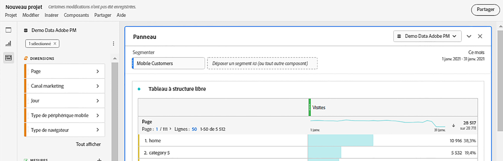
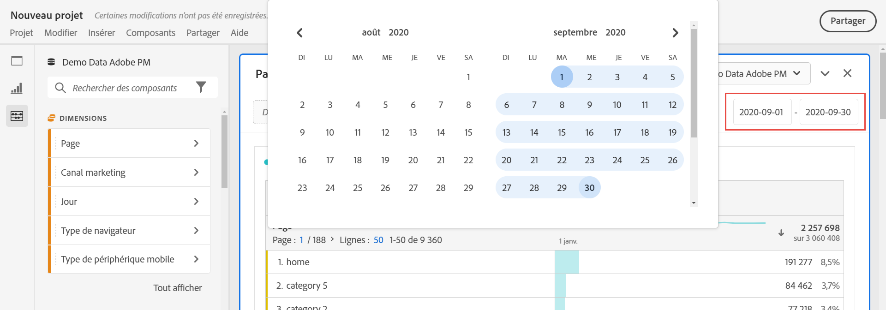
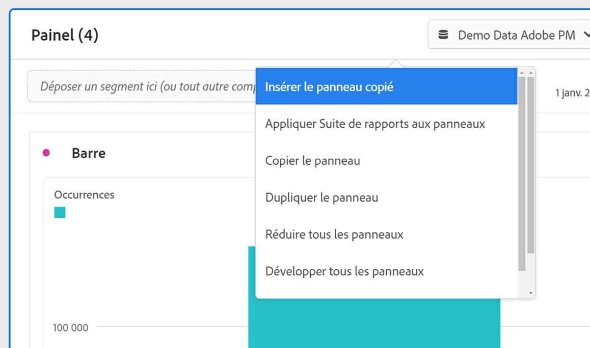

# Vue d’ensemble des panneaux

Un [!UICONTROL panneau] est un ensemble de tableaux et de visualisations. Vous pouvez accéder aux panneaux à partir de l’icône située en haut à gauche dans Workspace ou à partir d’un [panneau vierge](/help/analyze/analysis-workspace/c-panels/blank-panel.md). Les panneaux sont utiles pour organiser vos projets en fonction des périodes, des suites de rapports ou des cas d’utilisation d’analyses.

## Types de panneaux

Les types de panneau suivants sont disponibles dans Analysis Workspace pour [!UICONTROL Adobe Analytics] :

| Nom du panneau | Description |
| --- | --- |
| [Panneau vierge](/help/analyze/analysis-workspace/c-panels/blank-panel.md) | Faites votre choix parmi les panneaux et visualisations disponibles pour démarrer votre analyse. |
| [Attribution](attribution.md) | Comparez et visualisez rapidement de nombreux modèles d’attribution en utilisant n’importe quelle dimension ou mesure de conversion. |
| [Analytics for Target](a4t-panel.md) | Analysez les activités et les expériences Target dans Analysis Workspace. |
| [Tableau à structure libre](freeform-panel.md) | Effectuez des comparaisons et des répartitions illimitées, puis ajoutez des visualisations pour raconter une histoire riche en données. |
| [Audience moyenne par minute de média](average-minute-audience-panel.md) | Analysez l’audience moyenne par minute pour un élément spécifique de contenu ou au cours d’une période personnalisée. |
| [Visionneuses simultanées de médias &#x200B;](media-concurrent-viewers.md) | Analysez les visionneuses au fil du temps, avec des informations sur la simultanéité la plus élevée, et sur la capacité à ventiler et à comparer. |
| [Temps de lecture du média](/help/analyze/analysis-workspace/c-panels/media-playback-time-spent.md) | L’analyse du temps de lecture permet de déterminer où se produisent les pics d’audience mais aussi où des abandons ont eu lieu. |
| [Élément suivant ou précédent](next-previous.md) | Affiche les pages visitées suivantes ou précédentes. |
| [Aperçu rapide](quickinsight.md) | Construisez rapidement un tableau à structure libre et une visualisation d’accompagnement afin d’analyser et de mettre en évidence les informations plus rapidement. |
| [Résumé de la page](page-summary.md) | Explorez les statistiques clés concernant des pages spécifiques. |
| [Comparaison des segments](/help/analyze/analysis-workspace/c-panels/c-segment-comparison/segment-comparison.md) | Comparez rapidement deux segments sur tous les points de données afin de rechercher automatiquement les différences pertinentes. |

Les panneaux [!UICONTROL Aperçu rapide], [!UICONTROL Blank] et [!UICONTROL Tableau à stucture libre] constituent d’excellents points de départ pour votre analyse, tandis qu’[!UICONTROL Attribution] est réservé à des analyses avancées. Un  est disponible au bas de la zone de travail. Vous pouvez donc ajouter des panneaux vierges à tout moment.

Le panneau de démarrage par défaut est le panneau [!UICONTROL Tableau à structure libre], mais vous pouvez également choisir d’utiliser le [Panneau vierge](/help/analyze/analysis-workspace/c-panels/blank-panel.md) ou l’[Aperçu rapide](/help/analyze/analysis-workspace/c-panels/quickinsight.md) par défaut. Consultez [Préférences des projets et analyses](/help/analyze/analysis-workspace/user-preferences.md#projects--analyses-preferences).

## Créer un panneau

Pour créer un panneau :

* Faites glisser un panneau à partir du panneau de gauche **[!UICONTROL Panneaux]** dans votre zone de travail.
* Sélectionnez un panneau dans le [Panneau vierge](blank-panel.md).
* Utilisez le menu **[!UICONTROL Insérer]** dans Workspace et sélectionnez votre panneau. Vous pouvez également utiliser l’un des [raccourcis](../build-workspace-project/fa-shortcut-keys.md) pour insérer un panneau.

  

Vous pouvez effectuer les opérations suivantes :

* Sélectionnez  **dans** n’importe quel panneau pour ajouter une autre visualisation. Une fenêtre contextuelle s’affiche, vous permettant de sélectionner une visualisation.

  

  | Sélectionner... | Pour créer un/une... |
  |---|---|
  |  | [Tableau à structure libre](/help/analyze/analysis-workspace/visualizations/freeform-table/freeform-table.md) |
  |  | [Ligne](/help/analyze/analysis-workspace/visualizations/line.md) |
  |  | [Barre](/help/analyze/analysis-workspace/visualizations/bar.md) |
  |  | [Numéro de résumé](/help/analyze/analysis-workspace/visualizations/summary-number-change.md) |
  |  | [Texte](/help/analyze/analysis-workspace/visualizations/text.md) |
  |  | [Abandon](/help/analyze/analysis-workspace/visualizations/fallout/fallout-flow.md) |
  |  | [Flux](/help/analyze/analysis-workspace/visualizations/c-flow/flow.md) |
  |  | [Aires empilées](/help/analyze/analysis-workspace/visualizations/area.md) |
  |  | [Table de cohorte](/help/analyze/analysis-workspace/visualizations/cohort-table/t-cohort.md) |
  |  | [Puces](/help/analyze/analysis-workspace/visualizations/bullet-graph.md) |
  |  | [Anneau](/help/analyze/analysis-workspace/visualizations/donut.md) |
  |  | [Résumé des changements](/help/analyze/analysis-workspace/visualizations/summary-number-change.md) |
  |  | [Histogramme](/help/analyze/analysis-workspace/visualizations/histogram.md) |
  |  | [Dispersion](/help/analyze/analysis-workspace/visualizations/scatterplot.md) |
  |  | [Venn](/help/analyze/analysis-workspace/visualizations/venn.md) |
  |  | [Plan en arborescence](/help/analyze/analysis-workspace/visualizations/treemap.md) |

* Sélectionnez  **à l&#39;extérieur** du dernier panneau de votre espace de travail pour ajouter un autre [panneau vierge](blank-panel.md).

## Gérer un panneau

Vous pouvez gérer un panneau des façons suivantes :

* Pour réduire un panneau, sélectionnez .
* Pour afficher un panneau réduit, sélectionnez .
* Pour supprimer un panneau, sélectionnez . Pour annuler, sélectionnez **[!UICONTROL Modifier]** > **[!UICONTROL Annuler]** (**[!UICONTROL *cmd *+*z *]**|**[!UICONTROL * ctrl *+* z *]**).
* Pour déplacer un panneau, faites-le glisser et déposez-le chaque fois qu’un  est visible (généralement lorsque vous passez la souris sur l’en-tête).

## Suite de rapports

Chaque panneau est associé à une [suite de rapports](/help/admin/tools/manage-rs/report-suites-admin.md), identifiée par  **[!UICONTROL *nom de la suite de rapports *]**&#x200B;dans le menu déroulant en haut à droite du panneau.

Lorsque vous créez un panneau, la suite de rapports par défaut est basée sur la suite de rapports du panneau sur lequel vous avez travaillé pour la dernière fois dans le projet Analysis Workspace.

Dans un projet, vous pouvez utiliser une ou [plusieurs suites de rapports](/help/analyze/analysis-workspace/build-workspace-project/multiple-report-suites.md) selon les cas d’utilisation de votre analyse.

La liste des suites de rapports est triée selon la pertinence, définie par Adobe en fonction de la fréquence et de la dernière date d’utilisation de la suite par l’utilisateur actuel. et la fréquence d’utilisation de la suite au sein de l’organisation.

>[!IMPORTANT]
>
>La suite de rapports sélectionnée détermine les dimensions, les mesures et les segments disponibles pour la création des visualisations dans un panneau.
>
>
>Lorsque vous changez la suite de rapports d’un panneau, certains composants peuvent ne pas être disponibles dans la nouvelle suite de rapports. Cette modification peut empêcher votre visualisation de s’afficher correctement. Des avertissements peuvent s’afficher, par exemple :
>
>* Ce panneau contient des composants qui ne sont pas activés dans la suite de rapports sélectionnée. Changez de suite de rapports ou activez les composants requis dans la suite de rapports.
>* Impossible d’afficher la visualisation : vérifiez vos colonnes et lignes pour vous assurer qu’elles contiennent des composants valides.
>

## Calendrier

Le calendrier de panneau contrôle la période des rapports des tableaux et des visualisations dans un panneau.

>[!NOTE]
>
>Si un composant de période  est utilisé dans une visualisation ou un panneau (par exemple, comme segment), le composant de période remplace le calendrier de panneau.
>

1. Sélectionnez une période en sélectionnant d’abord la date de début, puis la date de fin.
Vous pouvez également sélectionner un **[!UICONTROL paramètre prédéfini]** dans le menu déroulant [!UICONTROL *Sélectionner un paramètre prédéfini*].

1. Vous pouvez également sélectionner **[!UICONTROL Afficher les paramètres avancés]** pour :

   * Spécifier une **[!UICONTROL heure de départ]** et une **[!UICONTROL heure de fin]** différentes de celles par défaut, à savoir `12:00 AM` (`0:00`) et `11:59 PM` (`23:59`). Les heures de fin comprennent toujours 59 secondes. Pour une période qui s’étend sur plusieurs jours, l’heure de début s’applique au premier jour de la période et l’heure de fin s’applique au dernier jour de la période. Utilisez **[!UICONTROL (Réinitialiser les heures)]** pour réinitialiser les heures de début et de fin à leurs valeurs par défaut.
   * **[!UICONTROL Faire correspondre les composants de la période au calendrier du panneau]**. Si cette option est désactivée, les composants de période utilisés dans le panneau sont relatifs à l’heure actuelle. Si cette option est activée, les composants de période utilisés dans le panneau sont relatifs au calendrier du panneau.
   * **[!UICONTROL Utilisation de dates glissantes]**. Si cette option est activée, les périodes prédéfinies comme **[!UICONTROL 7 derniers jours complets]** sont mises à jour dynamiquement à mesure que la date et l’heure actuelles se déroulent. Si cette option est désactivée, ces paramètres prédéfinis ne sont pas mis à jour une fois appliqués.

     

     Vous pouvez sélectionner le texte entre crochets (par exemple, **[!UICONTROL début fixe - roulement quotidien]**) pour étendre le panneau et spécifier des détails pour **[!UICONTROL Début]** et **[!UICONTROL Fin]**.

      1. Sélectionnez **[!UICONTROL Début de]**, **[!UICONTROL Fin de]** ou **[!UICONTROL Jour fixe]**.
      1. Lorsque vous avez sélectionné **[!UICONTROL Début de]** ou **[!UICONTROL Fin de]**, vous pouvez créer une expression complète. Par exemple : **[!UICONTROL Fin de]** **[!UICONTROL l’année en cours]** **[!UICONTROL plus]** `1` **[!UICONTROL jour]**. Sélectionnez la valeur appropriée pour chaque partie de l’expression.
         * Sélectionnez une valeur pour la période actuelle. Par exemple, **[!UICONTROL année en cours]**.
         * Sélectionnez une valeur pour le calcul supplémentaire. Par exemple, **[!UICONTROL plus]**.
         * Lorsque vous avez spécifié un calcul supplémentaire, indiquez une valeur. Par exemple : `1`.
         * Lorsque vous avez spécifié un calcul supplémentaire, sélectionnez la période à utiliser pour le calcul. Par exemple, **[!UICONTROL jour]**.

     Sélectionnez **[!UICONTROL Masquer les détails]** pour masquer les détails du calcul des dates glissantes.

1. Sélectionnez **[!UICONTROL Appliquer]** pour appliquer la période au panneau à partir duquel vous avez ouvert le calendrier.
Sélectionnez **[!UICONTROL Appliquer à tous les panneaux]** pour appliquer la période à tous les panneaux du projet Workspace.

## Zone de dépôt {#dropzone}

La zone de dépôt du panneau, intitulée **[!UICONTROL _Déposer un composant pour filtrer ou répartir les données_]**, vous permet de filtrer ou de répartir les données du panneau. Les segments ou les répartitions que vous utilisez pour filtrer ou répartir les données s’appliquent à tous les tableaux à structure libre et visualisations du panneau.

Les segments et les répartitions vous permettent d’interagir avec les données de manière contrôlée. Par exemple, vous pouvez ajouter un menu déroulant de segment pour les types d’appareils mobiles afin de filtrer le panneau en sélectionnant Tablette, Téléphone mobile ou Bureau.

Les segments peuvent également être utilisés pour consolider de nombreux projets en un seul. Par exemple, si vous disposez de différentes versions du même projet auxquelles est appliqué un segment de pays différent, vous pouvez consolider toutes les versions en un seul projet et ajouter un menu déroulant Segment de pays .

L’illustration ci-dessous présente les différentes variantes des segments (rapides) ou des répartitions qui se produisent lorsque vous ajoutez des composants à la zone de dépôt.

### Ajouter ou remplacer

Pour ajouter ou remplacer des segments ou des répartitions (rapides) :

1. Sélectionnez un ou plusieurs composants dans le rail Composants . Utilisez ⇧+ ou ^+ pour sélectionner plusieurs composants.
1. Faites glisser la sélection vers la zone de dépôt, intitulée **[!UICONTROL _Déposez un composant pour filtrer ou répartir les données_]** les ❶, ou sur un composant existant déjà placé à proximité de la zone de dépôt.
1. Vous disposez de deux options lorsque vous voyez  **[!UICONTROL Ajouter (appuyez sur « Maj » pour créer une liste déroulante)]** ou  **[!UICONTROL Remplacer (appuyez sur « Maj » pour ajouter à la liste déroulante)]** :

   

   * Déposez la sélection pour créer les composants suivants :
      * [Segment](#segment) pour tous les composants de segment que vous ❷.
      * [Segment rapide](#quick-segment) pour tous les composants hors segment (périodes, mesures, dimensions, éléments de dimension) que vous ❸.
   * Déposez la sélection **tout en maintenant la touche enfoncée** ⇧ (maj) pour créer les composants suivants :
      * Segment statique [menu déroulant](#drop-down-menu) avec des éléments sur lesquels filtrer pour les segments sélectionnés que vous ❹.
      * Segment statique [menu déroulant](#drop-down-menu) avec des éléments sur lesquels filtrer pour les périodes sélectionnées que vous ❺.
      * Segment statique [menu déroulant](#drop-down-menu) avec des éléments sur lesquels filtrer les mesures sélectionnées que vous ❻.
      * Segment statique [menu déroulant](#drop-down-menu) ou répartition [menu déroulant](#drop-down-menu) avec des éléments sur lesquels filtrer ou répartir pour la dimension sélectionnée *éléments* que vous ❼.
      * Segment dynamique [menu déroulant](#drop-down-menu) ou répartition [menu déroulant](#drop-down-menu) avec des éléments sur lesquels filtrer ou répartir pour les dimensions sélectionnées que vous ❽.

### Segment

Tout composant de segment que vous déposez est utilisé pour segmenter le panneau. Utilisez des segments pour obtenir des informations segmentées sur les données et les visualisations de votre panneau.

### Segment rapide

Tout composant non lié au segment (dimension, élément de dimension, mesure, période) déposé définit un [segment rapide](#quick-segment) pour segmenter le panneau. Utilisez n’importe quel composant non-segment pour créer un segment rapide sans utiliser le [créateur de segments](/help/components/segmentation/segmentation-workflow/seg-quick.md). Un segment ainsi créé est automatiquement défini en tant que segment au niveau de l’événement et intitulé **[!UICONTROL Segment rapide]** par défaut.

Vous pouvez également utiliser  pour créer un segment rapide.

Voir [Segments rapides](/help/components/segmentation/segmentation-workflow/seg-quick.md) pour savoir comment créer et gérer des segments rapides.

### Menu déroulant

Un menu déroulant créé lorsque vous maintenez la touche enfoncée ⇧ permet d’effectuer les opérations suivantes :

* contiennent une liste [statique](#static) ou [dynamique](#dynamic) d’éléments.
* vous devez [filtrer un panneau](#filter) ou [répartir un panneau](#breakdown).

#### Statique

Des menus déroulants statiques sont créés pour les dimensions sélectionnées *éléments* mesures, segments et périodes). Les éléments d’un menu déroulant statique sont basés sur les composants sélectionnés que vous déposez et les éléments ne changent pas lorsque vous ajoutez ou remplacez des composants.

#### Dynamique

Les menus déroulants dynamiques sont créés uniquement lorsque vous déposez des composants de dimension. Les menus déroulants dynamiques sont indiqués par  dans le libellé.

Les éléments disponibles dans un menu déroulant dynamique sont basés sur :

* les données obtenues à partir des éléments sélectionnés dans d’autres menus déroulants, segments et segments rapides dans la zone de dépôt du panneau ; et
* les données disponibles dans la plage de rapports du panneau.

Par exemple, vous pouvez ajouter deux menus déroulants dynamiques à l’aide d’une dimension pays et d’une dimension villes . Lorsque vous sélectionnez un pays dans le menu déroulant **[!UICONTROL Pays]**, le menu déroulant **[!UICONTROL Villes]** s’ajuste de manière dynamique pour afficher uniquement les villes du pays sélectionné. Lorsque vous disposez de menus déroulants statiques supplémentaires, les éléments sélectionnés dans ces menus déroulants affectent également les éléments disponibles dans les menus déroulants dynamiques. Les éléments sélectionnés dans les menus déroulants dynamiques n’affectent pas les éléments disponibles dans les menus déroulants statiques.

#### Filtrer un panneau

Pour tout composant de mesure, de segment ou de période que vous déposez **tout en maintenant la touche enfoncée** ⇧, un menu déroulant de segment est créé. Ce menu déroulant vous permet de filtrer le panneau en fonction des éléments disponibles pour le composant déposé.

Pour tout composant *dimension* que vous déposez **tout en maintenant la touche enfoncée** ⇧, un menu déroulant de segment est créé. Ce menu déroulant vous permet de filtrer le panneau en fonction des éléments disponibles pour les éléments de dimension déposés (menu déroulant [statique](#static) segment) ou le composant de dimension (menu déroulant [dynamique](#dynamic) segment). Pour configurer explicitement le menu déroulant afin de filtrer un panneau à l’aide de segments :

* Sélectionnez  et sélectionnez  **[!UICONTROL Segment]** | **[!UICONTROL Filtre les données du panneau]** dans le menu contextuel du ❾ du composant.

#### Répartition d’un panneau

Pour tout composant *dimension* que vous déposez **tout en maintenant la touche enfoncée** ⇧, un menu déroulant de segment est créé. Vous pouvez configurer ce menu déroulant pour répartir le panneau en fonction des éléments disponibles pour les éléments de dimension déposés (menu déroulant [statique](#static) répartition) ou le composant de dimension (menu déroulant [dynamique](#dynamic) répartition). Pour configurer explicitement le menu déroulant afin de répartir un panneau à l’aide de répartitions :

* Sélectionnez  et sélectionnez  **[!UICONTROL Répartition]** | **[!UICONTROL Répartit les données dans le panneau]** dans le menu contextuel du ❾ de composant.

>[!IMPORTANT]
>
>Les répartitions ne sont disponibles que pour les dimensions et les éléments de dimension, et non pour les segments, les périodes ou les mesures.
>

#### Segments ou répartitions

Pensez à ventiler un panneau au lieu de filtrer un panneau (à l’aide de segments) dans les scénarios suivants :

* Si vous utilisez des mesures activées pour l’attribution dans votre panneau, les segments effacent souvent vos mesures activées pour l’attribution. Les répartitions sont appliquées à un autre point de la requête exécutée pour récupérer les données de votre panneau. Par conséquent, les répartitions n’effacent pas ces mesures activées pour les attributs.

  Par exemple, consultez la différence entre la mesure basée sur les attributs **[!UICONTROL Chiffre d’affaires en ligne]** lors de l’utilisation d’un segment **[!UICONTROL Luma : Catégorie de produits]**  **[!UICONTROL Femmes]** et d’un segment **[!UICONTROL Luma : Catégorie de produits]**Women **&#x200B;**.

  

* Si vous utilisez une dimension de niveau sous-événement dans un menu déroulant de répartition, les répartitions s’exécutent à ce niveau de sous-événement. Au lieu de cela, les segments dans un menu déroulant segments s’exécutent au niveau de l’événement.

  Par exemple, consultez la différence entre la mesure **[!UICONTROL Chiffre d’affaires en ligne]** lors de l’utilisation d’un segment **[!UICONTROL Luma : Sous-catégorie de produits]**  **[!UICONTROL Tops]** et d’un segment **[!UICONTROL Luma : Sous-catégorie de produits]** Tops **&#x200B;**. La répartition exécute la requête explicitement au niveau du sous-événement, tandis que le segment exécute la requête au niveau de l’événement.

  

### Gérer

Vous pouvez gérer les composants de la zone de dépôt comme suit :

| Que faire dans la zone de dépôt du panneau... | Comment faire... |
|---|---|
| Pour supprimer un segment ou un segment rapide. | Sélectionnez  dans le composant. |
| Pour supprimer un élément sélectionné d&#39;un menu déroulant. | Sélectionnez  dans l’élément. |
| Pour supprimer tous les éléments sélectionnés d&#39;un menu déroulant. | Sélectionnez  dans le menu déroulant. |
| Pour modifier le libellé d’un composant. | Pointez sur le libellé du composant et sélectionnez . |
| Pour supprimer le libellé d’un composant. | Pointez sur le libellé du composant et sélectionnez **[!UICONTROL Supprimer le libellé]** dans le menu contextuel du composant. |
| Pour supprimer le composant de la zone de dépôt. | Sélectionnez **[!UICONTROL Liste déroulante Supprimer]** dans le menu contextuel du composant. |
| Pour obtenir des informations sur un segment ou un segment rapide. | Pointez sur le composant et sélectionnez  pour ouvrir le dictionnaire de données avec des informations sur le composant. |
| Pour obtenir des informations sur le composant qui définit un menu déroulant. | Pointez dans le menu déroulant et sélectionnez  pour ouvrir le dictionnaire de données avec des informations sur le composant. |
| Pour modifier un segment rapide. | Passez la souris sur le segment rapide, puis sélectionnez . Voir [Segments rapides](/help/components/segmentation/segmentation-workflow/seg-quick.md) pour plus d’informations. |
| Pour exiger une sélection pour un menu déroulant. | Sélectionnez **[!UICONTROL Exiger une sélection]** dans le menu contextuel du composant. |
| Pour n’autoriser aucun filtre pour un menu déroulant. | Sélectionnez **[!UICONTROL N’autoriser aucun filtre]** dans le menu contextuel du composant. |
| Pour réinitialiser tous les composants et effacer toutes les sélections pour les menus déroulants | Sélectionnez **[!UICONTROL Réinitialiser tout]**. |

>[!BEGINSHADEBOX]

Voir  [Utilisation de filtres dans Analysis Workspace](https://experienceleague.adobe.com/en/docs/analytics-learn/tutorials/analysis-workspace/using-panels/using-drop-down-filters){target="_blank"} pour une vidéo de démonstration.

>[!ENDSHADEBOX]

>[!BEGINSHADEBOX]

Voir  [Menus déroulants dynamiques](https://experienceleague.adobe.com/en/docs/customer-journey-analytics-learn/tutorials/analysis-workspace/tips-and-tricks/dynamic-drop-downs){target="_blank"} pour une vidéo de démonstration.

{{videocja}}

>[!ENDSHADEBOX]

## Menu contextuel

Pour accéder aux fonctionnalités supplémentaires d’un panneau, faites un clic droit sur l’en-tête du panneau pour accéder au menu contextuel.

Les options disponibles sont les suivantes :

| Option | Description |
| --- | --- |
| **[!UICONTROL Insérer le panneau copié]** | Vous permet de coller la copie d’un panneau ou d’une visualisation dans un autre emplacement au sein du projet, ou dans un autre projet. |
| **[!UICONTROL Insérer une visualisation copiée]** | Permet de coller la copie d’une visualisation dans un autre emplacement au sein du panneau, du projet, ou dans un autre projet. |
| **[!UICONTROL Appliquer une suite de rapports à tous les panneaux]** | Appliquez la suite de rapports de ce panneau à tous les autres panneaux du projet. |
| **[!UICONTROL Copier le panneau]** | Copie un panneau pour vous permettre de l’insérer dans un autre emplacement au sein du projet, ou dans un autre projet. |
| **[!UICONTROL Dupliquer le panneau]** | Crée un double exact du panneau actuel, que vous pouvez ensuite modifier. |
| **[!UICONTROL Réduire tous les panneaux]** | Réduit tous les panneaux du projet. |
| **[!UICONTROL Développer tous les panneaux]** | Développe tous les panneaux du projet. |
| **[!UICONTROL Réduire toutes les visualisations dans le panneau]** | Réduit toutes les visualisations dans le panneau actif. |
| **[!UICONTROL Développer toutes les visualisations dans le panneau]** | Développe toutes les visualisations du panneau actif. |
| **[!UICONTROL Modifier la description]** | Ajouter (ou modifier) une description textuelle du panneau. |
| **[!UICONTROL Obtenir un lien vers le panneau]** | Dirige un utilisateur ou une utilisatrice vers un panneau spécifique dans un projet. Lorsque le lien est sélectionné, la personne destinataire doit se connecter avant d’être dirigée vers le panneau lié. |

## Configuration

Certains panneaux (comme [!UICONTROL Attribution], [!UICONTROL Expérience], [!UICONTROL Audience moyenne par minute de média], etc.) possèdent une boîte de dialogue de configuration pour vous aider à créer la visualisation. Utilisez  en haut du panneau pour accéder à la configuration et la modifier.

