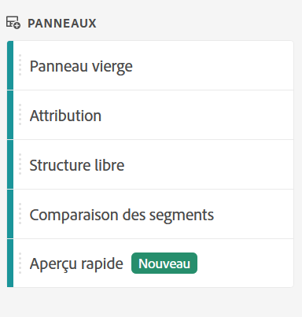

# Panneau d’aperçu rapide {#quick-insights-panel}

<!-- markdownlint-disable MD034 -->

>[!CONTEXTUALHELP]
>id="workspace_quickinsights_button"
>title="Aperçu rapide"
>abstract="Créez un panneau afin de créer rapidement un tableau à structure libre pour accompagner la visualisation afin d’analyser et d’exposer plus rapidement les informations."

<!-- markdownlint-enable MD034 -->

>[!BEGINSHADEBOX]

_Cet article présente le panneau Aperçu rapide dans_  _&#x200B;**Adobe Analytics**._ _Voir le [panneau Aperçu rapide](https://experienceleague.adobe.com/fr/docs/analytics/analyze/analysis-workspace/panels/quickinsight) de la_ version  _&#x200B;**Customer Journey Analytics** de cet article._

>[!ENDSHADEBOX]

[!UICONTROL Aperçu rapide] fournit des conseils aux non-analystes et aux nouveaux utilisateurs d’[!UICONTROL Analysis Workspace] pour savoir comment répondre rapidement et facilement à des besoins professionnels. Il s’agit également d’un outil idéal pour les utilisateurs expérimentés qui souhaitent une réponse rapide à une question simple sans avoir à créer eux-mêmes un tableau.

Lorsque vous commencez à utiliser [!UICONTROL Analysis Workspace], vous vous demandez peut-être :

* quelles visualisations sont les plus utiles,
* quelles dimensions et quelles mesures peuvent optimiser les informations,
* où glisser-déposer des éléments,
* où créer un filtre,
* etc.

Pour répondre à ces questions, [!UICONTROL Quick Insights] utilise un algorithme qui vous présente les dimensions, mesures, segments et périodes les plus populaires utilisés par votre entreprise. Cet algorithme est basé sur l’utilisation des composants de données par votre propre entreprise dans [!UICONTROL Analysis Workspace]. Les dimensions, mesures et filtres marqués comme [!UICONTROL POPULAIRE] dans la liste déroulante sont indiqués ici :

[!UICONTROL Aperçu rapide] vous permet :

* de créer correctement un tableau de données et une visualisation correspondante dans [!UICONTROL Analysis Workspace] ;
* d’apprendre la terminologie et le vocabulaire des éléments et des composants de base d’[!UICONTROL Analysis Workspace] ;
* d’effectuer des répartitions simples de dimensions, d’ajouter plusieurs mesures ou de comparer facilement des segments dans un [!UICONTROL tableau à structure libre] ;
* de modifier ou de tester divers types de visualisation pour trouver rapidement et intuitivement l’outil de recherche pour votre analyse.

## Terminologie clé de base

Voici quelques-uns des termes de base que vous devez connaître. Chaque tableau de données se compose d’au moins deux blocs de création (composants) que vous utilisez pour décrire vos données.

| Bloc de construction (composant) | Définition |
|---|---|
| **[!UICONTROL Dimension]** | Les dimensions sont des descriptions ou caractéristiques de données de mesure qui peuvent être affichées, ventilées et comparées dans un projet. Il s’agit de valeurs et de dates non numériques qui se ventilent en éléments de dimension. Par exemple, *navigateur* ou *page* sont des dimensions. |
| **[!UICONTROL Élément de dimension]** | Les éléments de dimension sont des valeurs individuelles d’une dimension. Par exemple, les éléments de dimension pour la dimension Navigateur seraient *Chrome*, *Firefox*, *Edge*, etc. |
| **[!UICONTROL Mesure]** | Les mesures sont des informations quantitatives sur l’activité des visiteurs, telles que les affichages, les clics publicitaires, les actualisations, la durée moyenne de consultation, les unités, les commandes, le chiffre d’affaires, etc. |
| **[!UICONTROL Visualisation]** | Workspace offre [une variété de visualisations](/help/analyze/analysis-workspace/visualizations/freeform-analysis-visualizations.md) pour créer des représentations visuelles de vos données. Par exemple, des graphiques à barres, des graphiques en anneau, des histogrammes, des graphiques en courbes, des cartes, des nuages de points, etc. |
| **[!UICONTROL Répartition des dimensions]** | Une répartition de dimension est un moyen de répartir une dimension en fonction d’autres dimensions. Par exemple, vous pouvez répartir les États américains en fonction des périphériques mobiles pour obtenir le nombre de visites via des périphériques mobiles par État. Vous pouvez également répartir les périphériques mobiles par types de périphériques mobiles, par régions, par campagnes internes, etc. |
| **[!UICONTROL Segments]** | Les segments vous permettent d’identifier des sous-ensembles de visiteurs selon des caractéristiques ou des interactions Web. Par exemple, vous pouvez créer des filtres [!UICONTROL Visiteur ou visiteuse] basés sur les éléments suivants : <li>Attributs : type de navigateur, appareil, nombre de visites, pays, sexe.</li><li>Interactions : campagnes, recherche par mots-clés, moteur de recherche.</li><li>Sorties et entrées : personnes provenant de Facebook, d’une page de destination définie, d’un domaine référent, ou</li><li> Variables personnalisées : champ de formulaire, catégories définies, ID de client. |

## Utilisation

Pour utiliser un panneau **[!UICONTROL Aperçu rapide]** :

1. Créez un panneau **[!UICONTROL Aperçu rapide]**. Pour obtenir des instructions sur comment créer un panneau, consultez [Créer un panneau](panels.md#create-a-panel).

1. Lorsque vous utilisez pour la première fois un panneau **[!UICONTROL Aperçu rapide]**, vous pouvez suivre le court [!UICONTROL tutoriel d’introduction] qui vous apprend quelques principes de base. Sélectionnez  à côté du titre du panneau Aperçu rapide et sélectionnez **[!UICONTROL Tutoriel d’introduction]** dans la fenêtre contextuelle.

1. Spécifiez l’[entrée](#panel-input) du panneau.

1. Observez la [sortie](#panel-output) du panneau.

### Entrée du panneau

Sélectionnez vos blocs de création :

* **[!UICONTROL Analyser]** : spécifiez une dimension (orange)
* **[!UICONTROL Par]** : spécifiez une mesure (vert)
* **[!UICONTROL Filtrer par]** : spécifiez un segment (bleu).
* **[!UICONTROL Sur]** : spécifiez une période (violet).

Pour que la visualisation fonctionne correctement, vous devez sélectionner au moins une dimension et une mesure.

Vous pouvez spécifier les blocs de création de trois manières :

* Glissez et déposez les composants à partir du panneau de gauche.
* Commencez à saisir du texte dans l’un des champs des blocs de création. Lorsque l’entrée est trouvée, le champ de bloc de création se remplit automatiquement avec les valeurs possibles.
* Spécifiez une liste déroulante de bloc de création (par exemple **[!UICONTROL Country]** dans **[!UICONTROL Analyze]**) et recherchez dans la liste des valeurs possibles (à l’aide de ) la valeur que vous souhaitez utiliser (par exemple **[!UICONTROL Country code]**).

Sélectionnez **[!UICONTROL Effacer]** pour effacer tous les champs de saisie.

### Sortie du panneau

1. Lorsque vous avez ajouté au moins une dimension et une mesure, vous pouvez voir les résultats.

   

   * Un tableau à structure libre avec la dimension ([!UICONTROL Site de pays]) et la mesure ([!UICONTROL Visites]), segmenté par [!UICONTROL Visites] provenant de [!UICONTROL Moteurs de recherche] pour les [!UICONTROL 12 derniers mois].

   * Une visualisation correspondante, dans ce cas un [graphique à barres](/help/analyze/analysis-workspace/visualizations/bar.md). La visualisation qui est générée dépend du type de données que vous avez ajoutées au tableau. Toutes les données temporelles (telles que [!UICONTROL Visites] par jour/mois) sont présentées sous forme de graphique [!UICONTROL en courbes]. Toutes les données non temporelles (telles que [!UICONTROL Visites] par [!UICONTROL Appareil]) sont présentées sous forme de graphique [!UICONTROL à barres]. Vous pouvez modifier le type de visualisation en cliquant sur la flèche déroulante en regard du type de visualisation.

1. Essayez d’affiner un peu plus votre recherche comme décrit ci-dessous, sous [Plus de conseils](#more-tips).

1. Vous pouvez enregistrer votre projet à l’aide de **[!UICONTROL Projet > Enregistrer]**.

## Plus de conseils

D’autres astuces utiles s’affichent dans le [!UICONTROL Créateur d’Aperçu rapide], dont certaines dépendent de votre dernière action.

* Tout d’abord, vous pouvez consulter le tutoriel **[!UICONTROL Plus de conseils]**. Ce tutoriel s’affiche 24 heures après que vous avez créé un projet avec au moins une dimension et une mesure. Sélectionnez  à côté du titre du panneau Aperçu rapide et sélectionnez **[!UICONTROL Plus de conseils]** dans la fenêtre contextuelle.

  

* Vous pouvez analyser plusieurs dimensions et mesures, combiner ou comparer des segments et spécifier une période :

  

   * Dimension **[!UICONTROL Analyser]** **[!UICONTROL Répartie par]** : vous pouvez utiliser jusqu’à 3 niveaux de répartition sur les dimensions pour analyser en détail les données afin d’obtenir les informations dont vous avez réellement besoin. Voir ➊, ➋ et ➌.

   * Ajouter d’autres mesures **[!UICONTROL Par]** : vous pouvez ajouter jusqu’à 2 mesures supplémentaires. Voir ➍ et ➎.

   * **[!UICONTROL Filtrer par]** : vous pouvez ajouter jusqu’à 2 segments supplémentaires. Par exemple, ajoutez Réservations en tant que segment et combinez-le avec les segments Personnes réservant fréquemment et Personnes voyageant pour la première fois, que vous comparez. Voir ➏, ➐ et ➑.

   * Sur : vous pouvez spécifier la période. Voir ➒.

## Limites connues

Si vous essayez d’effectuer des modifications directement dans le tableau, le panneau [!UICONTROL Aperçu rapide] ne sera plus synchronisé. Sélectionnez **[!UICONTROL Resynchroniser le créateur]** en haut à droite du panneau pour restaurer les paramètres précédents de l’[!UICONTROL Aperçu rapide].

Vous recevez un avertissement avant d’effectuer un ajout directement dans le tableau :

Dans le cas contraire, si la création se fait directement, le tableau se comporte comme un tableau à structure libre traditionnel, sans les fonctionnalités utiles pour les nouveaux utilisateurs et les nouvelles utilisatrices.

>[!MORELIKETHIS]
>
>[Créer un panneau](/help/analyze/analysis-workspace/c-panels/panels.md#create-a-panel)
>
<!--
# Quick Insights panel

[!UICONTROL Quick Insights] provides guidance for non-analysts and new users of [!UICONTROL Analysis Workspace] to learn how to answer business questions quickly and easily. It is also a great tool for advanced users who want to answer a simple question quickly without having to build a table themselves.

When you first start using this [!UICONTROL Analysis Workspace], you might wonder what visualizations would be most useful, which dimensions and metrics might facilitate insights, where to drag and drop items, where to create a segment, etc. 

To help with this, and based on your own company's usage of data components in [!UICONTROL Analysis Workspace], [!UICONTROL Quick Insights] leverages an algorithm that will present you with the most popular dimensions, metrics, segments, and date ranges your company uses. In fact, you will see dimensions, metrics, and segments tagged as [!UICONTROL Popular] in the drop-down list, as shown here:

[!UICONTROL Quick Insights] helps you

* Properly build a data table and an accompanying visualization in [!UICONTROL Analysis Workspace].
* Learn the terminology and vocabulary for basic components and pieces of [!UICONTROL Analysis Workspace].
* Do simple breakdowns of dimensions, add multiple metrics, or compare segments easily within a [!UICONTROL Freeform table].
* Change or try out various visualization types to find the find tool for your analysis quickly and intuitively.

Here is a video overview of the [!UICONTROL Quick Insights] panel:

>[!VIDEO](https://video.tv.adobe.com/v/37248/?quality=12)

## Basic key terminology

Following are some of the basic terms you need to be familiar with. Each data table consists of 2 or more building blocks (components) that you utilize to tell your data story.

|Building block (Component)|Definition|
|---|---|
|[!UICONTROL Dimension]|Dimensions are descriptions or characteristics of metric data that can be viewed, broken down, and compared in a project. They are non-numeric values and dates that break down into dimension items. For example, "browser", or "page" are dimensions.|
|[!UICONTROL Dimension item]|Dimension items are individual values for a dimension. For example, dimension items for the browser dimension would be "Chrome", "Firefox", "Edge", etc.|
|[!UICONTROL Metric]|Metrics are quantitative information about visitor activity, such as views, click-throughs, reloads, average time spent, units, orders, revenue, and so on.|
|[!UICONTROL Visualization]|Workspace offers [a number of visualizations](/help/analyze/analysis-workspace/visualizations/freeform-analysis-visualizations.md) to build visual representations of your data, such as bar charts, donut charts, histograms, line charts, maps, scatterplots, and others.|
|[!UICONTROL Dimension Breakdown]|A dimension breakdown is a way to literally break down a dimension by other dimensions. In our example, you could break down US States by Mobile Devices to get the mobile device visits per state, or you could break Mobile Devices down by Mobile Device types, by Regions, by Internal Campaigns, etc..|
|[!UICONTROL Segment]|Segments let you identify subsets of visitors based on characteristics or website interactions. For example, you can build [!UICONTROL Visitor] segments based on attributes: browser type, device, number of visits, country, gender, or based on interactions: campaigns, keyword search, search engine, or based on exits and entries: visitors from Facebook, a defined landing page, referring domain, or based on custom variables: form field, defined categories, customer ID.  |

## Get started with Quick Insights

1. Log in to Adobe Analytics using the credentials you have been provided with.
1. Go to [!UICONTROL Workspace] and click **[!UICONTROL Create New Project]** and then click **[!UICONTROL Quick Insights]**. (You can also access this panel from the **[!UICONTROL Panel]** menu in the left rail.)

    

    

1. When you first start out, go through the short tutorial that teaches you some of the [!UICONTROL Quick Insights panel] basics. Or, click to **[!UICONTROL Skip Tutorial]**.
1. Select your building blocks (also known as components): dimensions (orange), metrics (green), segments (blue), or date ranges (purple) You have to select at least one dimension and one metric for a table to be built automatically. 

    

    You have three ways of selecting the building blocks:
    * Drag and drop them from the left rail.
    * If you know what you are looking for: Start typing and [!UICONTROL Quick Insights] will fill in the blanks for you.
    * Click on the drop-down and search the list.

1. When you have added at least one dimension and one metric, the following will be created for you:

    * A Freeform table with the dimension (here, US States) vertically and the metric (here, Visits) horizontally at the top. Check out this table: 

    

    * An accompanying visualization, in this case a [bar chart](/help/analyze/analysis-workspace/visualizations/bar.md). The visualization that is generated is based on the type of data you added to the table. Any time-based data (such as [!UICONTROL Visits] per Day/Month) defaults to a [!UICONTROL Line] chart. Any non-time-based data (such as [!UICONTROL Visits] per [!UICONTROL Device]) defaults to a [!UICONTROL Bar] chart. You can change the type of visualization by clicking on the drop-down arrow next to the visualization type.

1. (Optional) Drill down on dimensions and see dimension items by clicking the > right-arrow next to the dimension.

1. Try adding some more refinements as described below under "More tips."

1. Save your project by clicking **[!UICONTROL Project > Save]**.

## More tips

Other useful hints will pop up in the [!UICONTROL Quick Insights Builder], some of them depending on your last action.

* First, complete the **[!UICONTROL More tips]** tutorial: Access it via the Help (?) icon next to the [!UICONTROL Quick Insights] title. This tutorial shows up 24 hours after you have created a project with at least one dimension and one metric.

    

* **Breakdown by**: You can use up to 3 levels of breakdowns on dimensions to drill down to the data you really need.

    

* **Add more metrics**: You can add up to 2 more metrics by using the AND operator to add them the table.

    

* **Add more segments**: You can add up to 2 more segments by using the AND or OR operators to add them the table. Look at what happens to the table when you add Mobile Users OR Loyal Visitors. They are next to each other, above the metrics. If you added Mobile Users AND Loyal Visitors, you would see results from both segments together, and they would be stacked on top of each other in the table.

    

## Known limitations

If you try to edit directly within the table, it will cause the [!UICONTROL Quick Insights] panel to become out of sync. You can restore it to the previous [!UICONTROL Quick Insights] settings by clicking **[!UICONTROL Resync Builder]** at the top right of the panel.

 

You will get a warning before adding anything directly to the table:

 

Otherwise, building directly will cause the table to now behave as a traditional Freeform table, without the helpful features for new users.

-->