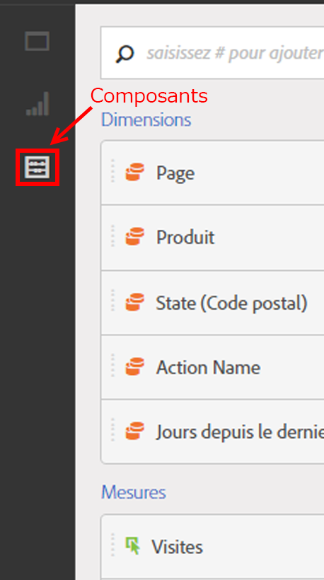
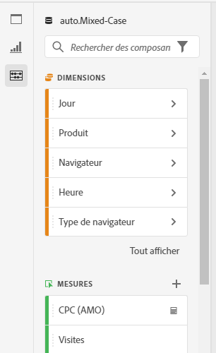
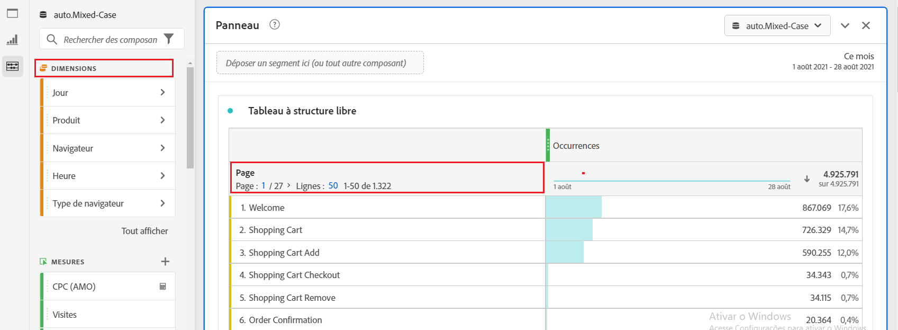
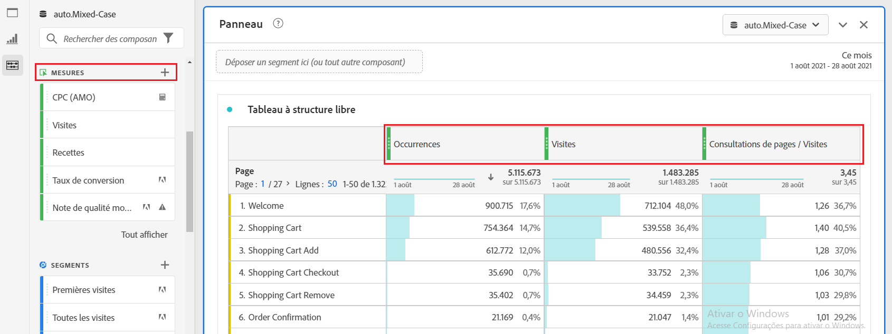
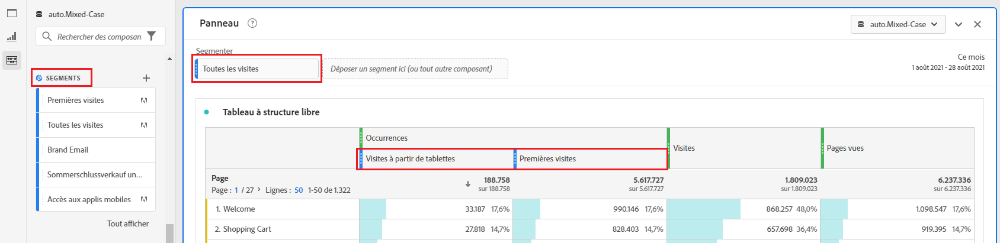
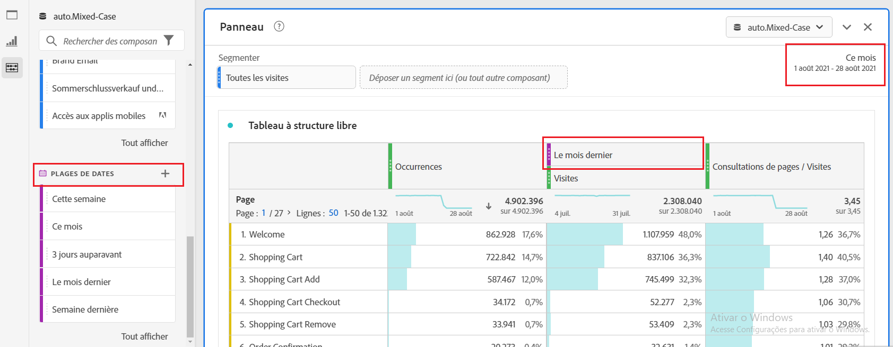
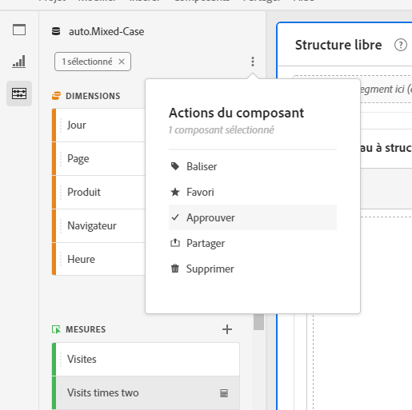

# Vue d’ensemble des composants

Les composants sont des fonctionnalités d’Adobe Analytics qui peuvent être utilisées dans des visualisations (telles qu’un tableau à structure libre) ou qui complètent les fonctionnalités de rapport.

Pour gérer les composants à partir de l’interface principale d’Adobe Analytics, procédez comme suit :

1. Sélectionnez **[!UICONTROL Composants]** dans la barre supérieure.
1. Sélectionnez **[!UICONTROL Composants]** pour afficher une vue d’ensemble des composants que vous pouvez gérer ou sélectionnez directement dans le menu le composant que vous souhaitez gérer.

Vous pouvez gérer les composants suivants :

* [Segments](/help/components/segmentation/seg-home.md) : créez, gérez, partagez et appliquez des segments d’audience puissants à vos rapports. Les segments vous permettent d’identifier des sous-ensembles de personnes selon des caractéristiques ou des interactions.
* [Mesures calculées :](/help/components/calculated-metrics/cm-overview.md) utilisent les mesures et les formules comme nouveaux composants à utiliser dans les rapports.
* [Périodes](calendar-date-ranges/custom-date-ranges.md) : permettent de personnaliser et d’affiner les offres Analysis Workspace.
* [Projets planifiés](../curate-share/t-schedule-report.md) : gérez vos projets planifiés.
* [Emplacements](../../../components/locations/locations-manager.md) : gérez les emplacements vers lesquels exporter vos projets.
* [Alertes](/help/components/alerts/alerts-overview.md) : envoient un avertissement en fonction de pourcentages ou de points de données spécifiques modifiés.
* [Annotations](annotations/overview.md) : communiquez les nuances et les informations concernant les données contextuelles à votre organisation.
* [Préférences](/help/analyze/analysis-workspace/user-preferences.md) : gérez les préférences d’Analysis Workspace.

## Composants d’Analysis Workspace

Les composants d’Analysis Workspace sont constitués de mesures, dimensions, segments et périodes que vous pouvez glisser-déposer dans des panneaux et des visualisations de votre projet Workspace. Les composants personnalisés que vous créez sont ajoutés à ces panneaux, tels qu’une mesure calculée ou une période personnalisée.

Pour accéder au panneau Composants, sélectionnez  **[!UICONTROL Composants]** dans le panneau des boutons.

Consultez [Créer un projet](/help/analyze/analysis-workspace/home.md) pour plus d’informations sur l’utilisation de composants dans un projet.

## Gestion des composants {#actions}

Vous pouvez rapidement créer un composant à l’aide du menu **[!UICONTROL Composants]** dans Analysis Workspace. Pour plus d’informations, consultez le [menu Analysis Workspace](/help/analyze/analysis-workspace/home.md#menu).

Vous pouvez gérer les composants (individuellement ou en en sélectionnant plusieurs).

1. Sélectionnez un ou plusieurs composants.

1. Dans le menu contextuel ou à partir du bouton d’actions de composant  (en haut des composants), sélectionnez l’une des actions suivantes.

   >[!TIP]
   >
   >Vous pouvez sélectionner plusieurs composants en maintenant la touche **[!UICONTROL Maj]** enfoncée ou en maintenant enfoncée la touche **[!UICONTROL Commande]** (sur Mac) ou **[!UICONTROL Ctrl]** (sur Windows).

   

   | Action des composants | Description |
   |--- |--- |
   |  [!UICONTROL **Étiquette**] | Organisez ou gérez les composants en leur appliquant des étiquettes. Vous pouvez ensuite effectuer une recherche par étiquette dans le panneau de gauche en sélectionnant le filtre  ou en saisissant `#`. Les étiquettes servent également de filtres dans les gestionnaires de composants. |
   |  [!UICONTROL **Ajouter aux favoris**] | Ajoutez le composant à votre liste de favoris. Comme avec les étiquettes, vous pouvez effectuer une recherche par Favoris dans le panneau de gauche et les utiliser comme filtre dans le gestionnaire de composants. |
   |  **[!UICONTROL Retirer des favoris]** | Retire le composant de votre liste de favoris. |
   |  [!UICONTROL **Approuver**] | Marquez les composants comme Approuvés pour signaler à vos utilisateurs et utilisatrices que le composant est approuvé par l’organisation. Comme les étiquettes, vous pouvez rechercher et filtrer par Approuvé dans le panneau de gauche. Une  identifie les composants approuvés. |
   |  [!UICONTROL **Partager**] | Partagez des composants avec des utilisateurs de votre organisation. Cette option est uniquement disponible pour les composants personnalisés, tels que les segments ou les mesures calculées. |
   |  [!UICONTROL **Supprimer**] | Supprimez les composants dont vous n’avez plus besoin. Cette option est uniquement disponible pour les composants personnalisés, tels que les segments ou les mesures calculées. |

Les composants personnalisés peuvent également être gérés par l’intermédiaire de leurs gestionnaires de composants respectifs. Par exemple, consultez [Gérer les segments](/help/components/segmentation/segmentation-workflow/seg-manage.md).

## Gestion de la liste des composants

Vous pouvez rechercher, filtrer et trier la liste des composants dans le panneau de gauche d’Analysis Workspace afin de localiser un composant particulier.

### Recherche

1. Sélectionnez l’icône **Composants**  dans le panneau de gauche.

2. Dans le champ de recherche, commencez à saisir le nom du composant que vous souhaitez utiliser dans votre projet.

   Une couleur et une icône permettent d’identifier le type de composant. **Les dimensions**  sont orange, **les segments**  sont bleus, **les périodes**  sont violettes et **les mesures**  sont vertes. L’icône Adobe  indique soit un modèle de mesure calculée, soit un modèle de segment. L’icône de calculateur  indique une mesure calculée créée par un administrateur ou une administratrice de votre organisation.

3. Sélectionnez le composant dans le menu déroulant.

### Filtre

1. Sélectionnez l’icône **Composants**  dans le panneau de gauche.

2. Sélectionnez **Filtre**  ou saisissez `#` dans le champ de recherche.

3. Sélectionnez l’une des options de filtre suivantes pour filtrer la liste des composants :

   | Icône | Option de filtre | Description |
   |---------|---|----------|
   |  | **[!UICONTROL Approuvés]** | Afficher uniquement les composants marqués comme approuvés par l’administration. |
   |  | **[!UICONTROL Favoris]** | Affichez uniquement les composants figurant dans votre liste de favoris.  Pour plus d’informations sur l’ajout de composants à votre liste de favoris, consultez [Gérer les composants](#manage-components). |
   |  | **[!UICONTROL Dimensions]** | Afficher uniquement les composants qui sont des dimensions. |
   |  | **[!UICONTROL Mesures]** | Afficher uniquement les composants qui sont des mesures. |
   |  | **[!UICONTROL Segments]** | Afficher uniquement les composants qui sont des segments. |
   |  | **[!UICONTROL Périodes]** | Affiche uniquement les composants qui sont des périodes. |
   |  | **[!UICONTROL *Nom d’étiquette *]** | Affiche uniquement les composants avec les étiquettes spécifiques sélectionnées. Une étiquette dédiée est disponible pour le modèle d’Adobe qui sont les [mesures calculées par défaut](/help/components/calculated-metrics/cm-reference/default-calcmetrics.md) d’Adobe. |

   Sélectionnez  dans un filtre pour supprimer le filtre.

4. Vous pouvez éventuellement trier la liste des composants, comme décrit dans [Trier la liste des composants](#sort-the-component-list).

### Tri

<!-- {{release-limited-testing-section}}-->

1. (Facultatif) Appliquez des filtres à la liste des composants, comme décrit dans la section [Filtrer la liste des composants](#filter-the-component-list).

2. Sélectionnez **Composants**  dans le panneau de gauche.

3. Sélectionnez **Trier** , puis sélectionnez l’une des options de filtre suivantes pour trier la liste des composants.

Les options de tri disponibles sont les suivantes :

{{components-sort-options}}

## Autorisations d’accès

Dans Analysis Workspace, les administrateurs et les administratrices peuvent [choisir](/help/analyze/analysis-workspace/curate-share/curate.md) les composants à présenter aux utilisateurs et aux utilisatrices dans les rapports.

<!--
# Components overview

Components in Analysis Workspace consist of dimensions, metrics, segments, and date ranges that you can drag-and-drop onto a project. 

To access the Components menu, click the **[!UICONTROL Components]** icon in the left rail. You can switch among [panels](/help/analyze/analysis-workspace/c-panels/panels.md), [visualizations](/help/analyze/analysis-workspace/visualizations/freeform-analysis-visualizations.md), and components from the left rail icons or by using [hotkeys](/help/analyze/analysis-workspace/build-workspace-project/fa-shortcut-keys.md).

You can also adjust the [View density settings](/help/analyze/analysis-workspace/build-workspace-project/view-density.md) for the project to see more values in the left rail at once by going to **[!UICONTROL Project > Project Info & Settings > View Density]**.

## Dimensions {#dimensions}

[**Dimensions**](/help/components/dimensions/overview.md) are text attributes that describe your visitor behavior and can be viewed, broken down, and compared in your analysis. They can be found in the left Component rail (orange section) and are typically applied as rows of a table. 

Examples of dimensions include [!UICONTROL Page Name], [!UICONTROL Marketing Channels], [!UICONTROL Device Type], and [!UICONTROL Products]. Dimensions are provided by Adobe and are captured through your custom implementation (eVar, Props, classifications, etc).

Each dimension also contains **dimension items** within it. Dimension items can be found in the left Component rail by clicking the right-arrow next to any dimension name (items are yellow).

Examples of dimension items include [!UICONTROL Homepage] (within the [!UICONTROL Page] dimension), [!UICONTROL Paid Search] (within the [!UICONTROL Marketing Channel] dimension), [!UICONTROL Tablet] (within the [!UICONTROL Mobile Device Type] dimension), and so on.

## Metrics {#metrics}

[**Metrics**](/help/components/metrics/overview.md) are quantitative measures about visitor behavior. They can be found in the left Component rail (green section) and are typically applied as columns of a table.

Examples of metrics include [!UICONTROL Page views], [!UICONTROL Visits], [!UICONTROL Orders], [!UICONTROL Average Time spent], and [!UICONTROL Revenue/Order]. Metrics are provided by Adobe, or captured through your custom implementation ([!UICONTROL Success events]), or created using the [Calculated metric builder](/help/components/calculated-metrics/workflow/cm-build-metrics.md).

## Segments {#segments}

[**Segments**](/help/analyze/analysis-workspace/components/segments/t-freeform-project-segment.md) are audience filters that are applied to your analysis. They can be found in the left Component rail (blue section) and are typically applied at the top of a panel or above metric columns in a table. 

Examples of segments include [!UICONTROL Mobile Device Visitors], [!UICONTROL Visits from Email], and [!UICONTROL Authenticated Hits]. Segments are provided by Adobe, or created in the [panel dropzone](/help/analyze/analysis-workspace/c-panels/panels.md), or created using the [Segment builder](/help/components/segmentation/segmentation-workflow/seg-build.md).

## Date Ranges {#date-ranges}

[**Date Ranges**](/help/analyze/analysis-workspace/components/calendar-date-ranges/calendar.md) are the range of dates you conduct your analysis across. They can be found in the left Component rail (purple section) and are typically applied in the calendar of each panel.

You can make the date range components relative to the panel calendar. For additional information, see [About relative panel date ranges](/help/analyze/analysis-workspace/components/calendar-date-ranges/calendar.md#relative-panel-dates).

Examples of date ranges include July 2019, [!UICONTROL Last 4 weeks], and [!UICONTROL This month]. Date ranges are provided by Adobe, applied in the [panel calendar](/help/analyze/analysis-workspace/c-panels/panels.md), or created using the [Date range builder](/help/analyze/analysis-workspace/components/calendar-date-ranges/custom-date-ranges.md).

## Manage components {#actions}

You can manage components directly in the left rail. 

1. Right-click a component.

   Or
   
   Select a component, then select the **Action** (3-dot) icon at the top of the component list.

   >[!TIP]
   >
   >   You can select multiple components by holding Shift, or by holding Command (on Mac) or Ctrl (on Windows).

   

   | Component action | Description |
   |--- |--- |
   | [!UICONTROL **Tag**] | Organize or manage components by applying tags to them. You can then search by tag in the left rail by clicking the filter or typing #. Tags also act as filters in the component managers. |
   | [!UICONTROL **Favorite**] | Add the component to your list of favorites. Like tags, you can search by Favorites in the left rail and filter by them in the component managers. |
   | [!UICONTROL **Approve**] | Mark components as Approved to signal to your users that the component is organization-approved. Like tags, you can search by Approved in the left rail and filter by them in the component managers. |
   | [!UICONTROL **Share**] | Share components to users in your organization. This option is available for custom components only, such as segments or calculated metrics. |
   | [!UICONTROL **Delete**] | Delete components that you no longer need. This option is available for custom components only, such as segments or calculated metrics. |

Custom components can also be managed through their respective Component managers. For example, the [Segment Manager](/help/components/segmentation/segmentation-workflow/seg-manage.md).

## Search, filter, and sort the component list

You can search, filter, and sort the component list in the left rail of Analysis Workspace to quickly locate a particular component. 

### Search the component list

1. Select the **Components** icon  in the left rail.

2. In the search field, begin typing the name of the component you want to use in your project.

   The type of component can be identified by both color and icon. **Dimensions**  are orange, **Segments**  are blue, **Date ranges**  are purple, and **Metrics**  are green. The Adobe icon indicates either a calculated metric template or a segment template, and the calculator icon  indicated a calculated metric that was created by an Analytics administrator in your organization. 

3. Select the component when it appears in the drop-down list.

### Filter the component list

1. Select the **Components** icon  in the left rail.

2. Select the **Filter** icon .

   Or

   Type the pound sign (#) in the search field.

3. Select any of the following filter options to filter the list of components:

   |Option | Function |
   |---------|----------|
   | [!UICONTROL **Approved**] | Show only components that are marked as Approved by an administrator. |
   | [!UICONTROL **Favorites**] | Show only components that are in your list of Favorites. For information about adding components to your list of favorites, see [Components overview](/help/analyze/analysis-workspace/components/analysis-workspace-components.md). |
   | [!UICONTROL **Dimensions**] | Show only components that are Dimensions. |
   | [!UICONTROL **Metrics**] | Show only components that are Metrics. |
   | [!UICONTROL **Segments**] | Show only components that are Segments.  |
   | [!UICONTROL **Date ranges**] | Show only components that are Date Ranges. |
   | [!UICONTROL **Show all**] | Show all components. This option is available only for administrators. |
   | [!UICONTROL **Unapproved**] | Show only components that are not yet marked as Approved by an administrator. As an administrator, this is helpful when identifying components that require your review and approval. This option is available only for administrators. |

4. (Optional) To further hone the list, you can sort the component list, as described in [Sort the component list](#sort-the-component-list).

### Sort the component list

1. (Optional) Apply any filters to the component list, as described in [Filter the component list](#filter-the-component-list).

2. Select the **Components** icon  in the left rail.

3. Select the **Sort** icon , then select any of the following filter options to sort the list of components:

   {{components-sort-options}}

-->