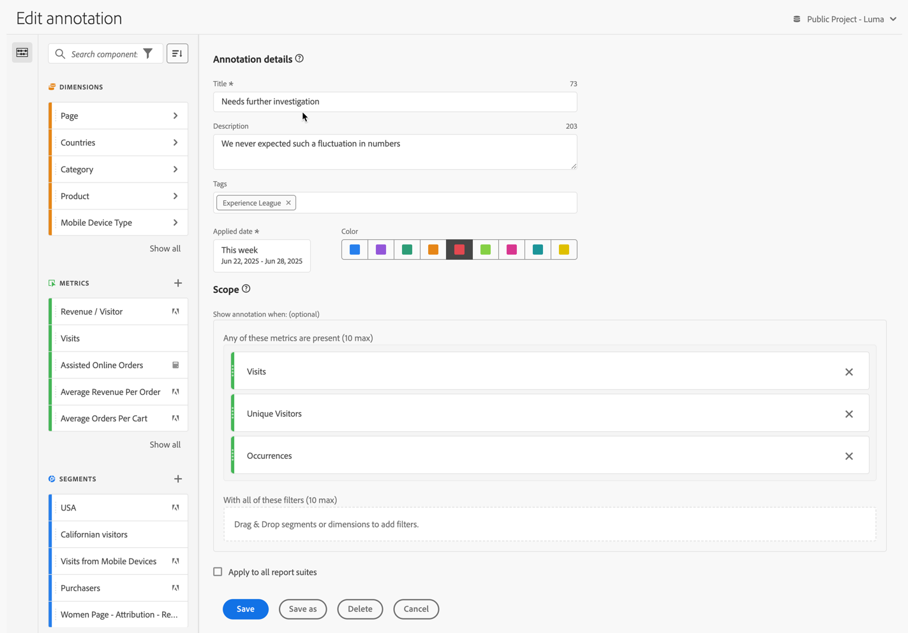

# Création d’annotations

Par défaut, seuls les administrateurs et les administratrices peuvent créer des annotations. Les utilisateurs et utilisatrices disposent de l’autorisation d’afficher les annotations, comme pour les autres composants (tels que les segments, les mesures calculées, etc.).

Toutefois, les administrateurs et administratrices peuvent accorder aux utilisateurs et utilisatrices l’autorisation de [!UICONTROL Créer des annotations] (outils Analytics) via l’[Adobe Admin Console](/help/admin/admin-console/permissions/analytics-tools.md).

Vous pouvez créer une annotation de la manière suivante :

* **A**. Dans l’interface principale, sélectionnez **[!UICONTROL Composants]**, puis **[!UICONTROL Annotations]**. Sélectionnez  [!UICONTROL **[!UICONTROL Ajouter]**] dans le [[!UICONTROL gestionnaire d’annotations]](/help/analyze/analysis-workspace/components/annotations/manage-annotations.md).
* **B**. Dans un projet Workspace, dans le menu contextuel d’une visualisation, sélectionnez **[!UICONTROL Créer une annotation d’après la sélection]**.
* **C**. Dans un projet Workspace, dans le menu contextuel d’un graphique linéaire, sélectionnez **[!UICONTROL Annoter la sélection]**.
* **D**. Dans un projet Workspace, sélectionnez **[!UICONTROL Composants]** dans le menu, puis **[!UICONTROL Créer une annotation]**.
* **E**.  Dans un projet Workspace, utilisez le raccourci **[!UICONTROL Ctrl+Maj+O]** (Windows) ou **[!UICONTROL Shift+Commande+O]** (macOS)

Pour définir l’annotation, vous utilisez le [[!UICONTROL créateur d’annotations]](#annotation-builder).

## Créateur d’annotations {#annotation-builder}

>[!CONTEXTUALHELP]
>id="components_annotations_details"
>title="Détails des annotations"
>abstract="Les annotations vous permettent de communiquer efficacement à votre organisation les nuances et informations concernant les données contextuelles. Elles vous permettent de lier des événements de calendrier à des dimensions/mesures spécifiques."

>[!CONTEXTUALHELP]
>id="components_annotations_scope"
>title="Portée"
>abstract="La portée vous permet de spécifier les données qui seront annotées. Les mesures calculées et les segments n’hériteront pas automatiquement des annotations appliquées aux composants utilisés dans leurs définitions. Vous pouvez ajouter de nouvelles mesures calculées à la section Portée d’une annotation existante. Les nouveaux segments nécessitent une nouvelle annotation."

La boîte de dialogue du **[!UICONTROL Créateur d’annotations]** permet de créer ou de modifier des annotations existantes. La boîte de dialogue s’intitule **[!UICONTROL Nouvelle annotation]** ou **[!UICONTROL Modifier l’annotation]** pour les annotations que vous créez ou gérez à partir du [[!UICONTROL gestionnaire d’annotations]](/help/analyze/analysis-workspace/components/annotations/manage-annotations.md).

>[!BEGINTABS]

>[!TAB Créateur d’annotations]

>[!TAB Création/modification d’une annotation]

>[!ENDTABS]

1. Spécifiez les détails suivants ( est obligatoire) :

   | Élément | Description |
   | --- | --- |
   | **[!UICONTROL Suite de rapports]** | Vous pouvez sélectionner la suite de rapports pour l’annotation. L’annotation que vous définissez est disponible en tant qu’annotation dans les projets Workspace en fonction de la suite de rapports sélectionnée. Cette sélection est remplacée lorsque vous avez activé [!UICONTROL Appliquer à toutes les suites de rapports]. |
   | **[!UICONTROL Annotation réservée au projet]** | Zone d’informations expliquant que l’annotation que vous créez n’est visible que dans le projet Workspace sur lequel vous travaillez. Activez **[!UICONTROL Rendre cette annotation disponible pour tous vos projets]**, afin de rendre l’annotation visible pour tous vos projets. Cette zone d’informations n’est visible que lorsque vous créez une annotation au sein d’un projet Workspace. |
   | **[!UICONTROL Titre]**  | Nommez l’annotation, par exemple `Needs further investigation`. |
   | **[!UICONTROL Description]** | Fournissez une description de l’annotation, par exemple, `We never expected such a fluctuation in numbers.`. |
   | **[!UICONTROL Étiquettes]** | Organisez l’annotation en créant ou en appliquant une ou plusieurs étiquettes. Commencez à saisir du texte pour rechercher les étiquettes existantes que vous pouvez sélectionner. Ou appuyez sur **[!UICONTROL Entrée]** pour ajouter une nouvelle étiquette. Sélectionnez  pour supprimer une étiquette. |
   | **[!UICONTROL Date appliquée]**  | Sélectionnez la date ou la période qui doit être indiquée pour que l’annotation soit visible. Lorsque vous créez une annotation à l’aide du raccourci, celle-ci correspond par défaut à la période de la journée en cours. Lorsque vous créez une annotation à l’aide d’une sélection dans une visualisation, l’annotation correspond par défaut à la période basée sur la période du panneau auquel appartient la visualisation. |
   | **[!UICONTROL Couleur]** | Appliquez une couleur à l’annotation. L’annotation apparaît dans le projet avec la couleur sélectionnée. Vous pouvez utiliser la couleur pour classer les annotations comme les jours fériés, les événements externes, les problèmes de suivi, etc. |
   | **[!UICONTROL Portée]** | Glissez-déposez les mesures à partir du panneau de composant qui déclenche l’annotation. Par exemple Personnes, Sessions et Événements. Glissez-déposez ensuite les dimensions ou les segments du panneau de composant qui servent alors de segments pour déterminer s’il faut afficher ou non l’annotation. Si vous n’indiquez pas de portée, l’annotation s’applique à toutes vos données.  Vous disposez de deux options :<ul><li>**[!UICONTROL L’une de ces mesures est présente]** : glissez-déposez jusqu’à 10 mesures qui déclenchent l’affichage de l’annotation. Par exemple, la mesure Chiffre d’affaires a cessé de collecter des données pour une période spécifique. Faites glisser la mesure Chiffre d’affaires dans cette zone.</li><li>**[!UICONTROL Avec tous ces segments]** : faites glisser et déposez jusqu’à 10 dimensions ou segments pour définir si l’annotation s’affiche ou non.</li></ul>

**Remarque :** toute annotation appliquée à un composant qui est ensuite utilisé dans le cadre d’une mesure calculée ou d’une définition de segment n’est pas héritée dans ces derniers. La mesure calculée souhaitée doit également être ajoutée à la section de la portée pour afficher l’annotation. Toutefois, une nouvelle annotation doit être créée pour tout segment que vous souhaitez annoter avec les mêmes informations. Exemple : vous appliquez une annotation à [!UICONTROL Commandes] un jour spécifique. Vous pouvez ensuite utiliser [!UICONTROL Commandes] dans une mesure calculée pour la même période. La nouvelle mesure calculée n’affiche pas automatiquement l’annotation pour les commandes. Ajoutez également la mesure calculée à la section Portée pour que l’annotation s’affiche. |
   | **[!UICONTROL Appliquer à toutes les vues de données]** | Par défaut, l’annotation s’applique à la suite de rapports d’origine. En cochant cette case, vous pouvez faire en sorte que l’annotation s’applique à toutes les suites de rapports de l’entreprise. |

   {style="table-layout:auto"}

1. Sélectionner
   * Cliquez sur **[!UICONTROL Enregistrer]** pour enregistrer l’annotation.
   * **[!UICONTROL Enregistrer sous]** pour enregistrer une copie de l’annotation.
   * **[!UICONTROL Supprimer]** pour supprimer une annotation.
   * **[!UICONTROL Annuler]** pour annuler toute modification apportée à une annotation ou annuler la création d’une nouvelle annotation.
