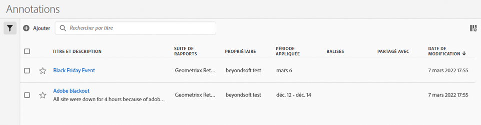

# Gestion des annotations

Vous pouvez partager, filtrer, étiqueter, approuver, copier, supprimer des annotations et marquer des annotations comme favorites depuis une interface de gestion centralisée des [!UICONTROL Annotations]. Pour gérer les annotations :

* Sélectionnez **[!UICONTROL Composants]** dans l’interface principale, puis sélectionnez **[!UICONTROL Annotations]**.

>[!NOTE]
>
>Les annotations que vous créez dans un projet Workspace spécifique n’apparaissent pas dans le gestionnaire d’[!UICONTROL annotations], sauf si vous avez rendu l’annotation disponible pour tous vos projets.
>

## Gestionnaire d’annotations

Le gestionnaire d’annotations comprend les éléments d’interface suivants :

### Liste des annotations

La ➊ Liste des annotations affiche toutes les annotations que vous possédez, celles qui ont été incluses dans tous vos projets et celles qui ont été partagées avec vous. La liste comporte les colonnes suivantes :

| Colonne | Description |
| --- | --- |
|  | Cliquez pour ajouter aux favoris  ou retirer des favoris  une annotation. |
| **[!UICONTROL Titre et description]** | Fournis dans le créateur d’annotations. Pour modifier le titre et la description, sélectionnez le lien du titre : cela ouvre le [créateur d’annotations](/help/analyze/analysis-workspace/components/annotations/create-annotations.md#annotation-builder). Une annotation partagée est indiquée par . |
| **[!UICONTROL Suite de rapports]** | Suites de rapports auxquelles cette annotation s’applique. |
| **[!UICONTROL Propriétaire]** | La personne propriétaire de l’annotation. En tant qu’utilisateur ou utilisatrice, vous ne pouvez consulter que les annotations que vous possédez ou celles qui ont été partagées avec vous. |
| **[!UICONTROL Période appliquée]** | La date ou la période à laquelle cette annotation s’applique. |
| **[!UICONTROL Étiquettes]** | Les étiquettes de cette annotation. |
| **[!UICONTROL Partagé avec]** | Les individus ou les groupes avec lesquels vous avez partagé l’annotation. Sélectionnez cette option pour ouvrir la boîte de dialogue **[!UICONTROL Partager le composant]**. |
| **[!UICONTROL Date de modification]** | Affiche la date et l’heure de la dernière modification de l’annotation. |

{style="table-layout:auto"}

Utilisez  pour spécifier les colonnes à afficher.

### Barre d’actions

Vous pouvez agir sur les annotations à l’aide de la barre d’actions ➋. La barre d’actions contient les actions suivantes :

| Icône | Action | Description |
|:--:|---|---|
|  | **[!UICONTROL Ajouter]** | Ajoutez une autre annotation à l’aide du [créateur d’annotations](create-annotations.md#annotation-builder). |
|  | [!UICONTROL *Rechercher par titre*] | Lorsqu’aucune annotation n’est sélectionnée dans la liste, recherchez des annotations à l’aide de ce champ de recherche. |
|  | **[!UICONTROL Étiquette]** | Étiquetez les annotations sélectionnées. Dans la boîte de dialogue **[!UICONTROL Étiqueter le composant]**, sélectionnez ou désélectionnez les étiquettes pour les annotations sélectionnées. Sélectionnez **[!UICONTROL Enregistrer]** pour enregistrer les étiquettes pour les annotations sélectionnées. |
|  | **[!UICONTROL Partager]** | Partagez les annotations sélectionnées. Dans la boîte de dialogue **[!UICONTROL Partager le composant]**, vous pouvez  *Rechercher des individus ou des groupes* ou sélectionner **[!UICONTROL Organisation]** ou **[!UICONTROL Groupes]**. Sélectionnez **[!UICONTROL Enregistrer]** pour enregistrer les détails de partage pour les annotations sélectionnées. Pour plus de détails, consultez la section [Partager des annotations](#share-annotations). |
|  | **[!UICONTROL Supprimer]** | Supprimez les annotations sélectionnées. Il vous est demandé de confirmer. |
|  | **[!UICONTROL Renommer]** | Renommez une seule annotation sélectionnée. Lorsque cette option est sélectionnée, vous pouvez directement renommer l’annotation. |
|  | **[!UICONTROL Copier]** | Copiez les annotations sélectionnées. Les nouvelles annotations sont créées avec le même nom et le même suffixe (Copie). |
|  | **[!UICONTROL Exporter dans un fichier CSV]** | Exportez les annotations dans un fichier `Annotations List.csv`. |

### Barre de filtres actifs

La barre de filtres affiche ➌ les filtres actifs (le cas échéant). Vous pouvez supprimer rapidement un filtre à l’aide de . Si plusieurs filtres sont spécifiés, vous pouvez tous les supprimer à l’aide de **[!UICONTROL Tout supprimer]**.

### Panneau Filtrer

Vous pouvez filtrer les annotations à l’aide du **[!UICONTROL du panneau de gauche]** Filtrer➍. Le panneau Filtrer affiche le type de filtre et le nombre d’annotations qui correspondent au filtre. Sélectionnez  pour afficher ou masquer le panneau Filtrer.

Pour filtrer la liste des filtres :

1. Sélectionnez  pour ouvrir le panneau Filtres. Si vous avez besoin d’espace supplémentaire pour la liste des filtres, vous pouvez sélectionner à nouveau  pour fermer le panneau.
1. Vous pouvez filtrer les annotations à l’aide des [sections de filtrage](#filter-sections) disponibles.

   >[!INFO]
   >
   >*Les éléments* font référence aux éléments d’annotation affichés dans la [Liste des annotations](manage-annotations.md#annotations-list).
   > 

#### Sections de filtrage

{{tagfiltersection}}
{{reportsuitefiltersection}}
{{ownerfiltersection}}
{{daterangefiltersection}}
{{otherfiltersfiltersection}}

La [Liste des annotations](manage-annotations.md#annotations-list) est automatiquement mise à jour en fonction de la configuration de vos filtres. Vous pouvez voir les filtres configurés dans la [Barre des filtres actifs](manage-annotations.md#active-filter-bar).

## Modification des annotations

Vous pouvez modifier une annotation de deux manières différentes :

* Dans un projet Workspace, utilisez l’icône [Informations sur le composant](/help/analyze/analysis-workspace/components/use-components-in-workspace.md#component-info).

* Dans la liste des [[!UICONTROL annotations]](#annotations-list), cliquez sur le titre de l’annotation.

Utilisez le [Créateur d’annotations](/help/analyze/analysis-workspace/components/annotations/create-annotations.md#annotation-builder) pour modifier l’annotation.

## Partage des annotations

Les éléments suivants s’appliquent lorsque vous partagez ou utilisez des annotations partagées avec vous :

* Les annotations limitées uniquement au projet que vous partagez avec d’autres utilisateurs et utilisatrices s’affichent pour ces utilisateurs et utilisatrices. Les utilisateurs et utilisatrices ne peuvent pas modifier ou supprimer ces annotations limitées uniquement au projet.
* Si vous enregistrez une annotation et la partagez directement avec un utilisateur ou une utilisatrice, ceux-ci ne peuvent la modifier ou la supprimer que s’ils disposent de droits d’administration.

* Si un projet est partagé avec vous, les annotations créées dans ce projet s’affichent uniquement dans ce projet. Si une annotation est partagée directement avec vous, elle apparaîtra dans tous les projets où elle peut être affichée.

## Annotations et fuseaux horaires

Toutes les annotations sont créées avec un horodatage qui n’inclut pas l’heure ou le fuseau horaire. Au moment du rapport, le fuseau horaire de la suite de rapports configurée pour le panneau est utilisé.

<!--
# Manage annotations

The [!UICONTROL Annotations manager] shows you all of the annotations that you own or that have been shared with you. Project-specific annotations do not appear here. You can use this interface to share, filter, tag, copy, delete, and favorite your annotations. Administrators can manage and approve annotations.

**[!UICONTROL Components]** > **[!UICONTROL Annotations]**

## Annotations Manager user interface

| UI Element | Description |
| --- | --- |
| [!UICONTROL Title and Description] | Provided in the Annotations Builder. To edit the title and description, click the title link - this takes you back to the Annotations Builder.  |
| [!UICONTROL Report Suite] | The report suites that this annotation applies to.  |
| [!UICONTROL Owner] | Indicates who owns the annotation. As a non-Admin, you can see only annotations that you own or those that were shared with you. |
| [!UICONTROL Applied Date Range] | The date or date range that this annotation applies to. |
| [!UICONTROL Shared with] | Lists how many individuals or groups that you shared the annotation with. Click for more detail. |
| [!UICONTROL Date Modified] | Shows the date and time that the annotation was last modified. |

{style="table-layout:auto"}

## Edit annotations

Editing an annotation means that you can adjust date ranges, colors, scope, or whether it applies to all report suites or projects. You can edit annotations in two ways:

* In a line chart, hover over the annotation and click the pencil icon within the popover.
* In the [!UICONTROL Annotations Manager], click the title of the annotation.

Both of these options land you back in the [!UICONTROL Annotations Builder]. There, you can make the necessary adjustments and save the new version.

## Share annotations

When sharing annotations or working with annotations that were shared with you, keep this in mind:

* If you create a project with project-only annotations, then share the project with another user, annotations cannot be edited or deleted by anyone that you share the project with.
* If you save an annotation and share it directly with a user, they can edit/delete the annotation only if they have admin rights.
* If a project is shared with you with a project-only annotation, it shows up only in that project. If the annotation is shared directly with you, it shows up in all projects where that annotation can be displayed. 

## Annotations and time zones

All annotations are created with a timestamp, but no hours or timezone information. At report time, the timezone of the panel's report suite is always applied. For example, an annotation created for Christmas Day happens on December 25 no matter what report suite timezone you are in. 

## Other annotation tasks

The Annotations manager lets Administrators edit, add, tag, delete, rename, approve, copy, export, and filter annotations. It is not visible to non-Admin users. 

Additional options are available when you select at least one annotation:

| Task | Description |
| --- | --- |
| [!UICONTROL Add] | Takes you to the Annotations builder where you can create annotations. |
| [!UICONTROL Tag] | All users can create tags for annotations and apply one or more tags to an annotation. However, you can see tags only for annotations that you own. |
| [!UICONTROL Delete] | Deleting an annotation removes it from any project in your organization. |
| [!UICONTROL Rename] | Renaming an annotation renames it in all projects that it was applied to. |
| [!UICONTROL Copy] | Creates a distinct copy with its own annotation ID, but with the same name and definition.|
| [!UICONTROL Export to CSV] | Export the annotation definition to a .csv file.|
| [!UICONTROL Filter] (left rail) | Filter by tags, report suite, owners, and other filters (Mine, Approved, Favorites, Shared with me, and Show All).|

{style="table-layout:auto"}

-->