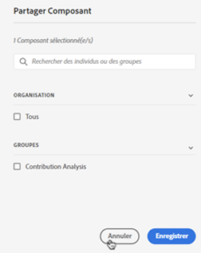

# Gestion des annotations

>[!NOTE]
>
>Cette fonctionnalité fait actuellement l’objet de tests limités.

Le [!UICONTROL Composants] > [!UICONTROL Annotations] manager offre de nombreuses façons de gérer les annotations, telles que le partage, le filtrage, le balisage, l’approbation, la copie, la suppression et le marquage en tant que favoris.

Le [!UICONTROL Annotations] manager vous présente toutes les annotations que vous possédez qui ont été incluses dans tous vos projets et qui ont été partagées avec vous.

>[!NOTE]
>
>[!UICONTROL Annotations] que vous avez créé uniquement pour un projet spécifique n’apparaît pas dans le gestionnaire.

## Interface utilisateur du Gestionnaire d’annotations

| Elément de l’interface utilisateur | Description |
| --- | --- | 
| [!UICONTROL Titre et description] | Fourni dans le créateur d’annotations. Pour modifier le titre et la description, cliquez sur le lien du titre : il vous ramène au créateur d’annotations. |
| [!UICONTROL Suite de rapports] | Suite(s) de rapports à laquelle cette annotation s’applique. |
| [!UICONTROL Propriétaire] | Indique qui possède l’annotation. En tant que non administrateur, vous ne pouvez afficher que les annotations que vous possédez ou celles qui ont été partagées avec vous. |
| [!UICONTROL Période appliquée] | Date ou période à laquelle cette annotation s’applique. |
| [!UICONTROL Partagé avec] | Répertorie le nombre d’individus ou de groupes avec lesquels vous avez partagé l’annotation. Cliquez sur pour plus de détails. |
| [!UICONTROL Date de modification] | Affiche la date et l’heure de la dernière modification de l’annotation. |

## Modification des annotations

La modification d’une annotation signifie que vous pouvez ajuster les plages de dates, les couleurs, la portée ou s’il s’applique ou non à toutes les suites de rapports ou tous les projets. Vous pouvez modifier les annotations de deux manières différentes :

* Dans un graphique en courbes, passez la souris sur l’annotation et cliquez sur l’icône représentant un crayon dans la fenêtre contextuelle.

* Dans le [!UICONTROL Gestionnaire des annotations], cliquez sur le titre de l’annotation.

Ces deux options vous redirigent vers le créateur d’annotations. Vous pouvez y effectuer les réglages nécessaires et enregistrer la nouvelle version.

## Partage des annotations

1. Sélectionnez la ou les annotations à partager, puis cliquez sur [!UICONTROL Partager].

1. Dans le [!UICONTROL Composant Partager] recherchez les individus ou les groupes avec lesquels vous souhaitez partager la ou les annotations.

1. Sous [!UICONTROL Organisation], ....

1. Cliquez sur [!UICONTROL Enregistrer].

## Balisage des annotations

Pour suivre

