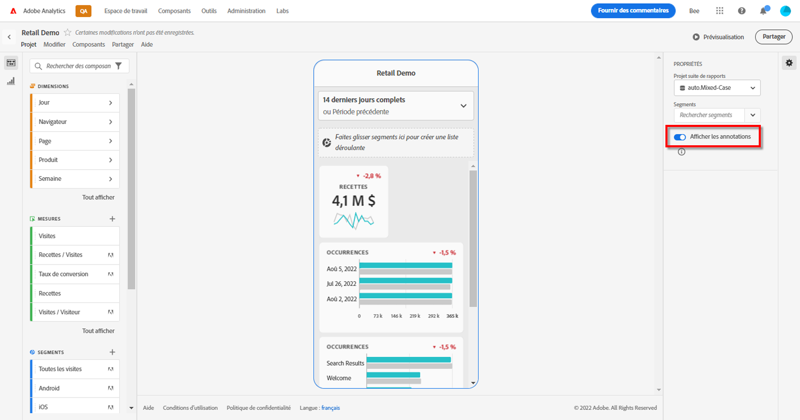
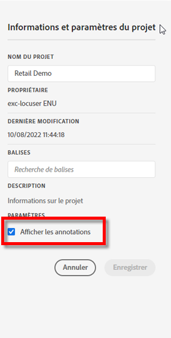

# Partage des annotations dans les cartes de performance mobiles

Vous pouvez afficher les annotations créées dans l’espace de travail sur les cartes de performance mobiles. Cela vous permet de partager des nuances et informations de données contextuelles sur votre organisation et vos campagnes directement au sein des projets de cartes de performance mobiles, visibles dans l’application mobile des tableaux de bord Analytics.

## Affichage des annotations dans les cartes de performance mobiles

Pour afficher les annotations dans les cartes de performance mobiles, créez d’abord l’annotation à partir des projets de l’espace de travail ou depuis le menu des composants.

Consultez [Création d’annotations](create-annotations.md) pour en savoir plus à ce sujet. Les annotations sont désactivées par défaut dans les cartes de performance mobiles et doivent être activées pour chaque carte de performance que vous souhaitez voir figurer dans les cartes de performance mobiles.

1. Activez les annotations. Allez à [Activation ou désactivation des annotations](overview.md#annotations-on-off) pour les activer.

1. Créez une annotation et assurez-vous qu’elle est partagée avec tous vos projets. Allez à [Création d’annotations](create-annotations.md) pour créer une annotation dans l’espace de travail.

1. Sélectionnez **Afficher les annotations** pour afficher l’annotation dans les cartes de performance mobiles.

   

1. Confirmez que l’option Afficher les annotations est sélectionnée, puis allez à **Projet** > **Informations et paramètres du projet**.

   

## Visualisation des annotations dans les cartes de performance mobiles

Lorsque les annotations sont activées, les icônes d’annotation apparaissent dans le créateur de cartes de performance. Les annotations figurent uniquement sur les graphiques et les tableaux dans la vue détaillée. Les annotations ne sont pas visibles lorsque la carte de performance s’affiche sous forme de vignette.

Lorsque les icônes d’annotation sont visibles, vous ne pouvez pas visualiser ni interagir avec l’intégralité des annotations dans le canevas du créateur. Utilisez le mode Aperçu pour afficher et interagir avec les annotations telles qu’elles apparaissent dans l’application  **Aperçu**.

Les couleurs d’annotation sont sélectionnées lors de la création de l’annotation dans l’espace de travail. Les annotations grises indiquent la présence de plusieurs annotations.

## Visualisation des annotations d’un graphique

| Date | Apparence |
| --- | --- |
| **Un seul jour** |    |
| **Période** |  |
| **Annotations qui se chevauchent** |   Sélectionnez une icône d’annotation pour afficher les détails des annotations dans l’application des tableaux de bord Analytics.   Lorsque vous consultez une annotation dans un graphique, vous pouvez balayer vers la gauche et la droite pour parcourir toutes les annotations présentes dans le graphique. Lorsque vous consultez une annotation dans le tableau, balayez vers la gauche et la droite pour parcourir toutes les annotations associées à cet élément de ligne dans le tableau.      Dans les graphiques sans *axe x* basé sur le temps comme les graphiques circulaires ou à barres horizontales, les annotations qui s’appliquent au graphique peuvent être consultées en appuyant sur l’icône située dans le coin inférieur droit.    |
