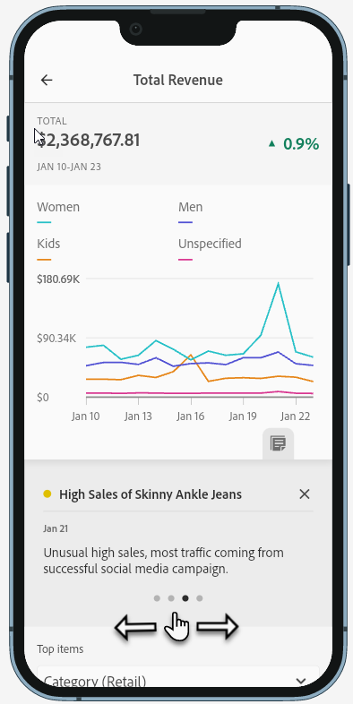

# Partage des annotations dans les Fiches d’évaluation mobiles

Vous pouvez afficher les annotations créées dans Workspace dans les Fiches d’évaluation mobiles. Cela vous permet de partager des nuances de données contextuelles et des informations sur votre organisation et vos campagnes directement dans les projets de Fiche d’évaluation mobile, visibles dans l’application mobile des tableaux de bord Analytics.

## Annotations de surface dans les Fiches d’évaluation mobiles

Pour afficher les annotations dans les fiches d’évaluation mobiles, créez d’abord l’annotation à partir des projets Workspace ou du menu Composants.

Pour plus d’informations sur la création d’annotations, voir [Création d’annotations](create-annotations.md). Par défaut, les annotations sont désactivées dans les Fiches d’évaluation mobiles et doivent être activées pour chaque Fiche d’évaluation que vous souhaitez afficher dans les Fiches d’évaluation mobiles.

1. Activez les annotations. Pour activer les annotations, voir [Activation ou désactivation des annotations](https://experienceleague.adobe.com/docs/analytics-platform/using/cja-components/annotations/overview.html?lang=en#turn-annotations-on-or-off).

1. Créez une annotation et assurez-vous qu’elle est partagée avec tous vos projets. Pour créer une annotation dans Workspace, voir [Création d’annotations](create-annotations.md).

1. Sélectionner **Afficher les annotations** pour afficher l’annotation dans les Fiches d’évaluation mobiles.

1. Confirmez que l’option afficher les annotations est sélectionnée. Pour **Projet** > **Informations et paramètres du projet**.

## Affichage des annotations dans les Fiches d’évaluation mobiles

Lorsque les annotations sont activées, les icônes d’annotation sont visibles dans le créateur de Fiche d’évaluation. Les annotations apparaissent uniquement sur les graphiques et les tableaux dans la vue détaillée. Les annotations ne sont pas visibles à partir de l’affichage de la mosaïque principale de la fiche d’évaluation.

Lorsque les icônes d’annotation sont visibles, vous ne pouvez pas afficher ou interagir avec les annotations dans la zone de travail du créateur. Utilisez le mode Aperçu pour afficher et interagir avec les annotations telles qu’elles apparaissent dans l’application. 

Les couleurs de l’annotation sont sélectionnées lors de la création de l’annotation dans l’espace de travail. Les annotations grises indiquent la présence de plusieurs annotations.  

## Affichage des annotations de graphique

| Date | Apparence |
| --- | --- |
| **Un seul jour** |    |
| **Période** |  |
| **Annotations qui se chevauchent** |   Pour afficher les détails des annotations dans l’application de tableaux de bord Analytics, appuyez sur une icône d’annotation.   Lors de l’affichage d’une annotation dans un graphique, vous pouvez faire glisser vers la gauche et la droite pour parcourir toutes les annotations présentes dans le graphique. Lors de l’affichage d’une annotation dans le tableau, faites glisser les annotations vers la gauche et la droite pour parcourir toutes les annotations associées à cet élément de ligne dans le tableau.      Dans les graphiques qui n’ont pas d’heure *axe x*, par exemple les graphiques en anneau ou à barres horizontales, les annotations qui s’appliquent au graphique peuvent être visualisées en appuyant sur l’icône située dans le coin inférieur droit.    |
