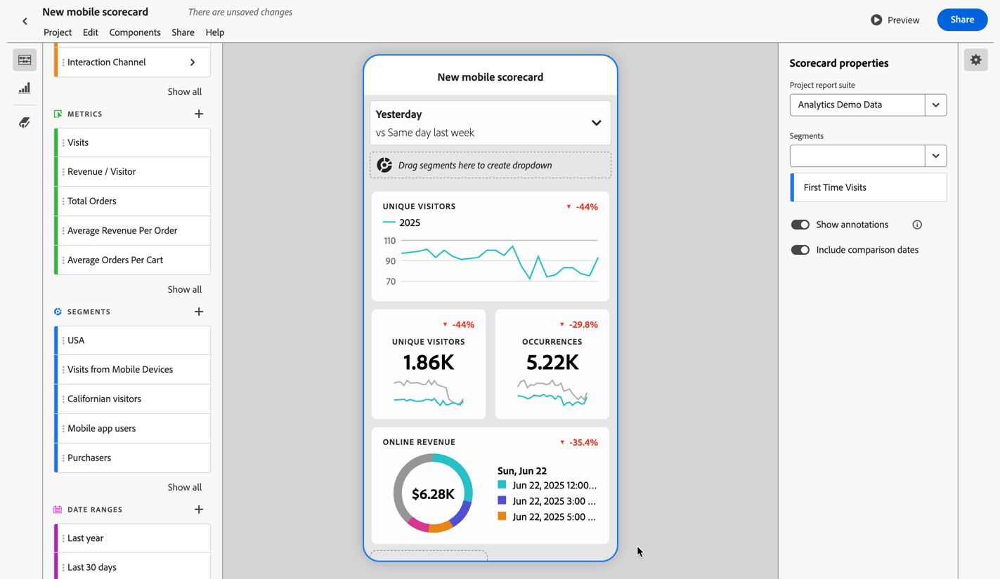

# Partage des annotations dans les cartes de performance mobiles

Vous pouvez afficher les annotations créées dans Workspace dans les cartes de performance mobiles. Les annotations dans les cartes de performance mobiles vous permettent de partager les nuances et informations des données contextuelles de votre organisation et de vos campagnes.

## Affichage des annotations dans les cartes de performance mobiles

Pour afficher les annotations dans les cartes de performance mobiles, créez d’abord l’annotation à partir des projets de l’espace de travail ou depuis le menu des composants.

Pour plus d’informations sur la création d’annotations, consultez [Créer des annotations](create-annotations.md). Les annotations sont désactivées par défaut dans les cartes de performance mobiles et doivent être activées pour chaque carte de performance que vous souhaitez voir figurer dans les cartes de performance mobiles.

1. Activez les annotations. Allez à [Activation ou désactivation des annotations](overview.md#turn-annotations-on-or-off) pour les activer.

1. Créez une annotation et assurez-vous qu’elle est partagée avec tous vos projets. Consultez [Créer des annotations](create-annotations.md) pour plus d’informations.

1. Sélectionnez **[!UICONTROL Afficher les annotations]** pour afficher l’annotation dans les cartes de performance mobiles.

   

   Vous avez la possibilité de confirmer que l’option **[!UICONTROL Afficher les annotations]** est sélectionnée dans **[!UICONTROL Projet]** > **[!UICONTROL Informations et paramètres du projet]**.

## Visualiser les annotations dans les cartes de performance mobiles

Lorsque les annotations sont activées, les icônes d’annotation apparaissent dans le créateur de cartes de performance. Les annotations figurent uniquement sur les graphiques et les tableaux dans la vue détaillée. Les annotations ne sont pas visibles lorsque la carte de performance s’affiche sous forme de vignette.

Lorsque les icônes d’annotation sont visibles, vous ne pouvez pas complètement visualiser ni interagir avec les annotations dans la zone de travail du créateur. Utilisez la **[!UICONTROL prévisualisation]** pour visualiser et interagir avec les annotations telles qu’elles apparaissent dans l’application.

Les couleurs d’annotation sont sélectionnées lors de la création de l’annotation dans l’espace de travail. Les annotations en gris indiquent la présence de plusieurs annotations.

## Prévisualisation des annotations

Vous pouvez prévisualiser une annotation à l’aide de la prévisualisation . Sélectionnez une annotation pour consulter ses détails.

Si d’autres annotations sont disponibles, plusieurs points (●) s’affichent au bas de l’annotation. Balayez vers la gauche ou vers la droite pour passer d’une annotation à une autre.

<!--
# Share Annotations in Mobile Scorecards

You can display annotations that are created in Workspace in Mobile Scorecards. This allows you to share contextual data nuances and insights about your organization and campaigns directly within Mobile Scorecard projects, viewable in the Analytics dashboards mobile app.

## Surface Annotations in Mobile Scorecards

To surface annotations in mobile scorecards, create the annotation first from Workspace projects or from the components menu.

For information on creating annotations, see [Create Annotations](create-annotations.md). Annotations are turned off in mobile scorecards by default and must be enabled for each scorecard that you want to surface in mobile scorecards.

1. Turn on annotations. To turn annotations on, see [Turn annotations on or off](overview.md#annotations-on-off).

1. Create an annotation and make sure it is shared to all your projects. To create an annotation in Workspace,  see [Create Annotations](create-annotations.md).

1. Select **Show annotations** to display the annotation in Mobile Scorecards.

   

1. Confirm that show annotations is selected, go to **Project** > **Project info and settings**.

   

## View annotations in Mobile Scorecards

When annotations are enabled, annotation icons are visible in the Scorecard Builder. Annotations appear only on charts and tables in the detailed view. Annotations are not visible from the main tile view of the scorecard.

 

When annotation icons are visible, you can't fully view or interact with annotations in the builder canvas. Use the Preview mode to view and interact with annotations as they appear in the app  **Preview**.

Annotation colors are selected when the annotation is created in workspace. Gray annotations indicated the presence of more than one annotation.

## View chart annotations

| Date | Appearance |
| --- | --- |
| **Single day** |     |
| **Date range** |  |
| **Overlapping annotations** |   To view annotation details in the Analytics dashboards app, tap an annotation icon.   When viewing an annotation in a chart, you can swipe left and right to navigate all annotations present in the chart. When viewing an annotation in the table, swipe left and right to navigate all annotations associated with that row item in the table.      In charts that do not have a time-based *x axis*, such as the donut or horizontal bar charts, annotations that apply to the chart can be viewed by tapping the icon located in the lower right-hand corner.   |
-->