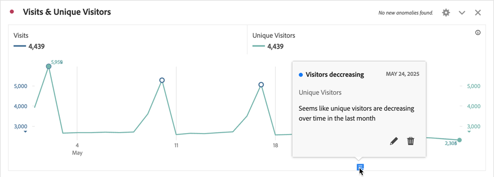
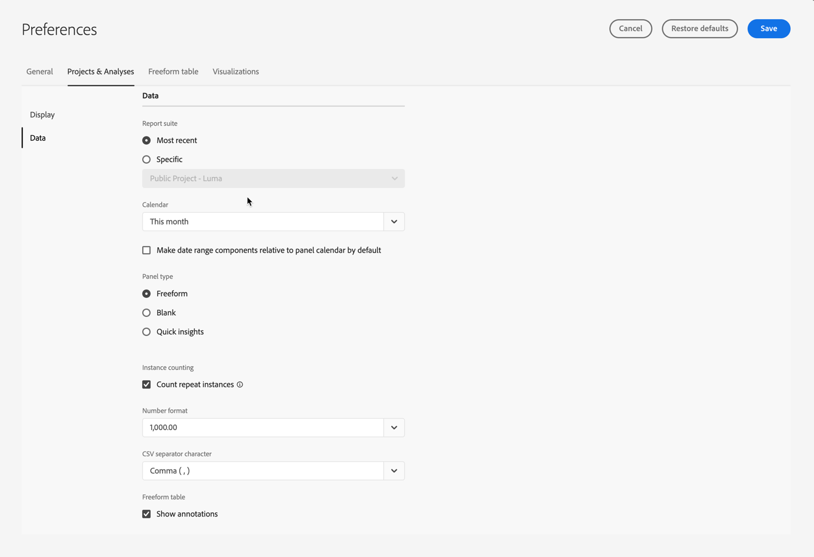
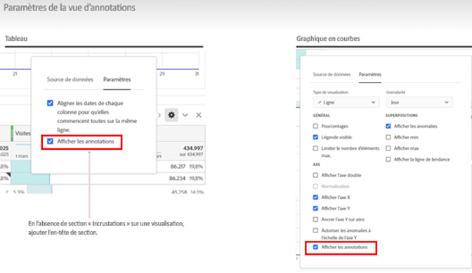
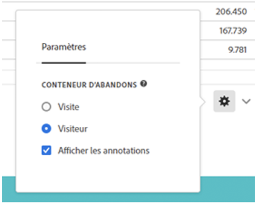

# Vue d’ensemble des annotations

Les annotations vous permettent de communiquer efficacement les nuances et les informations des données contextuelles aux autres parties prenantes de votre entreprise. Elles vous permettent de lier des événements de calendrier à des dimensions et à des mesures spécifiques. Vous pouvez annoter une date ou une période avec des problèmes de données connus, des jours fériés, des lancements de campagne, etc. Vous pouvez ensuite afficher les événements sous forme graphique et voir si les campagnes ou d’autres événements ont affecté le trafic sur votre site, votre utilisation de l’application mobile, votre chiffre d’affaires ou toute autre mesure.

Supposons, par exemple, que vous partagiez des projets avec votre organisation. Si le nombre de vos visiteurs et visiteuses uniques a considérablement baissé, vous pouvez créer une annotation **Visiteurs et visiteuses en baisse** et l’étendre à l’ensemble de votre suite de rapports. Lorsque vos utilisateurs et utilisatrices visualisent une suite de rapports incluant cette date, ils voient l’annotation dans leurs projets, à côté de leurs données.

Les annotations peuvent s’appliquer à :

* Une date unique ou une période.

* Votre jeu de données entier ou des mesures, dimensions ou segments spécifiques.

* Le projet dans lequel les annotations sont créées (par défaut) ou tous les projets.

* La vue de données dans laquelle les annotations sont créées (par défaut) ou toutes les vues de données.

Consultez [Créer des annotations](create-annotations.md) pour connaître les différentes options disponibles pour créer des annotations. Vous pouvez ensuite créer, modifier et enregistrer des annotations dans le [créateur d’annotations](create-annotations.md#annotation-builder).

Utilisez le [gestionnaire d’annotations](manage-annotations.md) pour gérer les annotations.

## Activation ou désactivation des annotations

Les annotations peuvent être activées ou désactivées à plusieurs niveaux :

| Niveau | Comment... |
|---|---|
| **Visualisation** | Activer ou désactiver le  > **[!UICONTROL Paramètres]** > **[!UICONTROL Afficher les annotations]**.  |
| **Projet** | Dans le menu d’un projet Workspace, sélectionnez **[!UICONTROL Projet]** > **[!UICONTROL Informations et paramètres du projet]** et activez ou désactivez l’option **[!UICONTROL Afficher les annotations]**.  |
| **Utilisateur ou utilisatrice** | Dans l’onglet **[!UICONTROL Composants]**, sélectionnez **[!UICONTROL Préférences]** ou, dans le menu d’un projet Workspace, sélectionnez **[!UICONTROL Projet]** > **[!UICONTROL Préférences utilisateur]**.  Dans **[!UICONTROL Préférences]**, sélectionnez **[!UICONTROL Projets et analyse]**. Dans la barre d’onglets de gauche, sélectionnez **[!UICONTROL Données]**. En bas, activez ou désactivez **[!UICONTROL Afficher les annotations]** sous l’en-tête du **[!UICONTROL Tableau à structure libre]**.  |

<!--
# Annotations overview

Annotations in Workspace enable you to effectively communicate contextual data nuances and insights to your organization. They let you tie calendar events to specific dimensions/metrics. You can annotate a date or date range with known data issues, public holidays, campaign launches, etc. You can then graphically display events and see whether campaigns or other events have affected your site traffic, revenue, or any other metric.

For example, let's say you are sharing projects with your organization. If you had a major spike in traffic due to a marketing campaign, you could create a "Campaign launch date" annotation and scope it for your whole report suite. When your users view any data sets that included that date, they see the annotation within their projects, alongside their data.

Keep this in mind:

* Annotations can be tied to a single date or to a date range.

* They can apply to your entire data set or to specified metrics, dimensions, or segments.

* They can apply to the project in which they were created (default) or to all projects.

* They can apply to the report suite in which they were created (default) or to all report suites.

## Permissions {#permissions}

By default, only Admins can create annotations. Users have rights to view annotations like they do with other other Analytics components (such as segments, calculated metrics, etc.).

However, Admins can give the [!UICONTROL Annotation Creation] permission (Analytics Tools) to users via the [Adobe Admin Console](https://experienceleague.adobe.com/docs/analytics/admin/admin-console/permissions/analytics-tools.html).

## Turn annotations on or off {#annotations-on-off}

Annotations can be turned on or off at several levels:

* At the Visualization level: [!UICONTROL Visualization] settings > [!UICONTROL Show annotations]

* At the Project level: [!UICONTROL Project info & settings] > [!UICONTROL Show annotations]

* At the User level: [!UICONTROL Components] > [!UICONTROL User preferences] > [!UICONTROL Data] > [!UICONTROL Show annotations]

-->