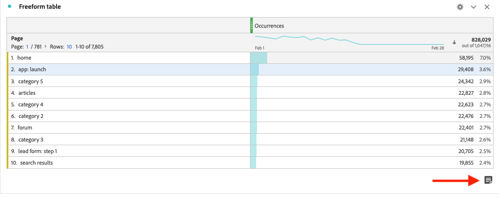

# Affichage des annotations

Les annotations se présentent de manière légèrement différente, selon leur emplacement et selon qu’elles s’étendent sur un seul jour ou sur une période.

## Affichage des annotations dans Workspace

| Type de  visualisation | Description |
| --- | --- |
| **Graphique linéaire &#x200B;** **Un seul jour** | Lorsque vous sélectionnez  dans un graphique linéaire, une fenêtre contextuelle contenant les détails de l’annotation s’affiche.  Pour modifier l’annotation dans le [créateur d’annotations](create-annotations.md#annotation-builder), sélectionnez . Pour supprimer l’annotation, sélectionnez . |
| **Graphique linéaire &#x200B;** **Période** | Lorsque vous sélectionnez , une fenêtre contextuelle contenant les détails de l’annotation s’affiche, ainsi qu’une ligne située en dessous qui indique la période. Pour modifier l’annotation dans le [créateur d’annotations](create-annotations.md#annotation-builder), sélectionnez . Pour supprimer l’annotation, sélectionnez . |
| **Tableau à structure libre** | Dans un tableau à structure libre, vous pouvez accéder à toutes les annotations à partir du bouton des annotations situé en haut à droite de la visualisation. Sélectionnez  pour afficher toutes les annotations (sous forme de liste déroulante).  Pour chaque annotation, vous pouvez sélectionner  pour modifier l’annotation dans le [créateur d’annotations](create-annotations.md#annotation-builder) et  pour supprimer l’annotation. |

{style="table-layout:auto"}

## Affichage des annotations dans un fichier .pdf

Lorsque vous téléchargez ou envoyez votre projet sous forme de fichier .pdf, les annotations sont regroupées dans le fichier dans la section Résumé des annotations.

<!--
# View annotations

Annotations manifest slightly differently, depending on whether they span a single day or a date range.

## View annotations in Line charts or Tables

| Date | Appearance |
| --- | --- |
| **Single day** |   
When you hover over the annotation, you can see its details, you can edit it by selecting the pen icon, or you can delete it:
  |
| **Date range** |  The icon changes and when you hover over it, the date range appears.

When you select it in the line chart, the annotation metadata appear, and you can edit or delete it:
In a table, an icon appears on every date in the date range.
|
| **Overlapping annotations** | On days that have more than one annotation tied to them, the icon appears in a grey color.

When you hover over the grey icon, all overlapping annotations appear:
 |

{style="table-layout:auto"}

## View annotations in a .pdf file

Since you cannot hover over icons in a .pdf file, this file (after export) provides notes of explanations at the bottom of a panel. Here is an example:

## View annotations with non-trended data

Sometimes annotation are shown with non-trended data, but tied to a specific dimension. In that case, they appear only in a summary annotation in the bottom right corner. Here is an example:

The summary chart appears in all visualization types in the corner, not just in non-trended freeform tables and summary numbers. It also appears in visualizations like [!UICONTROL Donut], [!UICONTROL Flow],[!UICONTROL Fallout],[!UICONTROL Cohort], and so on.

-->