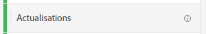
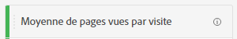
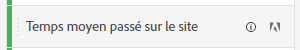
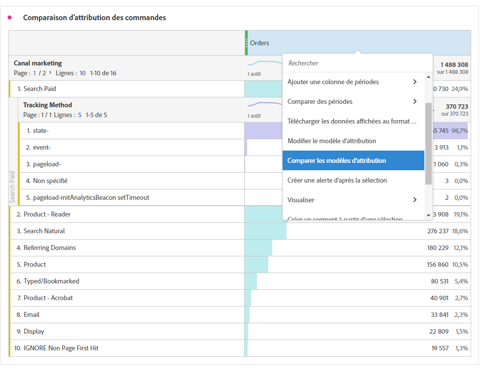

# Mesures

Les mesures vous permettent de quantifier les points de données dans Analysis Workspace. Elles sont généralement utilisées comme colonnes dans une visualisation et liées aux dimensions.

## Types de mesures

Adobe propose plusieurs types de mesures à utiliser dans Analysis Workspace :

* **Mesures standard** : la plupart des mesures que vous utilisez dans les projets sont des mesures standard. Exemples : [Pages vues](/help/components/metrics/page-views.md), [Revenu](/help/components/metrics/revenue.md)ou [Événements personnalisés](/help/components/metrics/custom-events.md). Pour plus d’informations, consultez la section [Vue d’ensemble des mesures](/help/components/metrics/overview.md) du guide d’utilisation des composants.

  

* **Mesures calculées** : mesures définies par l’utilisateur ou l’utilisatrice et basées sur des mesures standard, des nombres statiques ou des fonctions algorithmiques. Les mesures calculées définies par l’utilisateur ou l’utilisatrice affichent une icône de calculateur dans la liste des composants disponibles. Pour plus d’informations, consultez la section [Vue d’ensemble des mesures calculées](/help/components/c-calcmetrics/cm-overview.md) du guide d’utilisation des composants.

  

* **Modèles de mesures calculées** : mesures définies par Adobe qui se comportent de la même manière que les mesures calculées. Vous pouvez les utiliser tels quels dans les projets Workspace ou enregistrer une copie pour personnaliser sa logique. Les modèles de mesures calculées affichent une icône Adobe dans la liste des composants disponibles.

  

## Utilisation des mesures de dans Analysis Workspace

Les mesures peuvent être utilisées de différentes manières dans Analysis Workspace. Pour plus d’informations sur l’ajout de mesures et d’autres types de composants à Analysis Workspace, voir [Utiliser des composants dans Analysis Workspace](/help/analyze/analysis-workspace/components/use-components-in-workspace.md).

>[!BEGINSHADEBOX]

Voir  [Use metrics](https://video.tv.adobe.com/v/40817?quality=12&learn=on){target="_blank"} pour une vidéo de démonstration.

>[!ENDSHADEBOX]

## Création de mesures calculées

Les mesures calculées vous permettent de voir facilement comment les mesures sont liées les unes aux autres, à l’aide d’opérateurs simples ou de fonctions statistiques.

Il existe plusieurs façons de créer des mesures calculées. La méthode que vous choisissez détermine si la mesure calculée est disponible dans la liste des composants de tous les projets ou uniquement dans le projet dans lequel elle a été créée.

### Création de mesures calculées pour tous les projets

Vous pouvez utiliser le créateur de mesures calculées pour créer des mesures calculées. Une fois créées de cette manière, les mesures calculées sont disponibles dans la liste des composants et peuvent ensuite être utilisées dans les projets de l’ensemble de votre organisation.

Pour plus d’informations sur l’accès au créateur de mesures calculées, voir [Création de mesures](/help/components/c-calcmetrics/c-workflow/cm-workflow/c-build-metrics/cm-build-metrics.md).

### Création de mesures calculées pour un seul projet

Vous pouvez créer des mesures calculées rapides qui ne sont disponibles que pour le projet dans lequel elles ont été créées.

Pour créer une mesure calculée pour un seul projet :

1. Dans Analysis Workspace, ouvrez le projet dans lequel vous souhaitez créer la mesure calculée.

1. Dans un tableau à structure libre, cliquez avec le bouton droit sur l’en-tête d’une colonne unique.

   Ou

   Sélectionnez deux colonnes tout en maintenant la touche Maj enfoncée, puis cliquez avec le bouton droit sur l’une des colonnes sélectionnées.

1. Sélectionnez **[!UICONTROL Créer une mesure à partir de la sélection]**

   Panneau 

1. Pour créer une mesure calculée pour ce projet uniquement, choisissez l’une des options disponibles.

   Lorsqu’une seule colonne est sélectionnée, les options suivantes sont disponibles :

   * [!UICONTROL **Moyenne**] : crée une colonne qui affiche la valeur moyenne dans l’ensemble des éléments de dimension de la colonne. Elle utilise la fonction [Mean](/help/components/c-calcmetrics/cm-reference/cm-functions.md#mean).

   * [!UICONTROL **Médiane**] : crée une colonne qui affiche la valeur médiane dans le jeu d’éléments de dimension de la colonne. Elle utilise la fonction [Median](/help/components/c-calcmetrics/cm-reference/cm-functions.md#median).

   * [!UICONTROL **Colonne max**] : crée une colonne qui affiche la plus grande valeur de l’ensemble des éléments de dimension de la colonne. Cette méthode utilise la fonction [Nombre maximal de colonnes](/help/components/c-calcmetrics/cm-reference/cm-functions.md#column-maximum).

   * [!UICONTROL **Colonne min**] : crée une colonne qui affiche la plus petite valeur du jeu d’éléments de dimension pour la colonne. Elle utilise la fonction [Column Minimum](/help/components/c-calcmetrics/cm-reference/cm-functions.md#column-minimum).

   * [!UICONTROL **Somme des colonnes**] : crée une colonne qui ajoute toutes les valeurs numériques d’une mesure dans une colonne (sur l’ensemble des éléments d’une dimension). Elle utilise la fonction [Column Sum](/help/components/c-calcmetrics/cm-reference/cm-functions.md#column-sum).

   Lorsque deux colonnes sont sélectionnées, les options suivantes sont disponibles :

   * [!UICONTROL **Diviser**] : crée une colonne qui divise les valeurs des deux colonnes sélectionnées.

   * [!UICONTROL **Soustraire**] : crée une colonne qui soustrait les valeurs des deux colonnes sélectionnées.

   * [!UICONTROL **Ajouter**] : crée une colonne qui ajoute les valeurs des deux colonnes sélectionnées.

   * [!UICONTROL **Multiplier**] : crée une colonne qui multiplie les valeurs des deux colonnes sélectionnées.

   * [!UICONTROL **Changement en pourcentage**] : crée une colonne qui affiche le changement en pourcentage des deux colonnes sélectionnées.

[Mesures calculées : mesures sans implémentation](https://experienceleague.adobe.com/docs/analytics-learn/tutorials/components/calculated-metrics/calculated-metrics-implementationless-metrics.html?lang=fr) (3:42)

## Comparaison de mesures avec différents modèles d’attribution

Si vous souhaitez comparer rapidement et facilement deux modèles d’attribution, faites un clic droit sur une mesure et sélectionnez **[!UICONTROL Comparer les modèles d’attribution]** :

Ce raccourci vous permet de comparer rapidement et facilement deux modèles d’attribution sans faire glisser une mesure et la configurer deux fois.

## Utilisation de la fonction [!UICONTROL moyenne cumulée] pour appliquer le lissage des mesures

Regardez une vidéo sur ce sujet :

>[!BEGINSHADEBOX]

Voir  [Moyenne cumulée](https://video.tv.adobe.com/v/27068?quality=12&learn=on){target="_blank"} pour une vidéo de démonstration.

>[!ENDSHADEBOX]

