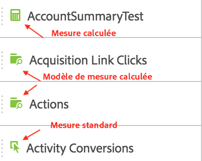
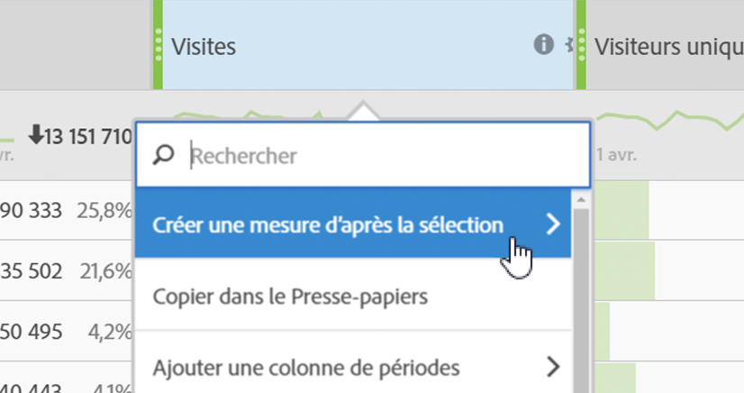

# Mesures

Dans Analysis Workspace, vous pouvez utiliser les mesures de deux façons.

Vous pouvez soit faire glisser les mesures standard, les mesures calculées ou les modèles de mesures calculées du menu [!UICONTROL Composants] au tableau :

> [!NOTE] Bien que cela paraisse simple, l’utilisation des mesures est plutôt performante. Vous pouvez ajouter des mesures à un rapport en faisant glisser la mesure appropriée vers la section des mesures d’un tableau. Vous pouvez également ventiler les dimensions par mesures, ce qui vous confère un contrôle précis au niveau de l’affichage du tableau. De plus, vous pouvez insérer une mesure sous forme de dimension et une dimension sous forme de mesure pour créer un rapport d’heures supplémentaires. Jouez avec les différents composants et voyez ce qu’ils vous proposent. Les possibilités sont infinies.

Ou cliquez sur **[!UICONTROL Composants]** > **[!UICONTROL Nouvelle mesure]**. Le [Créateur de mesures calculées](https://marketing.adobe.com/resources/help/fr_FR/analytics/calcmetrics/) s’ouvre, où vous pouvez personnaliser les mesures existantes.

Afin de faciliter la création rapide de mesures calculées, l’option **[!UICONTROL Créer une mesure d’après la sélection]** a été ajoutée au menu contextuel des colonnes dans les tableaux à structure libre. Cette option s’affiche lorsqu’une ou plusieurs cellules de colonne d’en-tête sont sélectionnées.

[Utilisation des mesures de participation sur YouTube](https://www.youtube.com/watch?v=ngmJHcg65o8&amp;list=PL2tCx83mn7GuNnQdYGOtlyCu0V5mEZ8sS&amp;index=32) (4:16)
