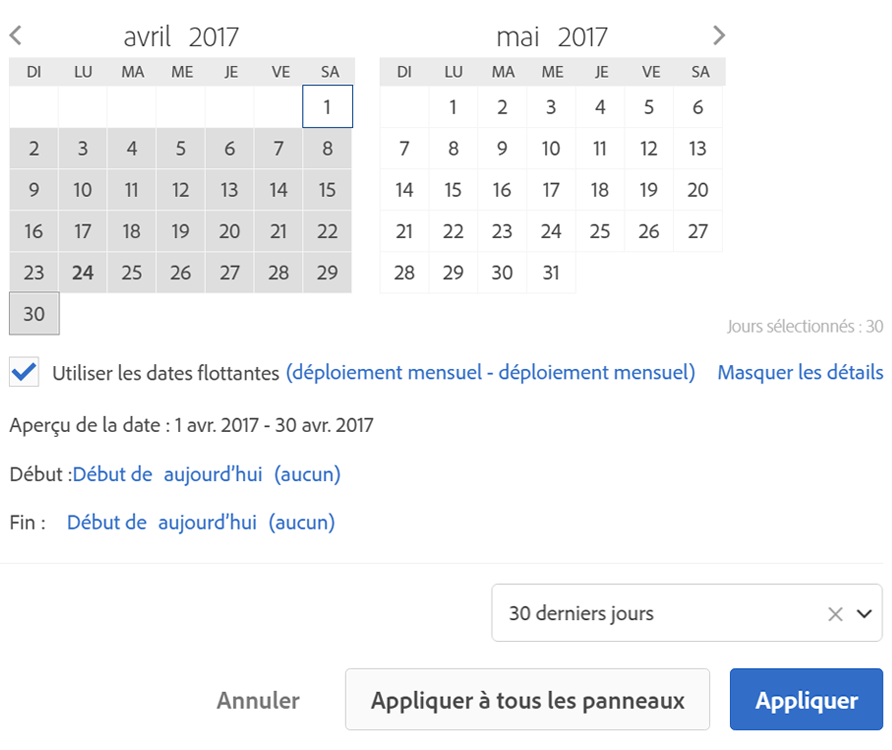

# Calendrier et plages de dates - Aperçu

Dans le calendrier, vous pouvez spécifier des dates et des plages de dates, ou sélectionner un paramètre prédéfini.

Les sélections du calendrier s’appliquent par défaut au panneau seulement, mais vous pouvez aussi les appliquer à l’ensemble des panneaux. Par défaut, le calendrier Workspace présente le mois en cours et le mois précédent.

Le premier clic démarre une sélection de plage de dates. Mettez en surbrillance la période dans l’une ou l’autre direction puis cliquez pour sélectionner la fin de la plage de dates. Si vous maintenez la touche `Shift` enfoncée (ou faites un clic droit) lorsque vous cliquez sur la première date, celle-ci est ajoutée à la plage.

Vous pouvez également faire glisser des dates (et des dimensions temporelles) dans un projet Workspace. Sélectionnez des jours, des semaines, des mois ou des années spécifiques ou encore une date variable.

[Utilisation des périodes et des calendriers dans Analysis Workspace sur YouTube](https://www.youtube.com/watch?v=L4FSrxr3SDA&amp;list=PL2tCx83mn7GuNnQdYGOtlyCu0V5mEZ8sS&amp;index=28) (4:07)

| Paramètre | Description |
|--- |--- |
| Jours sélectionnés | Jours/semaines/mois/années sélectionné(e)s. |
| Utiliser les dates de déploiement | Grâce aux dates de déploiement, vous pouvez générer un rapport dynamique qui recherche une période donnée, en amont ou en aval, en fonction de la date d’exécution du rapport. Si, par exemple, vous souhaitez générer en décembre un rapport sur toutes les commandes passées le mois dernier (d’après le champ Date de création), les commandes passées en novembre seront incluses dans le rapport. Si vous exécutez ce même rapport en janvier, vous verrez les commandes passées en décembre.  Aperçu de la date : indique quelle période englobe le calendrier variable.  Début : choisissez parmi : aujourd’hui, semaine en cours, mois en cours, trimestre en cours, année en cours.  Fin : choisissez parmi : aujourd’hui, semaine en cours, mois en cours, trimestre en cours, année en cours.  Pour consulter un exemple, suivez [ce lien](/help/analyze/analysis-workspace/components/calendar-date-ranges/custom-date-ranges.md). |
| Période | Permet de sélectionner une période prédéfinie. Par défaut : 30 derniers jours. |
| Appliquer à tous les panneaux | Permet de modifier la période sélectionnée pour le panneau en cours ainsi que pour tous les autres panneaux du projet. |
| Appliquer | Applique la période à ce panneau seulement. |
