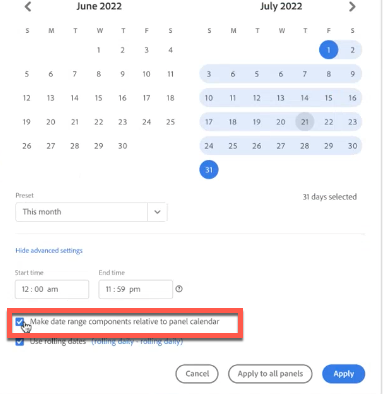

# Calendrier et périodes - Aperçu

Dans le calendrier, vous pouvez spécifier des dates et des périodes, ou sélectionner un paramètre prédéfini.

Regardez cette vidéo sur l’utilisation des périodes et des calendriers dans Analysis Workspace :

>[!VIDEO](https://video.tv.adobe.com/v/23973/?quality=12)

Les sélections du calendrier s’appliquent par défaut au panneau seulement, mais vous pouvez aussi les appliquer à l’ensemble des panneaux. Lorsque vous cliquez sur une période dans Workspace, l’interface affiche le mois civil en cours et le mois civil précédent. Vous pouvez ajuster ces deux calendriers en cliquant sur les flèches droite et gauche dans chaque coin supérieur respectif.

Le premier clic sur un calendrier démarre une sélection de période. Le deuxième clic termine une sélection de période, qui devient surlignée. Si la touche `Shift` est enfoncée (ou si un clic droit est utilisé), elle est ajoutée à la période actuellement sélectionnée.

Vous pouvez également faire glisser des dates (et des dimensions temporelles) dans un projet Workspace. Sélectionnez des jours, des semaines, des mois ou des années spécifiques ou encore une date variable.

[Utilisation des périodes et des calendriers dans Analysis Workspace](https://experienceleague.adobe.com/docs/analytics-learn/tutorials/analysis-workspace/calendar-and-date-ranges/using-dates-in-analysis-workspace.html?lang=fr) (4:07)

| Paramètre | Description |
|--- |--- |
| Jours sélectionnés | Jours/semaines/mois/années sélectionné(e)s. |
| Créer des composants de période par rapport au calendrier du panneau | Conserver la cohérence des dates en fonction de la période du panneau. |
| Utiliser les dates de déploiement | Grâce aux dates de déploiement, vous pouvez générer un rapport dynamique qui recherche une période donnée, en amont ou en aval, en fonction de la date d’exécution du rapport. Si, par exemple, vous souhaitez générer en décembre un rapport sur toutes les commandes passées le mois dernier (d’après le champ Date de création), les commandes passées en novembre seront incluses dans le rapport. Si vous exécutez ce même rapport en janvier, vous verrez les commandes passées en décembre.<ul><li>**[!UICONTROL Aperçu de la date]** : indique la période englobée par le calendrier variable.</li><li>**[!UICONTROL Début]** : choisissez parmi aujourd’hui, semaine en cours, mois en cours, trimestre en cours et année en cours.</li><li>**[!UICONTROL Fin]** : choisissez parmi aujourd’hui, semaine en cours, mois en cours, trimestre en cours et année en cours.</li></ul>Pour consulter un exemple, reportez-vous à la section [Périodes personnalisées](/help/analyze/analysis-workspace/components/calendar-date-ranges/custom-date-ranges.md).  Sélectionné par défaut. |
| Période | Permet de sélectionner une période prédéfinie. Par défaut : 30 derniers jours. **[!UICONTROL Cette semaine, ce mois, ce trimestre ou cette année (aujourd’hui non inclus)]** vous permet de choisir parmi des périodes qui n’incluent pas de données de la journée partielle d’aujourd’hui. |
| Appliquer à tous les panneaux | Permet de modifier la période sélectionnée pour le panneau en cours ainsi que pour tous les autres panneaux du projet. |
| Appliquer | Applique la période à ce panneau seulement. |

## À propos des plages de dates relatives au panneau {#relative-panel-dates}

Si vous travaillez dans Workspace, vous pouvez définir les composants de période par rapport au calendrier du panneau afin que les données prévisualisées dans le rail de gauche (ou dans les composants) soient basées sur la période du panneau. Trois cas d’utilisation courants où les dates de panneau relatives prennent effet sont les graphiques combinés, le résumé des mesures clés et les plages de dates du tableau à structure libre.

Pour utiliser des plages de dates de panneau relatives

1. Sélectionnez la **Workspace** .
1. Sélectionner **Projet vierge**.
1. Ajoutez des dimensions, des mesures et des segments à partir du rail de gauche.
1. Cliquez sur le champ de plage de dates du panneau pour activer/désactiver le paramètre de plage de dates relatif du panneau.
1. Sélectionner ou désélectionner **Définition des composants de période relatifs au calendrier du panneau**.
   * Sélectionnez l’option pour que les composants de période soient relatifs au calendrier du panneau.
   * Si vous désélectionnez cette option, les plages de dates du panneau (Résumé des mesures clés, Graphiques combinés ou Colonnes de dates violettes) ne se mettront pas à jour en cas de modification de la plage de dates du panneau. Il s’agit de l’utilisation par défaut.

   

1. Cliquez sur **Appliquer**.
Les dates relatives s’affichent dans le coin supérieur droit.

   