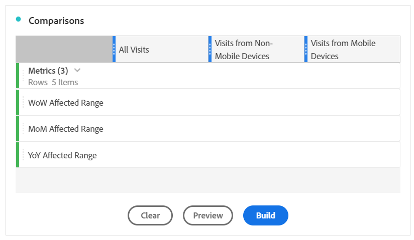

# Comparer les dates affectées par un aux plages précédentes

Si des données sont [affectées par une](/help/technotes/event-impacted.md), vous pouvez examiner les tendances historiques pour en évaluer l’impact. Cette comparaison est utile pour comprendre l’impact d’un sur vos données. Vous pouvez donc décider d’exclure les données, d’ajouter une note aux rapports ou de les ignorer.

## Créez une plage de dates qui inclut le  du

Créez une plage de dates qui englobe le  pour commencer à étudier l’impact de cette .

1. Accédez à **[!UICONTROL Components]** > **[!UICONTROL Date ranges]**.
2. Cliquez sur **[!UICONTROL Add]**.
3. Sélectionnez la période au cours de laquelle le  a eu lieu. Cliquez sur **[!UICONTROL Save]**.

   

##  les dates  et les plages précédentes similaires côte à côte

Vous pouvez comparer n’importe quelle mesure entre la plage de dates du  avec des plages de dates antérieures similaires à l’aide d’une visualisation de tableau à structure libre.

1. Ouvrez un projet Workspace et ajoutez la dimension &quot;Jour&quot; au tableau à structure libre. Appliquez la période récemment créée empilée sur une mesure, telle que Occurrences.

   

2. Cliquez avec le bouton droit sur la plage de dates, puis cliquez sur **[!UICONTROL Add time period column]** > **[!UICONTROL Custom date range to this date range]**.
   * Pour une comparaison semaine après semaine, sélectionnez la plage du  moins 7 jours. Assurez-vous que les jours de la semaine entre le  du et cette période sont alignés.
   * Pour une comparaison mois par mois, sélectionnez la plage du  du mois dernier. Vous pouvez également sélectionner la plage du  moins 28 jours si vous souhaitez aligner les jours de la semaine.
   * Pour une comparaison d’une année sur l’autre, sélectionnez la plage de l’ de l’année dernière.
3. Lorsque vous sélectionnez une plage de dates, elle est ajoutée à votre tableau à structure libre. Vous pouvez cliquer avec le bouton droit et ajouter autant de plages de dates que vous le souhaitez.

   

## Calculer les différences de pourcentage entre le  de et les plages précédentes similaires

Comparez les valeurs de dimension entre une plage de dates  et des plages de dates antérieures similaires à l’aide d’une visualisation de tableau à structure libre. Ces étapes illustrent un exemple semaine après semaine que vous pouvez suivre.

1. Ouvrez un projet Workspace et ajoutez une dimension **non temporelle** au tableau à structure libre. Par exemple, vous pouvez utiliser la dimension &quot;Type de périphérique mobile&quot;. Appliquez la période récemment créée empilée sur une mesure, telle que Occurrences :

   

2. Cliquez avec le bouton droit sur la plage de dates, puis cliquez sur **[!UICONTROL Compare time periods]** > **[!UICONTROL Custom date range to this date range]**. Sélectionnez la plage du  moins 7 jours. Assurez-vous que les jours de la semaine entre le  du et cette période sont alignés.

   

3. Renommez la mesure Changement de pourcentage en une mesure plus spécifique, telle que &quot;Plage affectée par WoW&quot;. Cliquez sur l’icône d’informations, puis sur le crayon d’édition pour modifier le nom de la mesure.

   

4. Répétez les étapes 3 et 4 pour les comparaisons d’un mois à l’autre et d’une année à l’autre. Vous pouvez effectuer cette action dans le même tableau ou dans des tableaux distincts.

## Analyser les plages de dates de comparaison côte à côte sous forme de lignes

Si vous souhaitez analyser plus en détail les changements de pourcentage ci-dessus, vous pouvez les convertir en lignes.

1. Ajouter une visualisation de tableau à structure libre et activez le créateur de tableaux. Cette action vous permet de placer les mesures de changement de pourcentage dans l’ordre souhaité.
2. Maintenez la touche `Ctrl` (Windows) ou `Cmd` (Mac) enfoncée et faites glisser les 3 % de modification des mesures dans les lignes du tableau, une par une.

   

3. Ajouter le segment &quot;Toutes les visites&quot; dans la colonne du tableau, ainsi que tout autre segment souhaité.

   

4. Cliquez sur **[!UICONTROL Build]**. Dans le tableau qui en résulte, vous pouvez les plages affectées par rapport à la semaine, au mois et à l’année précédents pour tous les segments de votre choix.

   
