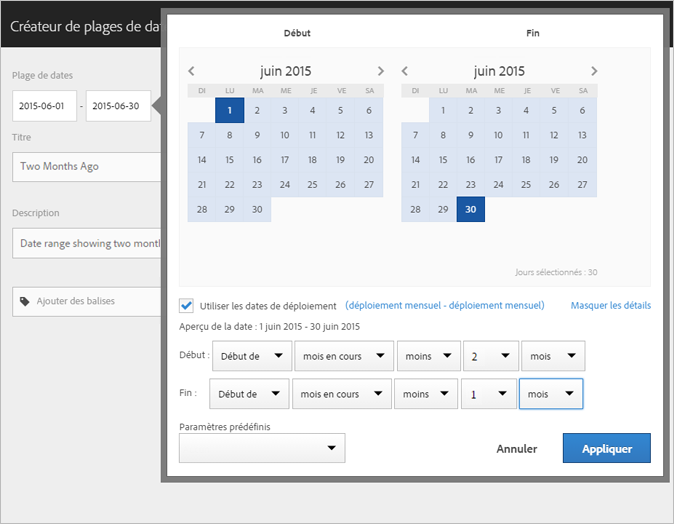
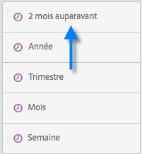
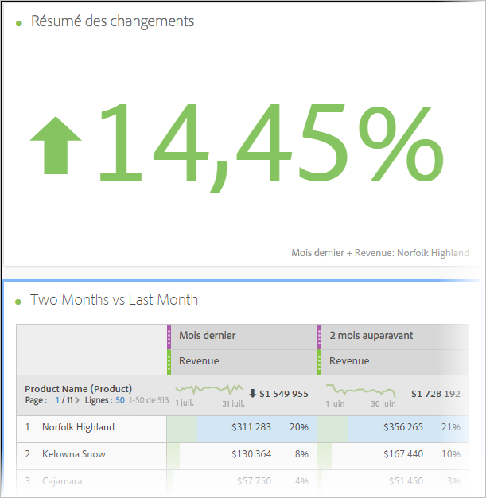
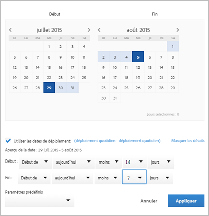

# Création de périodes personnalisées

Vous pouvez créer des périodes personnalisées dans Analysis Workspace et les enregistrer sous la forme de composants de type Heure.

Pour plus d’informations sur l’ajout de périodes existantes à un projet, voir [Vue d’ensemble du calendrier et des périodes](/help/analyze/analysis-workspace/components/calendar-date-ranges/calendar.md).

Pour créer une période personnalisée, procédez comme suit :

1. Dans Adobe Analytics, sélectionnez **[!UICONTROL Composants]** > **[!UICONTROL Périodes]**.

   

1. Sélectionnez [!UICONTROL **Créer une période**].

1. Dans le créateur de périodes, spécifiez les informations suivantes :

   | Option | Description |
   |---------|----------|
   | [!UICONTROL **Titre**] | Titre de la période tel qu’il apparaîtra lorsque les utilisateurs et utilisatrices la sélectionneront dans Analysis Workspace. |
   | [!UICONTROL **Description**] | Description de la période. |
   | [!UICONTROL **Balises**] | Toutes les balises à appliquer à la période. |
   | [!UICONTROL **Période**] | Permet de sélectionner une période personnalisée. Par défaut, les 30 derniers jours sont sélectionnés. |
   | [!UICONTROL **Paramètre prédéfini**] | Faites votre choix dans une liste de périodes prédéfinies, par exemple [!UICONTROL **Hier**], [!UICONTROL **7 derniers jours**], [!UICONTROL **30 derniers jours**], etc. |
   | [!UICONTROL **Heure de début**] | Heure de la journée de début de la période. |
   | [!UICONTROL **Heure de fin**] | Heure de la journée de fin de la période. |
   | [!UICONTROL **Utiliser les dates flottantes**] | Grâce aux dates de déploiement, vous pouvez générer un rapport dynamique qui recherche une période donnée, en amont ou en aval, en fonction de la date d’exécution du rapport. Si, par exemple, vous souhaitez générer en décembre un rapport sur toutes les commandes passées le mois dernier (d’après le champ Date de création), les commandes passées en novembre seront incluses dans le rapport. Si vous exécutez ce même rapport en janvier, vous verrez les commandes passées en décembre.<ul><li>**[!UICONTROL Aperçu de la date]** : indique la période englobée par le calendrier variable.</li><li>**[!UICONTROL Début]** : choisissez parmi aujourd’hui, semaine en cours, mois en cours, trimestre en cours et année en cours.</li><li>**[!UICONTROL Fin]** : choisissez parmi aujourd’hui, semaine en cours, mois en cours, trimestre en cours et année en cours.</li></ul> Sélectionné par défaut. |

1. Sélectionnez [!UICONTROL **Enregistrer**].

## Exemple : période pour « deux mois auparavant » {#section_C4109C57CB444BB2A79CC8082BD67294}

La période personnalisée suivante présente une période pour « deux mois auparavant », avec une visualisation Synthèse des changements présentant le changement directionnel.

La plage de dates personnalisée s’affiche au haut du panneau du composant [!UICONTROL Plage de dates] dans votre projet :

Vous pouvez la faire glisser dans une colonne le long d’une plage de dates variable mensuelle personnalisée, en utilisant pour comparaison le paramètre prédéfini Mois dernier. Ajoutez une visualisation Synthèse des changements et sélectionnez les totaux de chaque colonne pour afficher le changement directionnel :

## Exemple : utiliser une période variable de 7 jours {#section_7EF63B2E9FF54D2E9144C4F76956A8DD}

Vous pouvez créer une période qui spécifie un créneau variable de 7 jours qui s’est terminé il y a une semaine :

Utilisez *`rolling daily`*.

* Le paramètre Début correspondrait à *`current day minus 6 days`*.

* Le paramètre Fin correspondrait à *`current day minus 7 days`*.

Cette période peut être un composant que vous faites glisser sur un tableau à structure libre.
