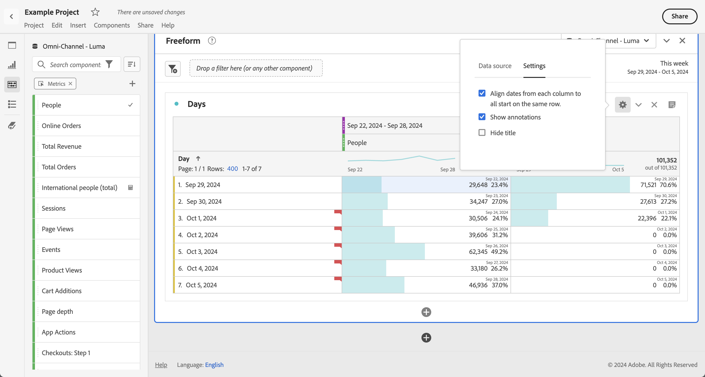

# Comparaison des dates

Dans Analysis Workspace, appliquez une comparaison de dates commune à partir de n’importe quelle colonne contenant une période, par exemple : année par année, trimestre par trimestre, mois par mois, etc.

## Comparer des périodes

Une analyse ne peut pas avoir lieu sans contexte. Il arrive souvent que ce contexte découle d’une période précédente. Par exemple, la question *Dans quelle mesure votre situation est-elle meilleure ou pire qu’à la même époque l’année dernière ?* est essentielle pour bien comprendre vos activités. La comparaison des dates inclut automatiquement une colonne *différence*, qui présente le pourcentage de changement par rapport à une période donnée.

1. Créez un [tableau à structure libre](/help/analyze/analysis-workspace/visualizations/freeform-table/freeform-table.md), avec les dimensions et mesures à comparer sur une certaine période.
1. Ouvrez le menu contextuel d’une ligne de tableau et sélectionnez **[!UICONTROL Comparer des périodes]**.

   

   >[!NOTE]
   >
   >Cette option de menu contextuelle est désactivée pour les lignes de mesures, de périodes et de dimension temporelle.

1. Selon la façon dont sont définies les périodes du tableau, les options de comparaison suivantes sont disponibles :

   | Option | Description |
   |---|---|
   | **[!UICONTROL *x* semaines/mois/trimestres/années précédant cette période]** | Compare à la période sélectionnée immédiatement avant cette période. |
   | **[!UICONTROL Ces x semaines/mois/trimestres/années l’an dernier à cette période]** | Compare les données à la même période il y a un an. |
   | **[!UICONTROL Période personnalisée à cette période]** | Permet de définir une période personnalisée. |

   >[!NOTE]
   >
   >Lorsque vous sélectionnez un nombre de jours personnalisé (par exemple, du 7 au 20 octobre, soit 14 jours), seules deux options sont proposées : **[!UICONTROL 14 jours précédant cette période]** et **[!UICONTROL Période personnalisée à cette période]**.

1. La comparaison qui en résulte ressemble à ceci :

   

   Les lignes dans la colonne Pourcentage de modification sont en rouge pour les valeurs négatives et en vert pour les valeurs positives.

## Ajouter une colonne de périodes à la comparaison

Vous pouvez désormais ajouter une période à chaque colonne d’un tableau, ce qui permet d’ajouter une période différente de celle configurée pour votre calendrier.

1. Cliquez avec le bouton droit de la souris dans le tableau, puis sélectionnez **[!UICONTROL Ajouter une colonne de périodes]**.

   

1. Selon la façon dont sont définies les périodes du tableau, les options de comparaison suivantes sont disponibles :

   | Option | Description |
   |---|---|
   | **[!UICONTROL *x* semaines/mois/trimestres/années précédant cette période]** | Ajoute une colonne avec la semaine/le mois/etc. précédant immédiatement cette période. |
   | **[!UICONTROL Ces *x* semaines/mois/trimestres/années l’année dernière à cette période]** | Ajoute la même période il y a un an. |
   | **[!UICONTROL Période personnalisée à cette période]** | Permet de créer une période personnalisée. |

   >[!NOTE]
   >
   >Lorsque vous sélectionnez un nombre de jours personnalisé (par exemple, du 7 au 20 octobre, soit 14 jours), seules deux options sont proposées : **[!UICONTROL 14 jours précédant cette période]** et **[!UICONTROL Période personnalisée à cette période]**.

1. La période est insérée en haut de la colonne sélectionnée :

   

1. Vous pouvez ajouter autant de colonnes que vous le souhaitez, et mélanger et associer différentes périodes :

1. Vous pouvez également trier chaque colonne, ce qui change l’ordre des jours selon la colonne utilisée pour le tri.

## Aligner les dates de colonnes pour commencer sur la même ligne

Vous pouvez également aligner les dates de chaque colonne afin qu’elles commencent à partir de la même ligne.

Par exemple, vous effectuez une comparaison jour par jour pour la dernière semaine (se terminant le 5 octobre 2024) et la semaine précédente. Par défaut, la colonne de gauche commence par le 22 septembre et la colonne de droite par le 29 septembre.

Vous pouvez activer l’option **[!UICONTROL Aligner les dates de chaque colonne pour qu’elles commencent toutes sur la même ligne]** dans [Paramètres](/help/analyze/analysis-workspace/visualizations/freeform-table/freeform-table.md#settings-1) pour que la visualisation du tableau à structure libre aligne les dates des colonnes pour qu’elles commencent sur la même ligne.

Tenez compte des points suivants lorsque vous utilisez cette option :

* Ce paramètre est activé par défaut pour tous les nouveaux projets.

* Ce paramètre s’applique à l’ensemble du tableau. Par exemple, si vous modifiez ce paramètre pour une répartition au sein du tableau, le paramètre est appliqué pour l’ensemble du tableau.

<!--
# Date comparison

Date comparison in Analysis Workspace lets you take any column containing a date range and create a common date comparison, such as: year-over-year, quarter-over-quarter, month-over-month, etc.

>[!BEGINSHADEBOX]

See  [Date comparison](https://video.tv.adobe.com/v/30753?quality=12&learn=on){target="_blank"} for a demo video.

>[!ENDSHADEBOX]

## Compare time periods {#section_C4E36BFE0F5C4378A74E705747C9DEE4}

>[!NOTE]
>[!UICONTROL Compare Time Periods] leverages advanced Calculated Metrics. As a result, it is available only to customers with Analytics Select, Prime, and Ultimate SKUs. 

Analysis requires context, and often that context is provided by a previous time period. For example, the question "How much better or worse are we doing than at this time last year?" is fundamental to understanding your business. Date Comparison automatically include a "difference" column, which shows the percentage change compared to a specified time period.

1. Create a Freeform table, with any dimensions and metrics you want to compare over a time period.
1. Right-click a table row and select **[!UICONTROL Compare time periods]**.

   

   >[!NOTE]
   >
   >This right-click option is disabled for metric rows, date range rows, and time dimension rows.

1. Depending on how you have set the table's date range, you have these options for comparison: 

   |  Option  | Description  |
   |---|---|
   | **[!UICONTROL Prior week/month/quarter/year to this date range]** | Compares to the week/month/etc. immediately before this date range.  |
   | **[!UICONTROL This week/month/quarter/year last year to this date range]** | Compares to the same date range a year ago.  |
   | **[!UICONTROL Custom date range to this date range]** | Lets you select a custom date range.  |

   >[!NOTE]
   >
   >When you select a custom number of days, for example October 7 - October 20 (a 14-day range), you will get only 2 options: **[!UICONTROL Prior 14 days before this date range]**, and **[!UICONTROL Custom date range to this date range]**.

1. The resulting comparison looks like this:

   

   Rows in the Percent Change column appear red for negative values and green for positive values.

1. (Optional) As in any other Workspace projects, you can create visualizations based on these time comparisons. For example, here is a Bar graph:

   

   Note that in order to show the percentage change in the bar chart, you have to have the [!UICONTROL Percentages] setting checked in the [!UICONTROL Visualization Settings].

## Add a time period column for comparison {#section_93CC2B4F48504125BEC104046A32EB93}

You can now add a time period to each column in a table, enabling you to add a time period that is different from the one your calendar is set to. This is another way you can compare dates.

1. Right-click a column in the table and select **[!UICONTROL Add time period column]**. 

   

1. Depending on how you have set the table's date range, you have these options for comparison: 

   |  Option  | Description  |
   |---|---|
   | **[!UICONTROL Prior week/month/quarter/year to this date range]** | Adds a column with the week/month/etc. immediately before this date range.  |
   | **[!UICONTROL This week/month/quarter/year last year to this date range]** | Adds the same date range a year ago.  |
   | **[!UICONTROL Custom date range to this date range]** | Lets you select a custom date range.  |

   >[!NOTE]
   >
   >When you select a custom number of days, for example October 7 - October 20 (a 14-day range), you will get only 2 options: **[!UICONTROL Prior 14 days before this date range]**, and **[!UICONTROL Custom date range to this date range]**.

1. The time period will be inserted on top of the column you selected:

   

1. You can add as many time columns as you want, as well as mix and match different date ranges:

   

1. In addition, you can sort on each column, which will change the order of days depending on the column you are sorting on.

## Align column dates to start on the same row {#section_5085E200082048CB899C3F355062A733}

You can align the dates from each column to all start on the same row. 

For example, when you choose to align the dates, if you do a month-over-month comparison between October and September 2016, the left column will start with October 1 and the right column will start with September 1:

>[!NOTE]
>
>Consider the following when using this option:
>
>* This setting is enabled by default for all new projects.
>
>* This setting applies to the entire table. For example, if you change this setting for a breakdown within the table, it will change the setting for the entire table.
>

To enable this setting, if it is not already enabled:

1. In the table where you want to align column dates, select the **Settings** icon in the table header.

1. On the [!UICONTROL **Settings**] tab, select **[!UICONTROL Align Dates from each column to all start on the same row (applies to entire table)]**.

-->