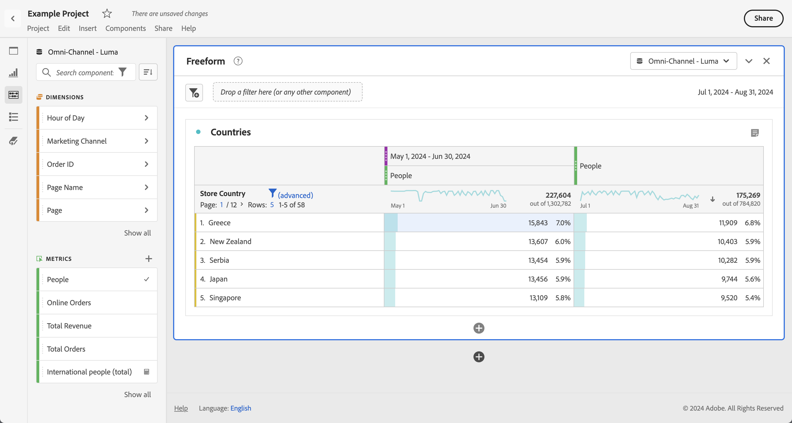

# Comparaison de dates

Dans Analysis Workspace, appliquez une comparaison des dates commune à partir de n’importe quelle colonne contenant une plage de dates, par exemple : année par année, trimestre par trimestre, mois par mois, etc.

## Comparaison des périodes {#section_C4E36BFE0F5C4378A74E705747C9DEE4}

Une analyse ne peut pas avoir lieu sans contexte. Il arrive souvent que ce contexte découle d’une période précédente. Par exemple, la question « Où nous situons-nous par rapport à la même date l’an dernier ? Mieux ou pire ? » est essentielle pour bien comprendre vos activités. La comparaison des dates inclut automatiquement une colonne « différence », qui présente le pourcentage de changement par rapport à une période donnée.

1. Créez un tableau à structure libre, avec les dimensions et mesures à comparer sur une certaine période.
1. Cliquez avec le bouton droit de la souris dans une ligne de tableau, puis sélectionnez **[!UICONTROL Comparer des périodes]**.

   

   >[!IMPORTANT]
   >
   >Cette option de clic droit est désactivée pour les lignes de mesures, les lignes de plage de dates et les lignes de dimension temporelle.

1. Selon la façon dont sont définies les plages de dates du tableau, les options de comparaison suivantes sont disponibles :

   | Option | Description |
   |---|---|
   | **[!UICONTROL Semaine/Mois/Trimestre/Année précédent(e) à cette période]** | Compare les données à la semaine/au mois/etc. précédant immédiatement cette plage de dates. |
   | **[!UICONTROL Cette semaine/ce mois/ce trimestre/cette année l’an dernier]** | Compare les données à la même période il y a un an. |
   | **[!UICONTROL Sélectionner une plage]** | Permet de sélectionner une plage de dates personnalisée. |

   >[!NOTE]
   >
   >When you select a custom number of days, for example October 7 - October 20 (a 14-day range), you will get only 2 options: **[!UICONTROL Prior 14 days before this date range]**, and **[!UICONTROL Select range]**.

1. La comparaison qui en résulte ressemble à ceci :

   

   Les lignes dans la colonne Pourcentage de changement sont en rouge pour les valeurs négatives et en vert pour les valeurs positives.

1. (Facultatif) Comme dans n’importe quel autre projet Analysis Workspace, vous pouvez créer des visualisations en fonction de ces comparaisons temporelles. Voici par exemple un graphique en barres :

   

   Pour afficher le pourcentage de changement dans ce graphique à barres, le paramètre [!UICONTROL Pourcentages] doit être activé dans les [!UICONTROL Paramètres de visualisation].

## Add a time period column for comparison {#section_93CC2B4F48504125BEC104046A32EB93}

Vous pouvez désormais ajouter une période à chaque colonne d’un tableau, ce qui permet d’ajouter une période différente de celle configurée pour votre calendrier. Cette fonctionnalité offre un autre moyen de comparer les dates.

1. Cliquez avec le bouton droit de la souris dans le tableau, puis sélectionnez **[!UICONTROL Ajouter une colonne de périodes.]**

1. Selon la façon dont sont définies les plages de dates du tableau, les options de comparaison suivantes sont disponibles :

   | Option | Description |
   |---|---|
   | **[!UICONTROL Semaine/Mois/Trimestre/Année précédent(e) à cette période]** | Ajoute une colonne avec la semaine/le mois/etc. précédant immédiatement cette plage de dates. |
   | **[!UICONTROL Cette semaine/ce mois/ce trimestre/cette année l’an dernier]** | Ajoute la même période il y a un an. |
   | **[!UICONTROL Sélectionner une plage]** | Permet de sélectionner une plage de dates personnalisée. |

   >[!NOTE]
   >
   >When you select a custom number of days, for example October 7 - October 20 (a 14-day range), you will get only 2 options: **[!UICONTROL Prior 14 days before this date range]**, and **[!UICONTROL Select range]**.

1. La période sera insérée en haut de la colonne sélectionnée :

   

1. Vous pouvez ajouter autant de colonnes que vous le souhaitez, et mélanger et associer différentes périodes :

   

1. Vous pouvez également trier chaque colonne, ce qui change l’ordre des jours selon la colonne utilisée pour le tri.

## Align column dates to start on same row {#section_5085E200082048CB899C3F355062A733}

A new setting for all tables lets you **[!UICONTROL Align Dates from each column to all start on the same row (applies to entire table)]**. « S’applique à l’ensemble du tableau » signifie que si, par exemple, vous définissez ce paramètre pour la ventilation des données d’un tableau, il s’applique également au reste du tableau.

>[!IMPORTANT]
>
>This setting is **disabled** (unchecked) for all existing projects and **enabled** (checked) for all new projects.

Exemple : si vous harmonisez les dates dans le cadre d’une comparaison d’un mois à l’autre entre octobre et septembre 2016, la colonne de gauche commence au 1er octobre et la colonne de droite au 1er septembre :

<!-- 

See Jonny Moon's email from November 3. 

 -->

