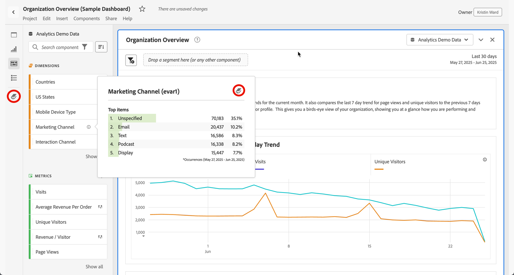

# Présentation du dictionnaire de données {#data-dictionary-overview}

<!-- markdownlint-disable MD034 -->

>[!CONTEXTUALHELP]
>id="component_datadictionary"
>title="Dictionnaire de données"
>abstract="Le dictionnaire de données aide les utilisateurs et utilisatrices, ainsi que les administrateurs et administratrices, à suivre et à mieux comprendre les composants dans leur environnement Analytics.  Les administrateurs et administratrices d’Analytics sont chargés de traiter les informations sur chaque composant du dictionnaire de données."

<!-- markdownlint-enable MD034 -->

Le dictionnaire de données d’Analysis Workspace permet aux utilisateurs et utilisatrices, et aux administrateurs et administratrices, de suivre et de mieux comprendre les composants dans leur environnement Analytics.

Les administrateurs et administratrices d’Analytics sont responsables du traitement des informations de chaque composant dans le dictionnaire de données pour les mettre à la disposition des utilisateurs et utilisatrices.

>[!BEGINSHADEBOX]

Consultez  [Dictionnaire de données pour Analysis Workspace](https://video.tv.adobe.com/v/3418028/?quality=12&learn=on){target="_blank"} pour une vidéo de démonstration.

>[!ENDSHADEBOX]

## Avantages pour les utilisateurs et utilisatrices

Le dictionnaire de données permet aux utilisateurs et utilisatrices de mieux comprendre chaque composant disponible.

Les informations disponibles dans le dictionnaire de données incluent :

* Fonction et utilisation prévue d’un composant.

* Composants généralement utilisés avec celui que vous consultez.

* Composants similaires à celui que vous consultez.

* Si un composant est approuvé par l’administrateur ou l’administratrice système.

Pour plus d’informations sur l’accès au dictionnaire de données et sur les informations qu’il contient, voir [Afficher des informations sur les composants dans le dictionnaire de données](view-data-dictionary.md).

## Avantages pour les administrateurs et administratrices

Le dictionnaire de données permet aux administrateurs et administratrices système de suivre et de traiter les composants dans leur environnement Analytics.

Les administrateurs et administratrices d’Analytics peuvent utiliser le dictionnaire de données à ces fins :

* Identifier les composants en double qui doivent être consolidés.

* Identifier les composants qui ne collectent aucune donnée afin qu’ils puissent être mis à jour ou supprimés.

* Identifier les composants qui ne sont pas encore approuvés.

* Mettre à jour les descriptions des composants directement dans Analysis Workspace. Toutes les mises à jour apportées aux descriptions des composants dans le dictionnaire de données sont répercutées dans la suite de rapports.

  De même, toutes les mises à jour apportées aux descriptions des composants dans la suite de rapports sont répercutées dans Analysis Workspace.

  Pour plus d’informations sur l’ajout de descriptions de composant dans Analysis Workspace ou dans une suite de rapports, voir [ Ajouter des descriptions de composant ](/help/analyze/analysis-workspace/components/add-component-descriptions.md).

## Accéder au dictionnaire de données

Vous pouvez accéder au dictionnaire de données de l’une des manières suivantes dans Analysis Workspace :

* À partir de  dans le panneau de bouton.

* À partir de  dans la fenêtre contextuelle d’informations d’un composant.

Pour des informations détaillées sur les différentes options disponibles dans le dictionnaire de données, voir [Afficher des informations sur les composants dans le dictionnaire de données](view-data-dictionary.md).

## Mettre à jour et traiter le dictionnaire de données

Les administrateurs et administratrices d’Adobe Analytics sont chargés de mettre à jour un dictionnaire de données intègre pour leur entreprise, comme décrit dans la section [Surveiller l’intégrité du dictionnaire de données](monitor-data-dictionary-health.md).

Dans le cadre de ce processus, les administrateurs et administratrices d’Adobe Analytics peuvent modifier des informations sur chaque composant du dictionnaire de données, comme décrit dans la section [Modifier les entrées de composant dans le dictionnaire de données](edit-entries-data-dictionary.md).

## Déplacer, réduire ou fermer le dictionnaire de données

Lorsque vous ouvrez le dictionnaire de données (comme décrit dans [Accéder au dictionnaire de données](#access-the-data-dictionary)), il s’affiche sous la forme d’une fenêtre par-dessus Analysis Workspace.

Vous pouvez manipuler la fenêtre du dictionnaire de données de l’une des manières suivantes :

* Faites-la glisser dans n’importe quelle zone d’Analysis Workspace.

  Si vous fermez et rouvrez Analysis Workspace, la fenêtre du dictionnaire de données reste à l’emplacement où vous l’avez déplacée pour la dernière fois. <!--True?-->

* Réduisez la fenêtre.

  Une fois réduit, le dictionnaire de données s’affiche sous la forme d’un onglet bleu dans le coin inférieur droit d’Analysis Workspace.

  Lorsque vous sélectionnez l’onglet bleu, le dictionnaire de données s’ouvre sur le composant que vous avez consulté le plus récemment.

* Fermez la fenêtre.

<!--
# Data Dictionary overview

The Data Dictionary in Analysis Workspace helps both users and administrators keep track of and better understand the components in their Analytics environment.   

Analytics administrators are responsible for curating information about each component in the Data Dictionary to make it available to users.

>[!BEGINSHADEBOX]

See  [Data dictionary](https://video.tv.adobe.com/v/3418028?quality=12&learn=on){target="_blank"} for a demo video.

>[!ENDSHADEBOX]

## Benefits for users

The Data Dictionary helps users gain a better understanding of each component that is available to them. 

Information available in the Data Dictionary includes: 

* A component's function and intended use

* Components typically used with the one you are viewing

* Components that are similar to the one you are viewing

* Whether a component is approved by the system administrator 

For information about how to access the Data Dictionary and for details about the information it contains, see [View component information in the Data Dictionary](/help/analyze/analysis-workspace/components/data-dictionary/view-data-dictionary.md).

## Benefits for administrators

The Data Dictionary helps system administrators keep track of and curate the components in their Analytics environment. 

Following are some of the ways Analytics administrators can use the Data Dictionary: 

* Identify duplicate components that need to be consolidated.

* Identify components that aren't collecting any data so they can be either updated or deleted.

* Identify components that are not yet approved.

* Update component descriptions directly in Analysis Workspace. Any updates made to component descriptions in the Data Dictionary are reflected in the Report Suite.

  Similarly, any updates made to component descriptions in the Report Suite are reflected in Analysis Workspace.

  For more information about adding component descriptions in either Analysis Workspace or in a Report Suite, see [Add component descriptions](/help/analyze/analysis-workspace/components/add-component-descriptions.md).

## Access the Data Dictionary

You can access the Data Dictionary in any of the following ways within Analysis Workspace:

* From the **Data Dictionary** icon in the left rail.

  

* From the **Data Dictionary** icon within the info popover of a component. 

  

For detailed information about the various options available in the Data Dictionary, see [View component information in the Data Dictionary](/help/analyze/analysis-workspace/components/data-dictionary/view-data-dictionary.md).

## Update and curate the Data Dictionary

Analytics administrators are responsible for maintaining a healthy Data Dictionary for their organization, as described in [Monitor Data Dictionary Health](/help/analyze/analysis-workspace/components/data-dictionary/monitor-data-dictionary-health.md).

As part of this process, Analytics administrators can edit information about each component in the data dictionary, as described in [Edit component entries in the Data Dictionary](/help/analyze/analysis-workspace/components/data-dictionary/edit-entries-data-dictionary.md).

## Move, minimize, or close the Data Dictionary

When you open the Data Dictionary (as described in [Access the Data Dictionary](#access-the-data-dictionary)), it displays as a window on top of Analysis Workspace. 

You can manipulate the Data Dictionary window in any of the following ways:

* Drag it to any area within Analysis Workspace 

  If you close and re-open Analysis Workspace, the Data Dictionary window remains in the location where you last moved it.

* Minimize it

  When minimized, the Data Dictionary appears as a blue tab in the lower-right corner of Analysis Workspace.

  When you select the blue tab, the Data Dictionary opens to the component you were most recently viewing. 

* Close it

-->