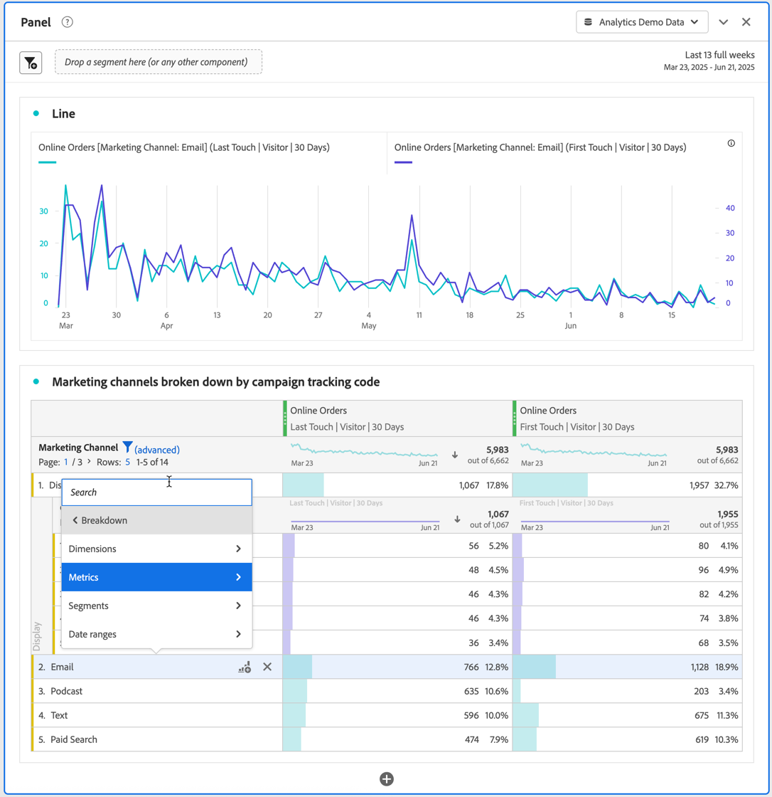
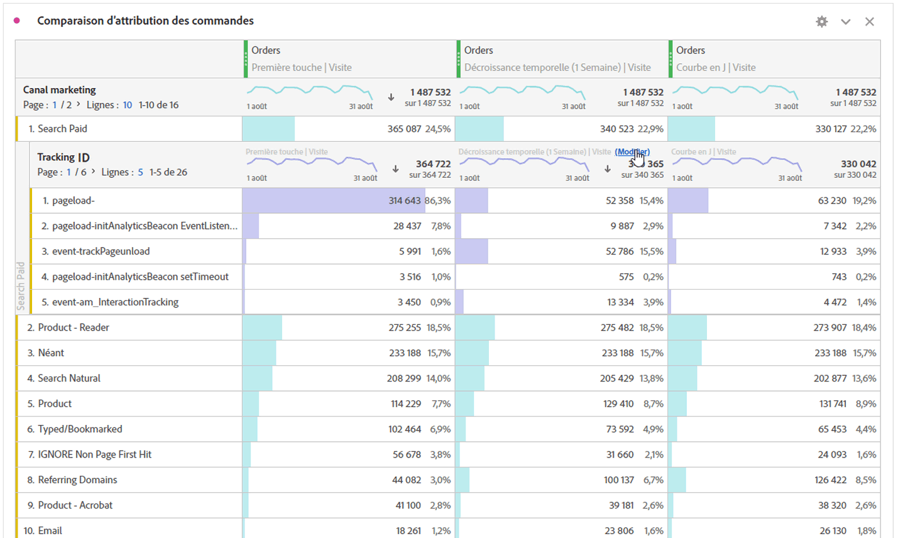

# Ventilation des dimensions

Vous pouvez ventiler vos données dans Analysis Workspace de différentes manières, en fonction de vos besoins spécifiques. Vous pouvez créer des requêtes à l’aide de mesures, dimensions, segments, chronologies pertinents et autres valeurs de répartition d’analyse.

1. Dans un [tableau à structure libre](/help/analyze/analysis-workspace/visualizations/freeform-table/freeform-table.md), dans le menu contextuel d’une ou de plusieurs lignes sélectionnées, sélectionnez **[!UICONTROL Répartition]** .

   

1. Dans le sous-menu, sélectionnez **[!UICONTROL Dimensions]**, **[!UICONTROL Mesures]**, **[!UICONTROL Segments]** ou **[!UICONTROL Périodes]** puis sélectionnez un élément. Vous pouvez également simplement rechercher un composant dans le champ **[!UICONTROL *Rechercher *]**.

Vous pouvez ventiler les mesures par éléments de dimension ou segments d’audience sur plusieurs périodes sélectionnées. Vous pouvez également approfondir l’analyse à un niveau plus détaillé.

>[!NOTE]
>
>Vous ne pouvez pas afficher plus de 200 répartitions dans le tableau. Cette limite augmente dans le cas de l’exportation des répartitions.

## Répartition par position

Par défaut, les répartitions sont fixées aux éléments de ligne statiques. Par exemple, imaginons que vous répartissiez les éléments de la dimension 3 premières pages (page d’accueil, résultats de recherche et passage en caisse) par canal marketing. Ensuite, vous quittez le projet et revenez deux semaines plus tard. Lors de la réouverture du projet, les 3 premières pages ont changé. Désormais, la page d’accueil, les résultats de recherche et le passage en caisse figurent sur les 4 à 6 premières pages. Par défaut, vos répartitions de canal marketing apparaissent toujours sous Page d’accueil, Résultats de la recherche et Passage en caisse, même si elles se trouvent désormais dans les lignes 4 à 6.

En revanche, la **Répartition par position** répartit toujours les 3 premiers éléments, quelle que soit la nature de ces éléments. Pour revenir à l’exemple, lorsque vous rouvrez votre projet, les répartitions des canaux marketing sont liées aux 3 premières pages du tableau. Et non sur la page d’accueil, les résultats de recherche et le passage en caisse, qui se trouvent désormais dans les lignes 4 à 6. Voir [Paramètres de ligne](/help/analyze/analysis-workspace/visualizations/freeform-table/column-row-settings/table-settings.md) comment configurer ce paramètre.

## Application des modèles d’attribution aux répartitions

Il est également possible d’appliquer n’importe quel modèle d’attribution à n’importe quelle répartition dans un tableau. Ce modèle d’attribution peut être identique ou non à la colonne parente. Par exemple, vous pouvez analyser les Commandes linéaires au niveau de la dimension de vos canaux marketing, mais appliquer les Commandes en forme de U aux codes de suivi spécifiques au sein d’un canal. Pour modifier le modèle d’attribution appliqué à une répartition, placez le pointeur de la souris sur le modèle de répartition et sélectionnez **[!UICONTROL Modifier]**.

Voici le comportement attendu lors de l’application des modèles d’attribution aux répartitions ou de leur modification :

* Si vous appliquez une attribution lorsqu’il n’en existe aucune autre, celle-ci s’applique à l’ensemble de l’arborescence des colonnes.

* Si vous ajoutez une répartition après l’application d’une attribution, elle utilise la valeur par défaut de la répartition donnée qui a été ajoutée (si cette dimension comporte une valeur par défaut). Sinon, elle utilisera la répartition de la colonne parente. Certaines dimensions disposent d’une attribution par défaut. Par exemple, les dimensions de temps et le référent utilisent la même touche. La dimension Produit utilise la dernière touche. Les autres dimensions ne disposent pas de valeur par défaut et utiliseront l’attribution de la colonne parente.

* Si des attributions sont déjà disponibles dans l’arborescence des colonnes, la modification de l’attribution n’a un impact que sur celle que vous modifiez.

>[!BEGINSHADEBOX]

Voir  [Dimension dans Analysis Workspace](https://video.tv.adobe.com/v/23971?quality=12&learn=on){target="_blank"} pour une vidéo de démonstration.

>[!ENDSHADEBOX]

>[!BEGINSHADEBOX]

Voir  [Répartitions de Dimension](https://video.tv.adobe.com/v/23969?quality=12&learn=on){target="_blank"} pour une vidéo de démonstration.

>[!ENDSHADEBOX]

>[!BEGINSHADEBOX]

Voir  [Ajout de dimensions et de mesures](https://video.tv.adobe.com/v/30606?quality=12&learn=on){target="_blank"} pour une vidéo de démonstration.

>[!ENDSHADEBOX]

>[!BEGINSHADEBOX]

Voir  [Utilisation des dimensions dans un tableau à structure libre](https://video.tv.adobe.com/v/40179?quality=12&learn=on){target="_blank"} pour une vidéo de démonstration.

>[!ENDSHADEBOX]

>[!BEGINSHADEBOX]

Voir  [Répartition des Dimension par position](https://video.tv.adobe.com/v/24033){target="_blank"} pour une vidéo de démonstration.

>[!ENDSHADEBOX]

<!--
# Break down dimensions

Break down dimensions and dimension items in Analysis Workspace.

Break down your data in unlimited ways for your specific needs; build queries using relevant metrics, dimensions, segments, time lines, and other analysis breakdown values.

1. [Create a project](/help/analyze/analysis-workspace/home.md) with a data table.
1. In the data table, right-click a line item and select **[!UICONTROL Breakdown]** > *`<item>`*.

   

   You can break down metrics by dimension items or audience segments across selected time periods. You can also drill down further to a more granular level.

   >[!NOTE]
   >
   >The number of breakdowns to show in the table is limited to 200. This limit will increase for exporting breakdowns.

## Apply attribution models to breakdowns

Any breakdown within a table can also have any attribution model applied to it. This attribution model can be the same or different from the parent column. For example, you can analyze linear Orders on your Marketing Channels dimension but apply U-Shaped Orders to the specific tracking codes within a Channel. To edit the attribution model applied to a breakdown, hover over the breakdown model and click **[!UICONTROL Edit]**:

This is the expected behavior when applying attribution models to breakdowns or editing them:

* If you apply an attribution when no other attributions exist, then the attribution applies to the entire column tree.

* If you add a breakdown after an attribution has been applied, it will use the default for the given breakdown that was added, if that dimension has a default. Otherwise it will use the breakdown from the parent column. Some dimensions have a default allocation.  For example, [!UICONTROL Time] dimensions and [!UICONTROL Referrer] use [!UICONTROL Same Touch]. The [!UICONTROL Product] dimension uses [!UICONTROL Last Touch]. Other dimensions don't have a default, and will use the parent column allocation.

* If there are already attributions in the column tree, changing the attribution only impacts the one you are editing.

## Videos

>[!BEGINSHADEBOX]

See  [Adding dimensions and metrics to your project in Analysis Workspace](https://video.tv.adobe.com/v/30606?quality=12&learn=on){target="_blank"} for a demo video.

>[!ENDSHADEBOX]

>[!BEGINSHADEBOX]

See  [Working with dimensions in a Freeform Table](https://video.tv.adobe.com/v/40179?quality=12&learn=on){target="_blank"} for a demo video.

>[!ENDSHADEBOX]

>[!BEGINSHADEBOX]

See  [dimension breakdowns by position](https://video.tv.adobe.com/v/24033?quality=12&learn=on){target="_blank"} for a demo video.

>[!ENDSHADEBOX]

-->