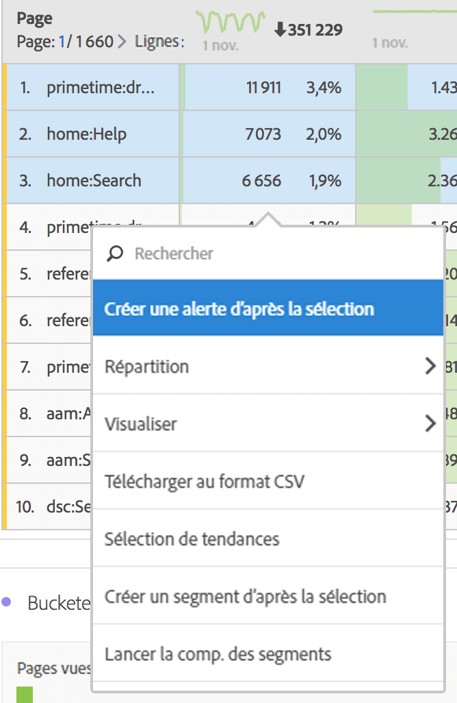

# Ventilation des dimensions

Ventilez les dimensions et les éléments de dimension dans Analysis Workspace.

Ventilez vos données de différentes manières en fonction de vos besoins ; créez des requêtes à l’aide de mesures, de dimensions, de segments, de chronologies pertinentes et autres valeurs de ventilation d’analyse.

1. [Créez un projet](/help/analyze/analysis-workspace/build-workspace-project/t-freeform-project.md) avec un tableau de données.
1. Dans le tableau de données, cliquez avec le bouton droit de la souris sur une ligne et sélectionnez **[!UICONTROL Ventilation]** &gt;*`<item>`*.

   

   Vous pouvez ventiler les mesures par valeurs de dimension ou segments d’audience sur plusieurs périodes sélectionnées. Vous pouvez également approfondir l’analyse à un niveau plus détaillé.

   >[!NOTE]
   >
   >Vous ne pouvez pas afficher plus de 200 ventilations dans le tableau. Cette limitation augmentera pour l’exportation des ventilations.

[Dimensions dans Analysis Workspace sur YouTube](https://www.youtube.com/watch?v=P9W0hhIHhCs&index=12&list=PL2tCx83mn7GuNnQdYGOtlyCu0V5mEZ8sS) (4:54)

[Ventilations des dimensions sur YouTube](https://www.youtube.com/watch?v=3mQ2HN7-lIc&list=PL2tCx83mn7GuNnQdYGOtlyCu0V5mEZ8sS&index=13) (2:02)
