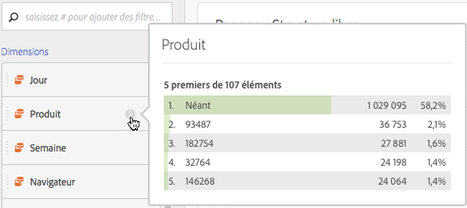
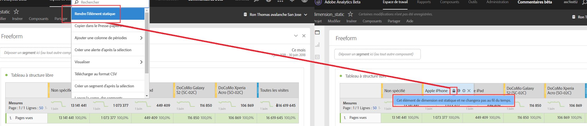

# Aperçu des dimensions

Pointez avec la souris sur l’icône d’information (i) en regard d’une dimension. Les cinq premières valeurs des dimensions non temporelles s’affichent alors (15 valeurs pour les dimensions temporelles). Nous gardions ces valeurs statiques (c.-à-d. que les 5 valeurs sélectionnées n’ont jamais changé).

Par défaut, nous affichons des valeurs dynamiques au lieu de valeurs statiques, avec la possibilité de les transformer en valeurs statiques. Autres points à noter :

* Au fur et à mesure que vos données sont mises à jour, les colonnes de dimension dynamique se mettent à jour pour afficher les éléments de dimension 5/15 actuels.
* Une colonne de dimension dynamique copiée ou déplacée devient statique.
* Lorsque vous passez la souris sur une colonne de dimension statique, une icône de verrouillage s’affiche, indiquant que la dimension est statique.

## Affichage des éléments de dimension

Lorsque vous placez le pointeur de la souris sur une dimension et cliquez sur la flèche droite grise située en regard, la liste de ses éléments de dimension apparaît. Tout d’éléments de dimension affiche généralement les principaux éléments des 30 derniers jours.

Si vous faites défiler le  vers le bas, vous verrez un **[!UICONTROL Show Top Items From Last 6 Months]**. Cliquez sur cette option pour afficher les principaux éléments de dimension des 180 derniers jours.
