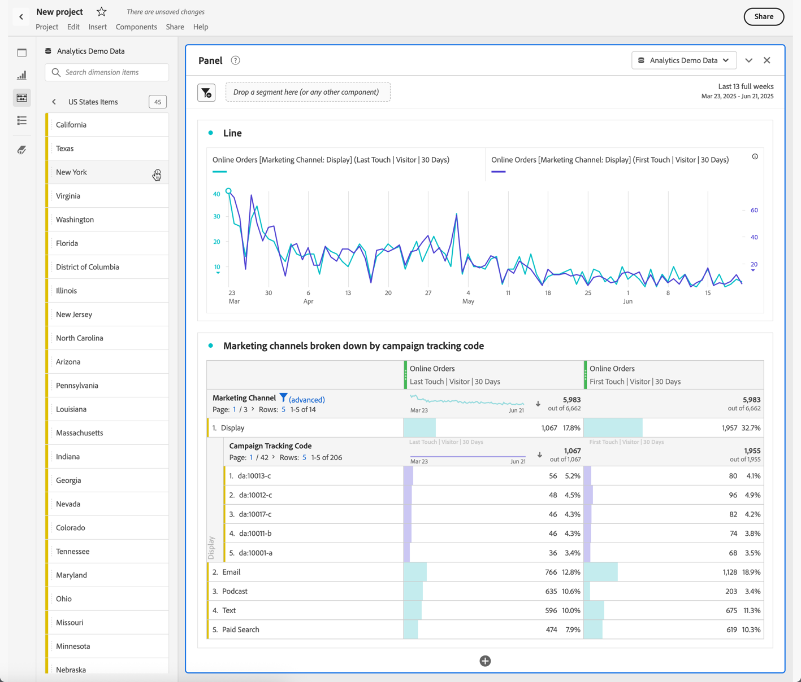

# Prévisualiser les dimensions dans Analysis Workspace

Vous pouvez utiliser les [informations sur le composant](/help/analyze/analysis-workspace/components/use-components-in-workspace.md#component-info) pour un composant afin d’afficher les principaux éléments d’une dimension.

<!--
Now, by default, we show dynamic values instead of static ones, with the option to turn them into static values. Other things to note:

* As your data updates, the dynamic dimension columns will update to show the current 5/15 dimension items.
* A dynamic dimension column that is copied or moved will become static.
* When hovering a static dimension column you will see a lock icon, indicating that the dimension is static.

-->

## Affichage des éléments de dimension

Lorsque vous sélectionnez  pour une dimension dans le panneau Composants, une liste de ses éléments de dimension s’affiche. La liste des éléments de dimension affiche généralement les principaux éléments au cours des 30 derniers jours. Lorsque d’autres éléments sont disponibles, en dehors de la période sélectionnée pour le panneau, sélectionnez le lien pour afficher d’autres éléments. Par exemple, **[!UICONTROL Afficher les éléments du mois dernier]**.

<!--
# Preview dimensions

Hover over the information (i) icon next to a dimension. This shows the top 5 values for non-time dimensions (and 15 for time dimensions). We used to keep those values static (i.e., the 5 values picked never changed).

Now, by default, we show dynamic values instead of static ones, with the option to turn them into static values. Other things to note:

* As your data updates, the dynamic dimension columns will update to show the current 5/15 dimension items.
* A dynamic dimension column that is copied or moved will become static.
* When hovering a static dimension column you will see a lock icon, indicating that the dimension is static.

## Show dimension items

When you hover over a dimension and click the grey right-arrow next to it, a list of its dimension items appears. Any list of dimension items usually shows the top items for the last 30 days.

If you scroll down to the bottom of the list, you see **[!UICONTROL Show Top Items From Last 18 Months]**. Click this option to see top dimension items from the last 547 days.

-->
