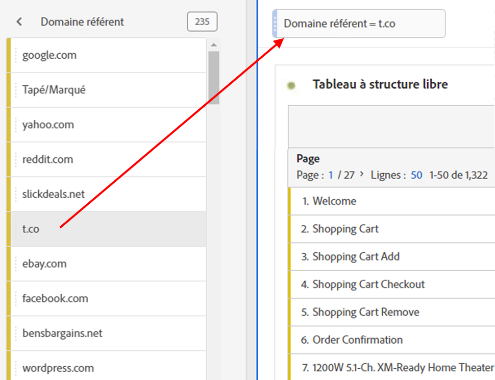
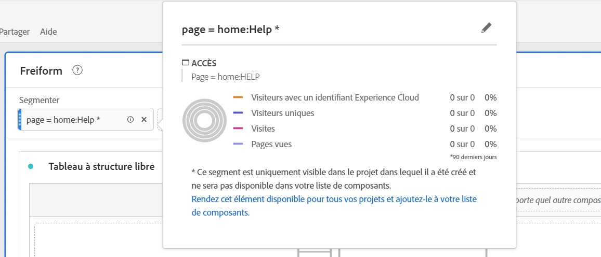

# Segments ad hoc

Voici une vidéo sur la création de segments ad hoc :

>[!VIDEO](https://video.tv.adobe.com/v/23978/?quality=12)

Vous pouvez créer des segments ad hoc si vous souhaitez explorer rapidement la manière dont un segment peut affecter votre projet, sans passer par le créateur de segments. Considérez ces segments comme des segments temporaires au niveau du projet. Ils ne font généralement pas partie de votre &quot;bibliothèque&quot; de segments comme les segments de composants dans le rail de gauche. Vous pouvez toutefois les rendre publics, comme illustré ci-dessous.

1. Déposez tout type de composant (dimension, élément de dimension, événement, mesure, segment, modèle de segment, période) dans la zone de dépôt des segments en haut d’un panneau. Les types de composants sont automatiquement transformés en segments.
Voici un exemple de création d’un segment pour le domaine référent Twitter :

   

   Ce segment est automatiquement appliqué à votre panneau et vous pouvez immédiatement afficher les résultats.

1. À

Remarque :

* Vous **ne pouvez pas** déposer les types de composants suivants dans une zone de segment : les mesures calculées et les dimensions/mesures à partir desquelles vous ne pouvez pas créer de segments.
* Pour l’intégralité des dimensions et événements, Analysis Workspace crée des segments de chute « existe ». Exemples : `Hit where eVar1 exists` ou `Hit where event1 exists`.
* Si des éléments de type « non spécifié » ou « aucun » sont déposés dans la zone de dépose, ils sont automatiquement transformés en segment « n’existe pas » afin d’être traités correctement dans la segmentation.

>[!NOTE]
>
>Les segments créés de cette façon sont internes au projet.

## Rendre les segments ad hoc publics {#ad-hoc-public}

Pour rendre ces segments publics (globaux), procédez comme suit :

1. Pointez sur le segment de la zone de dépôt, puis cliquez sur l’icône « i ».
1. Dans le panneau Informations qui s’affiche, cliquez sur **[!UICONTROL Rendre public]**.

   