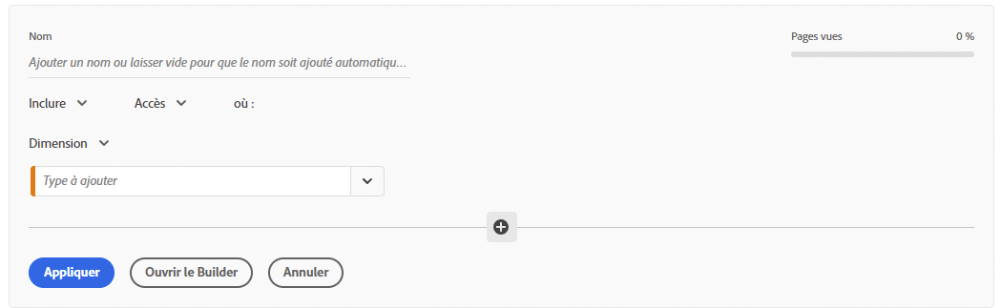
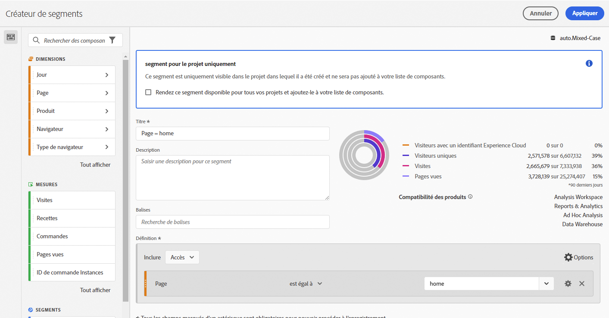
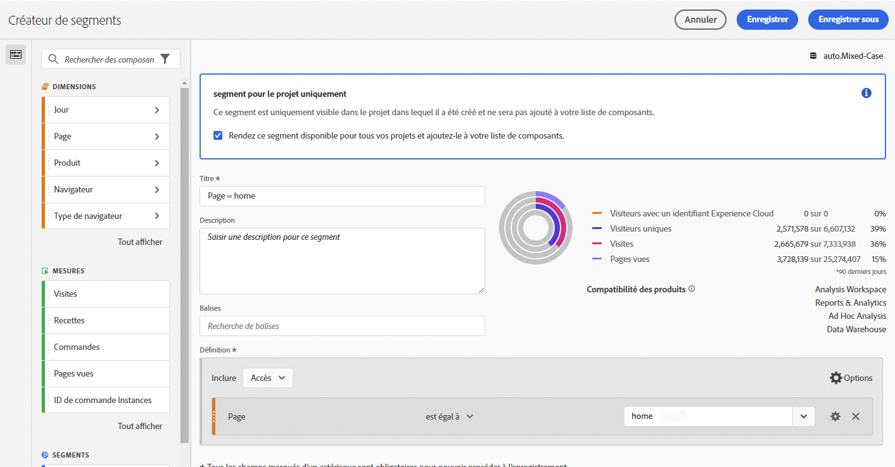

# Segments rapides

Vous pouvez créer des segments rapides dans un projet afin de contourner la complexité du [créateur de segments](/help/components/segmentation/segmentation-workflow/seg-build.md) complet. Segments rapides

* Appliquer comme [segments de projet uniquement](https://experienceleague.adobe.com/docs/analytics/analyze/analysis-workspace/components/segments/quick-segments.html#what-are-project-only-segments%3F).
* Autorisent jusquʼà 3 règles.
* Ne prennent pas en compte les conteneurs imbriqués ni les règles séquentielles.

Pour une comparaison des effets des segments rapides par rapport aux segments complets de la liste des composants, rendez-vous [ici](/help/analyze/analysis-workspace/components/segments/t-freeform-project-segment.md).

Voici un aperçu vidéo des segments rapides :

>[!VIDEO](https://video.tv.adobe.com/v/341466/?quality=12&learn=on)

## Conditions préalables

Tout le monde peut créer un [!UICONTROL Segment rapide]. Cependant, il est nécessaire dʼaccorder lʼautorisation [!UICONTROL Création de segments] dans [Adobe Admin Console](https://experienceleague.adobe.com/docs/analytics/admin/admin-console/permissions/summary-tables.html?lang=fr#analytics-tools) afin de pouvoir enregistrer un segment rapide ou lʼouvrir dans le [!UICONTROL Créateur de segments].

## Création de segments rapides

Dans un tableau à structure libre, cliquez sur l’icône filter+ dans l’en-tête du panneau :

Configurez le segment rapide vierge :

| Paramètre | Description |
| --- | --- |
| Nom | Le nom par défaut dʼun segment est une combinaison des noms des règles dans le segment. Vous pouvez renommer le segment. |
| Inclure/exclure | Vous pouvez soit inclure soit exclure des composants dans votre définition de segment, mais pas les deux. |
| Conteneur Accès/Visite/Visiteur | Les segments rapides comprennent un [conteneur de segments](https://experienceleague.adobe.com/docs/analytics/components/segmentation/seg-overview.html#section_AF2A28BE92474DB386AE85743C71B2D6) unique qui vous permet dʼinclure une dimension/mesure/période dans le segment (ou de lʼexclure). Un conteneur [!UICONTROL Visiteur] contient les données principales spécifiques au visiteur sur lʼensemble de ses visites et de ses pages vues. Un conteneur [!UICONTROL Visite] permet de définir des règles pour ventiler les données du visiteur selon les visites, et un conteneur [!UICONTROL Accès] permet de ventiler les informations du visiteur selon des pages vues spécifiques. Le conteneur par défaut est [!UICONTROL Accès]. |
| Composants (Dimension/mesure/période) | Définissez jusquʼà 3 règles maximum en ajoutant des composants (dimensions et/ou mesures et/ou périodes) et leurs valeurs. Il existe trois manières différentes de trouver le composant approprié :<ul><li>Commencez la saisie et le créateur de [!UICONTROL segments rapides] trouve automatiquement le composant approprié.</li><li>Utilisez la liste déroulante pour trouver le composant.</li><li>Glissez et déposez les composants à partir du rail de gauche.</li></ul> |
| Opérateur | Utilisez le menu déroulant pour trouver les opérateurs standards et les opérateurs [!UICONTROL Comptage distinct]. [En savoir plus](https://experienceleague.adobe.com/docs/analytics/components/segmentation/segment-reference/seg-operators.html?lang=fr) |
| Signe plus (+) | Ajouter une autre règle |
| Qualificateurs AND/OR | Vous pouvez ajouter des qualificateurs « AND » ou « OR » aux règles, mais vous ne pouvez pas les mélanger dans une définition de segment unique. |
| Appliquer | Permet dʼappliquer ce segment au panneau. Si le segment ne contient aucune donnée, vous serez invité à continuer. |
| Ouvrir le Builder | Ouvre le créateur de segments. Une fois le segment enregistré ou appliqué dans le Créateur de segments, il nʼest plus considéré comme un « Segment rapide ». Il rejoint ensuite la bibliothèque de segments de la liste des composants. |
| Annuler | Permet dʼannuler ce segment rapide : nʼappliquez pas ce paramètre. |
| Période | Le programme de validation utilise la période du panneau lors de sa recherche de données. Cependant, toute période appliquée dans un segment rapide remplace celle du panneau, située en haut de celui-ci. |
| Prévisualiser (en haut à droite) | Permet de vérifier que votre segment est valide et de consulter sa largeur. Représente la ventilation du jeu de données auquel vous pouvez vous attendre si vous appliquez ce segment. Il est possible que vous receviez un avertissement indiquant que ce segment ne contient aucune donnée. Si tel est le cas, vous pouvez décider de poursuivre ou de modifier la définition du segment. |

Voici un exemple de segment qui combine des dimensions et des mesures :

Le segment sʼaffiche en haut. Remarquez sa barre latérale rayée bleue, par opposition à la barre latérale bleue des segments au niveau des composants dans la bibliothèque de segments sur la gauche.

## Modification des segments rapides

1. Placez le pointeur de la souris sur le segment rapide et sélectionnez lʼicône en forme de crayon.
1. Modifiez la définition de segment et/ou le nom du segment.
1. Cliquez sur [!UICONTROL Appliquer].

## Enregistrement des segments rapides

>[!IMPORTANT]
>Une fois que vous avez enregistré ou appliqué le segment, vous ne pouvez plus le modifier dans le Créateur de segments rapides, vous devez pour cela utiliser le Créateur de segments classique. Seuls les administrateurs de produit Adobe Analytics et le créateur du segment rapide peuvent enregistrer les modifications apportées à un segment rapide existant.

1. Une fois que vous avez appliqué le segment rapide, passez la souris dessus et sélectionnez lʼicône dʼinformations (« i »).

   

1. Cliquez sur **[!UICONTROL Rendre cet élément disponible pour tous vos projets et l’ajouter à votre liste de composants.]**.
1. (Facultatif) Renommez le segment.
1. Cliquez sur **[!UICONTROL Enregistrer]**.

La barre latérale du segment passe du bleu réparti par bandes au bleu plus clair. Il apparaît également dans la liste des composants du rail de gauche.

## Que sont les segments réservés à un projet unique ?

Les segments de projet uniquement sont des segments qui s’appliquent uniquement au projet actuel dans lequel ils ont été créés. Ils ne seront pas disponibles dans d’autres projets et ne peuvent pas être partagés avec d’autres utilisateurs. Elles sont destinées à une exploration rapide de vos données sans avoir à créer et enregistrer un segment dans le rail de gauche. Les segments de projet uniquement peuvent être créés dans la zone de dépôt du panneau avec les segments rapides ou [segments ad hoc](https://experienceleague.adobe.com/docs/analytics/analyze/analysis-workspace/components/segments/ad-hoc-segments.html).

Si un segment de projet uniquement est ouvert dans la variable [!UICONTROL Créateur de segments], une notification de projet uniquement s’affiche. Si vous ne cochez pas la case &quot;Rendre ce segment disponible&quot;. et cliquez sur **[!UICONTROL APPLIQUER]**, le segment reste un segment réservé au projet. Remarque : Si vous appliquez un segment rapide à partir du créateur de segments, il ne peut plus être ouvert dans le [!UICONTROL Créateur de segments rapide].

Si vous cochez la case &quot;Rendre ce segment disponible&quot;. et cliquez sur **[!UICONTROL ENREGISTRER]**, le segment devient disponible dans la liste des composants du rail de gauche pour être utilisé dans d’autres projets. Il peut également être partagé avec d’autres utilisateurs à partir du Gestionnaire de segments.

