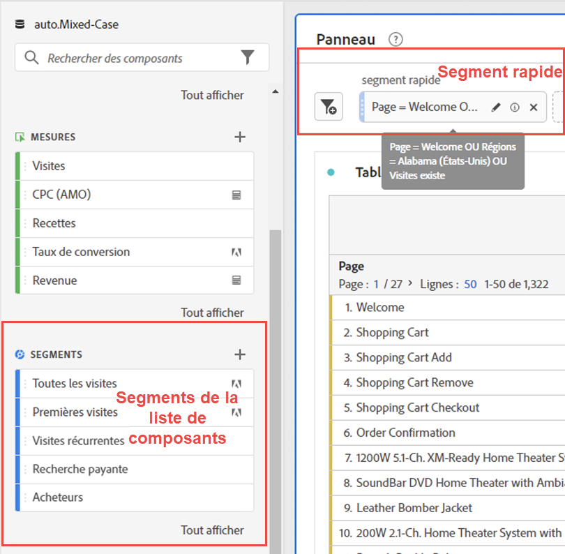
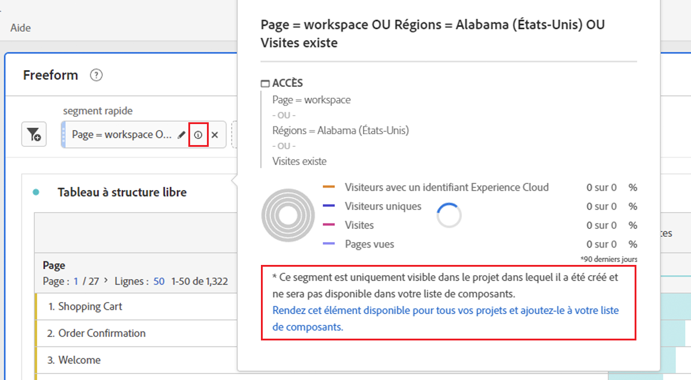
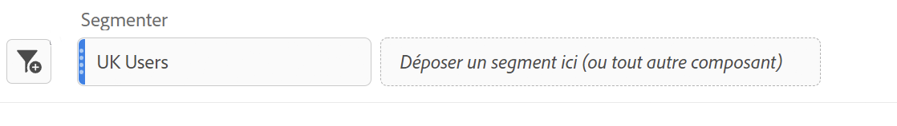
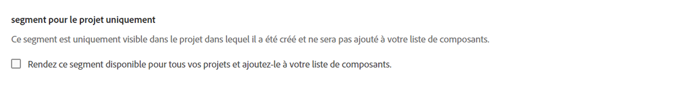

# Segments rapides

Vous pouvez créer des segments rapides dans un projet afin de contourner la complexité du [créateur de segments](/help/components/segmentation/segmentation-workflow/seg-build.md) complet. Pour une comparaison des effets des segments rapides par rapport aux segments de liste de composants complète, accédez à [ici](/help/analyze/analysis-workspace/components/segments/t-freeform-project-segment.md). Les segments rapides autorisent jusqu’à 3 règles et ne prennent pas en charge les conteneurs imbriqués ni les segments séquentiels.

>[!IMPORTANT]
> Les segments rapides font actuellement l’objet de tests limités et ne sont pas encore disponibles dans l’ensemble.

## Création de segments rapides

Dans un tableau à structure libre, cliquez sur l’icône filter+ dans l’en-tête du panneau :

| Paramètre | Description |
| --- | --- |
| Nom | Le nom par défaut d’un segment est une combinaison des règles du segment. Vous pouvez renommer le segment. |
| Inclure/exclure | Vous pouvez inclure ou exclure des composants dans votre définition de segment, mais pas les deux. |
| Conteneur d’accès/de visites/de visiteurs | Les segments rapides incluent un [conteneur de segments](https://experienceleague.adobe.com/docs/analytics/components/segmentation/seg-overview.html?lang=en#section_AF2A28BE92474DB386AE85743C71B2D6) qui vous permet d’inclure une dimension/mesure/plage de dates dans le segment (ou de l’exclure).  Visiteur contient les données principales spécifiques au visiteur pour les visites et les pages vues. Un conteneur [!UICONTROL Visite] permet de définir des règles pour ventiler les données du visiteur selon les visites, et un conteneur [!UICONTROL Accès] permet de ventiler les informations du visiteur selon des pages vues spécifiques. Le conteneur par défaut est [!UICONTROL Accès]. |
| Composants (Dimension/mesure/période) | Définissez jusqu’à 3 règles en ajoutant des dimensions et/ou des mesures de composants et/ou des plages de dates. Il existe trois façons de trouver le composant approprié :<ul><li>Commencez la saisie et le créateur de [!UICONTROL segment rapide] recherche automatiquement le composant approprié.</li><li>Utilisez la liste déroulante pour trouver le composant.</li><li>Faites glisser et déposez des composants à partir du rail de gauche.</li></ul> |
| Opérateur | Utilisez le menu déroulant pour rechercher des opérateurs standard tels que `contains` et [!UICONTROL Nombre distinct]. |
| Signe plus (+) | Ajouter une autre règle |
| Qualificateurs Et/Ou | Vous pouvez ajouter des qualificateurs &quot;AND&quot; ou &quot;OR&quot; aux règles, mais vous ne pouvez pas mélanger &quot;AND&quot; et &quot;OR&quot; dans une seule définition de segment. |
| Appliquer | Appliquez ce segment au panneau. |
| Ouvrir le Builder | Ouvre le créateur de segments. |
| Annuler | Annuler ce segment rapide : ne l’appliquez pas. |
| Période | Le programme de validation utilise la période du panneau pour sa recherche de données. Cependant, toute période appliquée dans un segment rapide remplace la période du panneau en haut du panneau. |
| Aperçu (en haut à droite) | Permet de vérifier si vous disposez d’un segment valide et sa largeur. Représente la ventilation du jeu de données que vous pouvez vous attendre à voir lorsque vous appliquez ce segment. |

Voici un exemple de segment qui combine des dimensions et des mesures :

Le segment s’affiche en haut. Notez sa barre latérale grise, par opposition à la barre latérale bleue pour les segments au niveau du composant dans la bibliothèque de segments sur la gauche.

## Modification des segments rapides

1. Pointez sur le segment rapide et sélectionnez l’icône en forme de crayon.
1. Modifiez la définition de segment ou le nom du segment.

## Enregistrement des segments rapides

Vous pouvez choisir d’enregistrer les segments rapides dans le créateur de segments rapides ou en procédant comme suit.

>[!IMPORTANT]
>Une fois que vous avez enregistré ou appliqué le segment, vous ne pouvez plus le modifier dans le Créateur de segments rapide, uniquement dans le Créateur de segments normal.

1. Pointez sur le segment rapide et sélectionnez l’icône d’information (&quot;i&quot;).
1. Sélectionnez **[!UICONTROL Enregistrer le segment]**.

   

1. Laissez le nom en l’état ou renommez le segment.

   Revenez à Workspace et remarquez que le segment comporte désormais une barre latérale bleue. Cela indique qu’il ne peut plus être modifié/ouvert dans le Créateur de segments rapide. Et en l&#39;enregistrant, il devient une partie de la liste des composants.

   

Après avoir appliqué le segment, vous pouvez choisir de l’ajouter à votre liste de composants de segment et de le rendre disponible pour tous vos projets.

1. Pointez sur le segment enregistré et sélectionnez l’icône représentant un crayon.

1. Dans la partie supérieure du créateur de segments, observez cette boîte de dialogue :

   

1. Cochez la case en regard de **[!UICONTROL Mettre ce segment à la disposition de tous vos projets et ajoutez-le à votre liste de composants.]**
1. Cliquez sur **[!UICONTROL Enregistrer]**.
1. Le segment apparaît désormais dans la liste des composants de segment pour tous vos projets.
1. Vous pouvez également [partager le segment](/help/components/segmentation/segmentation-workflow/t-seg-share.md) avec d’autres personnes de votre entreprise.

## Que sont les segments de projet uniquement ?

Les segments de projet uniquement sont des segments rapides ou des segments de projet Workspace ad hoc. Lorsque vous les modifiez/ouvrez dans le créateur de segments, la zone Projet uniquement s’affiche. S’ils APPLIQUENT un segment rapide dans le créateur, mais ne cochent pas la case rendre disponible, il s’agit toujours d’un segment de projet uniquement, mais il ne peut plus être ouvert dans le créateur QS. S’ils cochent la case et l’ENREGISTRER, il s’agit désormais d’un segment de liste de composants.