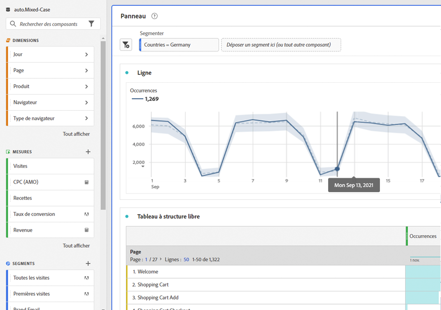
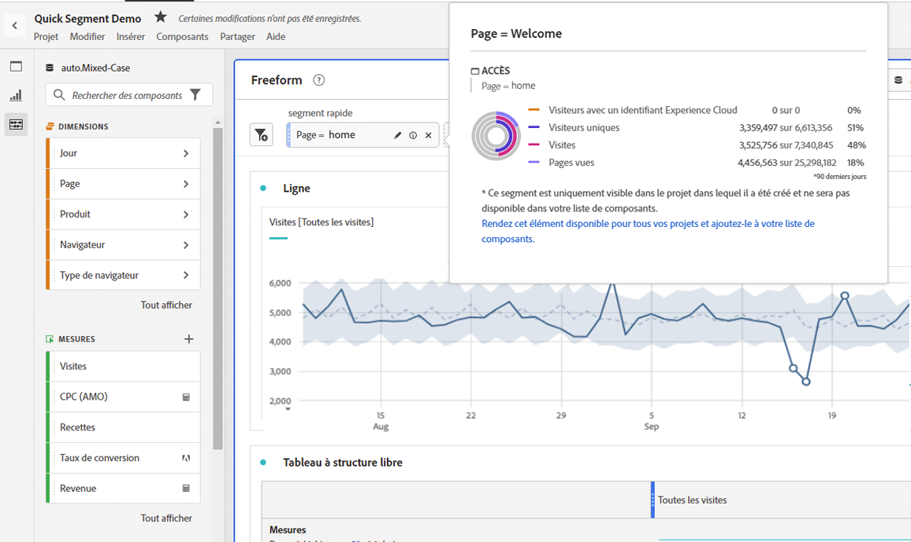

# Segments rapides

Vous pouvez créer des segments rapides dans un projet afin de contourner la complexité du [créateur de segments](/help/components/segmentation/segmentation-workflow/seg-build.md) complet. Segments rapides

* S’appliquer uniquement aux projets dans lesquels ils ont été créés (vous pouvez modifier ce paramètre).
* Autorisez jusqu’à 3 règles.
* Ne prenez pas en charge les conteneurs imbriqués ni les règles séquentielles.
* Travaillez dans des projets avec plusieurs suites de rapports.

Pour une comparaison des effets des segments rapides par rapport aux segments de liste de composants complète, accédez à [ici](/help/analyze/analysis-workspace/components/segments/t-freeform-project-segment.md).

>[!IMPORTANT]
> Les segments rapides font actuellement l’objet de tests limités et seront disponibles en général le 21 octobre 2021.

## Conditions préalables

N’importe qui peut créer un [!UICONTROL segment rapide]. Cependant, vous avez besoin de l’autorisation[!UICONTROL Création de segment] dans [Adobe Admin Console](https://experienceleague.adobe.com/docs/analytics/admin/admin-console/permissions/summary-tables.html?lang=en#analytics-tools) pour pouvoir enregistrer un segment rapide ou l’ouvrir dans le [!UICONTROL Créateur de segments].

## Création de segments rapides

Dans un tableau à structure libre, cliquez sur l’icône filter+ dans l’en-tête du panneau :

| Paramètre | Description |
| --- | --- |
| Nom | Le nom par défaut d’un segment est une combinaison des noms des règles dans le segment. Vous pouvez renommer le segment. |
| Inclure/exclure | Vous pouvez inclure ou exclure des composants dans votre définition de segment, mais pas les deux. |
| Conteneur d’accès/de visites/de visiteurs | Les segments rapides incluent un [conteneur de segments](https://experienceleague.adobe.com/docs/analytics/components/segmentation/seg-overview.html?lang=en#section_AF2A28BE92474DB386AE85743C71B2D6) qui vous permet d’inclure une dimension/mesure/plage de dates dans le segment (ou de l’exclure).  Visiteur contient les données principales spécifiques au visiteur pour les visites et les pages vues. Un conteneur [!UICONTROL Visite] permet de définir des règles pour ventiler les données du visiteur selon les visites, et un conteneur [!UICONTROL Accès] permet de ventiler les informations du visiteur selon des pages vues spécifiques. Le conteneur par défaut est [!UICONTROL Accès]. |
| Composants (Dimension/mesure/période) | Définissez jusqu’à 3 règles en ajoutant des dimensions et/ou des mesures et/ou des plages de dates aux composants et leurs valeurs. Il existe trois façons de trouver le composant approprié :<ul><li>Commencez la saisie et le créateur de [!UICONTROL segment rapide] recherche automatiquement le composant approprié.</li><li>Utilisez la liste déroulante pour trouver le composant.</li><li>Faites glisser et déposez des composants à partir du rail de gauche.</li></ul> |
| Opérateur | Utilisez le menu déroulant pour trouver les opérateurs standards et les opérateurs [!UICONTROL Comptage distinct]. [En savoir plus](https://experienceleague.adobe.com/docs/analytics/components/segmentation/segment-reference/seg-operators.html?lang=en) |
| Signe plus (+) | Ajouter une autre règle |
| Qualificateurs ET/OU | Vous pouvez ajouter des qualificateurs &quot;AND&quot; ou &quot;OR&quot; aux règles, mais vous ne pouvez pas mélanger &quot;AND&quot; et &quot;OR&quot; dans une seule définition de segment. |
| Appliquer | Appliquez ce segment au panneau. Si le segment ne contient aucune donnée, vous serez invité à continuer. |
| Ouvrir le Builder | Ouvre le créateur de segments. Une fois le segment enregistré dans le créateur de segments, il n’est plus considéré comme un &quot;segment rapide&quot;. Il devient une partie de la bibliothèque de segments de la liste des composants. |
| Annuler | Annuler ce segment rapide : ne l’appliquez pas. |
| Période | Le programme de validation utilise la période du panneau pour sa recherche de données. Cependant, toute période appliquée dans un segment rapide remplace la période du panneau en haut du panneau. |
| Aperçu (en haut à droite) | Permet de vérifier si vous disposez d’un segment valide et sa largeur. Représente la ventilation du jeu de données que vous pouvez vous attendre à voir lorsque vous appliquez ce segment. vous pourriez recevoir un avis indiquant que ce segment ne contient aucune donnée. Vous pouvez poursuivre ou modifier la définition de segment. |

Voici un exemple de segment qui combine des dimensions et des mesures :

Le segment s’affiche en haut. Notez sa barre latérale bleue, par opposition à la barre latérale bleue pour les segments au niveau du composant dans la bibliothèque de segments sur la gauche.

## Modification des segments rapides

1. Pointez sur le segment rapide et sélectionnez l’icône en forme de crayon.
1. Modifiez la définition de segment et/ou le nom du segment.
1. Cliquez sur [!UICONTROL Appliquer].

## Enregistrement des segments rapides

>[!IMPORTANT]
>Une fois que vous avez enregistré ou appliqué le segment, vous ne pouvez plus le modifier dans le Créateur de segments rapide, uniquement dans le Créateur de segments normal.

1. Une fois que vous avez appliqué le segment rapide, passez la souris dessus et sélectionnez l’icône d’information (&quot;i&quot;).

   

1. Cliquez sur **[!UICONTROL Mettre à disposition tous les projets et ajoutez-les à votre liste de composants]**.
1. (Facultatif) Renommez le segment.
1. Cliquez sur **[!UICONTROL Enregistrer]**.

La barre latérale du segment passe de bleu réparti par bandes à bleu. Il apparaît désormais dans la liste de vos composants dans le rail de gauche.

## Que sont les segments de projet uniquement ?

Les segments de projet uniquement sont des segments rapides ou des segments de projet Workspace ad hoc. Lorsque vous les modifiez/ouvrez dans le [!UICONTROL créateur de segments], la zone de projet uniquement s’affiche. Si vous APPLIQUEZ un segment rapide dans le créateur sans cocher la case Mettre à disposition , il s’agit toujours d’un segment projet uniquement, mais il ne peut plus être ouvert dans le [!UICONTROL Créateur de segments rapide]. Si vous cochez la case et cliquez sur **[!UICONTROL SAVE]**, il s’agit désormais d’un segment de liste de composants.