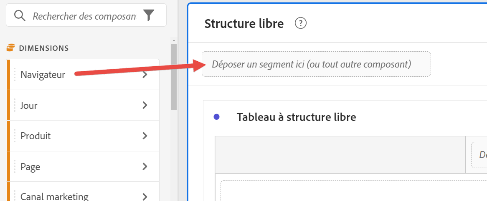
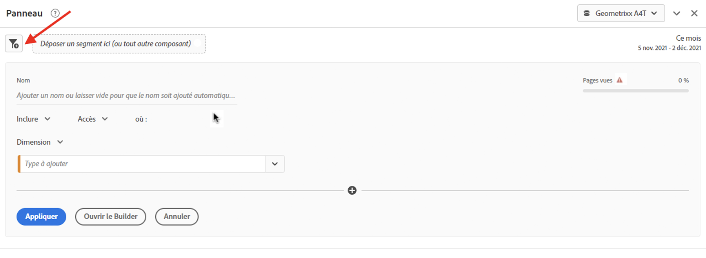
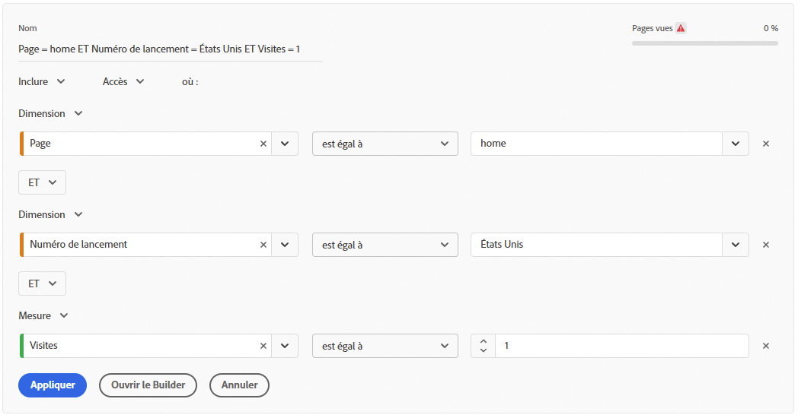

# Segments rapides

Les segments rapides vous permettent d’explorer facilement les données au sein d’un projet donné, sans avoir à créer un segment de liste de composants plus complexe dans le [créateur de segments](/help/components/segmentation/segmentation-workflow/seg-build.md).

Tenez compte des points suivants lors de la création de segments rapides :

* Les segments rapides s’appliquent uniquement au projet dans lequel ils ont été créés. Ils ne sont pas disponibles dans d’autres projets et ne peuvent pas être partagés avec d’autres utilisateurs et utilisatrices.
* 3 règles au maximum sont autorisées.
* Les conteneurs imbriqués ou les règles séquentielles ne sont pas pris en charge.

La vidéo suivante explique comment utiliser les segments rapides :

>[!VIDEO](https://video.tv.adobe.com/v/341466/?quality=12&learn=on)

## Créer un segment rapide

Toute personne utilisant Analysis Workspace peut créer un segment rapide.

Pour créer un segment rapide :

1. Choisissez l’une des méthodes suivantes pour commencer à créer le segment rapide :

   * **Ad hoc (glisser-déposer) :** dans le rail de gauche, faites glisser un composant vers la zone de dépôt des segments dans l’en-tête du panneau.

     

     Vous pouvez modifier le segment comme décrit dans [Modifier des segments rapides](#edit-quick-segments).

     >[!NOTE]
     >
     > Tenez compte des points suivants lors de la création d’un segment rapide ad hoc (glisser-déposer) :
     > * Les types de composants suivants ne sont pas pris en charge : les mesures calculées et les dimensions, ainsi que les mesures à partir desquelles vous ne pouvez pas créer de segments.
     > * Pour l’intégralité des dimensions et événements, Analysis Workspace crée des segments d’accès « existe ». Exemples : `Hit where eVar1 exists` ou `Hit where event1 exists`.
     > * Si des éléments de type « non spécifié » ou « aucun » sont déposés dans la zone de dépôt, ils sont automatiquement transformés en segments « n’existe pas » afin d’être traités correctement dans les segments.

   * **À l’aide de l’icône de segment :** dans un tableau à structure libre, sélectionnez l’icône **Segment** dans l’en-tête du panneau.

     

1. Ajustez l’un des paramètres suivants :

   | Paramètre | Description |
   | --- | --- |
   | [!UICONTROL Nom] | Le nom par défaut dʼun segment est une combinaison des noms des règles dans le segment. Vous pouvez donner un nom plus convivial au segment. |
   | [!UICONTROL Inclure/exclure] | Vous pouvez soit inclure soit exclure des composants dans votre définition de segment, mais pas les deux. |
   | [!UICONTROL Conteneur Accès/Visites/Visiteurs et visiteuses] | Les segments rapides comprennent un [conteneur de segments](https://experienceleague.adobe.com/docs/analytics/components/segmentation/seg-overview.html?lang=fr#section_AF2A28BE92474DB386AE85743C71B2D6) unique qui vous permet dʼinclure une dimension/mesure/période dans le segment (ou de lʼexclure). Un conteneur [!UICONTROL Visiteur] contient les données principales spécifiques au visiteur sur lʼensemble de ses visites et de ses pages vues. Un conteneur [!UICONTROL Visite] permet de définir des règles pour ventiler les données du visiteur selon les visites. Un conteneur [!UICONTROL Accès] permet de ventiler les informations du visiteur selon des pages vues spécifiques. Le conteneur par défaut est [!UICONTROL Accès]. |
   | [!UICONTROL Composants] (Dimension/mesure/période) | Définissez jusqu’à 3 règles en ajoutant des composants (dimensions, mesures, périodes ou valeurs de dimension). Il existe trois façons de trouver le composant approprié :<ul><li>Commencez la saisie et le créateur de segments rapides trouve automatiquement le composant approprié.</li><li>Utilisez la liste déroulante pour trouver le composant.</li><li>Glissez et déposez les composants à partir du rail de gauche.</li></ul> |
   | [!UICONTROL Opérateur] | Utilisez le menu déroulant pour trouver les opérateurs standards et les opérateurs [!UICONTROL Comptage distinct]. Voir [Opérateurs de segments](/help/components/segmentation/seg-reference/seg-operators.md). |
   | Signe plus (+) | Ajouter une autre règle |
   | Qualificateurs AND/OR | Vous pouvez ajouter des qualificateurs « AND » ou « OR » aux règles, mais vous ne pouvez pas les mélanger dans une définition de segment unique. |
   | [!UICONTROL Appliquer] | Permet dʼappliquer ce segment au panneau. Si le segment ne contient aucune donnée, le processus vous demande si vous souhaiter poursuivre. |
   | [!UICONTROL Ouvrir le créateur] | Ouvre le créateur de segments. Une fois le segment enregistré ou appliqué dans le créateur de segments, il nʼest plus considéré comme un « segment rapide ». Il rejoint ensuite la bibliothèque de segments de la liste des composants. 
Pour rendre le composant disponible dans tous vos projets et dans le rail de gauche, sélectionnez l’option [!UICONTROL **Rendre ce segment disponible pour tous vos projets et l’ajouter à votre liste de composants**].

Pour plus d’informations, voir la section [Enregistrer un segment rapide en tant que segment de liste de composants](#save-a-quick-segment-as-a-component-list-segment) dans cet article.

**Remarque :** seuls les utilisateurs et utilisatrices disposant de l’autorisation Création de segments dans l’[Adobe Admin Console](/help/admin/admin-console/permissions/analytics-tools.md) peuvent ouvrir le créateur de segments.
 |
   | [!UICONTROL Annuler] | Permet dʼannuler ce segment rapide (de ne pas l’appliquer). |
   | [!UICONTROL Période] | Le programme de validation utilise la période du panneau lors de sa recherche de données. Cependant, toute période appliquée dans un segment rapide remplace celle du panneau, située en haut de celui-ci. |
   | Prévisualiser (en haut à droite) | Permet de vérifier que votre segment est valide et de consulter sa largeur. Représente la répartition du jeu de données auquel vous pouvez vous attendre si vous appliquez ce segment. Il est possible que vous receviez un avertissement indiquant que ce segment ne contient aucune donnée. Dans ce cas, vous pouvez poursuivre ou modifier la définition du segment. |

1. Sélectionnez [!UICONTROL **Appliquer**] pour enregistrer vos modifications.

## Modifier des segments rapides

1. Placez le pointeur de la souris sur le segment rapide et sélectionnez lʼicône **Modifier**.

   

1. Modifiez la définition de segment et/ou le nom du segment.

1. Sélectionnez [!UICONTROL **Appliquer**].

## Enregistrer un segment rapide en tant que segment de liste de composants

>[!IMPORTANT]
>
> Tenez compte de ce qui suit lors de l’enregistrement d’un segment rapide :
> 
> * Pour enregistrer un segment rapide, vous devez disposer de l’autorisation Création de segments dans l’[Adobe Admin Console](/help/admin/admin-console/permissions/analytics-tools.md).
> 
> * Une fois le segment enregistré ou appliqué, il ne peut plus être modifié dans le créateur de segments rapides. À la place, vous devez utilser le créateur de segments standard.

Vous pouvez choisir d’enregistrer les segments rapides en tant que segments de liste de composants. Les segments de liste de composants offrent comme avantages :

* Disponibilité sur tous vos projets Workspace
* Prise en charge de segments plus complexes ainsi que de segments séquentiels

Vous pouvez enregistrer des segments à partir du créateur de segments rapides ou du [!UICONTROL créateur de filtres].

### Enregistrer dans le créateur de segments rapides {#save2}

1. Après avoir appliqué le segment rapide, passez la souris dessus et sélectionnez lʼicône dʼinformations (« i »).
1. Sélectionnez **[!UICONTROL Rendre cet élément disponible pour tous vos projets et l’ajouter à votre liste de composants]**.
1. (Facultatif) Renommez le segment.
1. Sélectionnez **[!UICONTROL Enregistrer]**.

   Le segment apparaît désormais dans la liste de vos composants dans le rail de gauche. Notez également que la barre latérale du segment passe du bleu clair au bleu foncé. Cela indique que le segment ne peut plus être modifié ni ouvert dans le créateur de segments rapides.

### Enregistrer dans le créateur de segments {#save3}

1. Après avoir appliqué le segment rapide, passez la souris dessus et sélectionnez lʼicône dʼinformations (« i »).
1. Sélectionnez **[!UICONTROL Enregistrer le segment]**.
1. (Facultatif) Renommez le segment, puis sélectionnez [!UICONTROL **Appliquer**].

   Revenez sur Workspace et notez que la barre latérale du segment passe du bleu clair au bleu plus foncé. Cela indique que le segment ne peut plus être modifié ni ouvert dans le créateur de segments rapides. En l’enregistrant, il devient une partie de la liste des composants.

Après avoir appliqué le segment, vous pouvez choisir de l’ajouter à votre liste de composants de segment et de le rendre disponible pour tous vos projets.

1. Pointez sur le segment enregistré et sélectionnez l’icône en forme de crayon.

1. Sélectionnez [!UICONTROL **Ouvrir le créateur**].

1. Dans la partie supérieure du créateur de segments, remarquez la boîte de dialogue [!UICONTROL **Segment de projet uniquement**] :

   

1. Cochez la case en regard de **[!UICONTROL Rendre disponible pour tous les projets à disposition et ajouter l’élément à votre liste de composants.]**

1. Sélectionnez **[!UICONTROL Enregistrer]**.

   Le segment apparaît désormais dans la liste de vos composants de segment pour tous vos projets.
Vous pouvez également [partager le segment](https://experienceleague.adobe.com/docs/analytics/analyze/analysis-workspace/curate-share/curate.html?lang=fr#concept_4A9726927E7C44AFA260E2BB2721AFC6) avec d’autres personnes de votre entreprise.

## Exemple de segment rapide

L’exemple de segment suivant combine des dimensions et des mesures :

## Problème connu

1. Créez un segment rapide avec 2 entrées et **[!UICONTROL Enregistrez]**-le en tant que Test1.
1. Cliquez sur **[!UICONTROL Enregistrer sous]** et enregistrez ce segment rapide en tant que Test2.
1. Modifiez le segment rapide Test2 et enregistrez-le à nouveau en tant que Test2.
Notez que le segment rapide Test1 est modifié par Test2.
