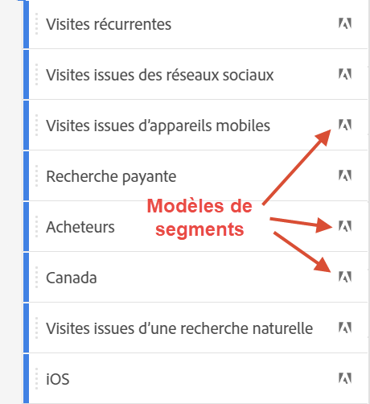

# Segments {#topic_DC2917A2E8FD4B62816572F3F6EDA58A}

Vous pouvez créer différents types de segments dans Workspace, selon leur complexité, s’ils doivent s’appliquer uniquement à ce projet, etc. Voici un résumé des types de segments :

| Type de segment | Création de l’emplacement ? | Applicable où ? | Conditions d’utilisation |
| --- | --- | --- | --- |
| Segment de liste de composants | Cliquez sur + pour accéder au [créateur de segments](/help/components/segmentation/segmentation-workflow/seg-build.md). | Tous les projets Workspace | Pour les segments plus complexes, les segments séquentiels |
| Segment rapide | [Créateur de segments rapide](/help/analyze/analysis-workspace/components/segments/quick-segments.md) | Au niveau du projet, mais vous pouvez enregistrer et ajouter des segments à votre liste de segments. | Flexibilité pour ajouter/modifier une ou plusieurs règles |
| Segments ad hoc : |  |  |  |
| - Segment de projet Ad Hoc Workspace | [Glisser-déposer dans la zone de dépôt des segments dans un projet](/help/analyze/analysis-workspace/components/segments/ad-hoc-segments.md) | Au niveau du projet, mais vous pouvez enregistrer et ajouter des segments à votre liste de segments. | Pour les segments à règle unique par défaut (aucune limite) |
| - Segment basé sur les mesures calculées | [Créateur de mesures calculées](https://experienceleague.adobe.com/docs/analytics/components/calculated-metrics/calcmetric-workflow/metrics-with-segments.html) | Pour une mesure calculée individuelle | Appliquer le ou les segments dans votre définition de mesure |
| - Segment basé sur des suites de rapports virtuelles | [Créateur de suites de rapports virtuelles](https://experienceleague.adobe.com/docs/analytics/components/virtual-report-suites/vrs-workflow/vrs-create.html) | Pour une suite de rapports virtuelle individuelle | Application d’un ou de plusieurs segments dans votre définition de suite de rapports virtuelle |

Voici une vidéo sur l’utilisation de segments dans Analysis Workspace :

>[!VIDEO](https://video.tv.adobe.com/v/23977/?quality=12)

## Création de segments {#section_693CFADA668B4542B982446C2B4CF0F5}

Vous pouvez créer différents types de segments dans Analysis Workspace :

* [Segments rapides](/help/analyze/analysis-workspace/components/segments/quick-segments.md)
* [Segments ad hoc](/help/analyze/analysis-workspace/components/segments/ad-hoc-segments.md)
* Les segments de liste de composants réguliers qui se retrouvent dans la bibliothèque de segments (voir ci-dessous)

### Création de segments de liste de composants {#section_3B07D458C43E42FDAF242BB3ACAF3E90}

Le rail de segments sous le menu Composants affiche
* Segments que vous ou votre société avez créés
* Modèles de segment, comme indiqué par l’icône d’Adobe :

Pour créer un segment de ce type, vous disposez de 2 options. Tous deux vous conduisent au [créateur de segments](/help/components/segmentation/segmentation-workflow/seg-build.md) dans Adobe Analytics.

* Dans le rail de gauche, cliquez sur le signe plus (+) en regard de [!UICONTROL Segments] :

ou

* Accédez à [!UICONTROL Composants] > [!UICONTROL Segments], puis cliquez sur [!UICONTROL + Ajouter].

### Autres méthodes d’application de segments {#section_10FF2E309BA84618990EA5B473015894}

>[!VIDEO](https://video.tv.adobe.com/v/30994/?quality=12)

Plusieurs autres méthodes permettent d’appliquer des segments à un projet d’analyse à structure libre.

| Action | Description |
|--- |--- |
| Création d’un segment d’après une sélection | Créez un segment incorporé. Ce segment s’applique uniquement au projet ouvert et n’est pas enregistré comme un segment Analytics. 1. Sélectionnez des lignes.  2. Cliquez avec le bouton de la souris sur la sélection.  3. Cliquez sur *Créer un segment d’après la sélection*. |
| Composants > Nouveau segment | Ouvre le créateur de segments. Voir [Créateur de segment](https://experienceleague.adobe.com/docs/analytics/components/segmentation/segmentation-workflow/seg-build.html?lang=fr) pour en savoir plus sur la segmentation. |
| Partager > Partager le projet ou Partager > Traiter les données du projet | Dans l’outil [Traiter et partager](https://experienceleague.adobe.com/docs/analytics/analyze/analysis-workspace/curate-share/curate.html?lang=fr#concept_4A9726927E7C44AFA260E2BB2721AFC6), découvrez comment les segments que vous appliquez au projet sont disponibles dans l’analyse partagée avec le destinataire. |
| Utilisation de segments comme des dimensions | Vidéo : [Utilisation de segments comme dimensions dans Analysis Workspace](https://experienceleague.adobe.com/docs/analytics-learn/tutorials/analysis-workspace/applying-segments/using-segments-as-dimensions-in-analysis-workspace.html?lang=fr) |

## Segment IQ

Segment IQ (également appelé comparaison de segments) comprend les fonctionnalités suivantes :

* [Panneau de comparaison des segments :](/help/analyze/analysis-workspace/c-panels/c-segment-comparison/segment-comparison.md) fonctionnalité principale de Segment IQ. Faites glisser deux segments dans le panneau et affichez un rapport complet qui montre les différences les plus importantes sur le plan statistique et le chevauchement entre les deux audiences.
* [Comparaison des segments dans la visualisation Abandons :](/help/analyze/analysis-workspace/visualizations/fallout/compare-segments-fallout.md) découvrez comment différentes audiences se comparent les unes aux autres dans le contexte d’une visualisation Abandons.

## Plus d’informations

Pour une discussion approfondie sur la segmentation dans Adobe Analytics, rendez-vous [ici](/help/components/segmentation/seg-overview.md).