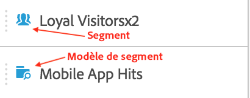
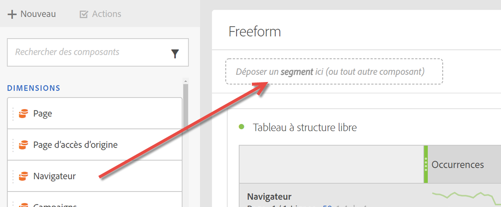
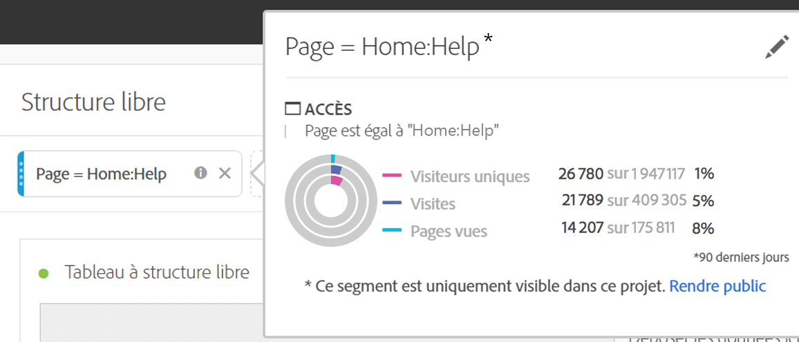

# Segments {#topic_DC2917A2E8FD4B62816572F3F6EDA58A}

## Rail des segments {#section_3B07D458C43E42FDAF242BB3ACAF3E90}

Le rail des segments sous le menu Composants affiche les segments, ainsi que les modèles de segments, comme représentés par ces icônes :

[Utilisation de segments dans Analysis Workspace sur YouTube](https://www.youtube.com/watch?v=QlUCdQDnni4)(6:46)

## Création de segments {#section_693CFADA668B4542B982446C2B4CF0F5}

Vous pouvez créer des segments instantanés en déposant un type de composants (dimension, élément de dimension, événement, mesure, segment, modèle de segments, plage de dates) dans la zone de dépôt des segments en haut d’un panneau.

Les types de composants sont automatiquement transformés en segments. Sinon, vous pouvez cliquer sur le signe « + » dans la zone de dépôt Ajouter un segment.

Gardez les éléments suivants à l’esprit :

* Vous **ne pouvez pas** déposer les types de composants suivants dans une zone de segment : les mesures calculées et les dimensions/mesures à partir desquelles vous ne pouvez pas créer de segments.
* Pour l’intégralité des dimensions et événements, Analysis Workspace crée des segments de chute « existe ». Exemples : « Déposer où eVar1 existe » ou « Déposer où event1 existe ».
* Si des éléments de type « non spécifié » ou « aucun » sont déposés dans la zone de dépose, ils sont automatiquement transformés en segment « n’existe pas » afin d’être traités correctement dans la segmentation.

> [!NOTE] Les segments créés de cette façon sont internes au projet.

Pour rendre ces segments publics (globaux), procédez comme suit :

1. Pointez sur le segment de la zone de dépôt, puis cliquez sur l’icône « i ».
1. Dans le panneau Informations qui s’affiche, cliquez sur **[!UICONTROL Rendre public]**.

   

## Autres méthodes d’application de segments {#section_10FF2E309BA84618990EA5B473015894}

Plusieurs autres méthodes permettent d’appliquer des segments à un projet d’analyse à structure libre.

| Action | Description |
|--- |--- |
| Création d’un segment d’après une sélection | Créez un segment incorporé. Sélectionnez des lignes, cliquez avec le bouton droit de la souris sur la sélection, puis créez un segment incorporé. Ce segment s’applique uniquement au projet ouvert et n’est pas enregistré comme un segment Analytics. 1. Sélectionnez des lignes.  2. Cliquez avec le bouton de la souris sur la sélection.  3. Cliquez sur *Créer un segment d’après la sélection*. |
| Composants > Nouveau segment | Ouvre le créateur de segments. Voir [Créateur de segment](https://docs.adobe.com/content/help/fr-FR/analytics/components/segmentation/segmentation-workflow/seg-build.html) pour en savoir plus sur la segmentation. |
| Partager > Partager le projet ou Partager > Traiter les données du projet | Dans l’outil [Traiter et partager](https://docs.adobe.com/content/help/fr-FR/analytics/analyze/analysis-workspace/curate-share/curate.html#concept_4A9726927E7C44AFA260E2BB2721AFC6), découvrez comment les segments que vous appliquez au projet sont disponibles dans l’analyse partagée avec le destinataire. |
| Utilisation de segments comme des dimensions | Vidéo : [Utilisation de segments comme dimensions dans Analysis Workspace](https://www.youtube.com/watch?v=WmSdReKTWto&amp;list=PL2tCx83mn7GuNnQdYGOtlyCu0V5mEZ8sS&amp;index=39) |
